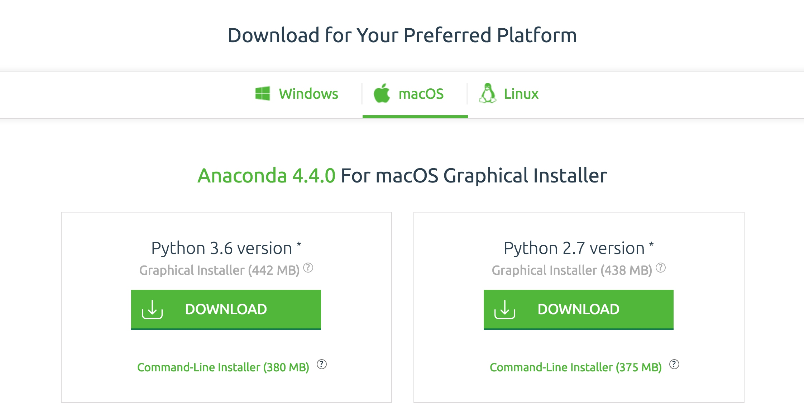

# Python3的安装

既然要用Python3开发爬虫，那么第一步一定是安装Python3，本节会介绍Windows、Linux、Mac三大平台下安装Python3的过程。

## Windows

Windows下安装Python3的方式有两种，一种是通过Anaconda安装，Anaconda提供了Python的科学计算环境，里面自带了Python以及常用的库，如果选用了此种方式后面的环境配置方式会更加简便，另一种是直接下载安装包安装，即标准的安装方式。下面会依次介绍这两种安装方式。

### Anaconda安装

Anaconda的官方下载链接为：[https://www.continuum.io/downloads](https://www.continuum.io/downloads)，选择Python3版本的安装包下载即可。


如果下载速度过慢可以选择使用清华大学镜像，下载列表链接为：[https://mirrors.tuna.tsinghua.edu.cn/anaconda/archive/](https://mirrors.tuna.tsinghua.edu.cn/anaconda/archive/)，使用说明链接为：[https://mirrors.tuna.tsinghua.edu.cn/help/anaconda/](https://mirrors.tuna.tsinghua.edu.cn/help/anaconda/)，可以选择需要的版本进行下载，速度相比官网会快很多。

下载完成之后直接双击运行安装包安装即可，安装完成之后Python3的环境就配置好了。

### 标准安装

推荐直接下载可执行文件安装包安装，到官方网站下载Python3安装包。

[https://www.python.org/downloads/](https://www.python.org/downloads/)

到目前为止，Python的最新版本是3.6.2，最新版本以官网为准，如Python3.6.2的下载链接为：[https://www.python.org/downloads/release/python-362/](https://www.python.org/downloads/release/python-362/)


64位系统可以下载Windows x86-64 executable installer，32位系统可以下载Windows x86 executable installer。

下载完成之后，直接双击运行Python安装包，使用图形界面安装，设置好Python的安装路径，完成后将Python3和Python3的Scripts目录配置到环境变量即可。

环境变量的配置，此处以Win10系统为例进行演示。

假如我安装后的Python3路径为C:\Python36，从资源管理器中打开该路径。


将该路径复制下来。

随后打开电脑-属性。


点击左侧的高级系统设置，即可看到在弹出的窗口中下方有环境变量按钮。


点击环境变量，找到系统变量下的Path变量，随后点击编辑按钮。


随后点击新建，新建一个条目，将刚才拷贝的C:\Python36复制进去，当然此处的路径就是你的Python3安装目录，请自行替换，然后再把C:\Python36\Scripts路径复制进去，如图所示：


最后点击确定即可完成环境变量的配置。

配置好环境变量之后，我们就可以直接在命令行直接执行环境变量路径下的可执行文件了，如python、pip等命令。

### 添加别名

如果我们之前安装过Python2的话，为了解决版本冲突的问题，建议将安装目录中的python.exe复制一份，命名为python3.exe，这样便可以调用python3命令了，实际上和python命令是完全一致的，这样可以更好地区分Python版本，当然如果没有安装过Python2的话也建议添加此别名。

对于Pip来说，安装包中自带了pip3.exe可执行文件，我们也可以直接使用pip3命令，无需额外配置。

### 测试验证

安装完成之后我们可以通过命令行测试一下安装是否成功，在开始菜单搜索cmd，找到命令提示符，就进入了命令行模式，输入python测试，如果添加了别名的话可以输入python3测试，在这里输入的是python3，如图所示：


类似输出结果如下：

```python
$ python3
Python 3.6.1 (v3.6.1:69c0db5, Mar 21 2017, 17:54:52) [MSC v.1900 32 bit (Intel)] on win32
Type "help", "copyright", "credits" or "license" for more information.
>>> print('Hello World')
Hello World
>>> exit()
$ pip3 -V
pip 9.0.1 from c:\python36\lib\site-packages (python 3.6)
```

如果出现类似上面的提示，则证明Python3和Pip3均安装成功，如果提示命令不存在，那么请检查下环境变量的配置情况。

## Linux

Linux下安装方式有多种，命令安装、源码安装、Anaconda安装。

使用源码安装需要自行编译，时间较长。推荐使用系统自带命令或Anaconda安装，简单高效。在这里对各种安装方式分别予以讲解。

### 命令安装

不同的Linux发行版本安装方式又有不同，在此分别予以介绍。

#### CentOS、RedHat

如果是CentOS或RedHat版本，使用yum命令安装即可。

下面列出了Python3.5和3.4两个版本的安装方法，可以自行选择。

Python3.5版本：

```
sudo yum install -y https://centos7.iuscommunity.org/ius-release.rpm
sudo yum update
sudo yum install -y python35u python35u-libs python35u-devel python35u-pip
```

执行完毕之后便可以成功安装Python3.5及Pip3。

Python3.4版本：

```
sudo yum groupinstall -y development tools
sudo yum install -y epel-release python34-devel  libxslt-devel libxml2-devel openssl-devel
sudo yum install -y python34
sudo yum install -y python34-setuptools
sudo easy_install-3.4 pip
```

执行完毕之后便可以成功安装Python3.4及Pip3。

#### Ubuntu、Debian、Deepin

首先安装Python3，使用apt-get安装即可，在安装前还需安装一些基础库，命令如下：

```
sudo apt-get install -y python3-dev build-essential libssl-dev libffi-dev libxml2 libxml2-dev libxslt1-dev zlib1g-dev libcurl4-openssl-dev
sudo apt-get install -y python3
```

执行完如上命令之后就可以成功安装好Python3了。

然后还需要安装Pip3，仍然使用apt-get安装即可，命令如下：

```
sudo apt-get install -y python3-pip
```

执行完毕之后便可以成功安装Python3及Pip3。

### 源码安装

如果命令行安装方式有问题，还可以下载Python3源码进行安装。

源码下载地址为：[https://www.python.org/ftp/python/](https://www.python.org/ftp/python/)，可以自行选用想要的版本进行安装，在此以Python3.6.2为例进行说明，安装路径设置为/usr/local/python3。

首先创建安装目录，命令如下：

```
sudo mkdir /usr/local/python3
```

随后下载安装包并解压进入，命令如下：

```
wget --no-check-certificate https://www.python.org/ftp/python/3.6.2/Python-3.6.2.tgz
tar -xzvf Python-3.6.2.tgz
cd Python-3.6.2
```

接下来编译安装，所需时间可能较长，请耐心等待，命令如下：

```
sudo ./configure --prefix=/usr/local/python3
sudo make
sudo make install
```

安装完成之后创建Python3软链接，命令如下：

```
sudo ln -s /usr/local/python3/bin/python3 /usr/bin/python3
```

随后下载Pip安装包并安装，命令如下：

```
wget --no-check-certificate https://github.com/pypa/pip/archive/9.0.1.tar.gz
tar -xzvf 9.0.1.tar.gz
cd pip-9.0.1
python3 setup.py install
```

安装完成后再创建Pip3软链接，命令如下：

```
sudo ln -s /usr/local/python3/bin/pip /usr/bin/pip3
```

这样就成功安装好了Python3及Pip3。

### Anaconda安装

Anaconda同样支持Linux，Anaconda的官方下载链接为：[https://www.continuum.io/downloads]([https://www.continuum.io/downloads)，选择Python3版本的安装包下载即可。


如果下载速度过慢同样可以使用清华镜像，参考Windows部分的介绍，在此不再赘述。

### 测试验证

命令行测试Python3和Pip3是否安装成功。

```
$ python3
Python 3.5.2 (default, Nov 17 2016, 17:05:23) 
Type "help", "copyright", "credits" or "license" for more information.
>>> exit()
$ pip3 -V
pip 8.1.1 from /usr/lib/python3/dist-packages (python 3.5)
```

如出现类似上面的提示，则证明Python3和Pip3安装成功。

## Mac

在Mac下同样有多重安装方式，如HomeBrew、安装包安装、Anaconda安装等，推荐使用HomeBrew安装。

### Homebrew安装

HomeBrew是Mac平台下强大的包管理工具，首先安装Homebrew，官方网站是：[https://brew.sh/](https://brew.sh/)。

执行如下命令即可安装Homebrew：

```
ruby -e "$(curl -fsSL https://raw.githubusercontent.com/Homebrew/install/master/install)"
```

安装完成后便可以使用brew命令安装Python3和Pip3了。

```
brew install python3
```

命令执行完成之后发现Python3和Pip3均已经安装成功。

### 安装包安装

可以到官方网站下载Python3安装包。链接为：[https://www.python.org/downloads/]。


Mac平台下可以选择下载 Mac OS X 64-bit/32-bit installer，下载完成之后打开安装包按照提示安装即可。

### Anaconda安装

Anaconda同样支持Mac，Anaconda的官方下载链接为：[https://www.continuum.io/downloads]([https://www.continuum.io/downloads)，选择Python3版本的安装包下载即可。



如果下载速度过慢同样可以使用清华镜像，参考Windows部分的介绍，在此不再赘述。

### 测试验证

在命令行测试Python3和Pip3是否成功安装。

```
$ python3
Python 3.6.1 (default, Apr 4 2017, 09:40:21) 
[GCC 4.2.1 Compatible Apple LLVM 8.1.0 (clang-802.0.38)] on darwin
Type "help", "copyright", "credits" or "license" for more information.
>>> exit()
$ pip3 -V
pip 9.0.1 from /usr/local/lib/python3.6/site-packages (python 3.6)
```

如出现上面的提示，则证明Python3和Pip3安装成功。

本节介绍了三大平台Windows、Linux、Mac 下 Python3 的安装方式，安装完成之后我们便可以开启Python爬虫的征程了。

