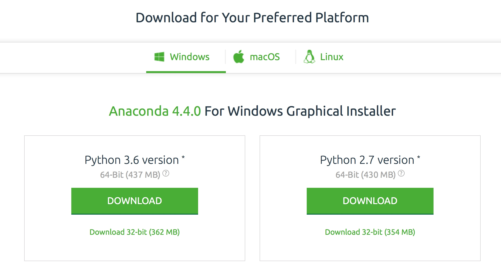
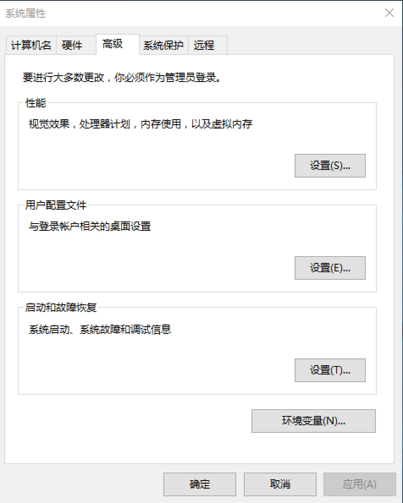
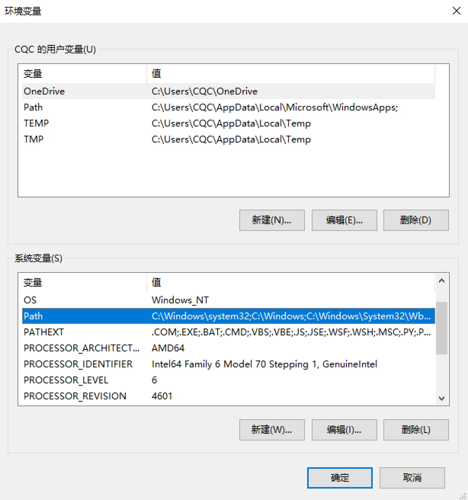
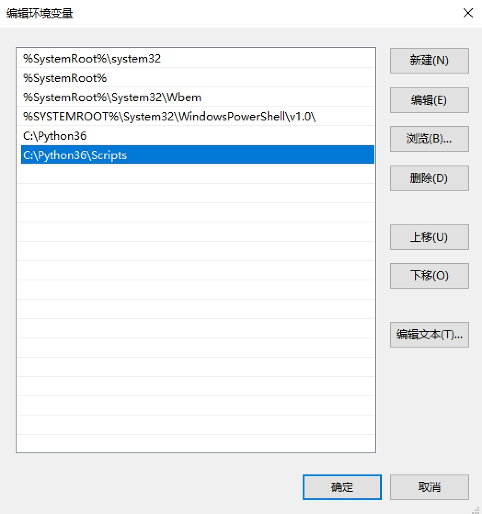
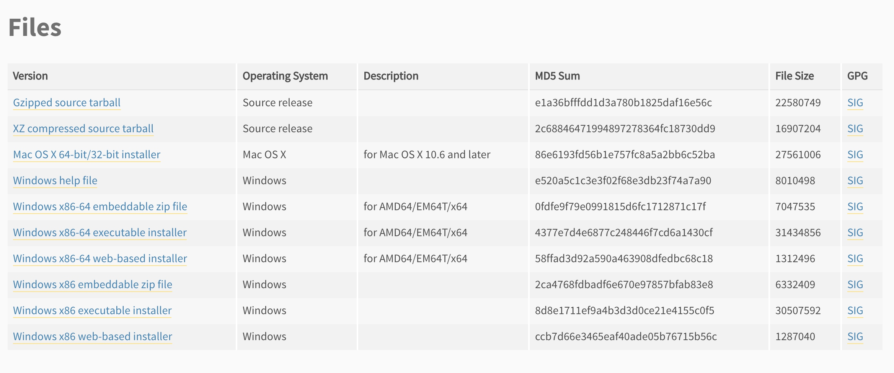

## 1.1 Python 3 的安装

既然要用 Python 3 开发爬虫，那么第一步一定是安装 Python 3。这里会介绍 Windows、Linux 和 Mac 三大平台下的安装过程，相关链接如下：

* 官方网站：[http://python.org](http://python.org)
* 下载地址：[https://www.python.org/downloads](https://www.python.org/downloads)
* 第三方库：[https://pypi.python.org/pypi](https://pypi.python.org/pypi)
* 官方文档：[https://docs.python.org/3](https://docs.python.org/3)
* 中文教程：[http://www.runoob.com/python3/python3-tutorial.html](http://www.runoob.com/python3/python3-tutorial.html)
* Awesome Python：[https://github.com/vinta/awesome-python](https://github.com/vinta/awesome-python)
* Awesome Python 中文版：[https://github.com/jobbole/awesome-python-cn](https://github.com/jobbole/awesome-python-cn)

### 1.1.1 Windows 下的安装

在 Windows 下安装 Python 3 的方式有两种。

一种是通过 Anaconda 安装，它提供了 Python 的科学计算环境，里面自带了 Python 以及常用的库。如果选用了这种方式，后面的环境配置方式会更加简便。

另一种是直接下载安装包安装，即标准的安装方式。

下面我们依次介绍这两种安装方式，任选其一即可。

#### 1. Anaconda 安装

Anaconda 的官方下载链接为：[https://www.continuum.io/downloads](https://www.continuum.io/downloads)，选择 Python 3 版本的安装包下载即可，如图 1-1 所示：



图 1-1 Anaconda Windows 下载页面

如果下载速度过慢，可以选择使用清华大学镜像，下载列表链接为 [https://mirrors.tuna.tsinghua.edu.cn/anaconda/archive/](https://mirrors.tuna.tsinghua.edu.cn/anaconda/archive/)，使用说明链接为 [https://mirrors.tuna.tsinghua.edu.cn/help/anaconda/](https://mirrors.tuna.tsinghua.edu.cn/help/anaconda/)，下载完成之后，直接双击安装包安装即可。安装完成之后，Python 3 的环境就配置好了。

#### 2. 安装包安装

我们推荐直接下载安装包来安装，此时可以直接到官方网站下载 Python 3 的安装包：[https://www.python.org/downloads/](https://www.python.org/downloads/)。

写书时，Python 的最新版本是 3.6.2，其下载链接为 [https://www.python.org/downloads/release/python-362/](https://www.python.org/downloads/release/python-362/)，下载页面如图 1-2 所示。需要说明的是，实际的 Python 最新版本以官网为准。


图 1-2 Python 下载页面

64 位系统可以下载 Windows x86-64 executable installer，32 位系统可以下载 Windows x86 executable installer。

下载完成之后，直接双击 Python 安装包，然后通过图形界面安装，接着设置 Python 的安装路径，完成后将 Python 3 和 Python 3 的 Scripts 目录配置到环境变量即可。

关于环境变量的配置，此处以 Windows 10 系统为例进行演示。

假如安装后的 Python 3 路径为 C:\Python36，从资源管理器中打开该路径，如图 1-3 所示。


图 1-3 Python 安装目录

将该路径复制下来。

随后，右击 “计算机”，从中选择 “属性”，此时将打开系统属性窗口，如图 1-4 所示。


图 1-4 系统属性

点击左侧的 “高级系统设置”，即可在弹出的对话框下方看到 “环境变量” 按钮，如图 1-5 所示。



图 1-5 高级系统设置

点击 “环境变量” 按钮，找到系统变量下的 Path 变量，随后点击 “编辑” 按钮，如图 1-6 所示。



图 1-6 环境变量

随后点击 “新建”，新建一个条目，将刚才的 C:\Python36 复制进去。这里需要说明的是，此处的路径就是你的 Python 3 安装目录，请自行替换。然后，再把 C:\Python36\Scripts 路径复制进去，如图 1-7 所示。



图 1-7 编辑环境变量

最后，点击 “确定” 按钮即可完成环境变量的配置。

配置好环境变量后，我们就可以在命令行中直接执行环境变量路径下的可执行文件了，如 python、pip 等命令。

#### 3. 添加别名

上面这两种安装方式任选其一即可完成安装，但如果之前安装过 Python 2 的话，可能会导致版本冲突问题，比如在命令行下输入 python 就不知道是调用的 Python 2 还是 Python 3 了。为了解决这个问题，建议将安装目录中的 python.exe 复制一份，命名为 python3.exe，这样便可以调用 python3 命令了。实际上，它和 python 命令是完全一致的，这样只是为了可以更好地区分 Python 版本。当然，如果没有安装过 Python 2 的话，也建议添加此别名，添加完毕之后的效果如图 1-8 所示。


图 1-8 添加别名

对于 pip 来说，安装包中自带了 pip3.exe 可执行文件，我们也可以直接使用 pip3 命令，无需额外配置。

#### 4. 测试验证

安装完成后，可以通过命令行测试一下安装是否成功。在 “开始” 菜单中搜索 cmd，找到命令提示符，此时就进入命令行模式了。输入 python，测试一下能否成功调用 Python。如果添加了别名的话，可以输入 python3 测试。这里输入的是 python3，测试结果如图 1-9 所示。


图 1-9 测试验证页面

类似输出结果如下：

```python
$ python3
Python 3.6.1 (v3.6.1:69c0db5, Mar 21 2017, 17:54:52) [MSC v.1900 32 bit (Intel)] on win32
Type "help", "copyright", "credits" or "license" for more information.
>>> print('Hello World')
Hello World
>>> exit()
$ pip3 -V
pip 9.0.1 from c:\python36\lib\site-packages (python 3.6)
```

如果出现了类似上面的提示，则证明 Python 3 和 pip 3 均安装成功；如果提示命令不存在，那么请检查下环境变量的配置情况。

### 1.1.2 Linux 下的安装

Linux 下的安装方式有多种：命令安装、源码安装和 Anaconda 安装。

使用源码安装需要自行编译，时间较长。推荐使用系统自带的命令或 Anaconda 安装，简单、高效。这里分别讲解这 3 种安装方式。

#### 1. 命令行安装

不同的 Linux 发行版本安装方式又有不同，在此分别予以介绍。

##### CentOS、RedHat

如果是 CentOS 或 Red Hat 版本，则使用 yum 命令安装即可。

下面列出了 Python 3.5 和 Python 3.4 两个版本的安装方法，可以自行选择。

Python 3.5 版本：

```
sudo yum install -y https://centos7.iuscommunity.org/ius-release.rpm
sudo yum update
sudo yum install -y python35u python35u-libs python35u-devel python35u-pip
```

执行完毕之后便可以成功安装 Python 3.5 及 pip 3 了。

Python 3.4 版本：

```
sudo yum groupinstall -y development tools
sudo yum install -y epel-release python34-devel  libxslt-devel libxml2-devel openssl-devel
sudo yum install -y python34
sudo yum install -y python34-setuptools
sudo easy_install-3.4 pip
```

执行完毕之后便可以成功安装 Python 3.4 及 pip 3 了。

##### Ubuntu、Debian、Deepin

首先安装 Python 3，使用 apt-get 安装即可，在安装前，还需安装一些基础库，相关命令如下：

```
sudo apt-get install -y python3-dev build-essential libssl-dev libffi-dev libxml2 libxml2-dev libxslt1-dev zlib1g-dev libcurl4-openssl-dev
sudo apt-get install -y python3
```

执行完如上命令之后，就可以成功安装好 Python 3 了。

然后还需要安装 pip 3，这里仍然使用 apt-get 安装即可，命令如下：

```
sudo apt-get install -y python3-pip
```

执行完毕之后便可以成功安装 Python 3 及 pip 3 了。

#### 2. 源码安装

如果命令行的安装方式有问题，还可以下载 Python 3 源码进行安装。

源码下载地址为 [https://www.python.org/ftp/python/](https://www.python.org/ftp/python/)，可以自行选用想要的版本进行安装，这里以 Python 3.6.2 为例进行说明，安装路径设置为 /usr/local/python3。

首先创建安装目录，命令如下：

```
sudo mkdir /usr/local/python3
```

随后下载安装包并解压进入，命令如下：

```
wget --no-check-certificate https://www.python.org/ftp/python/3.6.2/Python-3.6.2.tgz
tar -xzvf Python-3.6.2.tgz
cd Python-3.6.2
```
接下来编译安装，所需时间可能较长，请耐心等待，命令如下：
```
sudo ./configure --prefix=/usr/local/python3
sudo make
sudo make install
```
安装完成之后创建 Python 3 链接，命令如下：
```
sudo ln -s /usr/local/python3/bin/python3 /usr/bin/python3
```
随后下载 pip 安装包并安装，命令如下：
```
wget --no-check-certificate https://github.com/pypa/pip/archive/9.0.1.tar.gz
tar -xzvf 9.0.1.tar.gz
cd pip-9.0.1
python3 setup.py install
```
安装完成后再创建 pip 3 链接，命令如下：
```
sudo ln -s /usr/local/python3/bin/pip/usr/bin/pip3
```

这样就成功安装好了 Python 3 及 pip 3。

#### 3. Anaconda 安装

Anaconda 同样支持 Linux，其官方下载链接为：[https://www.continuum.io/downloads]([https://www.continuum.io/downloads)，选择 Python 3 版本的安装包下载即可，如图 1-10 所示：


图 1-10 Anaconda Linux 下载页面

如果下载速度过慢，同样可以使用清华镜像，参考 Windows 部分的介绍，在此不再赘述。

#### 4. 测试验证

在命令行界面下测试 Python 3 和 pip 3 是否安装成功：

```
$ python3
Python 3.5.2 (default, Nov 17 2016, 17:05:23) 
Type "help", "copyright", "credits" or "license" for more information.
>>> exit()
$ pip3 -V
pip 8.1.1 from /usr/lib/python3/dist-packages (python 3.5)
```

如出现类似上面的提示，则证明 Python 3 和 pip 3 安装成功。

### 1.1.3 Mac 下的安装

在 Mac 下同样有多种安装方式，如 Homebrew、安装包安装、Anaconda 安装等，这里推荐使用 Homebrew 安装。

#### 1. Homebrew 安装

Homebrew 是 Mac 平台下强大的包管理工具，首先安装 Homebrew，官方网站是 [https://brew.sh/](https://brew.sh/)。

执行如下命令，即可安装 Homebrew：

```
ruby -e"$(curl -fsSL https://raw.githubusercontent.com/Homebrew/install/master/install)"
```

安装完成后，便可以使用 brew 命令安装 Python 3 和 pip 3 了。

```
brew install python3
```

命令执行完成之后，我们发现 Python3 和 pip 3 均已经成功安装。

#### 2. 安装包安装

可以到官方网站下载 Python 3 安装包。链接为 https://www.python.org/downloads/，页面如图 1-2 所示。

在 Mac 平台下，可以选择下载 Mac OS X 64-bit/32-bit installer，下载完成后，打开安装包按照提示安装即可。

#### 3. Anaconda 安装

Anaconda 同样支持 Mac，其官方下载链接为：https://www.continuum.io/downloads，选择 Python 3 版本的安装包下载即可，如图 1-11 所示。



图 1-11 Anaconda Mac 下载页面

如果下载速度过慢，同样可以使用清华镜像，具体可参考 Windows 部分的介绍，在此不再赘述。

#### 4. 测试验证

打开终端，在命令行界面中测试 Python 3 和 pip 3 是否成功安装，如图 1-12 所示。


图 1-13 测试验证页面

若出现上面的提示，则证明 Python 3 和 pip 3 安装成功。

本节中，我们介绍了 3 大平台 Windows、Linux 和 Mac 下 Python 3 的安装方式。安装完成后，我们便可以开启 Python 爬虫的征程了。