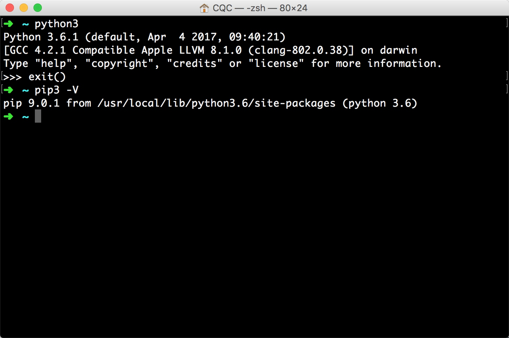
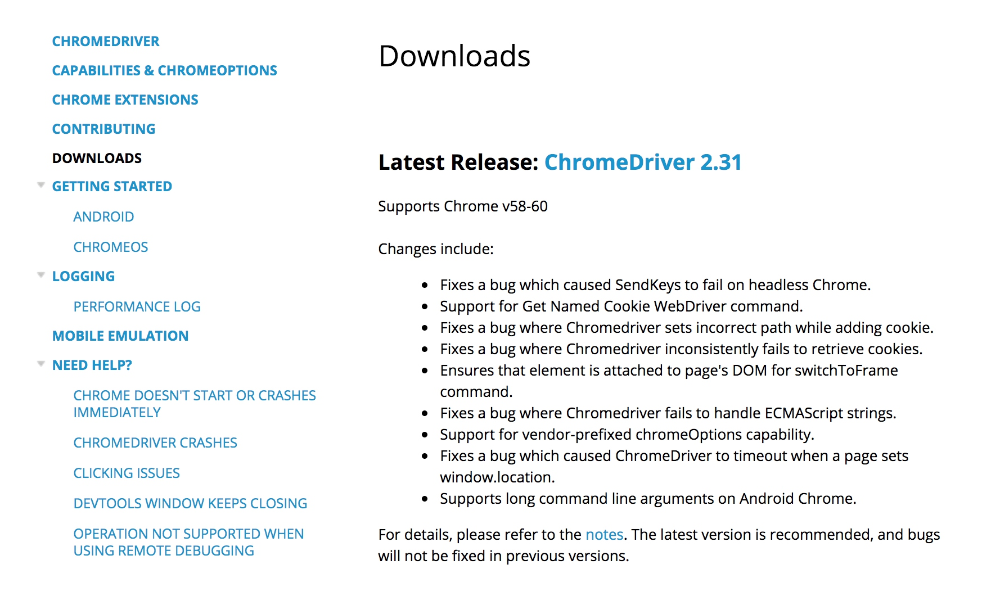
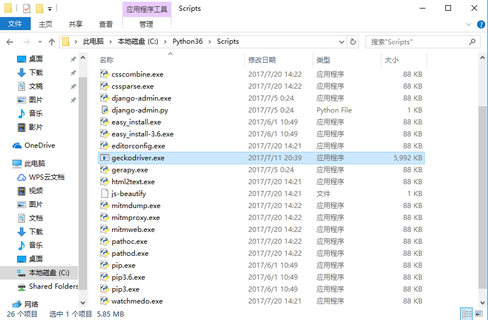
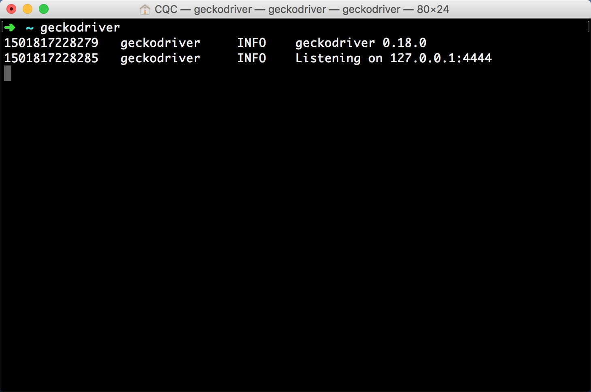

## 1.2 请求库的安装

爬虫可以简单分为几步：抓取页面、分析页面和存储数据。

在抓取页面的过程中，我们需要模拟浏览器向服务器发出请求，所以需要用到一些 Python 库来实现 HTTP 请求操作。在本书中，我们用到的第三方库有 requests、Selenium 和 aiohttp 等。

在本节中，我们介绍一下这些请求库的安装方法。

### 1.2.1 requests 的安装

由于 requests 属于第三方库，也就是 Python 默认不会自带这个库，所以需要我们手动安装。下面我们首先看一下它的安装过程。

#### 1. 相关链接

- GitHub：[https://github.com/requests/requests](https://github.com/requests/requests)
- PyPI：[https://pypi.python.org/pypi/requests](https://pypi.python.org/pypi/requests)
- 官方文档：[http://www.python-requests.org](http://www.python-requests.org)
- 中文文档：[http://docs.python-requests.org/zh_CN/latest](http://docs.python-requests.org/zh_CN/latest)

#### 2. pip 安装

无论是 Windows、Linux 还是 Mac，都可以通过 pip 这个包管理工具来安装。

在命令行界面中运行如下命令，即可完成 requests 库的安装：

```
pip3 install requests
```

这是最简单的安装方式，推荐使用这种方法安装。

#### 3. wheel 安装

wheel 是 Python 的一种安装包，其后缀为 .whl，在网速较差的情况下可以选择下载 wheel 文件再安装，然后直接用 pip3 命令加文件名安装即可。

不过在这之前需要先安装 wheel 库，安装命令如下：

```
pip3 install wheel
```

然后到 PyPI 上下载对应的 wheel 文件，如最新版本为 2.17.3，则打开：[https://pypi.python.org/pypi/requests/2.17.3#downloads](https://pypi.python.org/pypi/requests/2.17.3#downloads)，下载 requests-2.17.3-py2.py3-none-any.whl 到本地。

随后在命令行界面进入 wheel 文件目录，利用 pip 安装即可：

```
pip3 install requests-2.17.3-py2.py3-none-any.whl
```

这样我们也可以完成 requests 的安装。

#### 4. 源码安装

如果你不想用 pip 来安装，或者想获取某一特定版本，可以选择下载源码安装。

此种方式需要先找到此库的源码地址，然后下载下来再用命令安装。

requests 项目的地址是：[https://github.com/kennethreitz/requests](https://github.com/kennethreitz/requests)

可以通过 Git 来下载源代码：

```
git clone git://github.com/kennethreitz/requests.git
```

或通过 curl 下载：

```
curl -OL https://github.com/kennethreitz/requests/tarball/master
```

下载下来之后，进入目录，执行如下命令即可安装：

```
cd requests
python3 setup.py install
```

命令执行结束后即可完成 requests 的安装。由于这种安装方式比较烦琐，后面不再赘述。

#### 5. 验证安装

为了验证库是否已经安装成功，可以在命令行模式测试一下：

```
$ python3
>>> import requests
```

首先输入 python3，进入命令行模式，然后输入上述内容，如果什么错误提示也没有，就证明已经成功安装了 requests。

### 1.2.2 Selenium 的安装

Selenium 是一个自动化测试工具，利用它我们可以驱动浏览器执行特定的动作，如点击、下拉等操作。对于一些 JavaScript 渲染的页面来说，这种抓取方式非常有效。下面我们来看看 Selenium 的安装过程。

#### 1. 相关链接

- 官方网站：[http://www.seleniumhq.org](http://www.seleniumhq.org)
- GitHub：[https://github.com/SeleniumHQ/selenium/tree/master/py](https://github.com/SeleniumHQ/selenium/tree/master/py)
- PyPI：[https://pypi.python.org/pypi/selenium](https://pypi.python.org/pypi/selenium)
- 官方文档：[http://selenium-python.readthedocs.io](http://selenium-python.readthedocs.io)
- 中文文档：[http://selenium-python-zh.readthedocs.io](http://selenium-python-zh.readthedocs.io)

#### 2. pip 安装

这里推荐直接使用 pip 安装，执行如下命令即可：

```
pip3 install selenium
```

#### 3. wheel 安装

此外，也可以到 PyPI 下载对应的 wheel 文件进行安装，下载地址为 [https://pypi.python.org/pypi/selenium/#downloads](https://pypi.python.org/pypi/selenium/#downloads)，如最新版本为 3.4.3，则下载 selenium-3.4.3-py2.py3-none-any.whl 即可。

然后进入 wheel 文件目录，使用 pip 安装：

```
pip3 install selenium-3.4.3-py2.py3-none-any.whl
```

#### 4. 验证安装

进入 Python 命令行交互模式，导入 Selenium 包，如果没有报错，则证明安装成功：

```
$ python3
>>> import selenium
```

但这样做还不够，因为我们还需要用浏览器（如 Chrome、Firefox 等）来配合 Selenium 工作。

后面我们会介绍 Chrome、Firefox、PhantomJS 三种浏览器的配置方式。有了浏览器，我们才可以配合 Selenium 进行页面的抓取。

### 1.2.3 ChromeDriver 的安装

前面我们成功安装好了 Selenium 库，但是它是一个自动化测试工具，需要浏览器来配合使用，本节中我们就介绍一下 Chrome 浏览器及 ChromeDriver 驱动的配置。

首先，下载 Chrome 浏览器，方法有很多，在此不再赘述。

随后安装 ChromeDriver。因为只有安装 ChromeDriver，才能驱动 Chrome 浏览器完成相应的操作。下面我们来介绍下怎样安装 ChromeDriver。

#### 1. 相关链接

- 官方网站：[https://sites.google.com/a/chromium.org/chromedriver](https://sites.google.com/a/chromium.org/chromedriver)
- 下载地址：[https://chromedriver.storage.googleapis.com/index.html](https://chromedriver.storage.googleapis.com/index.html)

#### 2. 准备工作

在这之前请确保已经正确安装好了 Chrome 浏览器并可以正常运行，安装过程不再赘述。

#### 3. 查看版本

点击 Chrome 菜单 “帮助”→“关于 Google Chrome”，即可查看 Chrome 的版本号，如图 1-13 所示。



图 1-13　Chrome 版本号

这里我的 Chrome 版本是 58.0。

请记住 Chrome 版本号，因为选择 ChromeDriver 版本时需要用到。

#### 4. 下载 ChromeDriver

打开 ChromeDriver 的官方网站，可以看到最新版本为 2.31，其支持的 Chrome 浏览器版本为 58~60，官网页面如图 1-14 所示。



图 1-14　官网页面

如果你的 Chrome 版本号是 58~60，那么可以选择此版本下载。

如果你的 Chrome 版本号不在此范围，可以继续查看之前的 ChromeDriver 版本。每个版本都有相应的支持 Chrome 版本的介绍，请找好自己的 Chrome 浏览器版本对应的 ChromeDriver 版本再下载，否则可能无法正常工作。

找好对应的版本号后，随后到 ChromeDriver 镜像站下载对应的安装包即可，链接为 https://chromedriver.storage.googleapis.com/index.html。在不同平台下，可以下载不同的安装包。

#### 5. 环境变量配置

下载完成后，将 ChromeDriver 的可执行文件配置到环境变量下。

在 Windows 下，建议直接将 chromedriver.exe 文件拖到 Python 的 Scripts 目录下，如图 1-15 所示。


图 1-15　Python Scripts 目录

此外，也可以单独将其所在路径配置到环境变量，具体的配置方法请参见 1.1 节。

在 Linux 和 Mac 下，需要将可执行文件配置到环境变量或将文件移动到属于环境变量的目录里。

例如，要移动文件到 /usr/bin 目录。首先，需要在命令行模式下进入其所在路径，然后将其移动到 /usr/bin 目录：

```
sudo mv chromedriver /usr/bin
```

另外，如果你的系统是 Mac OS X El Capitan 10.11 及更新的系统版本的话，需要先关闭 Rootless 内核保护机制，具体可参考：[http://www.pc6.com/edu/86809.html](http://www.pc6.com/edu/86809.html)。

当然，也可以将 ChromeDriver 配置到 $PATH。首先，可以将可执行文件放到某一目录，目录可以任意选择，例如将当前可执行文件放在 /usr/local/chromedriver 目录下，接下来在 Linux 下可以修改～/.profile 文件，在 Mac 下可以修改～/.bash_profile 文件，添加如下内容：

```
export PATH="$PATH:/usr/local/chromedriver"
```

保存后在 Linux 下执行如下命令：

```
source ~/.profile
```

在 Mac 下执行如下命令：

```
source ~/.bash_profile
```

即可完成环境变量的添加。

#### 6. 验证安装

配置完成后，就可以在命令行下直接执行 chromedriver 命令了：

```
chromedriver
```

如果输入控制台有类似图 1-16 所示的输出，则证明 ChromeDriver 的环境变量配置好了。


图 1-16　控制台输出

随后再在程序中测试。执行如下 Python 代码：

```python
from selenium import webdriver
browser = webdriver.Chrome()
```

运行之后，如果弹出一个空白的 Chrome 浏览器，则证明所有的配置都没有问题。如果没有弹出，请检查之前的每一步配置。

如果弹出后闪退，则可能是 ChromeDriver 版本和 Chrome 版本不兼容，请更换 ChromeDriver 版本。

如果没有问题，接下来就可以利用 Chrome 来做网页抓取了。

### 1.2.4 GeckoDriver 的安装

上一节中，我们了解了 ChromeDriver 的配置方法，配置完成之后便可以用 Selenium 驱动 Chrome 浏览器来做相应网页的抓取。

那么对于 Firefox 来说，也可以使用同样的方式完成 Selenium 的对接，这时需要安装另一个驱动 GeckoDriver。

本节中，我们来介绍一下 GeckoDriver 的安装过程。

#### 1. 相关链接

- GitHub：[https://github.com/mozilla/geckodriver](https://github.com/mozilla/geckodriver)
- 下载地址：[https://github.com/mozilla/geckodriver/releases](https://github.com/mozilla/geckodriver/releases)

#### 2. 准备工作

在这之前请确保已经正确安装好了 Firefox 浏览器并可以正常运行，安装过程不再赘述。

#### 3. 下载 GeckoDriver

我们可以在 GitHub 上找到 GeckoDriver 的发行版本，当前最新版本为 0.18，下载页面如图 1-17 所示。


图 1-17 GeckoDriver 下载页面

这里可以在不同的平台上下载，如 Windows、Mac、Linux、ARM 等平台，我们可以根据自己的系统和位数选择对应的驱动下载，若是 Windows 64 位，就下载 geckodriver-v0.18.0-win64.zip。

#### 4. 环境变量配置

在 Windows 下，可以直接将 geckodriver.exe 文件拖到 Python 的 Scripts 目录下，如图 1-18 所示。


图 1-18　将 geckodriver.exe 文件拖到 Python Scripts 目录

此外，也可以单独将其所在路径配置到环境变量，具体的配置方法请参 1.1 节。

在 Linux 和 Mac 下，需要将可执行文件配置到环境变量或将文件移动到属于环境变量的目录里。

例如，要移动文件到 /usr/bin 目录。首先在命令行模式下进入其所在路径，然后将其移动到 /usr/bin：

```
sudo mv geckodriver /usr/bin
```

当然，也可以将 GeckoDriver 配置到 $PATH。首先，可以将可执行文件放到某一目录，目录可以任意选择，例如将当前可执行文件放在 /usr/local/geckodriver 目录下。接下来可以修改～/.profile 文件，然后添加如下一句配置：

```
export PATH="$PATH:/usr/local/geckodriver"
```

保存后执行如下命令即可完成配置：

```
source ~/.profile
```

#### 5. 验证安装

配置完成后，就可以在命令行下直接执行 geckodriver 命令测试：

```
geckodriver
```

这时如果控制台有类似图 1-19 所示的输出，则证明 GeckoDriver 的环境变量配置好了。



图 1-19　控制台输出

随后执行如下 Python 代码。在程序中测试一下：

```python
from selenium import webdriver  
browser = webdriver.Firefox()
```

运行之后，若弹出一个空白的 Firefox 浏览器，则证明所有的配置都没有问题；如果没有弹出，请检查之前的每一步配置。

如果没有问题，接下来就可以利用 Firefox 配合 Selenium 来做网页抓取了。

现在我们就可以使用 Chrome 或 Firefox 进行网页抓取了，但是这样可能有个不方便之处：因为程序运行过程中需要一直开着浏览器，在爬取网页的过程中浏览器可能一直动来动去。目前最新的 Chrome 浏览器版本已经支持无界面模式了，但如果版本较旧的话，就不支持。所以这里还有另一种选择，那就是安装一个无界面浏览器 PhantomJS，此时抓取过程会在后台运行，不会再有窗口出现。在下一节中，我们就来了解一下 PhantomJS 的相关安装方法。

### 1.2.5 PhantomJS 的安装

PhantomJS 是一个无界面的、可脚本编程的 WebKit 浏览器引擎，它原生支持多种 Web 标准：DOM 操作、CSS 选择器、JSON、Canvas 以及 SVG。

Selenium 支持 PhantomJS，这样在运行的时候就不会再弹出一个浏览器了。而且 PhantomJS 的运行效率也很高，还支持各种参数配置，使用非常方便。下面我们就来了解一下 PhantomJS 的安装过程。

#### 1. 相关链接

- 官方网站：[http://phantomjs.org](http://phantomjs.org)
- 官方文档：[http://phantomjs.org/quick-start.html](http://phantomjs.org/quick-start.html)
- 下载地址：[http://phantomjs.org/download.html](http://phantomjs.org/download.html)
- API 接口说明：[http://phantomjs.org/api/command-line.html](http://phantomjs.org/api/command-line.html)

#### 2. 下载 PhantomJS

我们需要在官方网站下载对应的安装包，PhantomJS 支持多种操作系统，比如 Windows、Linux、Mac、FreeBSD 等，我们可以选择对应的平台并将安装包下载下来。

下载完成后，将 PhantomJS 可执行文件所在的路径配置到环境变量里。比如在 Windows 下，将下载的文件解压之后并打开，会看到一个 bin 文件夹，里面包括一个可执行文件 phantomjs.exe，我们需要将它直接放在配置好环境变量的路径下或者将它所在的路径配置到环境变量里。比如，我们既可以将它直接复制到 Python 的 Scripts 文件夹，也可以将它所在的 bin 目录加入到环境变量。

Windows 下环境变量的配置可以参见 1.1 节，Linux 及 Mac 环境变量的配置可以参见 1.2.3 节，在此不再赘述，关键在于将 PhantomJS 的可执行文件所在路径配置到环境变量里。

配置成功后，可以在命令行下测试一下，输入：

```
phantomjs
```

如果可以进入到 PhantomJS 的命令行，那就证明配置完成了，如图 1-20 所示。



图 1-20　控制台

#### 3. 验证安装

在 Selenium 中使用的话，我们只需要将 Chrome 切换为 PhantomJS 即可：

```python
from selenium import webdriver
browser = webdriver.PhantomJS()
browser.get('https://www.baidu.com')
print(browser.current_url)
```

运行之后，我们就不会发现有浏览器弹出了，但实际上 PhantomJS 已经运行起来了。这里我们访问了百度，然后将当前的 URL 打印出来。

控制台的输出如下：

```python
https://www.baidu.com/
```

如此一来，我们便完成了 PhantomJS 的配置，后面可以利用它来完成一些页面的抓取。

这里我们介绍了 Selenium 对应的三大主流浏览器的对接方式，后面我们会对 Selenium 及各个浏览器的对接方法进行更加深入的探究。

### 1.2.6 aiohttp 的安装

之前介绍的 requests 库是一个阻塞式 HTTP 请求库，当我们发出一个请求后，程序会一直等待服务器响应，直到得到响应后，程序才会进行下一步处理。其实，这个过程比较耗费时间。如果程序可以在这个等待过程中做一些其他的事情，如进行请求的调度、响应的处理等，那么爬取效率一定会大大提高。

aiohttp 就是这样一个提供异步 Web 服务的库，从 Python 3.5 版本开始，Python 中加入了 async/await 关键字，使得回调的写法更加直观和人性化。aiohttp 的异步操作借助于 async/await 关键字的写法变得更加简洁，架构更加清晰。使用异步请求库进行数据抓取时，会大大提高效率，下面我们来看一下这个库的安装方法。

#### 1. 相关链接

- 官方文档：[http://aiohttp.readthedocs.io/en/stable](http://aiohttp.readthedocs.io/en/stable)
- GitHub：[https://github.com/aio-libs/aiohttp](https://github.com/aio-libs/aiohttp)
- PyPI：[https://pypi.python.org/pypi/aiohttp](https://pypi.python.org/pypi/aiohttp)

#### 2. pip 安装

这里推荐使用 pip 安装，命令如下：

```
pip3 install aiohttp
```

另外，官方还推荐安装如下两个库：一个是字符编码检测库 cchardet，另一个是加速 DNS 的解析库 aiodns。安装命令如下：

```
pip3 install cchardet aiodns
```

#### 3. 测试安装

安装完成之后，可以在 Python 命令行下测试：

```
$ python3
>>> import aiohttp
```

如果没有错误报出，则证明库已经安装好了。

我们会在后面的实例中用到这个库，比如维护一个代理池时，利用异步方式检测大量代理的运行状况，会极大地提升效率。