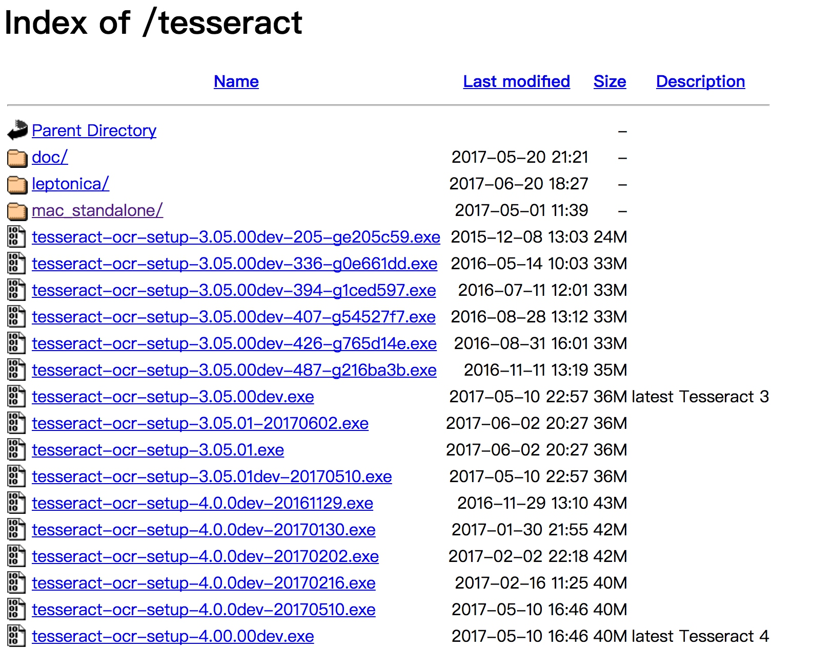
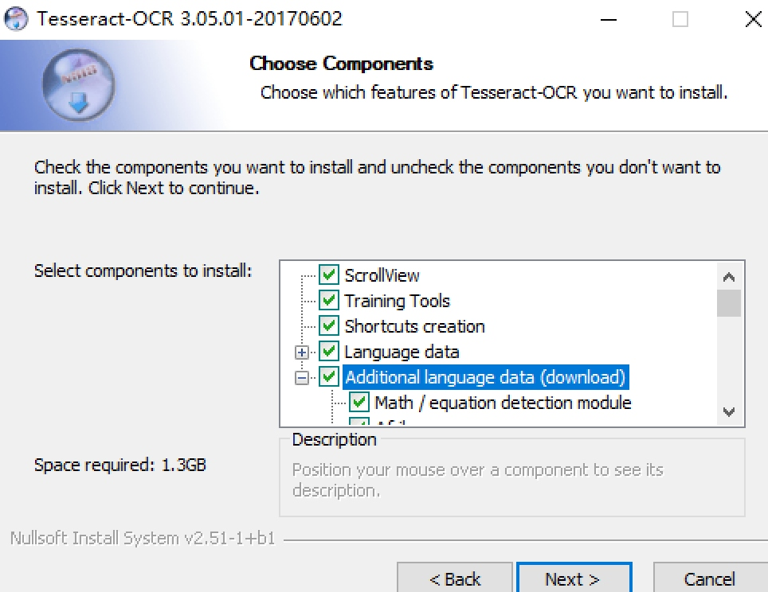

## 1.3 解析库的安装

抓取网页代码之后，下一步就是从网页中提取信息。提取信息的方式有多种多样，可以使用正则来提取，但是写起来相对比较烦琐。这里还有许多强大的解析库，如 lxml、Beautiful Soup、pyquery 等。此外，还提供了非常强大的解析方法，如 XPath 解析和 CSS 选择器解析等，利用它们，我们可以高效便捷地从网页中提取有效信息。

本节中，我们就来介绍一下这些库的安装过程。

### 1.3.1　lxml 的安装

lxml 是 Python 的一个解析库，支持 HTML 和 XML 的解析，支持 XPath 解析方式，而且解析效率非常高。本节中，我们了解一下 lxml 的安装方式，这主要从 Windows、Linux 和 Mac 三大平台来介绍。

#### 1. 相关链接

* 官方网站：[http://lxml.de](http://lxml.de)
* GitHub：[https://github.com/lxml/lxml](https://github.com/lxml/lxml)
* PyPI：[https://pypi.python.org/pypi/lxml](https://pypi.python.org/pypi/lxml)

#### 2. Windows 下的安装

在 Windows 下，可以先尝试利用 pip 安装，此时直接执行如下命令即可：

```
pip3 install lxml
```

如果没有任何报错，则证明安装成功。

如果出现报错，比如提示缺少 libxml2 库等信息，可以采用 wheel 方式安装。

推荐直接到这里，链接为 [http://www.lfd.uci.edu/~gohlke/pythonlibs/#lxml](http://www.lfd.uci.edu/~gohlke/pythonlibs/#lxml)，下载对应的 wheel 文件，找到本地安装 Python 版本和系统对应的 lxml 版本，例如 Windows 64 位、Python 3.6，就选择 lxml-3.8.0-cp36-cp36m-win_amd64.whl，将其下载到本地。

然后利用 pip 安装即可，命令如下：

```
pip3 install lxml-3.8.0-cp36-cp36m-win_amd64.whl
```

这样我们就可以成功安装 lxml 了。

#### 3. Linux 下的安装

在 Linux 平台下安装问题不大，同样可以先尝试 pip 安装，命令如下：

```
pip3 install lxml
```

如果报错，可以尝试下面的解决方案。

##### CentOS、Red Hat

对于此类系统，报错主要是因为缺少必要的库。

执行如下命令安装所需的库即可：

```
sudo yum groupinstall -y development tools  
sudo yum install -y epel-release libxslt-devel libxml2-devel openssl-devel
```

主要是 libxslt-devel 和 libxml2-devel 这两个库，lxml 依赖它们。安装好之后，重新尝试 pip 安装即可。

##### Ubuntu、Debian 和 Deepin

在这些系统下，报错的原因同样可能是缺少了必要的类库，执行如下命令安装：

```
sudo apt-get install -y python3-dev build-essential libssl-dev libffi-dev libxml2 libxml2-dev libxslt1-dev zlib1g-dev
```

安装好之后，重新尝试 pip 安装即可。

#### 4. Mac 下的安装

在 Mac 平台下，仍然可以首先尝试 pip 安装，命令如下：

```
pip3 install lxml
```

如果产生错误，可以执行如下命令将必要的类库安装：

```
xcode-select --install
```

之后再重新尝试 pip 安装，就没有问题了。

lxml 是一个非常重要的库，后面的 Beautiful Soup、Scrapy 框架都需要用到此库，所以请一定安装成功。

#### 5. 验证安装

安装完成之后，可以在 Python 命令行下测试：

```
$ python3
>>> import lxml
```

如果没有错误报出，则证明库已经安装好了。

### 1.3.2　Beautiful Soup 的安装

Beautiful Soup 是 Python 的一个 HTML 或 XML 的解析库，我们可以用它来方便地从网页中提取数据。它拥有强大的 API 和多样的解析方式，本节就来了解下它的安装方式。

#### 1. 相关链接

* 官方文档：[https://www.crummy.com/software/BeautifulSoup/bs4/doc](https://www.crummy.com/software/BeautifulSoup/bs4/doc)
* 中文文档：[https://www.crummy.com/software/BeautifulSoup/bs4/doc.zh](https://www.crummy.com/software/BeautifulSoup/bs4/doc.zh)
* PyPI：[https://pypi.python.org/pypi/beautifulsoup4](https://pypi.python.org/pypi/beautifulsoup4)

#### 2. 准备工作

Beautiful Soup 的 HTML 和 XML 解析器是依赖于 lxml 库的，所以在此之前请确保已经成功安装好了 lxml 库，具体的安装方式参见上节。

#### 3. pip 安装

目前，Beautiful Soup 的最新版本是 4.x 版本，之前的版本已经停止开发了。这里推荐使用 pip 来安装，安装命令如下：

```
pip3 install beautifulsoup4
```

命令执行完毕之后即可完成安装。

#### 4. wheel 安装

当然，我们也可以从 PyPI 下载 wheel 文件安装，链接如下：
[https://pypi.python.org/pypi/beautifulsoup4](https://pypi.python.org/pypi/beautifulsoup4)

然后使用 pip 安装 wheel 文件即可。

#### 5. 验证安装

安装完成之后，可以运行下面的代码验证一下：

```python
from bs4 import BeautifulSoup  
soup = BeautifulSoup('&lt;p&gt;Hello&lt;/p&gt;', 'lxml')  
print(soup.p.string)
```
运行结果如下：
```
Hello
```

如果运行结果一致，则证明安装成功。

注意，这里我们虽然安装的是 beautifulsoup4 这个包，但是在引入的时候却是 bs4。这是因为这个包源代码本身的库文件夹名称就是 bs4，所以安装完成之后，这个库文件夹就被移入到本机 Python3 的 lib 库里，所以识别到的库文件名就叫作 bs4。

因此，包本身的名称和我们使用时导入的包的名称并不一定是一致的。

### 1.3.3　pyquery 的安装

pyquery 同样是一个强大的网页解析工具，它提供了和 jQuery 类似的语法来解析 HTML 文档，支持 CSS 选择器，使用非常方便。本节中，我们就来了解一下它的安装方式。

#### 1. 相关链接

* GitHub：[https://github.com/gawel/pyquery](https://github.com/gawel/pyquery)
* PyPI：[https://pypi.python.org/pypi/pyquery](https://pypi.python.org/pypi/pyquery)
* 官方文档：[http://pyquery.readthedocs.io](http://pyquery.readthedocs.io)

#### 2. pip 安装

这里推荐使用 pip 安装，命令如下：

```
pip3 install pyquery
```

命令执行完毕之后即可完成安装。

#### 3. wheel 安装

当然，我们也可以到 PyPI [https://pypi.python.org/pypi/pyquery/#downloads](https://pypi.python.org/pypi/pyquery/#downloads) 下载对应的 wheel 文件安装。比如如果当前版本为 1.2.17，则下载的文件名称为 pyquery-1.2.17-py2.py3-none-any.whl，此时下载到本地再进行 pip 安装即可，命令如下：

```
pip3 install pyquery-1.2.17-py2.py3-none-any.whl
```

#### 4. 验证安装

安装完成之后，可以在 Python 命令行下测试：

```
$ python3
>>> import pyquery
```

如果没有错误报出，则证明库已经安装好了。

### 1.3.4　tesserocr 的安装

在爬虫过程中，难免会遇到各种各样的验证码，而大多数验证码还是图形验证码，这时候我们可以直接用 OCR 来识别。

#### 1. OCR

OCR，即 Optical Character Recognition，光学字符识别，是指通过扫描字符，然后通过其形状将其翻译成电子文本的过程。对于图形验证码来说，它们都是一些不规则的字符，这些字符确实是由字符稍加扭曲变换得到的内容。


图 1-21 验证码


图 1-22 验证码

例如，对于如图 1-21 和图 1-22 所示的验证码，我们可以使用 OCR 技术来将其转化为电子文本，然后爬虫将识别结果提交给服务器，便可以达到自动识别验证码的过程。

tesserocr 是 Python 的一个 OCR 识别库，但其实是对 tesseract 做的一层 Python API 封装，所以它的核心是 tesseract。因此，在安装 tesserocr 之前，我们需要先安装 tesseract。

#### 2. 相关链接

* tesserocr GitHub：[https://github.com/sirfz/tesserocr](https://github.com/sirfz/tesserocr)
* tesserocr PyPI：[https://pypi.python.org/pypi/tesserocr](https://pypi.python.org/pypi/tesserocr)
* tesseract 下载地址：[http://digi.bib.uni-mannheim.de/tesseract](http://digi.bib.uni-mannheim.de/tesseract)
* tesseract GitHub：[https://github.com/tesseract-ocr/tesseract](https://github.com/tesseract-ocr/tesseract)
* tesseract 语言包：[https://github.com/tesseract-ocr/tessdata](https://github.com/tesseract-ocr/tessdata)
* tesseract 文档：[https://github.com/tesseract-ocr/tesseract/wiki/Documentation](https://github.com/tesseract-ocr/tesseract/wiki/Documentation)

#### 3. Windows 下的安装

在 Windows 下，首先需要下载 tesseract，它为 tesserocr 提供了支持。

进入下载页面，可以看到有各种 .exe 文件的下载列表，这里可以选择下载 3.0 版本。图 1-23 所示为 3.05 版本。


图 1-23　下载页面

其中文件名中带有 dev 的为开发版本，不带 dev 的为稳定版本，可以选择下载不带 dev 的版本，例如可以选择下载 tesseract-ocr-setup-3.05.01.exe。

下载完成后双击，此时会出现如图 1-24 所示的页面。



图 1-24　安装页面

此时可以勾选 Additional language data (download) 选项来安装 OCR 识别支持的语言包，这样 OCR 便可以识别多国语言。然后一路点击 Next 按钮即可。

接下来，再安装 tesserocr 即可，此时直接使用 pip 安装：

```
pip3 install tesserocr pillow
```

#### 4. Linux 下的安装

对于 Linux 来说，不同系统已经有了不同的发行包了，它可能叫作 tesseract-ocr 或者 tesseract，直接用对应的命令安装即可。

##### Ubuntu、Debian 和 Deepin

在 Ubuntu、Debian 和 Deepin 系统下，安装命令如下：

```
sudo apt-get install -y tesseract-ocr libtesseract-dev libleptonica-dev
```

##### CentOS、Red Hat

在 CentOS 和 Red Hat 系统下，安装命令如下：

```
yum install -y tesseract
```

在不同发行版本运行如上命令，即可完成 tesseract 的安装。

安装完成后，便可以调用 tesseract 命令了。

接着，我们查看一下其支持的语言：

```
tesseract --list-langs
```

运行结果示例：

```
List of available languages (3):  
eng  
osd  
equ
```

结果显示它只支持几种语言，如果想要安装多国语言，还需要安装语言包，官方叫作 tessdata，其下载链接为：：[https://github.com/tesseract-ocr/tessdata](https://github.com/tesseract-ocr/tessdata)。

利用 Git 命令将其下载下来并迁移到相关目录即可，不同版本的迁移命令如下所示。

在 Ubuntu、Debian 和 Deepin 系统下的迁移命令如下：

```
git clone https://github.com/tesseract-ocr/tessdata.git  
sudo mv tessdata/* /usr/share/tesseract-ocr/tessdata
```
在 CentOS 和 Red Hat 系统下的迁移命令如下：
```
git clone https://github.com/tesseract-ocr/tessdata.git  
sudo mv tessdata/* /usr/share/tesseract/tessdata
```

这样就可以将下载下来的语言包全部安装了。

这时我们重新运行列出所有语言的命令：

```
tesseract --list-langs
```

结果如下：

```
List of available languages (107):  
afr  
amh  
ara  
asm  
aze  
aze_cyrl  
bel  
ben  
bod  
bos  
bul  
cat  
ceb  
ces  
chi_sim  
chi_tra  
...
```

可以发现，这里列出的语言就多了很多，比如 chi_sim 就代表简体中文，这就证明语言包安装成功了。

接下来再安装 tesserocr 即可，这里直接使用 pip 安装：

```
pip3 install tesserocr pillow
```

#### 5. Mac 下的安装

在 Mac 下，我们首先使用 Homebrew 安装 ImageMagick 和 tesseract 库：

```
brew install imagemagick   
brew install tesseract --all-languages
```
接下来再安装 tesserocr 即可：
```
pip3 install tesserocr pillow
```

这样我们便完成了 tesserocr 的安装。

#### 6. 验证安装

接下来，我们可以使用 tesseract 和 tesserocr 来分别进行测试。

下面我们以如图 1-25 所示的图片为样例进行测试。



图 1-25　测试样例

该图片的链接为 [https://raw.githubusercontent.com/Python3WebSpider/TestTess/master/image.png](https://raw.githubusercontent.com/Python3WebSpider/TestTess/master/image.png)，可以直接保存或下载。

首先用命令行进行测试，将图片下载下来并保存为 image.png，然后用 tesseract 命令测试：

```
tesseract image.png result -l eng && cat result.txt
```

运行结果如下：

```
Tesseract Open Source OCR Engine v3.05.01 with Leptonica  
Python3WebSpider
```

这里我们调用了 tesseract 命令，其中第一个参数为图片名称，第二个参数 result 为结果保存的目标文件名称，-l 指定使用的语言包，在此使用英文（eng）。然后，再用 cat 命令将结果输出。

运行结果便是图片的识别结果：Python3WebSpider。可以看到，这时已经成功将图片文字转为电子文本了。

然后还可以利用 Python 代码来测试，这里就需要借助于 tesserocr 库了，测试代码如下：

```python
import tesserocr  
from PIL import Image  
image = Image.open('image.png')  
print(tesserocr.image_to_text(image))
```

我们首先利用 Image 读取了图片文件，然后调用了 tesserocr 的 image_to_text 方法，再将其识别结果输出。

运行结果如下：

```
Python3WebSpider
```

另外，我们还可以直接调用 file_to_text 方法，这可以达到同样的效果：

```
import tesserocr  
print(tesserocr.file_to_text('image.png'))
```
运行结果：
```
Python3WebSpider
```

如果成功输出结果，则证明 tesseract 和 tesserocr 都已经安装成功。