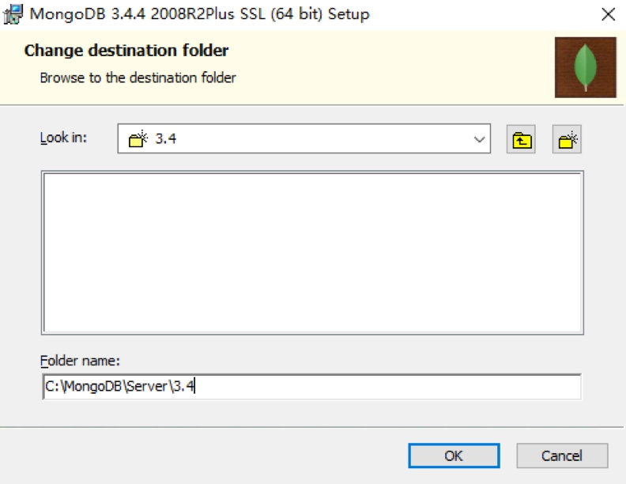
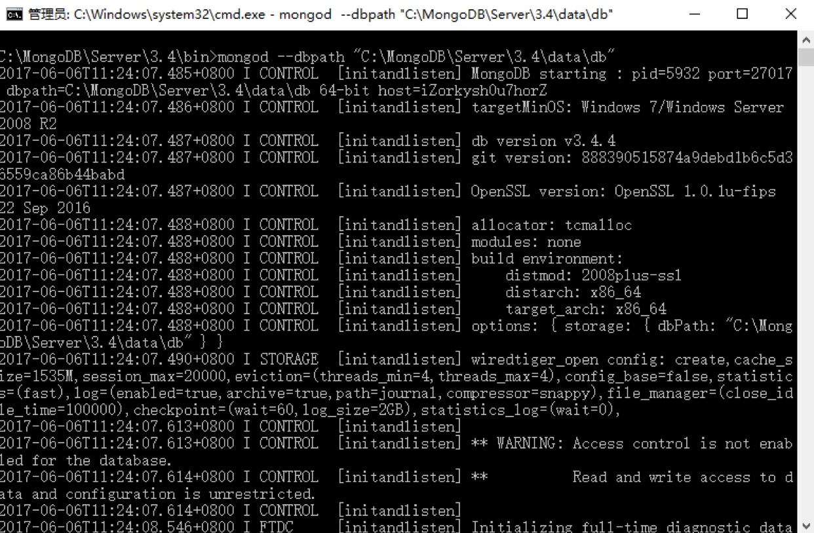
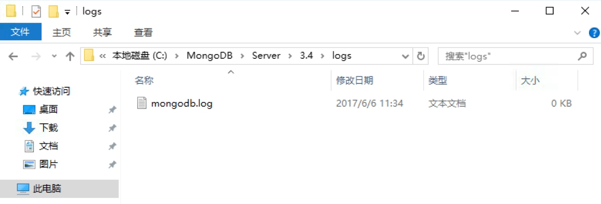
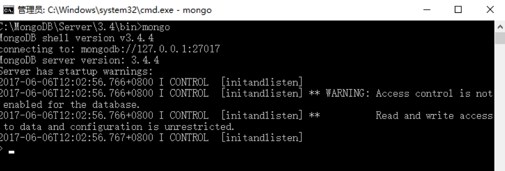
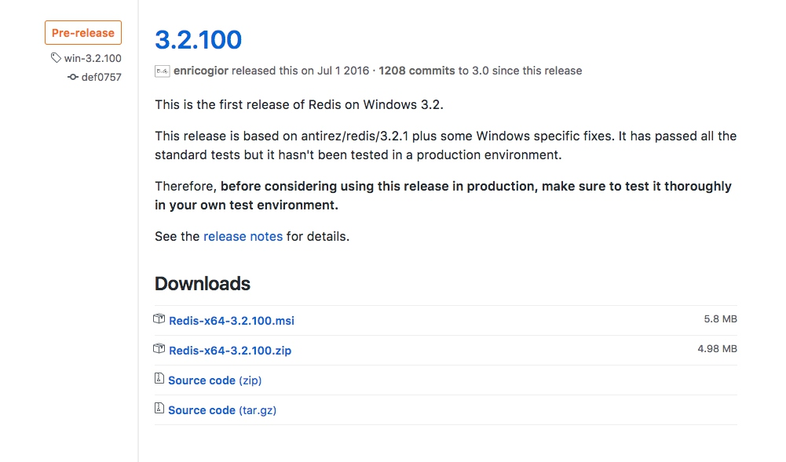

## 1.4　数据库的安装

作为数据存储的重要部分，数据库同样是必不可少的，数据库可以分为关系型数据库和非关系型数据库。

关系型数据库如 SQLite、MySQL、Oracle、SQL Server、DB2 等，其数据库是以表的形式存储；非关系型数据库如 MongoDB、Redis，它们的存储形式是键值对，存储形式更加灵活。

本书用到的数据库主要有关系型数据库 MySQL 及非关系型数据库 MongoDB、Redis。

本节中，我们来了解一下它们的安装方式。

### 1.4.1　MySQL 的安装

MySQL 是一个轻量级的关系型数据库，本节中我们来了解下它的安装方式。

#### 1. 相关链接

* 官方网站：[https://www.mysql.com/cn](https://www.mysql.com/cn)
* 下载地址：[https://www.mysql.com/cn/downloads](https://www.mysql.com/cn/downloads)
* 中文教程：[http://www.runoob.com/mysql/mysql-tutorial.html](http://www.runoob.com/mysql/mysql-tutorial.html)

#### 2. Windows 下的安装

对于 Windows 来说，可以直接在百度软件中心搜索 MySQL，下载其提供的 MySQL 安装包，速度还是比较快的。

当然，最安全稳妥的方式是直接到官网下载安装包进行安装，但可能下载速度没那么快。

下载完成后，双击安装包即可安装，这里直接选择默认选项，点击 Next 按钮安装即可。这里需要记住图 1-26 所设置的密码。


图 1-26　设置密码页面

安装完成后，我们可以在 “计算机”→“管理”→“服务” 页面开启和关闭 MySQL 服务，如图 1-27 所示。


图 1-27　系统服务页面

如果启动了 MySQL 服务，就可以使用它来存储数据了。

#### 3. Linux 下的安装

下面我们仍然分平台来介绍。

##### Ubuntu、Debian 和 Deepin

在 Ubuntu、Debian 和 Deepin 系统中，我们直接使用 apt-get 命令即可安装 MySQL：

```
sudo apt-get update  
sudo apt-get install -y mysql-server mysql-client
```

在安装过程中，会提示输入用户名和密码，输入后等待片刻即可完成安装。

启动、关闭和重启 MySQL 服务的命令如下：

```
sudo service mysql start  
sudo service mysql stop  
sudo service mysql restart
```

##### CentOS 和 Red Hat

这里以 MySQL 5.6 的 Yum 源为例来说明（如果需要更高版本，可以另寻），安装命令如下：

```
wget http://repo.mysql.com/mysql-community-release-el7-5.noarch.rpm  
sudo rpm -ivh mysql-community-release-el7-5.noarch.rpm  
yum install -y mysql mysql-server
```

运行如上命令即可完成安装，初始密码为空。接下来，需要启动 MySQL 服务。

启动 MySQL 服务的命令如下：

```
sudo systemctl start mysqld
```

停止、重启 MySQL 服务的命令如下：

```
sudo systemctl stop mysqld  
sudo systemctl restart mysqld
```
上面我们完成了 Linux 下 MySQL 的安装，之后可以修改密码，此时可以执行如下命令：
```
mysql -uroot -p
```
输入密码后，进入 MySQL 命令行模式，接着输入如下命令：
```
use mysql;  
UPDATE user SET Password = PASSWORD('newpass') WHERE user = 'root';  
FLUSH PRIVILEGES;
```

其中 newpass 为修改的新的 MySQL 密码，请自行替换。

由于 Linux 一般会作为服务器使用，为了使 MySQL 可以被远程访问，我们需要修改 MySQL 的配置文件，配置文件的路径一般为 /etc/mysql/my.cnf。

比如，使用 vi 进行修改的命令如下：

```
vi /etc/mysql/my.cnf
```

注释此行：

```
bind-address = 127.0.0.1
```

此行限制了 MySQL 只能本地访问而不能远程访问，注释掉即可解除此限制。

修改完成后重启 MySQL 服务，此时 MySQL 就可以被远程访问了。

到此为止，在 Linux 下安装 MySQL 的过程就结束了。

#### 4. Mac 下的安装

这里推荐使用 Homebrew 安装，直接执行 brew 命令即可：

```
brew install mysql
```

启动、停止和重启 MySQL 服务的命令如下：

```
sudo mysql.server start  
sudo mysql.server stop  
sudo mysql.server restart
```

Mac 一般不会作为服务器使用，如果想取消本地 host 绑定，那么需要修改 my.cnf 文件，然后重启服务。

### 1.4.2　MongoDB 的安装

MongoDB 是由 C++ 语言编写的非关系型数据库，是一个基于分布式文件存储的开源数据库系统，其内容存储形式类似  JSON 对象，它的字段值可以包含其他文档、数组及文档数组，非常灵活。

MongoDB 支持多种平台，包括 Windows、Linux、Mac OS、Solaris 等，在其官方网站 [https://www.mongodb.com/download-center](https://www.mongodb.com/download-center) 均可找到对应的安装包。

本节中，我们来看下它的安装过程。

#### 1. 相关链接

* 官方网站：[https://www.mongodb.com](https://www.mongodb.com)
* 官方文档：[https://docs.mongodb.com](https://docs.mongodb.com)
* GitHub：[https://github.com/mongodb](https://github.com/mongodb)
* 中文教程：[http://www.runoob.com/mongodb/mongodb-tutorial.html](http://www.runoob.com/mongodb/mongodb-tutorial.html)

#### 2. Windows 下的安装

如图 1-28 所示，这里直接在官网点击 DOWNLOAD 按钮下载 msi 安装包即可。


图 1-28　MongoDB 官网

下载完成后，双击它开始安装，指定 MongoDB 的安装路径，例如此处我指定的安装路径为 C:\MongoDB\Server\3.4，如图 1-29 所示。当然，这里也可以自行选择路径。


图 1-29　指定安装路径

点击 Next 按钮执行安装即可。

安装成功之后，进入 MongoDB 的安装目录，此处是 C:\MongoDB\Server\3.4，在 bin 目录下新建同级目录 data，如图 1-30 所示。



图 1-30　新建 data 目录

然后进入 data 文件夹，新建子文件夹 db 来存储数据目录，如图 1-31 所示。


图 1-31　新建 db 目录

之后打开命令行，进入 MongoDB 安装目录的 bin 目录下，运行 MongoDB 服务：

```
mongod --dbpath"C:\MongoDB\Server\3.4\data\db"
```

请记得将此处的路径替换成你的主机 MongoDB 安装路径。

运行之后，会出现一些输出信息，如图 1-32 所示。


图 1-32　运行结果

这样我们就启动 MongoDB 服务了。

但是如果我们想一直使用 MongoDB，就不能关闭此命令行了。如果意外关闭或重启，MongoDB 服务就不能使用了。这显然不是我们想要的。

所以，接下来还需将 MongoDB 配置成系统服务。

首先，以管理员模式运行命令行。注意，此处一定要以管理员身份运行，否则可能配置失败，如图 1-33 所示。



图 1-33　以管理员身份运行

在 “开始” 菜单中搜索 cmd，找到命令行，然后右击它以管理员身份运行即可。

随后新建一个日志文件，在 bin 目录新建 logs 同级目录，进入之后新建一个 mongodb.log 文件，用于保存 MongoDB 的运行日志，如图 1-34 所示。


图 1-34　新建 mongodb.log 文件

在命令行下输入如下内容：

```
mongod --bind_ip 0.0.0.0 --logpath"C:\MongoDB\Server\3.4\logs\mongodb.log"--logappend --dbpath"C:\MongoDB\Server\3.4\data\db"--port 27017 --serviceName"MongoDB"--serviceDisplayName"MongoDB"--install
```

这里的意思是绑定 IP 为 0.0.0.0（即任意 IP 均可访问），指定日志路径、数据库路径和端口，指定服务名称。需要注意的是，这里依然需要把路径替换成你的 MongoDB 安装路径，运行此命令后即可安装服务，运行结果如图 1-35 所示。



图 1-35　运行结果

如果没有出现错误提示，则证明 MongoDB 服务已经安装成功。

可以在服务管理页面查看到系统服务，如图 1-36 所示。


图 1-36　系统服务页面

然后就可以设置它的开机启动方式了，如自动启动或手动启动等，这样我们就可以非常方便地管理 MongoDB 服务了。

启动服务后，在命令行下就可以利用 mongo 命令进入 MongoDB 命令交互环境了，如图 1-37 所示。


图 1-37　命令行模式

这样，Windows 下的 MongoDB 配置就完成了。

#### 3. Linux 下的安装

这里以 MongoDB 3.4 为例说明 MongoDB 的安装过程。

##### Ubuntu

首先，导入 MongoDB 的 GPG key：

```
sudo apt-key adv --keyserver hkp://keyserver.ubuntu.com:80 --recv 0C49F3730359A14518585931BC711F9BA15703C6
```

随后创建 apt-get 源列表，各个系统版本对应的命令分别如下。

Ubuntu 12.04 对应的命令如下：

```
echo"deb [arch=amd64] http://repo.mongodb.org/apt/ubuntu precise/mongodb-org/3.4 multiverse"| sudo tee /etc/apt/sources.list.d/mongodb-org-3.4.list
```

Ubuntu 14.04 对应的命令如下：

```
echo"deb [arch=amd64] http://repo.mongodb.org/apt/ubuntu trusty/mongodb-org/3.4 multiverse"| sudo tee /etc/apt/sources.list.d/mongodb-org-3.4.list
```

Ubuntu 16.04 对应的命令如下：

```
echo"deb [arch=amd64,arm64] http://repo.mongodb.org/apt/ubuntu xenial/mongodb-org/3.4 multiverse"| sudo tee /etc/apt/sources.list.d/mongodb-org-3.4.list
```

随后更新 apt-get 源：

```
sudo apt-get update
```

之后安装 MongoDB 即可：

```
sudo apt-get install -y mongodb-org
```

安装完成后运行 MongoDB，命令如下：

```
mongod --port 27017 --dbpath /data/db
```

运行命令之后，MongoDB 就在 27017 端口上运行了，数据文件会保存在 /data/db 路径下。

一般情况下，我们在 Linux 上配置 MongoDB 都是为了远程连接使用的，所以这里还需要配置一下 MongoDB 的远程连接以及用户名和密码。

接着，进入 MongoDB 命令行：

```
mongo --port 27017
```

现在我们就已经进入到 MongoDB 的命令行交互模式下了，在此模式下运行如下命令：

```
> use admin
switched to db admin
> db.createUser({user: 'admin', pwd: 'admin123', roles: [{role: 'root', db: 'admin'}]})
Successfully added user: {
        "user" : "admin",
        "roles" : [
                {
                        "role" : "root",
                        "db" : "admin"
                }
        ]
}
```

这样我们就创建了一个用户名为 admin，密码为 admin123 的用户，赋予最高权限。

随后需要修改 MongoDB  的配置文件，此时执行如下命令：

```
sudo vi /etc/mongod.conf
```

然后修改 net 部分为：

```
net:  
  port: 27017  
  bindIp: 0.0.0.0
```

这样配置后，MongoDB 可被远程访问。

另外，还需要添加如下的权限认证配置。此时直接添加如下内容到配置文件即可：

```
security:  
  authorization: enabled
```
配置完成之后，我们需要重新启动 MongoDB 服务，命令如下：
```
sudo service mongod restart
```

这样远程连接和权限认证就配置完成了。

##### CentOS 和 Red Hat

首先，添加 MongoDB 源：

```
sudo vi /etc/yum.repos.d/mongodb-org.repo
```

接着修改如下内容并保存：

```
[mongodb-org-3.4]  
name=MongoDB Repository  
baseurl=https://repo.mongodb.org/yum/redhat/$releasever/mongodb-org/3.4/x86_64/  
gpgcheck=1  
enabled=1  
gpgkey=https://www.mongodb.org/static/pgp/server-3.4.asc
```
然后执行 yum 命令安装：
```
sudo yum install mongodb-org
```
这里启动 MongoDB 服务的命令如下：
```
sudo systemctl start mongod
```
停止和重新加载 MongoDB 服务的命令如下：
```
sudo systemctl stop mongod  
sudo systemctl reload mongod
```

有关远程连接和认证配置，可以参考前面，方式是相同的。

更多 Linux 发行版的 MongoDB 安装方式可以参考官方文档：[https://docs.mongodb.com/manual/administration/install-on-linux/](https://docs.mongodb.com/manual/administration/install-on-linux/)。

#### 4. Mac 下的安装

这里推荐使用 Homebrew 安装，直接执行 brew 命令即可：

```
brew install mongodb
```

然后创建一个新文件夹 /data/db，用于存放 MongoDB 数据。

这里启动 MongoDB 服务的命令如下：

```
brew services start mongodb  
sudo mongod
```
停止和重启 MongoDB 服务的命令分别是：
```
brew services stop mongodb  
brew services restart mongodb
```

#### 5. 可视化工具

这里推荐一个可视化工具 RoboMongo/Robo 3T，它使用简单，功能强大，官方网站为 [https://robomongo.org/](https://robomongo.org/)，三大平台都支持，下载链接为 [https://robomongo.org/download](https://robomongo.org/download)。

另外，还有一个简单易用的可视化工具 —— Studio 3T，它同样具有方便的图形化管理界面，官方网站为 [https://studio3t.com](https://studio3t.com)，同样支持三大平台，下载链接为 [https://studio3t.com/download/](https://studio3t.com/download/)。

### 1.4.3　Redis 的安装

Redis 是一个基于内存的高效的非关系型数据库，本节中我们来了解一下它在各个平台的安装过程。

#### 1. 相关链接

* 官方网站：[https://redis.io](https://redis.io)
* 官方文档：[https://redis.io/documentation](https://redis.io/documentation)
* 中文官网：[http://www.redis.cn](http://www.redis.cn)
* GitHub：[https://github.com/antirez/redis](https://github.com/antirez/redis)
* 中文教程：[http://www.runoob.com/redis/redis-tutorial.html](http://www.runoob.com/redis/redis-tutorial.html)
* Redis Desktop Manager：[https://redisdesktop.com](https://redisdesktop.com)
* Redis Desktop Manager GitHub：[https://github.com/uglide/RedisDesktopManager](https://github.com/uglide/RedisDesktopManager)

#### 2. Windows 下的安装

在 Windows 下，Redis 可以直接到 GitHub 的发行版本里面下载，具体下载地址是 [https://github.com/MSOpenTech/redis/releases](https://github.com/MSOpenTech/redis/releases)。

打开下载页面后，会发现有许多发行版本及其安装包，如图 1-38 所示。



图 1-38　下载页面

可以下载 Redis-x64-3.2.100.msi 安装即可。

安装过程比较简单，直接点击 Next 按钮安装即可。安装完成后，Redis 便会启动。

在系统服务页面里，可以观察到多了一个正在运行到 Redis 服务，如图 1-39 所示。



图 1-39　系统服务页面

另外，推荐下载 Redis Desktop Manager 可视化管理工具，来管理 Redis。这既可以到官方网站（链接为 [https://redisdesktop.com/download](https://redisdesktop.com/download)）下载，也可以到 GitHub（链接为 [https://github.com/uglide/RedisDesktopManager/releases](https://github.com/uglide/RedisDesktopManager/releases)）下载最新发行版本。

安装后，直接连接本地 Redis 即可。

#### 3. Linux 下的安装

这里依然分为两类平台来介绍。

##### Ubuntu、Debian 和 Deepin

在 Ubuntu、Debian 和 Deepin 系统下，使用 apt-get 命令安装 Redis：

```
sudo apt-get -y install redis-server
```

然后输入 redis-cli 进入 Redis 命令行模式：

```
$ redis-cli
127.0.0.1:6379> set 'name' 'Germey'
OK
127.0.0.1:6379> get 'name'
"Germey"
```

这样就证明 Redis 成功安装了，但是现在 Redis 还是无法远程连接的，依然需要修改配置文件，配置文件的路径为 /etc/redis/redis.conf。

首先，注释这一行：

```
bind 127.0.0.1
```

另外，推荐给 Redis 设置密码，取消注释这一行：

```
requirepass foobared
```

foobared 即当前密码，可以自行修改。

然后重启 Redis 服务，使用的命令如下：

```
sudo /etc/init.d/redis-server restart
```

现在就可以使用密码远程连接 Redis 了。

另外，停止和启动 Redis 服务的命令分别如下：

```
sudo /etc/init.d/redis-server stop  
sudo /etc/init.d/redis-server start
```

##### CentOS 和 Red Hat

在 CentOS 和 Red Hat 系统中，首先添加 EPEL 仓库，然后更新 yum 源：

```
sudo yum install epel-release  
sudo yum update
```
然后安装 Redis 数据库：
```
sudo yum -y install redis
```
安装好后启动 Redis 服务即可：
```
sudo systemctl start redis
```

这里同样可以使用 redis-cli 进入 Redis 命令行模式操作。

另外，为了可以使 Redis 能被远程连接，需要修改配置文件，路径为 /etc/redis.conf。

参见上文来修改配置文件实现远程连接和密码配置。

修改完成之后保存。

然后重启 Redis 服务即可，命令如下：

```
sudo systemctl restart redis
```

#### 4. Mac 下的安装

这里推荐使用 Homebrew 安装，直接执行如下命令即可：

```
brew install redis
```

启动 Redis 服务的命令如下：

```
brew services start redis  
redis-server /usr/local/etc/redis.conf
```

这里同样可以使用 redis-cli 进入 Redis 命令行模式。

在 Mac 下 Redis 的配置文件路径是 /usr/local/etc/redis.conf，可以通过修改它来配置访问密码。

修改配置文件后，需要重启 Redis 服务。停止和重启 Redis 服务的命令分别如下：

```
brew services stop redis  
brew services restart redis
```

另外，在 Mac 下也可以安装 Redis Desktop Manager 可视化管理工具来管理 Redis。