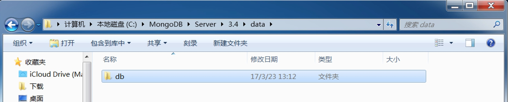

MongoDB安装

## 简介

MongoDB 是由C++语言编写的非关系型数据库，是一个基于分布式文件存储的开源数据库系统，其内容存储形式类似Json对象，它的字段值可以包含其他文档，数组及文档数组，非常灵活。

## 平台支持

MongoDB支持多种平台，包括Windows、Linux、Mac OS、Solaris等，在其官方网站均可找到对应的安装包，[https://www.mongodb.com/download-center](https://www.mongodb.com/download-center)

## 


### Windows

直接在官网下载安装包，[https://www.mongodb.com/download-center#community](https://www.mongodb.com/download-center#community)，运行安装即可。

安装成功之后，进入MongoDB的安装目录，在此处演示的所在路径是C:\MongoDB\Server\3.4，在bin目录下新建同级目录data作为数据目录存储的文件夹，然后进入data文件夹新建子文件夹db。




之后打开命令行，进入MongoDB安装目录的bin目录下，运行MongoDB服务：

```
mongod --dbpath "C:\MongoDB\Server\3.4\data\db"
```

运行之后会出现一些输出信息，如图所示：


这样我们就已经将MongoDB服务开起来了。

### Linux

以Ubuntu为例简述其安装方式。

命令行安装：

```
sudo apt-get install mongodb
```