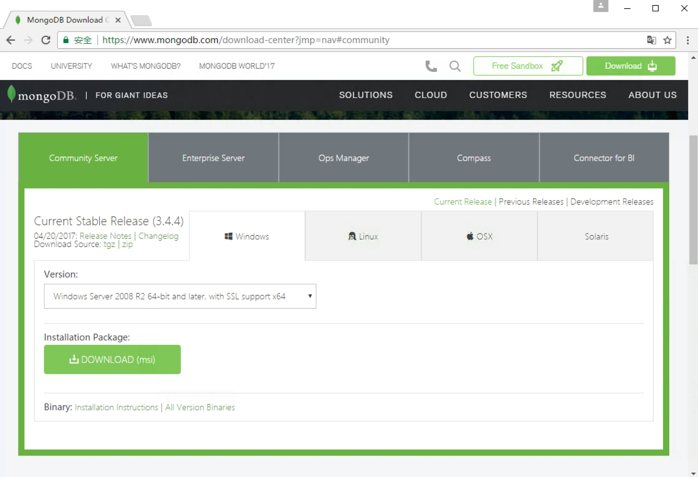
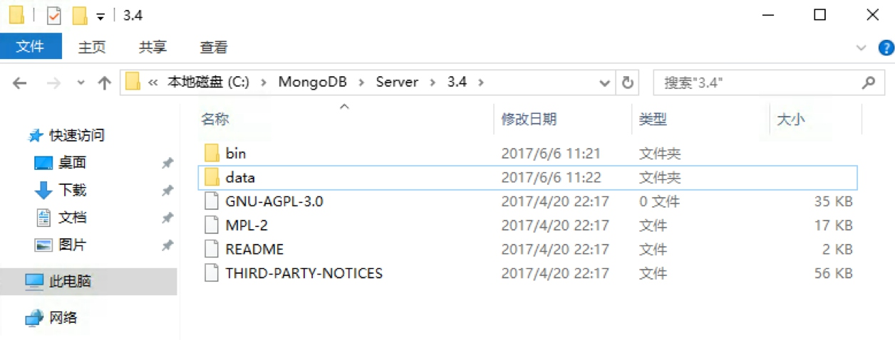

## 1.4.2 MongoDB安装

MongoDB 是由 C++ 语言编写的非关系型数据库，是一个基于分布式文件存储的开源数据库系统，其内容存储形式类似 Json 对象，它的字段值可以包含其他文档，数组及文档数组，非常灵活。

MongoDB 支持多种平台，包括 Windows、Linux、Mac OS、Solaris 等，在其官方网站均可找到对应的安装包，[https://www.mongodb.com/download-center](https://www.mongodb.com/download-center)

本节我们来看下它的安装过程。

### 1. 相关链接

* 官方网站：[https://www.mongodb.com](https://www.mongodb.com)
* 官方文档：[https://docs.mongodb.com](https://docs.mongodb.com)
* GitHub：[https://github.com/mongodb](https://github.com/mongodb)
* 中文教程：[http://www.runoob.com/mongodb/mongodb-tutorial.html](http://www.runoob.com/mongodb/mongodb-tutorial.html)

### 2. Windows下的安装

直接在官网下载安装包即可，链接为：[https://www.mongodb.com/download-center#community](https://www.mongodb.com/download-center#community)，页面如图 1-29 所示：



图 1-29 下载页面

直接点击 Download 下载 msi 安装包即可。

下载完成之后双击开始安装，指定 MongoDB 的安装路径，例如在此处我指定安装路径为 C:\MongoDB\Server\3.4，当然路径可以自行选择，如图 1-30 所示：


图 1-30 安装页面

点击下一步执行安装即可。

安装成功之后，进入 MongoDB 的安装目录，在此处所在路径是 C:\MongoDB\Server\3.4，在 bin 目录下新建同级目录 data，如图 1-31 所示：



图 1-31 新建 data 目录结果

然后进入 data 文件夹新建子文件夹 db，作为数据目录存储的文件夹，如图 1-32 所示：


图 1-32 新建 db 目录结果

之后打开命令行，进入 MongoDB 安装目录的 bin 目录下，运行 MongoDB 服务：

```
mongod --dbpath "C:\MongoDB\Server\3.4\data\db"
```

请记得将此处的路径替换成你的主机 MongoDB 安装路径。

运行之后会出现一些输出信息，如图 1-33 所示：


图 1-33 运行结果

这样我们就已经将 MongoDB 服务启动了。

但是这样如果我们想一直使用 MongoDB 就不能关闭此命令行，如果意外关闭或重启 MongoDB 服务就不能使用了，这显然不是我们想要的，所以接下来我们还需将 MongoDB 配置成系统服务。

首先我们要以管理员模式运行命令行，注意此处一定要是管理员模式运行，否则可能配置失败，如图 1-34 所示：


图 1-34 管理员模式

开始菜单搜索 cmd，找到命令行，然后右键以管理员身份运行即可。

随后新建一个日志文件，在 bin 目录同级目录新建 logs 文件夹，进入之后新建一个 mongodb.log 文件，用于保存 MongoDB 运行的日志，如图 1-35 所示。


图 1-35 新建 mongodb.log 结果

在命令行下输入如下内容：

```
mongod --bind_ip 0.0.0.0 --logpath "C:\MongoDB\Server\3.4\logs\mongodb.log" --logappend --dbpath "C:\MongoDB\Server\3.4\data\db" --port 27017 --serviceName "MongoDB" --serviceDisplayName "MongoDB" --install
```

这里的意思是绑定 IP 为 0.0.0.0，即任意 IP 均可访问，指定日志路径、数据库路径、端口，指定服务名称，注意这里依然需要把路径替换成你的 MongoDB 安装路径，运行此命令后即可安装服务，运行结果如图 1-36 所示：


图 1-36 运行结果

如果没有出现错误提示，则证明 MongoDB 服务已经安装成功。

可以在服务管理页面查看到系统服务，如图 1-37 所示：


图 1-37 系统服务页面

可以设置它的开机启动方式，如自动启动或手动启动等。这样我们就可以非常方便地管理 MongoDB 服务了。

启动服务之后我们在命令行下就可以利用 mongo 命令进入 MongoDB 命令交互环境了，如图 1-38 所示：


图 1-38 命令行模式

这样 Windows 下 MongoDB 配置就完成了。

### 3. Linux下的安装

在这里以 MongoDB 3.4 为例说明 MongoDB 的安装过程。

#### Ubuntu

首先导入 MongoDB 的 GPG Key：

```
sudo apt-key adv --keyserver hkp://keyserver.ubuntu.com:80 --recv 0C49F3730359A14518585931BC711F9BA15703C6
```

随后创建 apt-get 源列表，各个系统版本对应的命令如下：

* Ubuntu 12.04

```
echo "deb [ arch=amd64 ] http://repo.mongodb.org/apt/ubuntu precise/mongodb-org/3.4 multiverse" | sudo tee /etc/apt/sources.list.d/mongodb-org-3.4.list
```

* Ubuntu 14.04

```
echo "deb [ arch=amd64 ] http://repo.mongodb.org/apt/ubuntu trusty/mongodb-org/3.4 multiverse" | sudo tee /etc/apt/sources.list.d/mongodb-org-3.4.list
```

* Ubuntu 16.04

```
echo "deb [ arch=amd64,arm64 ] http://repo.mongodb.org/apt/ubuntu xenial/mongodb-org/3.4 multiverse" | sudo tee /etc/apt/sources.list.d/mongodb-org-3.4.list
```

随后更新 apt-get 源：

```
sudo apt-get update
```

之后安装 MongoDB 即可：

```
sudo apt-get install -y mongodb-org
```

安装完成之后运行 MongoDB，命令如下：

```
mongod --port 27017 --dbpath /data/db
```

运行命令之后 MongoDB 就在 27017 端口上运行了，数据文件会保存在 /data/db 路径下。

一般我们在 Linux 上配置 MongoDB 都是为了远程连接使用的，所以在这里还需要配置一下 MongoDB 的远程连接和用户名密码：

接着我们进入到 MongoDB 命令行：

```
mongo --port 27017
```

现在我们就已经进入到 MongoDB 的命令行交互模式下了，在此模式下运行如下命令：

```
> use admin
switched to db admin
> db.createUser({user: 'admin', pwd: 'admin123', roles: [{role: 'root', db: 'admin'}]})
Successfully added user: {
        "user" : "admin",
        "roles" : [
                {
                        "role" : "root",
                        "db" : "admin"
                }
        ]
}
```

这样我们就创建了一个用户名为 admin，密码为 admin123 的用户，赋予最高权限。

随后需要修改 MongoDB 的配置文件，

执行如下命令：

```
sudo vi /etc/mongod.conf
```

修改 net 部分为：

```
net:
  port: 27017
  bindIp: 0.0.0.0
```

这样配置后 MongoDB 可被远程访问。

另外还需要添加如下权限认证配置，直接添加如下内容到配置文件：

```
security:
 authorization: enabled
```

配置完成之后我们需要重新启动 MongoDB 服务，命令如下：

```
sudo service mongod restart
```

这样远程连接和权限认证就配置完成了。

#### CentOS、RedHat

首先添加 MongoDB 源：

```
sudo vi /etc/yum.repos.d/mongodb-org.repo
```

修改为如下内容保存：

```
[mongodb-org-3.4]
name=MongoDB Repository
baseurl=https://repo.mongodb.org/yum/redhat/$releasever/mongodb-org/3.4/x86_64/
gpgcheck=1
enabled=1
gpgkey=https://www.mongodb.org/static/pgp/server-3.4.asc
```

然后执行 yum 命令安装：

```
sudo yum install mongodb-org
```

启动 MongoDB 服务：

```
sudo systemctl start mongod
```

停止和重新加载 MongoDB 服务：

```
sudo systemctl stop mongod
sudo systemctl reload mongod
```

有关远程连接和认证配置可以参考上文，方式是相同的。

更多 Linux 发行版的 MongoDB 安装方式可以参考官方文档：[https://docs.mongodb.com/manual/administration/install-on-linux/](https://docs.mongodb.com/manual/administration/install-on-linux/)。

### 4. Mac下的安装

推荐使用 Homebrew 安装，执行 brew 命令即可：

```
brew install mongodb
```

然后创建一个新文件夹 /data/db，用于存放 MongoDB 数据。

启动 MongoDB 服务：

```
brew services start mongodb
sudo mongod
```

这样就启动了 MongoDB 服务。

停止、重启 MongoDB 服务的命令：

```
brew services stop mongodb
brew services restart mongodb
```

### 5. 可视化工具

在这里推荐一个可视化工具 RoboMongo/Robo 3T，使用简单，功能强大，官方网站：[https://robomongo.org/](https://robomongo.org/)，三大平台都有支持，下载链接：[https://robomongo.org/download](https://robomongo.org/download)。

另外还有一个简单易用的可视化工具，Studio 3T，同样具有方便的图形化管理，官方网站：[https://studio3t.com](https://studio3t.com)，同样支持三大平台，下载链接：[https://studio3t.com/download/](https://studio3t.com/download/)。


