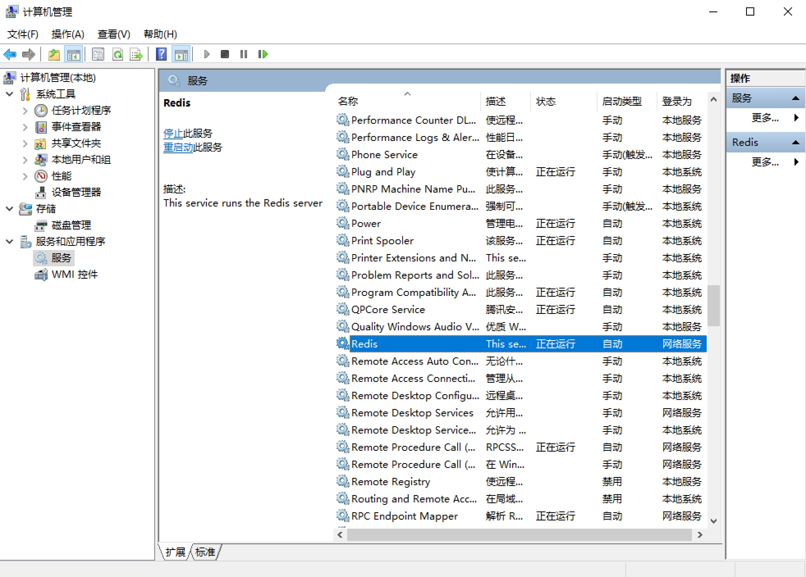

## 1.4.3 Redis的安装

Redis是一个基于内存的高效的非关系型数据库，本节我们来了解下Redis在各个平台的安装过程。

### 1. 相关链接

* 官方网站：[https://redis.io](https://redis.io)
* 官方文档：[https://redis.io/documentation](https://redis.io/documentation)
* 中文官网：[http://www.redis.cn](http://www.redis.cn)
* GitHub：[https://github.com/antirez/redis](https://github.com/antirez/redis)
* 中文教程：[http://www.runoob.com/redis/redis-tutorial.html](http://www.runoob.com/redis/redis-tutorial.html)
* Redis Desktop Manager：[https://redisdesktop.com](https://redisdesktop.com)
* Redis Desktop Manager GitHub：[https://github.com/uglide/RedisDesktopManager](https://github.com/uglide/RedisDesktopManager)

### 2. Windows下的安装

Redis在Windows下可以直接到GitHub的发行版本里面下载，[https://github.com/MSOpenTech/redis/releases](https://github.com/MSOpenTech/redis/releases)。

打开之后有许多发行版本及其安装包。


可以下载Redis-x64-3.2.100.msi安装即可。

安装过程比较简单，直接点击下一步安装即可，安装完成之后Redis便会启动。



在系统服务里可以观察到多了一个正在运行到Redis服务。

另外推荐下载一个Redis Desktop Manager可视化管理工具，来管理Redis。

可以到官方网站下载，链接为：[https://redisdesktop.com/download](https://redisdesktop.com/download) 也可以到GitHub下载最新发行版本，链接为：[https://github.com/uglide/RedisDesktopManager/releases](https://github.com/uglide/RedisDesktopManager/releases)。

安装之后直接连接本地Redis即可，简单方便。

### 3. Linux下的安装

这里依然还是分为两类平台介绍。

#### Ubuntu、Debian、Deepin

使用apt-get命令行安装：

```
sudo apt-get -y install redis-server
```

运行如上命令即可完成Redis的安装，然后输入redis-cli即可进入Redis命令行模式。

```
$ redis-cli
127.0.0.1:6379> set 'name' 'Germey'
OK
127.0.0.1:6379> get 'name'
"Germey"
```

这样就证明Redis成功安装了，但是现在Redis还是无法远程连接的，依然需要修改配置文件，配置文件路径为/etc/redis/redis.conf。

注释这一行：

```
bind 127.0.0.1
```

另外推荐给Redis设置密码，取消注释这一行：

```
requirepass foobared
```

foobared即当前密码，可以自行修改。

然后重启Redis服务，使用如下命令：

```
sudo /etc/init.d/redis-server restart
```

现在就可以使用密码远程连接Redis了。

另外停止和启动Redis服务的命令如下：

```
sudo /etc/init.d/redis-server stop
sudo /etc/init.d/redis-server start
```

#### CentOS、RedHat

首先添加EPEL仓库，然后更新Yum源：

```
sudo yum install epel-release
sudo yum update
```

然后安装Redis数据库：

```
sudo yum -y install redis
```

安装好之后启动Redis服务：

```
sudo systemctl start redis
```

同样可以使用redis-cli进入Redis命令行模式操作。

另外为了可以使Redis能被远程连接，需要修改配置文件，路径为/etc/redis.conf。

注释这一行：

```
bind 127.0.0.1
```

另外推荐给Redis设置密码，取消注释这一行：

```
requirepass foobared
```

foobared即当前密码，可以自行修改。

之后保存重启Redis服务：

```
sudo systemctl restart redis
```

这样就可以远程连接Redis了。

### 4. Mac下的安装

推荐使用Homenbrew安装，执行brew命令即可。

```
brew install redis
```

启动Redis服务：

```
brew services start redis
redis-server /usr/local/etc/redis.conf
```

这样就启动了Redis服务。

同样可以使用redis-cli进入Redis命令行模式。

Mac下Redis的配置文件路径是/usr/local/etc/redis.conf，可以通过修改它来配置访问密码。

修改配置文件后需要重启Redis服务，停止、重启Redis服务的命令如下：

```
brew services stop redis
brew services restart redis
```

另外在Mac下也可以安装Redis Desktop Manager可视化管理工具来管理Redis。
