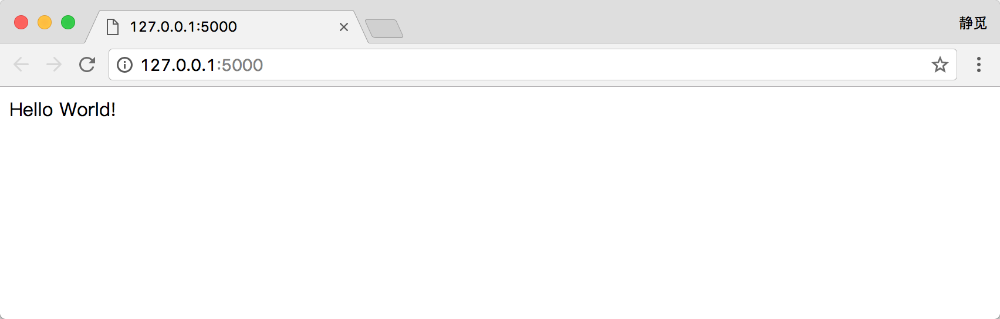

## 1.6.1 Flask的安装

Flask 是一个轻量级的 Web 服务程序，简单、易用、灵活，在本书中我们主要用它来做一些 API 服务，本节我们来了解下它的安装方式。

### 1. 相关链接

* GitHub：[https://github.com/pallets/flask](https://github.com/pallets/flask)
* 官方文档：[http://flask.pocoo.org](http://flask.pocoo.org)
* 中文文档：[http://docs.jinkan.org/docs/flask](http://docs.jinkan.org/docs/flask)
* PyPi：[https://pypi.python.org/pypi/Flask](https://pypi.python.org/pypi/Flask)

### 2. Pip安装

使用 Pip 安装 Flask 即可，命令如下：

```
pip3 install flask
```

运行完毕之后就可以完成安装。

### 3. 验证安装

安装成功之后可以运行如下实例代码测试一下：

```python
from flask import Flask
app = Flask(__name__)

@app.route("/")
def hello():
    return "Hello World!"

if __name__ == "__main__":
    app.run()
```

直接运行代码，可以发现系统会在 5000 端口开启 Web 服务，控制台输出如下：

```
 * Running on http://127.0.0.1:5000/ (Press CTRL+C to quit)
```

直接访问：[http://127.0.0.1:5000/](http://127.0.0.1:5000/)，可以观察到网页中呈现了 Hello World!，如图 1-41 所示：



图 1-41 运行结果

这样一个最简单的 Flask 程序就运行成功了。

### 4. 结语

在后文我们会利用 Flask+Redis 维护动态代理池和 Cookies 池。
