## 1.7 App 爬取相关库的安装

除了 Web 网页，爬虫也可以抓取 App 的数据。App 中的页面要加载出来，首先需要获取数据，而这些数据一般是通过请求服务器的接口来获取的。由于 App 没有浏览器这种可以比较直观地看到后台请求的工具，所以主要用一些抓包技术来抓取数据。

本书介绍的抓包工具有 Charles、mitmproxy 和 mitmdump。一些简单的接口可以通过 Charles 或 mitmproxy 分析，找出规律，然后直接用程序模拟来抓取了。但是如果遇到更复杂的接口，就需要利用 mitmdump 对接 Python 来对抓取到的请求和响应进行实时处理和保存。另外，既然要做规模采集，就需要自动化 App 的操作而不是人工去采集，所以这里还需要一个工具叫作 Appium，它可以像 Selenium 一样对 App 进行自动化控制，如自动化模拟 App 的点击、下拉等操作。

本节中，我们就来介绍一下 Charles、mitmproxy、mitmdump、Appium 的安装方法。

### 1.7.1　Charles 的安装

Charles 是一个网络抓包工具，相比 Fiddler，其功能更为强大，而且跨平台支持得更好，所以这里选用它来作为主要的移动端抓包工具。

#### 1. 相关链接

* 官方网站：[https://www.charlesproxy.com](https://www.charlesproxy.com)
* 下载链接：[https://www.charlesproxy.com/download](https://www.charlesproxy.com/download)

#### 2. 下载 Charles

我们可以在官网下载最新的稳定版本，如图 1-42 所示。可以发现，它支持 Windows、Linux 和 Mac 三大平台。


图 1-42　Charles 下载页面

直接点击对应的安装包下载即可，具体的安装过程这里不再赘述。

Charles 是收费软件，不过可以免费试用 30 天。如果试用期过了，其实还可以试用，不过每次试用不能超过 30 分钟，启动有 10 秒的延时，但是完整的软件功能还是可以使用的，所以还算比较友好。

#### 3. 证书配置

现在很多页面都在向 HTTPS 方向发展，HTTPS 通信协议应用得越来越广泛。如果一个 App 通信应用了 HTTPS 协议，那么它通信的数据都会是被加密的，常规的截包方法是无法识别请求内部的数据的。

安装完成后，如果我们想要做 HTTPS 抓包的话，那么还需要配置一下相关 SSL 证书。接下来，我们再看看各个平台下的证书配置过程。

Charles 是运行在 PC 端的，我们要抓取的是 App 端的数据，所以要在 PC 和手机端都安装证书。

##### Windows

如果你的 PC 是 Windows 系统，可以按照下面的操作进行证书配置。

首先打开 Charles，点击 Help→SSL Proxying→Install Charles Root Certificate，即可进入证书的安装页面，如图 1-43 所示。


图 1-43　证书安装页面入口

接下来，会弹出一个安装证书的页面，如图 1-44 所示。

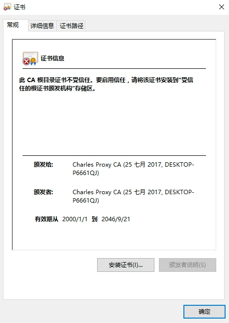

图 1-44　证书安装页面

点击 “安装证书” 按钮，就会打开证书导入向导，如图 1-45 所示。


图 1-45 证书导入向导

直接点击 “下一步” 按钮，此时需要选择证书的存储区域，点击第二个选项 “将所有的证书放入下列存储”，然后点击 “浏览” 按钮，从中选择证书存储位置为 “受信任的根证书颁发机构”，再点击 “确定” 按钮，然后点击 “下一步” 按钮，如图 1-46 所示。

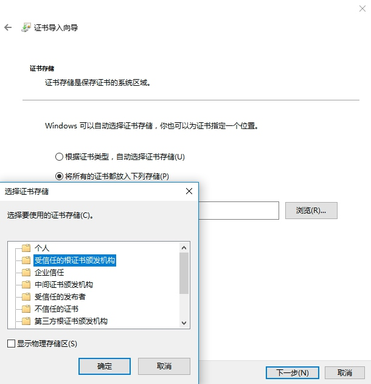

图 1-46 选择证书存储区域

再继续点击 “下一步” 按钮完成导入。

##### Mac

如果你的 PC 是 Mac 系统，可以按照下面的操作进行证书配置。

同样是点击 Help→SSL Proxying→Install Charles Root Certificate，即可进入证书的安装页面。

接下来，找到 Charles 的证书并双击，将 “信任” 设置为 “始终信任” 即可，如图 1-47 所示。


图 1-47　证书配置

这样就成功安装了证书。

##### iOS

如果你的手机是 iOS 系统，可以按照下面的操作进行证书配置。

首先，查看电脑的 Charles 代理是否开启，具体操作是点击 Proxy→Proxy Settings，打开代理设置页面，确保当前的 HTTP 代理是开启的，如图 1-48 所示。这里的代理端口为 8888，也可以自行修改。


图 1-48　代理设置

接下来，将手机和电脑连在同一个局域网下。例如，当前电脑的 IP 为 192.168.1.76，那么首先设置手机的代理为 192.168.1.76:8888，如图 1-49 所示。

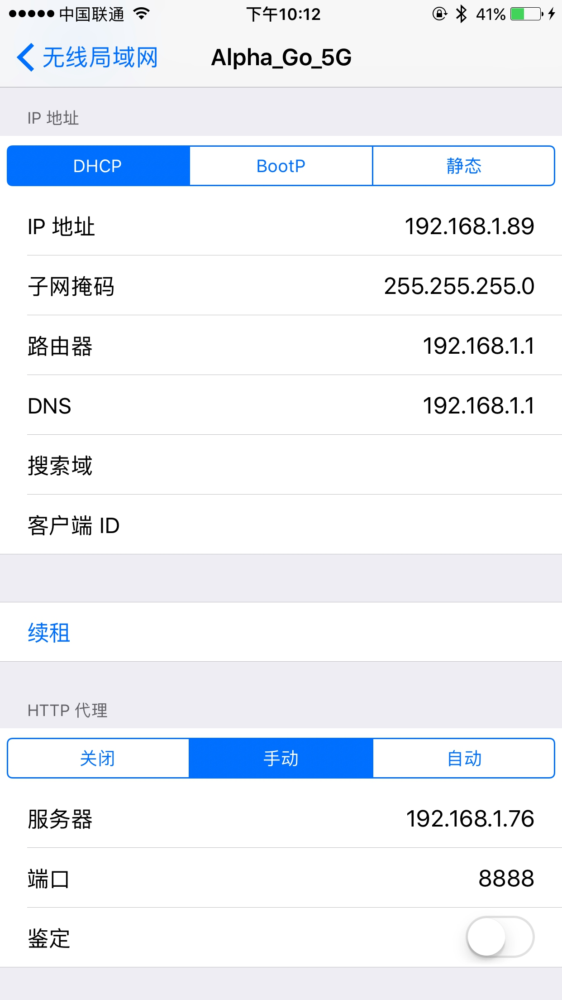

图 1-49　代理设置

设置完毕后，电脑上会出现一个提示窗口，询问是否信任此设备，如图 1-50 所示。


图 1-50　提示窗口

此时点击 Allow 按钮即可。这样手机就和 PC 连在同一个局域网内了，而且设置了 Charles 的代理，即 Charles 可以抓取到流经 App 的数据包了。

接下来，再安装 Charles 的 HTTPS 证书。

在电脑上打开 Help→SSL Proxying→Install Charles Root Certificate on a Mobile Device or Remote Browser，如图 1-51 所示。


图 1-51　证书安装页面入口

此时会看到如图 1-52 所示的提示。


图 1-52　提示窗口

它提示我们在手机上设置好 Charles 的代理（刚才已经设置好了），然后在手机浏览器中打开 chls.pro/ssl 下载证书。

在手机上打开 chls.pro/ssl 后，便会弹出证书的安装页面，如图 1-53 所示。


图 1-53　证书安装页面

点击 “安装” 按钮，然后输入密码即可完成安装，如图 1-54 所示。

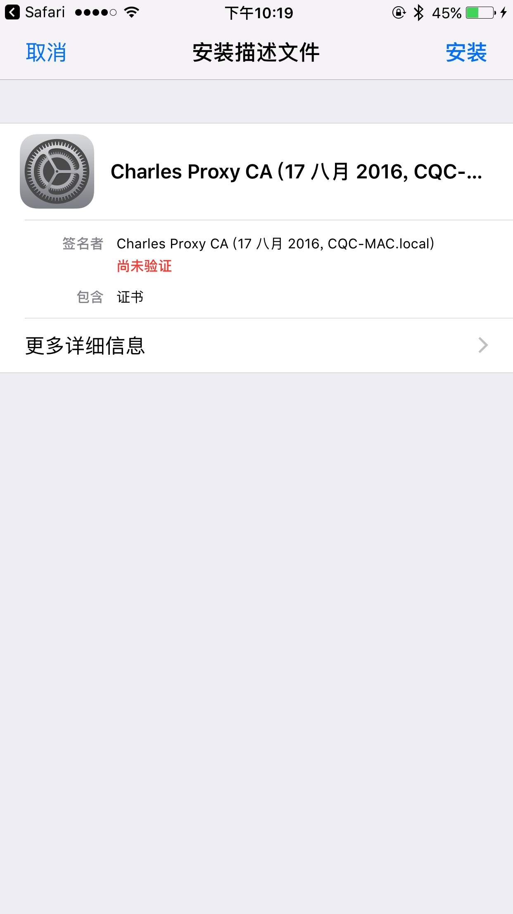

图 1-54　安装成功页面

如果你的 iOS 版本是 10.3 以下的话，信任 CA 证书的流程就已经完成了。

如果你的 iOS 版本是 10.3 及以上，还需要在 “设置”→“通用”→“关于本机”→“证书信任设置” 中将证书的完全信任开关打开，如图 1-55 所示。


图 1-55　证书信任设置

##### Android

如果你的手机是 Android 系统，可以按照下面的操作进行证书配置。

在 Android 系统中，同样需要设置代理为 Charles 的代理，如图 1-56 所示。

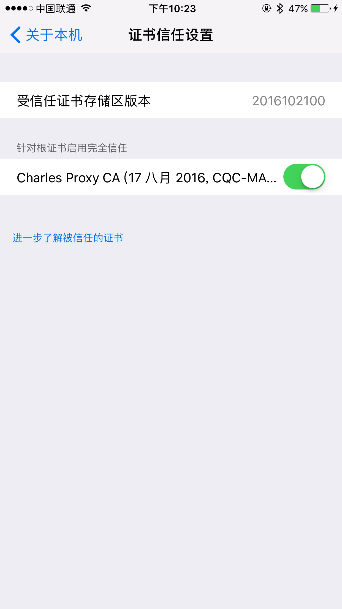

图 1-56　代理设置

设置完毕后，电脑上就会出现一个提示窗口，询问是否信任此设备，如图 1-50 所示，此时直接点击 Allow 按钮即可。

接下来，像 iOS 设备那样，在手机浏览器上打开 chls.pro/ssl，这时会出现一个提示框，如图 1-57 所示。

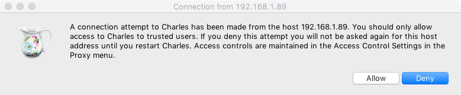

图 1-57　证书安装页面

我们为证书添加一个名称，然后点击 “确定” 按钮即可完成证书的安装。

#### 4. 开启 SSL 监听

点击 Proxy→SSLProxying Settings，在弹出的窗口中点击 Add 按钮，添加需要监听的地址和端口。如果需要监听所有的 HTTPS 请求，可以直接将地址和端口设置为 `*`，即添加一条 `*:*` 的配置，如图 1-58 所示。这样配置好了，我们就可以抓到所有 HTTPS 请求包了。如果不配置的话，抓到的 HTTPS 请求包状态可能是 unknown。


图 1-58　SSL Proxying Settings

### 1.7.2　mitmproxy 的安装

mitmproxy 是一个支持 HTTP 和 HTTPS 的抓包程序，类似 Fiddler、Charles 的功能，只不过它通过控制台的形式操作。

此外，mitmproxy 还有两个关联组件，一个是 mitmdump，它是 mitmproxy 的命令行接口，利用它可以对接 Python 脚本，实现监听后的处理；另一个是 mitmweb，它是一个 Web 程序，通过它以清楚地观察到 mitmproxy 捕获的请求。

本节中，我们就来了解一下 mitmproxy、mitmdump 和 mitmweb 的安装方式。

#### 1. 相关链接

* GitHub：[https://github.com/mitmproxy/mitmproxy](https://github.com/mitmproxy/mitmproxy)
* 官方网站：[https://mitmproxy.org](https://mitmproxy.org)
* PyPi：[https://pypi.python.org/pypi/mitmproxy](https://pypi.python.org/pypi/mitmproxy)
* 官方文档：[http://docs.mitmproxy.org](http://docs.mitmproxy.org)
* MitmDump 脚本：[http://docs.mitmproxy.org/en/stable/scripting/overview.html](http://docs.mitmproxy.org/en/stable/scripting/overview.html)
* 下载地址：[https://github.com/mitmproxy/mitmproxy/releases](https://github.com/mitmproxy/mitmproxy/releases)
* DockerHub：[https://hub.docker.com/r/mitmproxy/mitmproxy](https://hub.docker.com/r/mitmproxy/mitmproxy)

#### 2. pip 安装

最简单的安装方式还是使用 pip，直接执行如下命令即可安装：

```
pip3 install mitmproxy
```

这是最简单和通用的安装方式，执行完毕之后即可完成 mitmproxy 的安装，另外还附带安装了 mitmdump 和 mitmweb 这两个组件。如果不想用这种方式安装，也可以选择后面列出的专门针对各个平台的安装方式或者 Docker 安装方式。

#### 3. Windows 下的安装

可以到 GitHub 上 的 Releases 页面（链接为 [https://github.com/mitmproxy/mitmproxy/releases/](https://github.com/mitmproxy/mitmproxy/releases/)）获取安装包，如图 1-59 所示。


图 1-59　下载页面

比如，当前的最新版本为 2.0.2，则可以选择下载 Windows 下 的 exe 安装包 mitmproxy-2.0.2-windows-  
installer.exe，下载后直接双击安装包即可安装。

注意，在 Windows 上不支持 mitmproxy 的控制台接口，但是可以使用 mitmdump 和 mitmweb。

#### 4. Linux 下的安装

在 Linux 下，可以下载编译好的二进制包（下载地址 [https://github.com/mitmproxy/mitmproxy/releases/](https://github.com/mitmproxy/mitmproxy/releases/)），此发行包一般是最新版本，它包含了最新版本的 mitmproxy 和内置的 Python 3 环境，以及最新的 OpenSSL 环境。

如果你的环境里没有 Python 3 和 OpenSSL 环境，建议使用此种方式安装。

下载之后，需要解压并将其配置到环境变量：

```
tar -zxvf mitmproxy-2.0.2-linux.tar.gz  
sudo mv mitmproxy mitmdump mitmweb /usr/bin
```

这样就可以将 3 个可执行文件移动到了 /usr/bin 目录。而一般情况下，/usr/bin 目录都已经配置在了环境变量下，所以接下来可以直接调用这 3 个工具了。

#### 5. Mac 下的安装

Mac 下的安装非常简单，直接使用 Homebrew 即可，命令如下：

```
brew install mitmproxy
```

执行命令后，即可完成 mitmproxy 的安装。

#### 6. Docker 安装

mitmproxy 也支持 Docker，其 DockerHub 的地址为 [https://hub.docker.com/r/mitmproxy/mitmproxy/](https://hub.docker.com/r/mitmproxy/mitmproxy/)。

在 Docker 下，mitmproxy 的安装命令为：

```
docker run --rm -it -p 8080:8080 mitmproxy/mitmproxy mitmdump
```

这样就在 8080 端口上启动了 mitmproxy 和 mitmdump。

如果想要获取 CA 证书，可以选择挂载磁盘选项，命令如下：

```
docker run --rm -it -v ~/.mitmproxy:/home/mitmproxy/.mitmproxy -p 8080:8080 mitmproxy/mitmproxy mitmdump
```

这样就可以在～/.mitmproxy 目录下找到 CA 证书。

另外，还可以在 8081 端口上启动 mitmweb，命令如下：

```
docker run --rm -it -p 8080:8080 -p 127.0.0.1:8081:8081 mitmproxy/mitmproxy mitmweb
```

更多启动方式可以参考 Docker Hub 的安装说明。

#### 7. 证书配置

对于 mitmproxy 来说，如果想要截获 HTTPS 请求，就需要设置证书。mitmproxy 在安装后会提供一套 CA 证书，只要客户端信任了 mitmproxy 提供的证书，就可以通过 mitmproxy 获取 HTTPS 请求的具体内容，否则 mitmproxy 是无法解析 HTTPS 请求的。

首先，运行以下命令产生 CA 证书，并启动 mitmdump：

```
mitmdump
```

接下来，我们就可以在用户目录下的 .mitmproxy 目录里面找到 CA 证书，如图 1-60 所示。

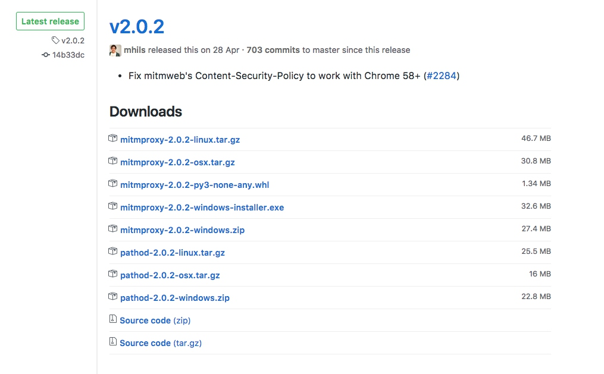

图 1-60　证书文件

证书一共 5 个，表 1-1 简要说明了这 5 个证书。

表 1-1　5 个证书及其说明

| 名　　称              | 描　　述                                                     |
| --------------------- | ------------------------------------------------------------ |
| mitmproxy-ca.pem      | PEM 格式的证书私钥                                            |
| mitmproxy-ca-cert.pem | PEM 格式证书，适用于大多数非 Windows 平台                       |
| mitmproxy-ca-cert.p12 | PKCS12 格式的证书，适用于 Windows 平台                          |
| mitmproxy-ca-cert.cer | 与 mitmproxy-ca-cert.pem 相同，只是改变了后缀，适用于部分 Android 平台 |
| mitmproxy-dhparam.pem | PEM 格式的秘钥文件，用于增强 SSL 安全性                         |

下面我们介绍一下 Windows、Mac、iOS 和 Android 平台下的证书配置过程。

##### Windows

双击 mitmproxy-ca.p12，就会出现导入证书的引导页，如图 1-61 所示。


图 1-61　证书导入向导

直接点击 “下一步” 按钮即可，会出现密码设置提示，如图 1-62 所示。

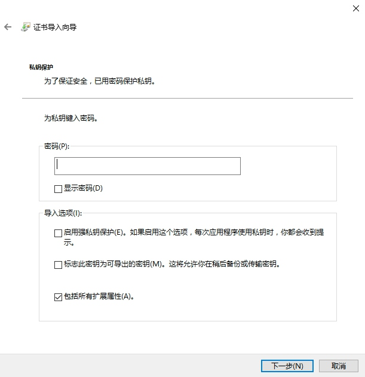

图 1-62　密码设置提示

这里不需要设置密码，直接点击 “下一步” 按钮即可。

接下来需要选择证书的存储区域，如图 1-63 所示。这里点击第二个选项 “将所有的证书都放入下列存储”，然后点击 “浏览” 按钮，选择证书存储位置为 “受信任的根证书颁发机构”，接着点击 “确定” 按钮，然后点击 “下一步” 按钮。


图 1-63　选择证书存储区域

最后，如果有安全警告弹出，如图 1-64 所示，直接点击 “是” 按钮即可。

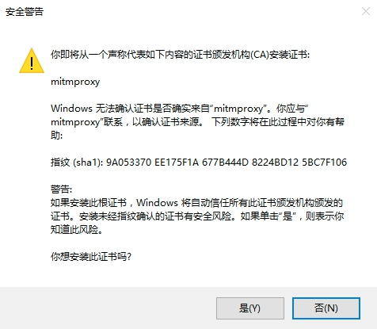

图 1-64　安全警告

这样就在 Windows 下配置完 CA 证书了。

##### Mac

Mac 下双击 mitmproxy-ca-cert.pem 即可弹出钥匙串管理页面，然后找到 mitmproxy 证书，打开其设置选项，选择 “始终信任” 即可，如图 1-65 所示。


图 1-65　证书配置

##### iOS

将 mitmproxy-ca-cert.pem 文件发送到 iPhone 上，推荐使用邮件方式发送，然后在 iPhone 上可以直接点击附件并识别安装，如图 1-66 所示。


图 1-66　证书安装页面

点击 “安装” 按钮之后，会跳到安装描述文件的页面，点击 “安装” 按钮，此时会有警告提示，如图 1-67 所示。


图 1-67　安装警告页面

继续点击右上角的 “安装” 按钮，安装成功之后会有已安装的提示，如图 1-68 所示。


图 1-68　安装成功页面

如果你的 iOS 版本是 10.3 以下的话，此处信任 CA 证书的流程就已经完成了。

如果你的 iOS 版本是 10.3 及以上版本，还需要在 “设置”→“通用”→“关于本机”→“证书信任设置” 将 mitmproxy 的完全信任开关打开，如图 1-69 所示。此时，在 iOS 上配置信任 CA 证书的流程就结束了。

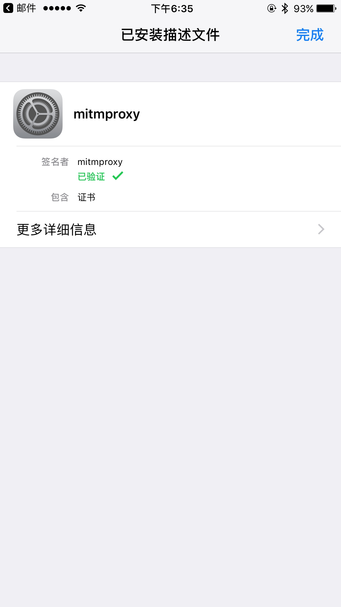

图 1-69　证书信任设置 

##### Android

在 Android 手机上，同样需要将证书 mitmproxy-ca-cert.pem 文件发送到手机上，例如直接复制文件。

接下来，点击证书，便会出现一个提示窗口，如图 1-70 所示。

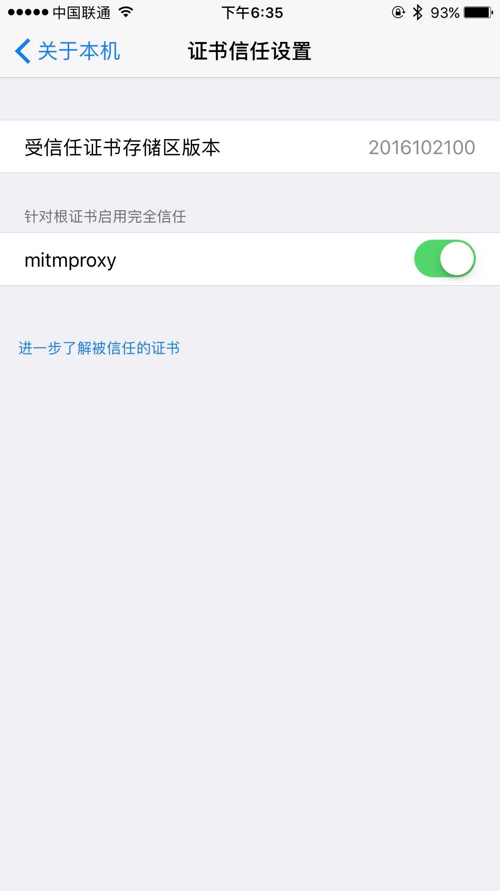

图 1-70　证书安装页面

这时输入证书的名称，然后点击 “确定” 按钮即可完成安装。

### 1.7.3　Appium 的安装

Appium 是移动端的自动化测试工具，类似于前面所说的 Selenium，利用它可以驱动 Android、iOS 等设备完成自动化测试，比如模拟点击、滑动、输入等操作，其官方网站为：[http://appium.io/](http://appium.io/)。本节中，我们就来了解一下 Appium 的安装方式。

#### 1. 相关链接

* GitHub：[https://github.com/appium/appium](https://github.com/appium/appium)
* 官方网站：[http://appium.io](http://appium.io)
* 官方文档：[http://appium.io/introduction.html](http://appium.io/introduction.html)
* 下载链接：[https://github.com/appium/appium-desktop/releases](https://github.com/appium/appium-desktop/releases)
* Python Client：[https://github.com/appium/python-client](https://github.com/appium/python-client)

#### 2. 安装 Appium

首先，需要安装 Appium。Appium 负责驱动移动端来完成一系列操作，对于 iOS 设备来说，它使用苹果的 UIAutomation 来实现驱动；对于 Android 来说，它使用 UIAutomator 和 Selendroid 来实现驱动。

同时 Appium 也相当于一个服务器，我们可以向它发送一些操作指令，它会根据不同的指令对移动设备进行驱动，以完成不同的动作。

安装 Appium 有两种方式，一种是直接下载安装包 Appium Desktop 来安装，另一种是通过 Node.js 来安装，下面我们介绍一下这两种安装方式。

##### Appium Desktop

Appium Desktop 支持全平台的安装，我们直接从 GitHub 的 Releases 里面安装即可，链接为 [https://github.com/appium/appium-desktop/releases](https://github.com/appium/appium-desktop/releases)。目前的最新版本是 1.1，下载页面如图 1-71 所示。

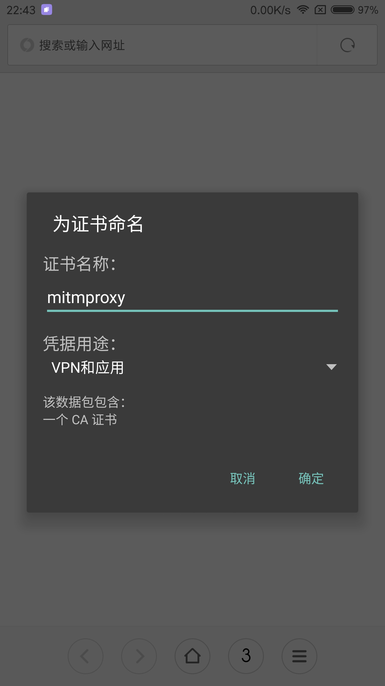

图 1-71　下载页面

Windows 平台可以下载 exe 安装包 appium-desktop-Setup-1.1.0.exe，Mac 平台可以下载 dmg 安装包如 appium-desktop-1.1.0.dmg，Linux 平台可以选择下载源码，但是更推荐用 Node.js 安装方式。

安装完成后运行，看到的页面如图 1-72 所示。


图 1-72　运行页面

如果出现此页面，则证明安装成功。

##### Node.js

首先需要安装 Node.js，具体的安装方式可以参见 [http://www.runoob.com/nodejs/nodejs-install-setup.html](http://www.runoob.com/nodejs/nodejs-install-setup.html)，安装完成之后就可以使用 npm 命令了。

接下来，使用 npm 命令全局安装 Appium 即可：

```
npm install -g appium
```

此时等待命令执行完成即可，这样就成功安装了 Appium。

#### 3. Android 开发环境配置

如果我们要使用 Android 设备做 App 抓取的话，还需要下载和配置 Android SDK，这里推荐直接安装 Android Studio，其下载地址为 [https://developer.android.com/studio/index.html?hl=zh-cn](https://developer.android.com/studio/index.html?hl=zh-cn)。下载后直接安装即可。

然后，我们还需要下载 Android SDK。直接打开首选项里面的 Android SDK 设置页面，勾选要安装的 SDK 版本，点击 OK 按钮即可下载和安装勾选的 SDK 版本，如图 1-73 所示。


图 1-73　Android SDK 设置页面

另外，还需要配置一下环境变量，添加 ANDROID_HOME 为 Android SDK 所在路径，然后再添加 SDK 文件夹下的 tools 和 platform-tools 文件夹到 PATH 中。

更详细的配置可以参考 Android Studio 的官方文档：[https://developer.android.com/studio/intro/index.html](https://developer.android.com/studio/intro/index.html)。
 
#### 4. iOS 开发环境

首先需要声明的是，Appium 是一个做自动化测试的工具，用它来测试我们自己开发的 App 是完全没问题的，因为它携带的是开发证书（Development Certificate）。但如果我们想拿 iOS 设备来做数据爬取的话，那又是另外一回事了。一般情况下，我们做数据爬取都是使用现有的 App，在 iOS 上一般都是通过 App Store 下载的，它携带的是分发证书（Distribution Certificate），而携带这种证书的应用都是禁止被测试的，所以只有获取 ipa 安装包再重新签名之后才可以被 Appium 测试，具体的方法这里不再展开阐述。

这里推荐直接使用 Android 来进行测试。如果你可以完成上述重签名操作，那么可以参考如下内容配置 iOS 开发环境。

Appium 驱动 iOS 设备必须要在 Mac 下进行，Windows 和 Linux 平台是无法完成的，所以下面介绍一下 Mac 平台的相关配置。

Mac 平台需要的配置如下：

* Mac OS X 10.12 及更高版本
* XCode 8 及更高版本

配置满足要求之后，执行如下命令即可配置开发依赖的一些库和工具：

```
xcode-select --install
```

这样 iOS 部分的开发环境就配置完成了，我们就可以用 iOS 模拟器来进行测试和数据抓取了。

如果想要用真机进行测试和数据抓取，还需要额外配置其他环境，具体可以参考 [https://github.com/appium/appium/blob/master/docs/en/appium-setup/real-devices-ios.md](https://github.com/appium/appium/blob/master/docs/en/appium-setup/real-devices-ios.md)。

以上是 Appium 开发环境的搭建，在后文我们会用它来抓取微信朋友圈的内容。