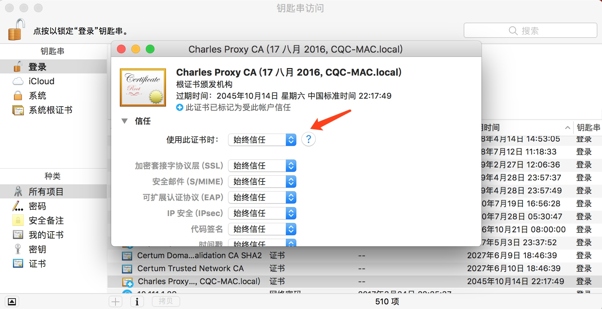

## 1.7.1 Charles的安装

Charles 是一个网络抓包工具，在做 APP 抓包的时候会用到，相比 Fiddler 来说，Charles 的功能更为强大，而且跨平台支持更好，所以在这里我们选用 Charles 来作为主要的移动端抓包工具，用于分析移动 APP 的数据包，辅助完成 APP 数据抓取工作。

### 1. 相关链接

* 官方网站：[https://www.charlesproxy.com](https://www.charlesproxy.com)
* 下载链接：[https://www.charlesproxy.com/download](https://www.charlesproxy.com/download)

### 2. 下载Charles

Charles 的官网是：[https://www.charlesproxy.com](https://www.charlesproxy.com)，我们可以在官网下载最新稳定版本，链接为：[https://www.charlesproxy.com/download](https://www.charlesproxy.com/download)，它支持 Windows、Linux、Mac 三大平台，如图 1-43 所示：

图 1-43 Charles 下载页面

可以直接点击对应的安装包进行下载，具体的安装过程不再赘述。

Charles 是收费的软件，不过可以免费试用 30 天。如果试用期过了其实还是可以试用的，不过每次试用不会超过30分钟，启动有 10 秒的延时，但是完整的软件功能还是可以使用的，所以还是比较友好的。

### 3. 证书配置

现在很多页面都在向 HTTPS 方向发展，HTTPS 通信协议应用越来越广泛，如果一个 APP 通信应用了 HTTPS 协议，那它通信的数据都会是被加密的，常规的截包方法是无法识别请求内部的数据的。

安装完成之后如果我们想要做 HTTPS 抓包的话还需要配置一下相关 SSL 证书，如果不配置的话无法抓取 HTTPS 请求，接下来我们再看下各个平台下的证书配置过程。

Charles 是运行在 PC 端的，我们要抓取的是 APP 端的数据，我们要在 PC 和手机端都安装证书。

#### Windows

如果你的 PC 是 Windows 系统，可以按照下面的操作进行证书配置。

首先我们先打开 Charles，点击 Help->SSL Proxying->Install Charles Root Certificate，即可进入证书的安装页面，如图 1-44 所示：

图 1-44 证书安装页面入口

接下来会弹出一个安装证书的页面，如图 1-45 所示：

图 1-45 证书安装页面

点击安装证书，接下来就会打开证书导入向导，如图 1-46 所示：

图 1-46 证书导入向导

直接点击下一步，接下来需要选择证书的存储区域，点击第二个选项“将所有证书放入下列存储”，然后点击浏览，再选择证书存储位置为“受信任的根证书颁发机构”，确定，点击下一步，如图 1-47 所示：

图 1-47 选择证书存储区域

再继续点击下一步完成导入即可，这样。

#### Mac

如果你的 PC 是 Mac 系统，可以按照下面的操作进行证书配置。

同样是点击 Help->SSL Proxying->Install Charles Root Certificate，即可进入证书的安装页面。

接下来找到 Charles 的证书双击，将信任设置为始终信任即可，如图 1-48 所示：

图 1-48 证书配置

这样就成功安装了证书。

#### iOS

如果你的手机是 iOS 系统，可以按照下面的操作进行证书配置。

首先查看一下电脑的 Charles 代理是是否开启的，点击 Proxy->Proxy Settings 即可打开当前代理设置页面，确保当前的 HTTP 代理是开启的，如图 1-49 所示：

图 1-49 代理设置

例如这里的代理端口为 8888，也可以自行修改。

接下来将手机和电脑连在同一个局域网下，例如当前电脑的 IP 为 192.168.1.76，那么首先设置手机的代理为 192.168.1.76:8888，设置如图 1-50 所示：

图 1-50 代理设置

设置完毕之后电脑上就会出现一个提示窗口，询问是否信任此设备，如图 1-51 所示：

图 1-51 提示窗口

点击 Allow 即可，这样手机就和 PC 连在了同一个局域网内了，而且设置了 Charles 的代理，这样 Charles 即可抓取到流经 APP 的数据包了。

接下来我们再安装 Charles 的 HTTPS 证书。

在电脑上打开 Help->SSL Proxying->Install Charles Root Certificate on a Mobile Device or Remote Browser，如图 1-52 所示：

图 1-52 证书安装页面入口

即可看到如下提示，如图 1-53 所示：

图 1-52 提示窗口

它提示我们在手机上设置好 Charles 的代理，我们刚才已经设置好了，然后在手机的浏览器中打开 chls.pro/ssl 下载证书，我们在手机上打开这个链接。

打开之后便会弹出证书的安装页面，如图 1-54 所示：

图 1-54 证书安装页面

我们点击安装，然后输入密码即可完成安装，如图 1-55 所示：

图 1-55 安装成功页面

如果你的 iOS 版本是 10.3 以下的话，此处信任 CA 证书的流程就已经完成了。

如果你的 iOS 版本是 10.3 及以上，还需要在设置->通用->关于本机->证书信任设置将证书添加完全信任，如图 1-56 所示：

在这里将 Charles 的证书的完全信任开关打开即可，如图 1-56 所示：

图 1-56 证书信任设置

这样 iOS 上配置信任 CA 证书的流程就结束了。

#### Android

如果你的手机是 Android 系统，可以按照下面的操作进行证书配置。

Android 同样需要设置代理为 Charles 的代理，如图 1-57 所示：

图 1-57 代理设置

设置完毕之后电脑上就会出现一个提示窗口，询问是否信任此设备，如图 1-58 所示：

图 1-58 提示窗口

点击 Allow 即可。

接下来像 iOS 设备一样，在手机浏览器上打开 chls.pro/ssl，这时会出现一个提示框，如图 1-59 所示：

图 1-59 证书安装页面

我们为证书添加一个名称，然后点击确定即可完成证书的安装。

### 4. 结语

本文介绍了 Charles 的安装及证书配置过程，后文我们会介绍 Charles 的基本使用方法。
