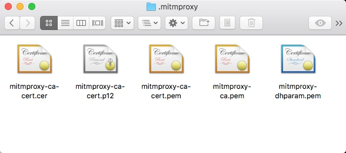

# MitmProxy的安装

MitmProxy是一个支持HTTP和HTTPS的抓包程序，类似Fiddler、Charles的功能，只不过它是一个控制台的形式操作。

同时MitmProxy还有两个关联组件，一个是MitmDump，它是MitmProxy的命令行接口，利用它我们可以对接Python脚本，用Python实现监听后的处理。另一个是MitmWeb，它是一个Web程序，通过它我们可以清楚地观察到MitmProxy捕获的请求。

本节我们来了解一下MitmProxy、MitmDump、MitmWeb的安装方式。

## Pip安装

最简单的安装方式还是使用Pip，直接执行如下命令即可安装：

```
pip3 install mitmproxy
```

这是最简单和通用的安装方式，执行完毕之后即可完成MitmProxy、MitmDump、MitmWeb的安装，如果不想用此种方式安装也可以选择下文列出的专门针对各个平台的安装方式。

## 标准安装

### Windows

可以到GitHub上的Releases页面获取安装包，链接为[https://github.com/mitmproxy/mitmproxy/releases/](https://github.com/mitmproxy/mitmproxy/releases/)。


如当前最新版本为2.0.2，所以可以选择下载Windows下的exe安装包mitmproxy-2.0.2-windows-installer.exe。

下载之后直接双击安装包即可安装。

注意：在Windows上不支持MitmProxy的控制台接口，但是可以使用MitmDump和MitmWeb。

### Mac

Mac的安装非常简单，使用HomeBrew即可，命令如下：

```
brew install mitmproxy
```

执行命令后即可完成MitmProxy的安装。

### Linux

Linux可以下载编译好的二进制包，此发行包一般是最新版本，它包含了最新版本的MitmProxy和内置的Python3环境还有最新的OpenSSL环境。

如果你的环境里没有Python3和OpenSSL环境，建议使用此种方式安装。

二进制包的下载地址还是[https://github.com/mitmproxy/mitmproxy/releases/](https://github.com/mitmproxy/mitmproxy/releases/)。


例如当前最新版本为2.0.2，下载mitmproxy-2.0.2-linux.tar.gz即可。

下载之后需要解压然后将其配置到环境变量。

```
tar -zxvf mitmproxy-2.0.2-linux.tar.gz
sudo mv mitmproxy mitmdump mitmweb /usr/bin
```

这样就可以将三个可执行文件移动到了/usr/bin目录，而一般/usr/bin目录都已经配置在了环境变量下，所以接下来我们就可以直接调用这三个工具了。

## Docker安装

MitmProxy也支持Docker，其DockerHub的地址为[https://hub.docker.com/r/mitmproxy/mitmproxy/](https://hub.docker.com/r/mitmproxy/mitmproxy/)

Docker下MitmProxy的安装命令为：

```
docker run --rm -it -p 8080:8080 mitmproxy/mitmproxy mitmdump
```

这样就在8080端口上启动了MitmProxy和MitmDump。

如果想要获取CA证书，可以选择挂载磁盘选项，命令如下：

```
docker run --rm -it -v ~/.mitmproxy:/home/mitmproxy/.mitmproxy -p 8080:8080 mitmproxy/mitmproxy mitmdump
```

这样可以在~/.mitmproxy目录找到CA证书。

另外还可以在8081端口上启动MitmWeb，命令如下：

```
docker run --rm -it -p 8080:8080 -p 127.0.0.1:8081:8081 mitmproxy/mitmproxy mitmweb
```

更多启动方式可以参考DockerHub的安装说明。

## CA证书配置

现在很多页面都在向HTTPS方向发展，HTTPS通信协议应用越来越广泛，如果一个APP通信应用了HTTPS协议，那它通信的数据都会是被加密的，常规的截包方法是无法识别请求内部的数据的。

对于MitmProxy来说，如果想要截获HTTPS请求，我们就需要设置CA证书，MitmProxy在安装后会提供一套CA证书，只要客户端信任了MitmProxy提供的证书，我们就可以通过MitmProxy获取HTTPS请求的具体内容，否则MitmProxy是无法解析HTTPS请求的。

首先运行一下命令产生CA证书，启动MitmDump即可：

```
mitmdump
```

这样即可启动MitmDump，接下来我们就可以在用户目录下的.mitmproxy目录里面找到CA证书。




证书一共五个，下面是对这五个证书的说明：

| 名称 | 描述 |
| --- | --- |
| mitmproxy-ca.pem | PEM格式的证书私钥 |
| mitmproxy-ca-cert.pem | PEM格式证书，适用于大多数非Windows平台 |
| mitmproxy-ca-cert.p12 | PKCS12格式的证书，适用于Windows平台 |
| mitmproxy-ca-cert.cer | 与mitmproxy-ca-cert.pem相同，只是改变了后缀，适用于部分Android平台 |
| mitmproxy-dhparam.pem | PEM格式的秘钥文件，用于增强SSL安全性 |

### Windows

双击mitmproxy-ca.p12，就会出现导入证书的引导页。


直接点击下一步即可，不需要设置密码，直接点击下一步即可。


接下来需要选择证书的存储区域，点击第二个选项“将所有证书放入下列存储”，然后点击浏览，再选择证书存储位置为“受信任的根证书颁发机构”，确定，点击下一步。


最后如果有安全警告均点击“是”即可。


这样就配置完成Windows下信任CA证书了。

### Mac OS

Mac OS下双击mitmproxy-ca-cert.pem即可弹出钥匙串管理页面，然后找到mitmproxy证书，点击打开其设置选项，选择始终信任即可。


这样就配置完成Mac OS下信任CA证书了。

### iOS

将mitmproxy-ca-cert.pem文件发送到iPhone上，推荐使用邮件的方式发送，iPhone上可以直接点击附件并识别安装。


点击之后会跳到安装描述文件的页面，点击右上角的安装按钮即可安装。


此处会有警告提示，继续点击右上角的安装即可。


安装成功之后会有已安装的提示。

如果你的iOS版本是10.3以下的话，此处信任CA证书的流程就已经完成了。

如果你的iOS版本是10.3及以上，还需要在设置->通用->关于本机->证书信任设置将证书添加完全信任。


在这里将MitmProxy的完全信任开关打开即可。

这样iOS上配置信任CA证书的流程就结束了。

### Android

Android手机同样需要将证书mitmproxy-ca-cert.pem文件发送到手机上，例如直接拷贝文件。

接下来点击证书便会出现一个提示窗口：


这时输入证书的名称，然后点击确定即可完成安装。


