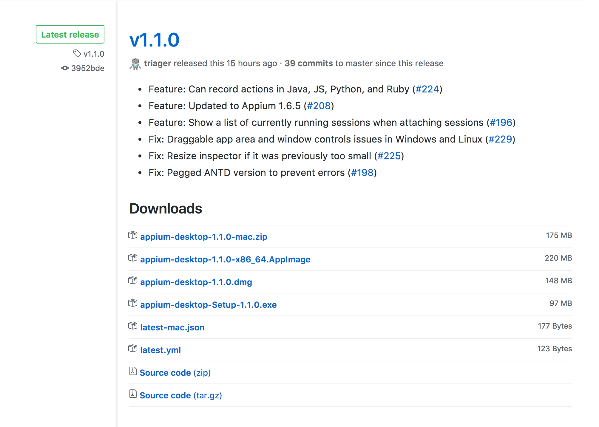
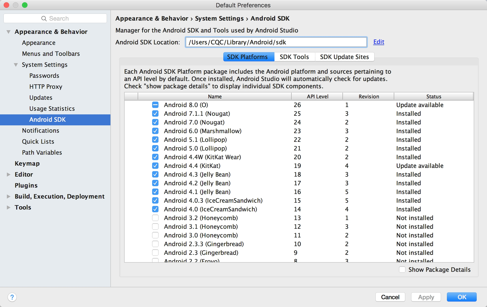

## 1.7.3 Appium的安装

Appium 是移动端的自动化测试工具，类似于前面所说的 Selenium，利用它我们可以驱动 Android、iOS 等设备完成自动化测试，比如模拟点击、滑动、输入等操作，其官方网站为[http://appium.io/](http://appium.io/)，本节来了解一下 Appium 的安装方式。

### 1. 相关链接

* GitHub：[https://github.com/appium/appium](https://github.com/appium/appium)
* 官方网站：[http://appium.io](http://appium.io)
* 官方文档：[http://appium.io/introduction.html](http://appium.io/introduction.html)
* 下载链接：[https://github.com/appium/appium-desktop/releases](https://github.com/appium/appium-desktop/releases)
* Python Client：[https://github.com/appium/python-client](https://github.com/appium/python-client)

### 2. 安装Appium

首先我们需要安装 Appium，Appium 负责驱动移动端来完成一系列操作，对 iOS 设备来说，它使用苹果的 UIAutomation 来实现驱动，对于 Android 来说，它使用 UiAutomator 和 Selendroid 来实现驱动。

同时 Appium 也相当于一个服务器，我们可以向 Appium 发送一些操作指令，Appium 就会根据不同的指令对移动设备进行驱动，完成不同的动作。

安装 Appium 有两种方式，一种是直接下载安装包 Appium Desktop 来安装，另外一种是通过 Node.js 来安装，下面我们各自介绍一下两种安装方式。

#### Appium Desktop

Appium Desktop 支持全平台的安装，我们直接从 GitHub 的 Releases 里面安装即可，链接为：[https://github.com/appium/appium-desktop/releases](https://github.com/appium/appium-desktop/releases)，目前的最新版本是 1.1，最新版本以网站为准。



Windows 平台可以下载 exe 安装包如 appium-desktop-Setup-1.1.0.exe，Mac 平台可以下载 dmg 安装包如 appium-desktop-1.1.0.dmg，Linux 平台可以选择下载源码，但是更推荐用下文的 Node.js 安装方式。

安装完成之后运行之后页面如图所示：


如果出现此页面则证明安装成功。

#### Node.js

首先需要安装 Node.js，具体的安装方式可以参见：[http://www.runoob.com/nodejs/nodejs-install-setup.html](http://www.runoob.com/nodejs/nodejs-install-setup.html)，安装完成之后就可以使用 npm 命令了。

接下来使用 npm 命令全局安装 Appium 即可，命令如下：

```
npm install -g appium
```

等待命令执行执行完成即可，这样就成功安装了 Appium。

### 3. Android开发环境配置

如果我们要使用 Android 设备做 App 抓取的话，还需要下载和配置 Android SDK，在这里推荐直接安装 Android Studio，其下载地址为：[https://developer.android.com/studio/index.html?hl=zh-cn](https://developer.android.com/studio/index.html?hl=zh-cn)，下载之后直接安装即可。

完成之后我们还需要下载 Android SDK，直接打开首选项里面的 Android SDK 设置页面，勾选要安装的 SDK 版本，点击确定即可开始下载和安装勾选的 SDK 版本。



另外还需要配置一下环境变量，添加 ANDROID_HOME 为 Android SDK 所在路径，然后再添加 SDK 文件夹下的 tools 和 platform-tools 文件夹到 PATH 中。

更详细的配置可以参考 Android Studio 的官方文档：[https://developer.android.com/studio/intro/index.html](https://developer.android.com/studio/intro/index.html)。

### 4. iOS开发环境

首先需要声明的是，Appium 是一个做自动化测试的工具，用它来测试我们自己开发的 App 是完全没问题的，它携带的是开发者证书（Development Certificate）。但如果我们想拿 iOS 设备来做数据爬取的话又是另外一回事了，一般我们做数据爬取都是使用现有的APP，在 iOS 上一般都是通过 App Store 下载的，它携带的是分发证书（Distribution Certificate），而携带这种证书的应用都是禁止被测试的，所以只有获取 ipa 安装包再重新签名之后才可以被 Appium 测试，具体的方法不再展开阐述，如感兴趣可以搜索相关资料。

因此在这里推荐直接使用 Android 来进行测试，如果你可以完成上述操作重签名操作，那么可以参考如下内容配置 iOS 开发环境。

Appium 驱动 iOS 设备必须要在 Mac 下进行，Windows 和 Linux 是平台是无法完成的，下面只介绍一下 Mac 平台的相关配置。

Mac 平台需要的配置如下：

* Mac OS X 10.12 及更高版本
* XCode 8 及更高版本

配置满足要求之后执行如下命令即可配置开发依赖的一些库和工具：

```
xcode-select --install
```

这样 iOS 部分开发环境就配置完成了，我们就可以用 iOS 模拟器来进行测试和数据抓取了。

如果想要用真机进行测试和数据抓取，还需要额外配置一下其他的环境，可以参考：[https://github.com/appium/appium/blob/master/docs/en/appium-setup/real-devices-ios.md](https://github.com/appium/appium/blob/master/docs/en/appium-setup/real-devices-ios.md)。

### 5. 结语

以上是 Appium 开发环境的搭建，在后文我们会用它来抓取微信朋友圈的内容。


