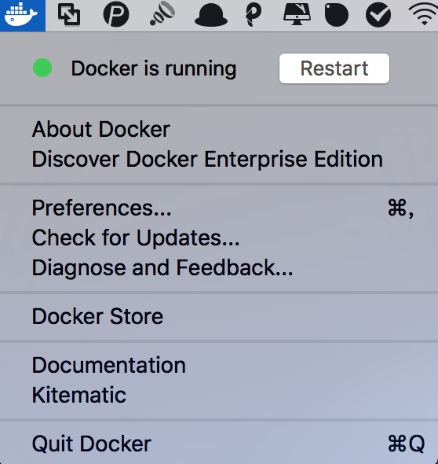

# Docker的安装

Docker 是一种容器技术，它可以将应用和环境等进行打包，形成一个独立的，类似于 iOS 的 APP 形式的「应用」，这个应用可以直接被分发到任意一个支持 Docker 的环境中，通过简单的命令即可启动运行。Docker 是一种最流行的容器化实现方案。和虚拟化技术类似，它极大的方便了应用服务的部署；又与虚拟化技术不同，它以一种更轻量的方式实现了应用服务的打包。使用 Docker 可以让每个应用彼此相互隔离，在同一台机器上同时运行多个应用，不过他们彼此之间共享同一个操作系统。Docker 的优势在于，它可以在更细的粒度上进行资源的管理，也比虚拟化技术更加节约资源。

本段参考：[DaoCloud官方文档](http://guide.daocloud.io/dcs/docker-9152673.html)

对于爬虫来说，如果我们需要大规模部署爬虫系统的话，用Docker会大大提高效率，工欲善其事，必先利其器。

本节来介绍一下三大平台下Docker的安装方式。

## Windows

如果你是Win10 64位系统，那么推荐使用Docker for Windows，直接从Docker官方网站下载最新的Docker for Windows安装包即可，[https://docs.docker.com/docker-for-windows/install/](https://docs.docker.com/docker-for-windows/install/)

如果不是Win10 64位系统，则可以下载Docker Toolbox，[https://docs.docker.com/toolbox/toolbox_install_windows/](https://docs.docker.com/toolbox/toolbox_install_windows/)。

安装包下载之后直接双击安装即可，安装详细过程可以参考文档说明，安装完成之后，进入命令行。

运行Docker命令测试：

```
docker
```

运行结果如下：


如果出现类似上述输出就证明Docker安装成功了。

## Linux

详细的分步骤的安装说明可以参见官方文档，[https://docs.docker.com/engine/installation/linux/ubuntu/](https://docs.docker.com/engine/installation/linux/ubuntu/)。

在官方文档中详细说明了不同Linux系统的安装方法，安装流程根据文档一步步执行即可安装成功。

但是为了使得安装更加方便，Docker官方还提供了一键安装脚本，使用它会使得安装更加便捷，不用再去一步步执行命令安装了，在此介绍一下一键脚本安装方式。

首先是Docker官方提供的安装脚本，相比其他脚本，官方提供的一定更靠谱，安装命令如下：

```
curl -sSL https://get.docker.com/ | sh
```

只要执行如上一条命令，等待一会儿Docker便会安装完成，非常方便。

但是官方脚本安装有一个缺点，那就是慢，也可能下载超时，所以为了加快下载速度，我们可以使用国内的镜像来安装，所以在这里还有阿里云和DaoCloud的安装脚本。

阿里云安装脚本：

```
curl -sSL http://acs-public-mirror.oss-cn-hangzhou.aliyuncs.com/docker-engine/internet | sh -
```

DaoCloud安装脚本：

```
curl -sSL https://get.daocloud.io/docker | sh
```

两个脚本可以任选其一，速度都非常不错。

等待脚本执行完毕之后，就可以使用Docker相关命令了，如运行测试Hello World镜像：

```
docker run hello-world
```

运行结果：

```
Unable to find image 'hello-world:latest' locally
latest: Pulling from library/hello-world
78445dd45222: Pull complete 
Digest: sha256:c5515758d4c5e1e838e9cd307f6c6a0d620b5e07e6f927b07d05f6d12a1ac8d7
Status: Downloaded newer image for hello-world:latest
Hello from Docker!
This message shows that your installation appears to be working correctly.
```

如果出现上文类似提示内容则证明Docker可以正常使用了。

## Mac OS

Mac平台同样有两种选择，Docker for Mac和Docker Toolbox。

Docker for Mac要求系统为OS X EI Captain 10.11或更新，至少4GB内存，如果你的系统满足此要求，则强烈建议安装Docker for Mac。

可以使用HomeBrew安装，安装命令如下：

```
brew cask install docker
```

另外也可以手动下载安装包安装，安装包下载地址为：[https://download.docker.com/mac/stable/Docker.dmg](https://download.docker.com/mac/stable/Docker.dmg)

下载完成之后直接双击安装包，然后将程序拖动到应用程序中即可。

点击程序图标运行Docker，会发现在菜单栏中出现了Docker的图标，如图中的第三个小鲸鱼图标。


点击图标展开菜单之后，再点击Start按钮即可启动Docker，启动成功便会提示Docker is running。



随后我们就可以在命令行下使用Docker命令了。

可以使用如下命令测试运行：

```
sudo docker run hello-world
```

运行结果如图所示：


如果出现类似输出则证明Docker已经成功安装。

如果系统不满足要求，可以下载Docker Toolbox，其安装说明为[https://docs.docker.com/toolbox/overview/](https://docs.docker.com/toolbox/overview/)。

关于Docker for Mac和Docker Toolbox的区别，可以参见[https://docs.docker.com/docker-for-mac/docker-toolbox/](https://docs.docker.com/docker-for-mac/docker-toolbox/)。


## 镜像加速

安装好Docker之后，在运行测试命令时，我们会发现它首先会下载一个Hello World的镜像，然后将其运行，但是下载速度有时候会非常慢，这是因为它默认还是从国外的Docker Hub下载的，所以为了提高镜像的下载速度，我们还可以使用国内镜像来加速下载，所以这就有了Docker加速器一说。

推荐的Docker加速器有DaoCloud和阿里云。

DaoCloud：[https://www.daocloud.io/mirror](https://www.daocloud.io/mirror)

阿里云：[https://cr.console.aliyun.com/#/accelerator](https://cr.console.aliyun.com/#/accelerator)

不同平台的镜像加速方法配置可以参考DaoCloud的官方文档：[http://guide.daocloud.io/dcs/daocloud-9153151.html](http://guide.daocloud.io/dcs/daocloud-9153151.html)。

配置完成之后，可以发现镜像的下载速度会快非常多。

以上便是Docker的安装方式说明。

