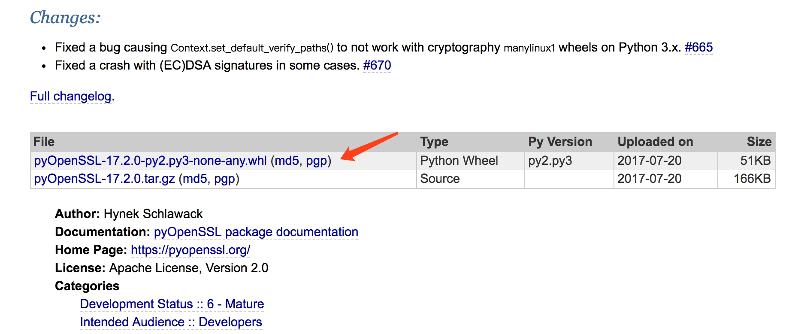
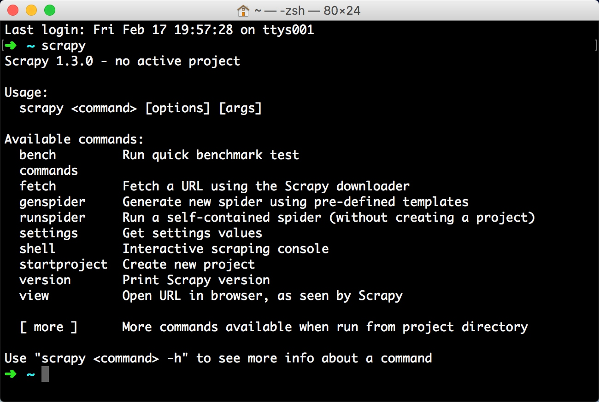

# Scrapy的安装

Scrapy 是一个十分强大的爬虫框架，依赖的库比较多，至少需要依赖库有 Twisted 14.0，lxml 3.4，pyOpenSSL 0.14。而在不同平台环境又各不相同，所以在安装之前最好确保把一些基本库安装好，尤其是 Windows。本节介绍一下 Scrapy 在不同平台的安装方法。

### 1. 相关链接

* 官方网站：[https://scrapy.org](https://scrapy.org)
* 官方文档：[https://docs.scrapy.org](https://docs.scrapy.org)
* PyPi：[https://pypi.python.org/pypi/Scrapy](https://pypi.python.org/pypi/Scrapy)
* GitHub：[https://github.com/scrapy/scrapy](https://github.com/scrapy/scrapy)
* 中文文档：[http://scrapy-chs.readthedocs.io](http://scrapy-chs.readthedocs.io)

### 2. Anaconda安装

这种方法是一种比较简单的安装 Scrapy 的方法（尤其是对 Windows 来说），如果你的 Python 是使用 Anaconda 安装的，或者还没有安装 Python 的话，可以使用该方法安装，简单省力，当然如果你的 Python 不是通过 Anaconda 安装的，可以继续查看下文中各平台直接安装方法。

Anaconda 的安装方式可以查看前文中 Python3 的安装方式一节，在此不再赘述。

如果已经安装好了 Anaconda，那么可以通过 conda 命令安装 Scrapy，安装命令如下：

```
conda install Scrapy
```

运行之后便可以完成 Scrapy 的安装。

### 3. Windows下的安装

如果你的 Python 不是使用 Anaconda 安装的，可以参考如下方式来一步步完成 Scrapy 的安装。

#### 安装LXML

LXML 的安装过程请参见前文 LXML 安装方法讲解，在此不再赘述，此库非常重要，请一定要安装成功。

#### 安装pyOpenSSL

官方网站下载 Wheel 文件，[https://pypi.python.org/pypi/pyOpenSSL#downloads](https://pypi.python.org/pypi/pyOpenSSL#downloads)，如当前最新版本名称是 pyOpenSSL-17.2.0-py2.py3-none-any.whl，直接下载即可。



下载后利用 Pip 安装即可：

```
pip3 install pyOpenSSL-17.2.0-py2.py3-none-any.whl
```

#### 安装Twisted

到 [http://www.lfd.uci.edu/~gohlke/pythonlibs/#twisted](http://www.lfd.uci.edu/~gohlke/pythonlibs/#twisted) 下载 Wheel 文件，利用 Pip 安装即可。
如 Python 3.6 版本，Windows 64 位系统，当前最新版本为 Twisted‑17.5.0‑cp36‑cp36m‑win_amd64.whl，直接下载即可，最新版本以网站为准。


然后 Pip 安装即可：

```
pip3 install Twisted‑17.5.0‑cp36‑cp36m‑win_amd64.whl
```

### 安装PyWin32

从官方网站下载对应版本的安装包即可，链接为：[https://sourceforge.net/projects/pywin32/files/pywin32/Build%20221/](https://sourceforge.net/projects/pywin32/files/pywin32/Build%20221/)。


如 Python 3.6 版本可以选择下载 pywin32-221.win-amd64-py3.6.exe，下载完毕之后双击安装即可。

注意这里使用的是 Build 221 版本，随着时间推移，版本肯定会继续更新，最新的版本可以查看：[https://sourceforge.net/projects/pywin32/files/pywin32/](https://sourceforge.net/projects/pywin32/files/pywin32/)，查找最新的版本安装即可。

#### 安装Scrapy

安装好了以上的依赖库，最后安装 Scrapy 就非常简单了，依然使用 Pip，命令如下：

```
pip3 install Scrapy
```

等待命令结束没有报错，就证明 Scrapy 已经安装好了。

### 4. Linux下的安装

在 Linux 上的安装方式依然分为两类平台介绍。

#### CentOS、RedHat

首先确保一些依赖库已经安装，运行如下命令：

```
sudo yum groupinstall -y development tools
sudo yum install -y epel-release libxslt-devel libxml2-devel openssl-devel
```

最后利用 Pip 安装 Scrapy 即可，运行如下命令：

```
pip3 install Scrapy
```

#### Ubuntu、Debian、Deepin

首先确保一些依赖库已经安装，运行如下命令：

```
sudo apt-get install build-essential python3-dev libssl-dev libffi-dev libxml2 libxml2-dev libxslt1-dev zlib1g-dev
```

然后利用 Pip 安装 Scrapy 即可，运行如下命令：

```
pip3 install Scrapy
```

运行完毕之后即可完成 Scrapy 的安装。

### 5. Mac下的安装

在 Mac 下首先也是进行依赖库的安装。

在 Mac 上构建 Scrapy 的依赖库需要 C 编译器以及开发头文件，它一般由 Xcode 提供，运行如下命令安装即可：

```
xcode-select --install
```

随后利用 Pip 安装 Scrapy 即可，运行如下命令：

```
pip3 install Scrapy
```

运行完毕之后即可完成 Scrapy 的安装。

### 6. 验证安装

安装之后，在命令行下输入 scrapy，如果出现类似下方的结果，就证明 Scrapy 安装成功。



### 7. 常见错误

#### pkg_resources.VersionConflict: (six 1.5.2 (/usr/lib/python3/dist-packages), Requirement.parse('six>=1.6.0'))

six 包版本过低，six包是一个提供兼容 Python2 和 Python3 的库，升级 six 包即可：

```
sudo pip3 install -U six
```

#### c/_cffi_backend.c:15:17: fatal error: ffi.h: No such file or directory

这是在 Linux 下常出现的错误，缺少 Libffi 这个库。什么是 libffi？“FFI” 的全名是 Foreign Function Interface，通常指的是允许以一种语言编写的代码调用另一种语言的代码。而 Libffi 库只提供了最底层的、与架构相关的、完整的”FFI”。

安装相应的库即可。

Ubuntu、Debian：

```
sudo apt-get install build-essential libssl-dev libffi-dev python3-dev
```

CentOS、RedHat:

```
sudo yum install gcc libffi-devel python-devel openssl-devel
```

#### Command "python setup.py egg_info" failed with error code 1 in /tmp/pip-build/cryptography/

这是缺少加密的相关组件，利用Pip 安装即可。

```
pip3 install cryptography
```

#### ImportError: No module named 'packaging'

缺少 packaging 这个包，它提供了 Python 包的核心功能，利用 Pip 安装即可。

#### ImportError: No module named '_cffi_backend'

缺少 cffi 包，使用 Pip 安装即可：

```
pip3 install cffi  
```

#### ImportError: No module named 'pyparsing'

缺少 pyparsing 包，使用 Pip 安装即可：

```
pip3 install pyparsing appdirs
```

