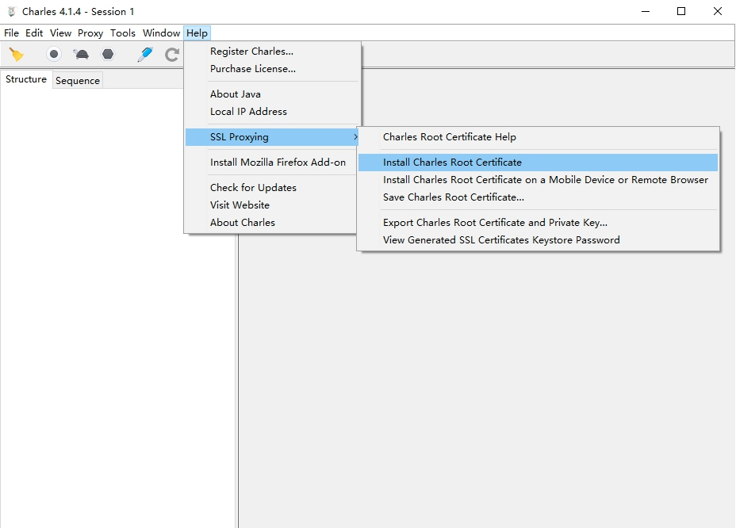

# Charles的安装

Charles是一个网络抓包工具，在做APP抓包的时候会用到，相比Fiddler来说，Charles的功能更为强大，而且跨平台支持更好，所以在这里我们选用Charles来作为主要的移动端抓包工具，用于分析移动APP的数据包，辅助完成APP数据爬取工作。

Charles的官网是[https://www.charlesproxy.com/](https://www.charlesproxy.com/)，我们可以在官网下载最新稳定版本，链接为[https://www.charlesproxy.com/download/](https://www.charlesproxy.com/download/)，支持Windows、Linux、Mac三大平台。

可以直接点击对应的安装包进行下载，具体的安装过程不再展开。

Charles是收费的软件，不过可以免费试用30天。如果试用期过了其实还是可以试用的，不过每次试用不会超过30分钟，启动有10秒的延时，但是完整的软件功能还是可以使用的，所以还是比较友好的。

## 证书的配置

安装完成之后如果我们想要做HTTPS抓包的话还需要配置一下相关SSL证书，如果不配置的话无法抓取HTTPS请求。

### Windows

首先我们先打开Charles，点击Help->SSL Proxying->Install Charles Root Certificate，即可进入证书的安装页面。

接下来会弹出一个安装证书的按钮，点击安装证书。

接下来就会打开证书导入向导，直接点击下一步。

接下来需要选择证书的存储区域，点击第二个选项“将所有证书放入下列存储”，然后点击浏览，再选择证书存储位置为“受信任的根证书颁发机构”，确定，点击下一步。

再继续点击下一步完成导入即可。

### Mac

同样是点击Help->SSL Proxying->Install Charles Root Certificate，即可进入证书的安装页面。

接下来找到Charles的证书双击，将信任设置为始终信任即可。

这样就成功安装了证书。

### iOS

