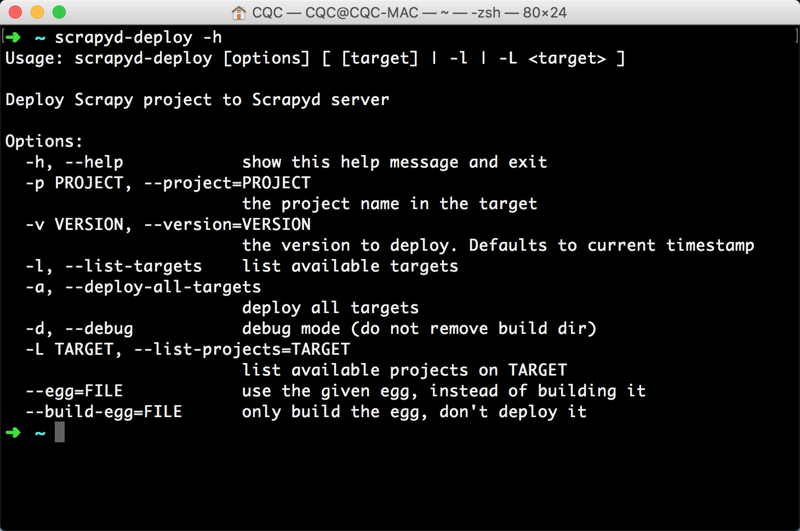

## 1.9　部署相关库的安装

如果想要大规模抓取数据，那么一定会用到分布式爬虫。对于分布式爬虫来说，我们需要多台主机，每台主机有多个爬虫任务，但是源代码其实只有一份。此时我们需要做的就是将一份代码同时部署到多台主机上来协同运行，那么怎么去部署就是另一个值得思考的问题。

对于 Scrapy 来说，它有一个扩展组件，叫作 Scrapyd，我们只需要安装该扩展组件，即可远程管理 Scrapy 任务，包括部署源码、启动任务、监听任务等。另外，还有 Scrapyd-Client 和 Scrapyd API 来帮助我们更方便地完成部署和监听操作。

另外，还有一种部署方式，那就是 Docker 集群部署。我们只需要将爬虫制作为 Docker 镜像，只要主机安装了 Docker，就可以直接运行爬虫，而无需再去担心环境配置、版本问题。

本节中，我们就来介绍相关环境的配置过程。

### 1.9.1　Docker 的安装

Docker 是一种容器技术，可以将应用和环境等进行打包，形成一个独立的、类似于 iOS 的 App 形式的 “应用”。这个应用可以直接被分发到任意一个支持 Docker 的环境中，通过简单的命令即可启动运行。Docker 是一种最流行的容器化实现方案，和虚拟化技术类似，它极大地方便了应用服务的部署；又与虚拟化技术不同，它以一种更轻量的方式实现了应用服务的打包。使用 Docker，可以让每个应用彼此相互隔离，在同一台机器上同时运行多个应用，不过它们彼此之间共享同一个操作系统。Docker 的优势在于，它可以在更细的粒度上进行资源管理，也比虚拟化技术更加节约资源。

对于爬虫来说，如果我们需要大规模部署爬虫系统的话，用 Docker 会大大提高效率。工欲善其事，必先利其器。

本节中，我们就来介绍三大平台下 Docker 的安装方式。

#### 1. 相关链接

* 官方网站：[https://www.docker.com](https://www.docker.com)
* GitHub：[https://github.com/docker](https://github.com/docker)
* Docker Hub：[https://hub.docker.com](https://hub.docker.com)
* 官方文档：[https://docs.docker.com](https://docs.docker.com)
* DaoCloud：[http://www.daocloud.io](http://www.daocloud.io)
* 中文社区：[http://www.docker.org.cn](http://www.docker.org.cn)
* 中文教程：[http://www.runoob.com/docker/docker-tutorial.html](http://www.runoob.com/docker/docker-tutorial.html)
* 推荐书籍：[https://yeasy.gitbooks.io/docker_practice](https://yeasy.gitbooks.io/docker_practice)

#### 2. Windows 下的安装
如果你的是 64 位 Windows 10 系统，那么推荐使用 Docker for Windows。此时直接从 Docker 官方网站下载最新的 Docker for Windows 安装包即可：[https://docs.docker.com/docker-for-windows/install/](https://docs.docker.com/docker-for-windows/install/)。

如果不是 64 位 Windows 10 系统，则可以下载 Docker Toolbox：[https://docs.docker.com/toolbox/toolbox_install_windows/](https://docs.docker.com/toolbox/toolbox_install_windows/)。

下载后直接双击安装即可，详细过程可以参考文档说明。安装完成后，进入命令行。

运行 docker 命令测试：

```
docker
```

运行结果如图 1-81 所示，这就证明 Docker 安装成功了。


图 1-81　运行结果

#### 3. Linux 下的安装

详细的步骤安装说明可以参见官方文档：[https://docs.docker.com/engine/installation/linux/ubuntu/](https://docs.docker.com/engine/installation/linux/ubuntu/)。

官方文档中详细说明了不同 Linux 系统的安装方法，根据文档一步步执行即可安装成功。但是为了使安装更加方便，Docker 官方还提供了一键安装脚本。使用它，会使安装更加便捷，不用再去一步步执行命令安装了。

首先是 Docker 官方提供的安装脚本。相比其他脚本，官方提供的一定更靠谱，安装命令如下：

```
curl -sSL https://get.docker.com/ | sh
```

只要执行如上一条命令，等待一会儿 Docker 便会安装完成，这非常方便。

但是使用官方脚本安装有一个缺点，那就是慢，也可能下载超时，所以为了加快下载速度，我们可以使用国内的镜像来安装，所以这里还有阿里云和 DaoCloud 的安装脚本。

阿里云的安装脚本：

```
curl -sSL http://acs-public-mirror.oss-cn-hangzhou.aliyuncs.com/docker-engine/internet | sh -
```

DaoCloud 的安装脚本：

```
curl -sSL https://get.daocloud.io/docker | sh
```

这两个脚本可以任选其一，速度都非常不错。

等待脚本执行完毕之后，就可以使用 Docker 相关命令了，如运行测试 Hello World 镜像：

```
docker run hello-world
```

运行结果：

```
Unable to find image 'hello-world:latest' locally  
latest: Pulling from library/hello-world  
78445dd45222: Pull complete   
Digest: sha256:c5515758d4c5e1e838e9cd307f6c6a0d620b5e07e6f927b07d05f6d12a1ac8d7  
Status: Downloaded newer image for hello-world:latest  
Hello from Docker!  
This message shows that your installation appears to be working correctly.
```

如果出现类似上面提示的内容，则证明 Docker 可以正常使用了。

#### 4. Mac 下的安装

Mac 平台同样有两种选择：Docker for Mac 和 Docker Toolbox。

Docker for Mac 要求系统为 OS X EI Captain 10.11 或更新，至少 4GB 内存。如果你的系统满足此要求，则强烈建议安装 Docker for Mac。

这里可以使用 Homebrew 安装，安装命令如下：

```
brew cask install docker
```

另外，也可以手动下载安装包（下载地址为：[https://download.docker.com/mac/stable/Docker.dmg](https://download.docker.com/mac/stable/Docker.dmg)）安装。

下载完成后，直接双击安装包，然后将程序拖动到应用程序中即可。

点击程序图标运行 Docker，会发现在菜单栏中出现了 Docker 的图标，如图 1-82 中的第三个小鲸鱼图标。


图 1-82　菜单栏

点击小鲸鱼图标，展开菜单之后，再点击 Start 按钮即可启动 Docker。启动成功后，便会提示 Docker is running，如图 1-83 所示。


图 1-83　运行页面

随后，我们就可以在命令行下使用 Docker 命令了。

可以使用如下命令测试运行：

```
sudo docker run hello-world
```

运行结果如图 1-84 所示，这就证明 Docker 已经成功安装了。


图 1-84　运行结果

如果系统不满足要求，可以下载 Docker Toolbox，其安装说明为：[https://docs.docker.com/toolbox/overview/](https://docs.docker.com/toolbox/overview/)。

关于 Docker for Mac 和 Docker Toolbox 的区别，可以参见：[https://docs.docker.com/docker-for-mac/docker-toolbox/](https://docs.docker.com/docker-for-mac/docker-toolbox/)。

#### 5. 镜像加速

安装好 Docker 之后，在运行测试命令时，我们会发现它首先会下载一个 Hello World 的镜像，然后将其运行。但是这里的下载速度有时候会非常慢，这是因为它默认还是从国外的 Docker Hub 下载的。因此，为了提高镜像的下载速度，我们还可以使用国内镜像来加速下载，于是就有了 Docker 加速器一说。

推荐的 Docker 加速器有 DaoCloud（详见 [https://www.daocloud.io/mirror](https://www.daocloud.io/mirror)）和阿里云（详见 [https://cr.console.aliyun.com/#/accelerator](https://cr.console.aliyun.com/#/accelerator)）。

不同平台的镜像加速方法配置可以参考 DaoCloud 的官方文档：[http://guide.daocloud.io/dcs/daocloud-9153151.html](http://guide.daocloud.io/dcs/daocloud-9153151.html)。

配置完成之后，可以发现镜像的下载速度会快非常多。

### 1.9.2　Scrapyd 的安装

Scrapyd 是一个用于部署和运行 Scrapy 项目的工具，有了它，我们可以将写好的 Scrapy 项目上传到云主机并通过 API 来控制它的运行。

既然是 Scrapy 项目部署，基本上都使用 Linux 主机，所以本节的安装是针对于 Linux 主机的。

#### 1. 相关链接

* GitHub：[https://github.com/scrapy/scrapyd](https://github.com/scrapy/scrapyd)
* PyPi：[https://pypi.python.org/pypi/scrapyd](https://pypi.python.org/pypi/scrapyd)
* 官方文档：[https://scrapyd.readthedocs.io](https://scrapyd.readthedocs.io)

#### 2. pip 安装
这里推荐使用 pip 安装，命令如下：

```
pip3 install scrapyd
```

#### 3. 配置

安装完毕之后，需要新建一个配置文件 /etc/scrapyd/scrapyd.conf，Scrapyd 在运行的时候会读取此配置文件。

在 Scrapyd 1.2 版本之后，不会自动创建该文件，需要我们自行添加。

首先，执行如下命令新建文件：

```
sudo mkdir /etc/scrapyd  
sudo vi /etc/scrapyd/scrapyd.conf
```
接着写入如下内容：
```
[scrapyd]  
eggs_dir    = eggs  
logs_dir    = logs  
items_dir   =  
jobs_to_keep = 5  
dbs_dir     = dbs  
max_proc    = 0  
max_proc_per_cpu = 10  
finished_to_keep = 100  
poll_interval = 5.0  
bind_address = 0.0.0.0  
http_port   = 6800  
debug       = off  
runner      = scrapyd.runner  
application = scrapyd.app.application  
launcher    = scrapyd.launcher.Launcher  
webroot     = scrapyd.website.Root  

[services]  
schedule.json     = scrapyd.webservice.Schedule  
cancel.json       = scrapyd.webservice.Cancel  
addversion.json   = scrapyd.webservice.AddVersion  
listprojects.json = scrapyd.webservice.ListProjects  
listversions.json = scrapyd.webservice.ListVersions  
listspiders.json  = scrapyd.webservice.ListSpiders  
delproject.json   = scrapyd.webservice.DeleteProject  
delversion.json   = scrapyd.webservice.DeleteVersion  
listjobs.json     = scrapyd.webservice.ListJobs  
daemonstatus.json = scrapyd.webservice.DaemonStatus
```

配置文件的内容可以参见官方文档 [https://scrapyd.readthedocs.io/en/stable/config.html#example-configuration-file](https://scrapyd.readthedocs.io/en/stable/config.html#example-configuration-file)。这里的配置文件有所修改，其中之一是 max_proc_per_cpu 官方默认为 4，即一台主机每个 CPU 最多运行 4 个 Scrapy 任务，在此提高为 10。另外一个是 bind_address，默认为本地 127.0.0.1，在此修改为 0.0.0.0，以使外网可以访问。

#### 4. 后台运行

Scrapyd 是一个纯 Python 项目，这里可以直接调用它来运行。为了使程序一直在后台运行，Linux 和 Mac 可以使用如下命令：

```
(scrapyd> /dev/null &)
```

这样 Scrapyd 就会在后台持续运行了，控制台输出直接忽略。当然，如果想记录输出日志，可以修改输出目标，如：

```
(scrapyd> ~/scrapyd.log &)
```

此时会将 Scrapyd 的运行结果输出到～/scrapyd.log 文件中。

当然也可以使用 screen、tmux、supervisor 等工具来实现进程守护。

运行之后，便可以在浏览器的 6800 端口访问 Web UI 了，从中可以看到当前 Scrapyd 的运行任务、日志等内容，如图 1-85 所示。


图 1-85　Scrapyd 首页

当然，运行 Scrapyd 更佳的方式是使用 Supervisor 守护进程，如果感兴趣，可以参考：[http://supervisord.org/](http://supervisord.org/)。

另外，Scrapyd 也支持 Docker，后面我们会介绍 Scrapyd Docker 镜像的制作和运行方法。

#### 5. 访问认证

配置完成后，Scrapyd 和它的接口都是可以公开访问的。如果想配置访问认证的话，可以借助于 Nginx 做反向代理，这里需要先安装 Nginx 服务器。

在此以 Ubuntu 为例进行说明，安装命令如下：

```
sudo apt-get install nginx
```

然后修改 Nginx 的配置文件 nginx.conf，增加如下配置：

```
http {  
    server {  
        listen 6801;  
        location / {  
            proxy_pass    http://127.0.0.1:6800/;  
            auth_basic    "Restricted";  
            auth_basic_user_file    /etc/nginx/conf.d/.htpasswd;  
        }  
    }  
}
```
这里使用的用户名和密码配置放置在 /etc/nginx/conf.d 目录下，我们需要使用 htpasswd 命令创建。例如，创建一个用户名为 admin 的文件，命令如下：
```
htpasswd -c .htpasswd admin
```
接着就会提示我们输入密码，输入两次之后，就会生成密码文件。此时查看这个文件的内容：
```
cat .htpasswd   
admin:5ZBxQr0rCqwbc
```
配置完成后，重启一下 Nginx 服务，运行如下命令：
```
sudo nginx -s reload
```

这样就成功配置了 Scrapyd 的访问认证了。

### 1.9.3　Scrapyd-Client 的安装

在将 Scrapy 代码部署到远程 Scrapyd 的时候，第一步就是要将代码打包为 EGG 文件，其次需要将 EGG 文件上传到远程主机。这个过程如果用程序来实现，也是完全可以的，但是我们并不需要做这些工作，因为 Scrapyd-Client 已经为我们实现了这些功能。

下面我们就来看看 Scrapyd-Client 的安装过程。

#### 1. 相关链接

* GitHub：[https://github.com/scrapy/scrapyd-client](https://github.com/scrapy/scrapyd-client)
* PyPi：[https://pypi.python.org/pypi/scrapyd-client](https://pypi.python.org/pypi/scrapyd-client)
* 使用说明：[https://github.com/scrapy/scrapyd-client#scrapyd-deploy](https://github.com/scrapy/scrapyd-client#scrapyd-deploy)

#### 2. pip 安装
这里推荐使用 pip 安装，相关命令如下：

```
pip3 install scrapyd-client
```

#### 3. 验证安装

安装成功后会有一个可用命令，叫作 scrapyd-deploy，即部署命令。

我们可以输入如下测试命令测试 Scrapyd-Client 是否安装成功：

```
scrapyd-deploy -h
```

如果出现类似如图 1-86 所示的输出，则证明 Scrapyd-Client 已经成功安装。



图 1-86　运行结果

### 1.9.4　Scrapyd API 的安装
安装好了 Scrapyd 之后，我们可以直接请求它提供的 API 来获取当前主机的 Scrapy 任务运行状况。比如，某台主机的 IP 为 192.168.1.1，则可以直接运行如下命令获取当前主机的所有 Scrapy 项目：

```
curl http://localhost:6800/listprojects.json
```

运行结果如下：

```
{"status":"ok","projects": ["myproject","otherproject"]}
```

返回结果是 JSON 字符串，通过解析这个字符串，便可以得到当前主机的所有项目。

但是用这种方式来获取任务状态还是有点烦琐，所以 Scrapyd API 就为它做了一层封装，下面我们来看下它的安装方式。

#### 1. 相关链接

* GitHub：[https://pypi.python.org/pypi/python-scrapyd-api/](https://pypi.python.org/pypi/python-scrapyd-api/)
* PyPi：[https://pypi.python.org/pypi/python-scrapyd-api](https://pypi.python.org/pypi/python-scrapyd-api)
* 官方文档：[http://python-scrapyd-api.readthedocs.io/en/latest/usage.html](http://python-scrapyd-api.readthedocs.io/en/latest/usage.html)

#### 2. pip 安装
这里推荐使用 pip 安装，命令如下：

```
pip install python-scrapyd-api
```

#### 3. 验证安装
安装完成之后，便可以使用 Python 来获取主机状态了，所以上面的操作便可以用 Python 代码实现：

```
from scrapyd_api import ScrapydAPI  
scrapyd = ScrapydAPI('http://localhost:6800')  
print(scrapyd.list_projects())
```
运行结果如下：
```
["myproject", "otherproject"]
```

这样我们便可以用 Python 直接来获取各个主机上 Scrapy 任务的运行状态了。

### 1.9.5　Scrapyrt 的安装
Scrapyrt 为 Scrapy 提供了一个调度的 HTTP 接口，有了它，我们就不需要再执行 Scrapy 命令而是通过请求一个 HTTP 接口来调度 Scrapy 任务了。Scrapyrt 比 Scrapyd 更轻量，如果不需要分布式多任务的话，可以简单使用 Scrapyrt 实现远程 Scrapy 任务的调度。

#### 1. 相关链接

* GitHub：[https://github.com/scrapinghub/scrapyrt](https://github.com/scrapinghub/scrapyrt)
* 官方文档：[http://scrapyrt.readthedocs.io](http://scrapyrt.readthedocs.io)

#### 2. pip 安装
这里推荐使用 pip 安装，命令如下：

```
pip3 install scrapyrt
```

接下来，在任意一个 Scrapy 项目中运行如下命令来启动 HTTP 服务：

```
scrapyrt
```

运行之后，会默认在 9080 端口上启动服务，类似的输出结果如下：

```
scrapyrt  
2017-07-12 22:31:03+0800 [-] Log opened.  
2017-07-12 22:31:03+0800 [-] Site starting on 9080  
2017-07-12 22:31:03+0800 [-] Starting factory &lt;twisted.web.server.Site object at 0x10294b160&gt;
```
如果想更换运行端口，可以使用 - p 参数，如：
```
scrapyrt -p 9081
```

这样就会在 9081 端口上运行了。

#### 3. Docker 安装

另外，Scrapyrt 也支持 Docker。比如，要想在 9080 端口上运行，且本地 Scrapy 项目的路径为 /home/quotesbot，可以使用如下命令运行：

```
docker run -p 9080:9080 -tid -v /home/user/quotesbot:/scrapyrt/project scrapinghub/scrapyrt
```

这样同样可以在 9080 端口上监听指定的 Scrapy 项目。

### 1.9.6　Gerapy 的安装

Gerapy 是一个 Scrapy 分布式管理模块，本节就来介绍一下它的安装方式。

#### 1. 相关链接

* GitHub：[https://github.com/Gerapy](https://github.com/Gerapy)

#### 2. pip 安装

这里推荐使用 pip 安装，命令如下：

```
pip3 install gerapy
```

#### 3. 测试安装

安装完成后，可以在 Python 命令行下测试：

```
$ python3  
>>> import gerapy
```

如果没有错误报出，则证明库已经安装好了。