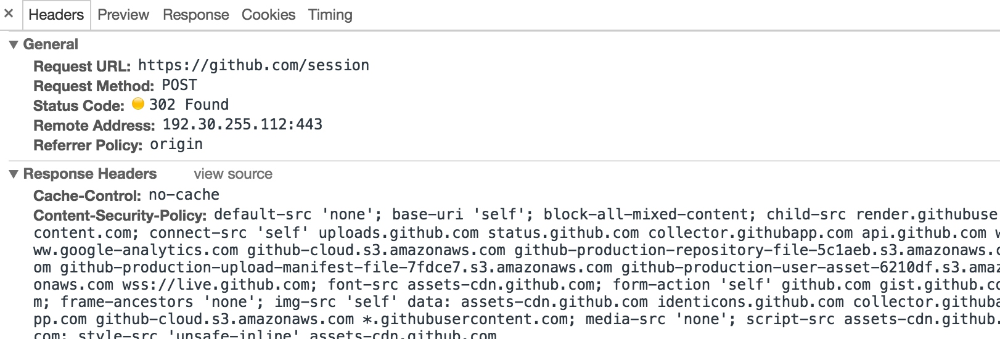

# 10.1 模拟登录并爬取 GitHub

我们先以一个最简单的实例来了解模拟登录后页面的抓取过程，其原理在于模拟登录后 Cookies 的维护。

### 1. 本节目标

本节将讲解以 GitHub 为例来实现模拟登录的过程，同时爬取登录后才可以访问的页面信息，如好友动态、个人信息等内容。

我们应该都听说过 GitHub，如果在我们在 Github 上关注了某些人，在登录之后就会看到他们最近的动态信息，比如他们最近收藏了哪个 Repository，创建了哪个组织，推送了哪些代码。但是退出登录之后，我们就无法再看到这些信息。

如果希望爬取 GitHub 上所关注人的最近动态，我们就需要模拟登录 GitHub。

### 2. 环境准备

请确保已经安装好了 requests 和 lxml 库，如没有安装可以参考第 1 章的安装说明。

### 3. 分析登录过程

首先要分析登录的过程，需要探究后台的登录请求是怎样发送的，登录之后又有怎样的处理过程。

如果已经登录 GitHub，先退出登录，同时清除 Cookies。

打开 GitHub 的登录页面，链接为 https://github.com/login，输入 GitHub 的用户名和密码，打开开发者工具，将 Preserve Log 选项勾选上，这表示显示持续日志，如图 10-1 所示。


图 10-1 开发者工具设置

点击登录按钮，这时便会看到开发者工具下方显示了各个请求过程，如图 10-2 所示。


图 10-2 请求过程

点击第一个请求，进入其详情页面，如图 10-3 所示。



图 10-3 详情页面

可以看到请求的 URL 为 https://github.com/session，请求方式为 POST。再往下看，我们观察到它的 Form Data 和 Headers 这两部分内容，如图 10-4 所示。


图 10-4 详情页面

Headers 里面包含了 Cookies、Host、Origin、Referer、User-Agent 等信息。Form Data 包含了 5 个字段，commit 是固定的字符串 Sign in，utf8 是一个勾选字符，authenticity_token 较长，其初步判断是一个 Base64 加密的字符串，login 是登录的用户名，password 是登录的密码。

综上所述，我们现在无法直接构造的内容有 Cookies 和 authenticity_token。下面我们再来探寻一下这两部分内容如何获取。

在登录之前我们会访问到一个登录页面，此页面是通过 GET 形式访问的。输入用户名密码，点击登录按钮，浏览器发送这两部分信息，也就是说 Cookies 和 authenticity_token 一定是在访问登录页的时候设置的。

这时再退出登录，回到登录页，同时清空 Cookies，重新访问登录页，截获发生的请求，如图 10-5 所示。


图 10-5 截获请求

访问登录页面的请求如图所示，Response Headers 有一个 Set-Cookie 字段。这就是设置 Cookies 的过程。

另外，我们发现 Response Headers 没有和 authenticity_token 相关的信息，所以可能 authenticity_token 还隐藏在其他的地方或者是计算出来的。我们再从网页的源码探寻，搜索相关字段，发现源代码里面隐藏着此信息，它是一个隐藏式表单元素，如图 10-6 所示。


图 10-6 表单元素

现在我们已经获取到所有信息，接下来实现模拟登录。

### 4. 代码实战

首先我们定义一个 Login 类，初始化一些变量：

```python
class Login(object):
    def __init__(self):
        self.headers = {
            'Referer': 'https://github.com/',
            'User-Agent': 'Mozilla/5.0 (Windows NT 10.0; WOW64) AppleWebKit/537.36 (KHTML, like Gecko) Chrome/57.0.2987.133 Safari/537.36',
            'Host': 'github.com'
        }
        self.login_url = 'https://github.com/login'
        self.post_url = 'https://github.com/session'
        self.logined_url = 'https://github.com/settings/profile'
        self.session = requests.Session()
```

这里最重要的一个变量就是 requests 库的 Session，它可以帮助我们维持一个会话，而且可以自动处理 Cookies，我们不用再去担心 Cookies 的问题。

接下来，访问登录页面要完成两件事：一是通过此页面获取初始的 Cookies，二是提取出 authenticity_token。

在这里我们实现一个 token() 方法，如下所示：

```python
from lxml import etree

def token(self):
    response = self.session.get(self.login_url, headers=self.headers)
    selector = etree.HTML(response.text)
    token = selector.xpath('//div/input[2]/@value')[0]
    return token
```

我们用 Session 对象的 get() 方法访问 GitHub 的登录页面，然后用 XPath 解析出登录所需的 authenticity_token 信息并返回。

现在已经获取初始的 Cookies 和 authenticity_token，开始模拟登录，实现一个 login() 方法，如下所示：

```python
def login(self, email, password):
    post_data = {
        'commit': 'Sign in',
        'utf8': '✓',
        'authenticity_token': self.token(),
        'login': email,
        'password': password
    }

    response = self.session.post(self.post_url, data=post_data, headers=self.headers)
    if response.status_code == 200:
        self.dynamics(response.text)
    
    response = self.session.get(self.logined_url, headers=self.headers)
    if response.status_code == 200:
        self.profile(response.text)
```

首先构造一个表单，复制各个字段，其中 email 和 password 是以变量的形式传递。然后再用 Session 对象的 post() 方法模拟登录即可。由于 requests 自动处理了重定向信息，我们登录成功后就可以直接跳转到首页，首页会显示所关注人的动态信息，得到响应之后我们用 dynamics() 方法来对其进行处理。接下来再用 Session 对象请求个人详情页，然后用 profile() 方法来处理个人详情页信息。

其中，dynamics() 方法和 profile() 方法的实现如下所示：

```python
def dynamics(self, html):
    selector = etree.HTML(html)
    dynamics = selector.xpath('//div[contains(@class, "news")]//div[contains(@class, "alert")]')
    for item in dynamics:
        dynamic = ' '.join(item.xpath('.//div[@class="title"]//text()')).strip()
        print(dynamic)

def profile(self, html):
    selector = etree.HTML(html)
    name = selector.xpath('//input[@id="user_profile_name"]/@value')[0]
    email = selector.xpath('//select[@id="user_profile_email"]/option[@value!=""]/text()')
    print(name, email)
```

在这里，我们仍然使用 XPath 对信息进行提取。在 dynamics() 方法里，我们提取了所有的动态信息，然后将其遍历输出。在 prifile() 方法里，我们提取了个人的昵称和绑定的邮箱，然后将其输出。

这样，整个类的编写就完成了。

### 5. 运行

我们新建一个 Login 对象，然后运行程序，如下所示：

```python

if __name__ == "__main__":
    login = Login()
    login.login(email='cqc@cuiqingcai.com', password='password')

```

在 login() 方法传入用户名和密码，实现模拟登录。

可以看到控制台有类似如下输出：

```python
GrahamCampbell  starred  nunomaduro/zero-framework
GrahamCampbell  starred  nunomaduro/laravel-zero
happyAnger6  created repository  happyAnger6/nodejs_chatroom
viosey  starred  nitely/Spirit
lbgws2  starred  Germey/TaobaoMM
EasyChris  starred  ageitgey/face_recognition
callmewhy  starred  macmade/GitHubUpdates
sindresorhus  starred  sholladay/squatter
SamyPesse  starred  graphcool/chromeless
wbotelhos  starred  tkadlec/grunt-perfbudget
wbotelhos  created repository  wbotelhos/eggy
leohxj  starred  MacGesture/MacGesture
GrahamCampbell  starred  GrahamCampbell/Analyzer
EasyChris  starred  golang/go
mitulgolakiya  starred  veltman/flubber
liaoyuming  pushed to  student  at  Germey/SecurityCourse
leohxj  starred  jasonslyvia/a-cartoon-intro-to-redux-cn
ruanyf  starred  ericchiang/pup
ruanyf  starred  bpesquet/thejsway
louwailou  forked  Germey/ScrapyTutorial  to  louwailou/ScrapyTutorial
Lving  forked  shadowsocksr-backup/shadowsocksr  to  Lving/shadowsocksr
qifuren1985  starred  Germey/ADSLProxyPool
QWp6t  starred  laravel/framework
Germey ['1016903103@qq.com', 'cqc@cuiqingcai.com']
```

可以发现，我们成功获取到关注的人的动态信息和个人的昵称及绑定邮箱。模拟登录成功！

### 6. 本节代码

本节代码地址：[https://github.com/Python3WebSpider/GithubLogin](https://github.com/Python3WebSpider/GithubLogin)。

### 7. 结语

我们利用 requests 的 Session 实现了模拟登录操作，其中最重要的还是分析思路，只要各个参数都成功获取，那么模拟登录是没有问题的。

登录成功，这就相当于建立了一个 Session 会话，Session 对象维护着 Cookies 的信息，直接请求就会得到模拟登录成功后的页面。