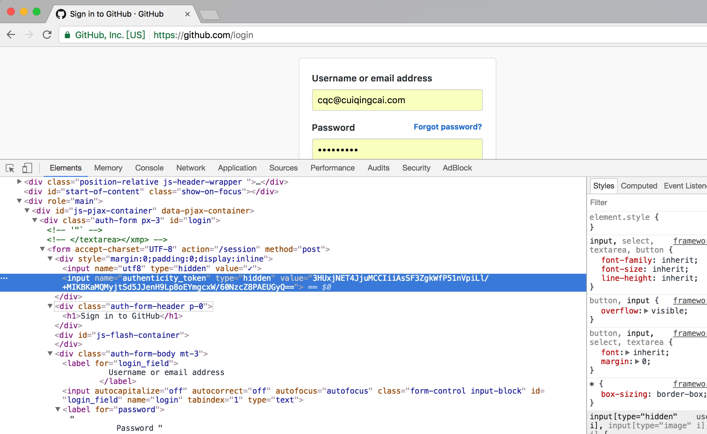

# 10.1 模拟登录并爬取GitHub

本节我们先以一个最简单的实例来了解一下模拟登录后页面的抓取过程，其核心的原理在于模拟登录后 Cookies 的维护。

### 1. 本节目标

本节我们以 GitHub 为例来实现一下模拟登录的过程，同时爬取登录后才可以访问的页面信息，如好友动态、个人信息等内容。

我们应该都知道听说过 GitHub，如果在我们在 Github 上关注了某些人的话，在登录之后就会显示他们最近的动态信息，比如他们最近 Star 了哪个 Repository，Create 了哪个 Organization，Push 了哪些 Code。但是如果退出登录之后，我们就无法再看到这些信息，因为毕竟我们关注了哪些人是需要登录之后才可以知道的。

所以如果我们想用爬取自己关注的人最近有什么动态的话，就需要来模拟登录 GitHub 了，接下来我们就来实现一下如何模拟登录并获取关注的人的动态信息和自己的相关信息。

### 2. 环境准备

在本节开始之前请确保已经安装好了 Requests 和 LXML 库，如没有安装可以参考第一章的安装说明。

### 3. 分析登录过程

要想模拟登录，首先需要分析登录的过程，我们需要探究后台的登录请求是怎样发送的，登录之后又有怎样的处理过程。

所以接下来我们首先打开浏览器，如果已经登录了 GitHub先退出登录，同时清除一下 Cookies，让我们从登录页面开始一步步探究模拟登录的过程究竟发生了什么。

首先打开 GitHub 的登录页面，链接为：[https://github.com/login](https://github.com/login)，输入 GitHub 的用户名密码，打开开发者工具，将 Preserve Log 选项勾选上，也就是显示持续日志，如图 10-1 所示：


图 10-1 开发者工具设置

点击登录按钮，这时便会看到在开发者工具下方显示了各个请求过程，如图 10-2 所示：


图 10-2 请求过程

这时我们需要观察点击登录按钮之后发生的第一个请求是怎样的，点击第一个请求进入其详情页面，如图 10-3 所示：


图 10-3 详情页面

可以看到请求的的URL为：[https://github.com/session](https://github.com/session)，请求方式为 POST，那么 POST 请求下一步我们就需要观察它的 Form Data 和 Headers，我们进一步再查看一下这两部分内容，如图 10-4 所示：


图 10-4 详情页面

可以看到 Headers 里面包含了 Cookies、Host、Origin、Referer、User-Agent 等信息，同时 Form Data 包含了五个字段，commit 是固定的字符串 Sign in，utf8 是一个勾选字符，authenticity_token 较长，初步判断是一个 Base64 加密的字符串，login 是登录的用户名，password就是登录的密码。

所以综上所述，如果要做模拟登录，我们现在无法直接构造的内容有两个，一个是 Cookies，另一个是authenticity_token，下面我们再来探寻一下这两部分内容是怎样获取的。

在登录之前我们会首先访问到一个登录页面，此页面是 GET 形式访问的，输入用户名密码之后我们就点击了登录按钮，浏览器就已经可以发送这两部分信息了，也就是说Cookies 和 authenticity_toke n一定是在访问登录页的时候设置的。

这时我们再退出登录，回到登录页，同时清空一下 Cookies，重新访问登录页，截获一下发生的请求，如图 10-5 所示：


图 10-5 截获请求

这时访问登录页面的请求如图所示，发现其 Response Headers 有一个 Set-Cookie字段，那么这就是设置 Cookies 的过程，这样登录时使用的 Cookies 就可以成功获取到了。

另外我们发现 Response Headers 没有和 authenticity_token 相关的信息，所以可能 authenticity_token 还隐藏在其他的地方或者是计算出来的。我们再从网页的源码里面探寻一下这个信息，搜索一下相关字段，发现在源代码里面隐藏着此信息，它是一个隐藏式表单元素，如图 10-6 所示：



图 10-6 表单元素

所以我们要获取 authenticity_token 就直接从源码里获取即可。

那现在我们就已经把所有信息获取到了，接下来实现模拟登录就可以了。

### 4. 代码实战

首先我们定义一个 Login 类，初始化一些变量：

```python
class Login(object):
    def __init__(self):
        self.headers = {
            'Referer': 'https://github.com/',
            'User-Agent': 'Mozilla/5.0 (Windows NT 10.0; WOW64) AppleWebKit/537.36 (KHTML, like Gecko) Chrome/57.0.2987.133 Safari/537.36',
            'Host': 'github.com'
        }
        self.login_url = 'https://github.com/login'
        self.post_url = 'https://github.com/session'
        self.logined_url = 'https://github.com/settings/profile'
        self.session = requests.Session()
```

在这里最重要的一个变量就是 Requests 库里面的 Session，它可以帮助我们维持一个会话，而且可以自动处理 Cookies，我们不用再去担心 Cookies 的问题。

接下来我们需要先访问登录页面，要完成两件事，一是通过此页面获取初始的 Cookies，二是提取出 authenticity_token。

所以在这里我们实现一个 token() 方法，如下：

```python
from lxml import etree

def token(self):
    response = self.session.get(self.login_url, headers=self.headers)
    selector = etree.HTML(response.text)
    token = selector.xpath('//div/input[2]/@value')[0]
    return token
```

在这里我们用 Session 对象的 get() 方法访问 GitHub 的登录页面，然后用 XPath 解析出来了登录所需的 authenticity_token 信息并返回。

现在我们已经获取了初始的Cookies，同时获取到了authenticity_token，开始模拟登录就好了，实现一个login()方法如下：

```python
def login(self, email, password):
    post_data = {
        'commit': 'Sign in',
        'utf8': '✓',
        'authenticity_token': self.token(),
        'login': email,
        'password': password
    }

    response = self.session.post(self.post_url, data=post_data, headers=self.headers)
    if response.status_code == 200:
        self.dynamics(response.text)
    
    response = self.session.get(self.logined_url, headers=self.headers)
    if response.status_code == 200:
        self.profile(response.text)
```

在这里我们首先构造一个表单，将各个字段复制，其中 email 和 password 是变量的形式传递进来，接下来再用 Session 对象的 post() 方法模拟登录即可，由于 Requests 自动帮我们处理了重定向信息，所以登录成功后我们就可以直接跳转到首页了，首页会显示自己关注的人的动态信息，得到 Response 之后我们用 dynamics() 方法来处理，另外我们接下来再次用 Session 对象请求了一次个人详情页，然后用 profile() 方法来处理个人详情页信息。

其中 dynamics() 方法和 profile() 方法的实现如下：

```python
def dynamics(self, html):
    selector = etree.HTML(html)
    dynamics = selector.xpath('//div[contains(@class, "news")]//div[contains(@class, "alert")]')
    for item in dynamics:
        dynamic = ' '.join(item.xpath('.//div[@class="title"]//text()')).strip()
        print(dynamic)

def profile(self, html):
    selector = etree.HTML(html)
    name = selector.xpath('//input[@id="user_profile_name"]/@value')[0]
    email = selector.xpath('//select[@id="user_profile_email"]/option[@value!=""]/text()')
    print(name, email)
```

在这里我们仍然是使用 XPath 对信息进行提取，在 dynamics() 方法里我们提取了所有的动态信息，然后将其遍历输出。prifile() 方法里我们提取了个人的昵称和绑定的邮箱，然后将其输出。

这样整个类的编写就完成了。

### 5. 运行

我们新建一个 Login 对象，然后运行一下程序：

```python

if __name__ == "__main__":
    login = Login()
    login.login(email='cqc@cuiqingcai.com', password='password')

```

在 login() 方法传入用户名和密码，实现模拟登录。

可以看到控制台有类似如下输出：

```python
GrahamCampbell  starred  nunomaduro/zero-framework
GrahamCampbell  starred  nunomaduro/laravel-zero
happyAnger6  created repository  happyAnger6/nodejs_chatroom
viosey  starred  nitely/Spirit
lbgws2  starred  Germey/TaobaoMM
EasyChris  starred  ageitgey/face_recognition
callmewhy  starred  macmade/GitHubUpdates
sindresorhus  starred  sholladay/squatter
SamyPesse  starred  graphcool/chromeless
wbotelhos  starred  tkadlec/grunt-perfbudget
wbotelhos  created repository  wbotelhos/eggy
leohxj  starred  MacGesture/MacGesture
GrahamCampbell  starred  GrahamCampbell/Analyzer
EasyChris  starred  golang/go
mitulgolakiya  starred  veltman/flubber
liaoyuming  pushed to  student  at  Germey/SecurityCourse
leohxj  starred  jasonslyvia/a-cartoon-intro-to-redux-cn
ruanyf  starred  ericchiang/pup
ruanyf  starred  bpesquet/thejsway
louwailou  forked  Germey/ScrapyTutorial  to  louwailou/ScrapyTutorial
Lving  forked  shadowsocksr-backup/shadowsocksr  to  Lving/shadowsocksr
qifuren1985  starred  Germey/ADSLProxyPool
QWp6t  starred  laravel/framework
Germey ['1016903103@qq.com', 'cqc@cuiqingcai.com']
```

可以发现我们成功获取到了关注的人的动态信息和个人的昵称及绑定邮箱，模拟登录成功！

### 6. 本节代码

本节代码地址：[https://github.com/Python3WebSpider/GithubLogin](https://github.com/Python3WebSpider/GithubLogin)。

### 7. 结语

以上我们便利用 Requests 的 Session 实现了模拟登录操作，最主要的其实还是分析的思路，只要各个参数都成功获取，那么模拟登录是没有问题的。

登录之后我们就相当于建立了一个 Session 会话，Session 对象会维护着 Cookies 的信息，后面我们直接请求就会得到模拟登录成功后的页面。

以上便是模拟登录的思路分析和相关实现过程。
