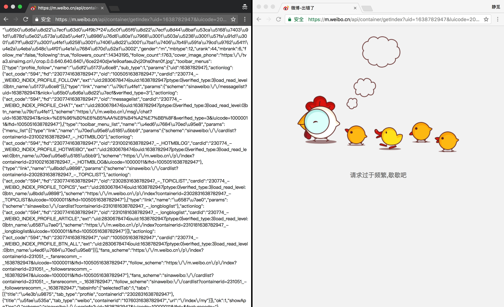
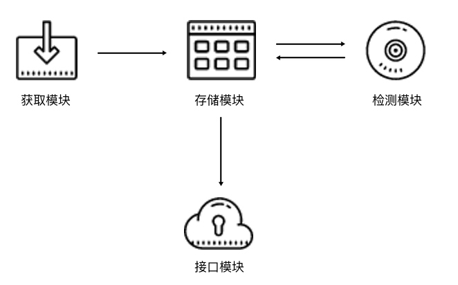

# 10.2 Cookies 池的搭建

很多时候，在爬取没有登录的情况下，我们也可以访问一部分页面或请求一些接口，因为毕竟网站本身需要做 SEO，不会对所有页面都设置登录限制。

但是，不登录直接爬取会有一些弊端，弊端主要有以下两点。

* 设置了登录限制的页面无法爬取。如某论坛设置了登录才可查看资源，某博客设置了登录才可查看全文等，这些页面都需要登录账号才可以查看和爬取。

* 一些页面和接口虽然可以直接请求，但是请求一旦频繁，访问就容易被限制或者 IP 直接被封，但是登录之后就不会出现这样的问题，因此登录之后被反爬的可能性更低。

下面我们就第二种情况做一个简单的实验。以微博为例，我们先找到一个 Ajax 接口，例如新浪财经官方微博的信息接口 https://m.weibo.cn/api/container/getIndex?uid=1638782947&amp;luicode=20000174  
&amp;type=uid&amp;value=1638782947&amp;containerid=1005051638782947，如果用浏览器直接访问，返回的数据是 JSON 格式，如图 10-7 所示，其中包含了新浪财经官方微博的一些信息，直接解析 JSON 即可提取信息。


图 10-7 返回数据

但是，这个接口在没有登录的情况下会有请求频率检测。如果一段时间内访问太过频繁，比如打开这个链接，一直不断刷新，则会看到请求频率过高的提示，如图 10-8 所示。


图 10-8 提示页面

如果重新打开一个浏览器窗口，打开 https://passport.weibo.cn/signin/login?entry=mweibo&amp;r=  
https://m.weibo.cn/，登录微博账号之后重新打开此链接，则页面正常显示接口的结果，而未登录的页面仍然显示请求过于频繁，如图 10-9 所示。



图 10-9 对比页面

图中左侧是登录了账号之后请求接口的结果，右侧是未登录账号请求接口的结果，二者的接口链接是完全一样的。未登录状态无法正常访问，而登录状态可以正常显示。

因此，登录账号可以降低被封禁的概率。

我们可以尝试登录之后再做爬取，被封禁的几率会小很多，但是也不能完全排除被封禁的风险。如果一直用同一个账号频繁请求，那就有可能遇到请求过于频繁而封号的问题。

如果需要做大规模抓取，我们就需要拥有很多账号，每次请求随机选取一个账号，这样就降低了单个账号的访问频率，被封的概率又会大大降低。

那么如何维护多个账号的登录信息呢？这时就需要用到 Cookies 池了。接下来我们看看 Cookies 池的构建方法。

### 1. 本节目标

我们以新浪微博为例来实现一个 Cookies 池的搭建过程。Cookies 池中保存了许多新浪微博账号和登录后的 Cookies 信息，并且 Cookies 池还需要定时检测每个 Cookies 的有效性，如果某 Cookies 无效，那就删除该 Cookies 并模拟登录生成新的 Cookies。同时 Cookies 池还需要一个非常重要的接口，即获取随机 Cookies 的接口，Cookies 运行后，我们只需请求该接口，即可随机获得一个 Cookies 并用其爬取。

由此可见，Cookies 池需要有自动生成 Cookies、定时检测 Cookies、提供随机 Cookies 等几大核心功能。

### 2. 准备工作

搭建之前肯定需要一些微博的账号。需要安装好 Redis 数据库并使其正常运行。需要安装 Python 的 redis-py、requests、Selelnium 和 Flask 库。另外，还需要安装 Chrome 浏览器并配置好 ChromeDriver，其流程可以参考第一章的安装说明。

### 3. Cookies 池架构

Cookies 的架构和代理池类似，同样是 4 个核心模块，如图 10-10 所示。



图 10-10 Cookies 池架构

Cookies 池架构的基本模块分为 4 块：存储模块、生成模块、检测模块和接口模块。每个模块的功能如下。

- 存储模块负责存储每个账号的用户名密码以及每个账号对应的 Cookies 信息，同时还需要提供一些方法来实现方便的存取操作。

- 生成模块负责生成新的 Cookies。此模块会从存储模块逐个拿取账号的用户名和密码，然后模拟登录目标页面，判断登录成功，就将 Cookies 返回并交给存储模块存储。

- 检测模块需要定时检测数据库中的 Cookies。在这里我们需要设置一个检测链接，不同的站点检测链接不同，检测模块会逐个拿取账号对应的 Cookies 去请求链接，如果返回的状态是有效的，那么此 Cookies 没有失效，否则 Cookies 失效并移除。接下来等待生成模块重新生成即可。

- 接口模块需要用 API 来提供对外服务的接口。由于可用的 Cookies 可能有多个，我们可以随机返回 Cookies 的接口，这样保证每个 Cookies 都有可能被取到。Cookies 越多，每个 Cookies 被取到的概率就会越小，从而减少被封号的风险。

以上设计 Cookies 池的基本思路和前面讲的代理池有相似之处。接下来我们设计整体的架构，然后用代码实现该 Cookies 池。

### 4. Cookies 池的实现

首先分别了解各个模块的实现过程。

#### 存储模块

其实，需要存储的内容无非就是账号信息和 Cookies 信息。账号由用户名和密码两部分组成，我们可以存成用户名和密码的映射。Cookies 可以存成 JSON 字符串，但是我们后面得需要根据账号来生成 Cookies。生成的时候我们需要知道哪些账号已经生成了 Cookies，哪些没有生成，所以需要同时保存该 Cookies 对应的用户名信息，其实也是用户名和 Cookies 的映射。这里就是两组映射，我们自然而然想到 Redis 的 Hash，于是就建立两个 Hash，结构分别如图 10-11 和图 10-12 所示。


图 10-11 用户名密码 Hash 结构


图 10-12 用户名 Cookies Hash 结构

Hash 的 Key 就是账号，Value 对应着密码或者 Cookies。另外需要注意，由于 Cookies 池需要做到可扩展，存储的账号和 Cookies 不一定单单只有本例中的微博，其他站点同样可以对接此 Cookies 池，所以这里 Hash 的名称可以做二级分类，例如存账号的 Hash 名称可以为 accounts:weibo，Cookies 的 Hash 名称可以为 cookies:weibo。如要扩展知乎的 Cookies 池，我们就可以使用 accounts:zhihu 和 cookies:zhihu，这样比较方便。

好，接下来我们就创建一个存储模块类，用以提供一些 Hash 的基本操作，代码如下：

```python
import random
import redis

class RedisClient(object):
    def __init__(self, type, website, host=REDIS_HOST, port=REDIS_PORT, password=REDIS_PASSWORD):
        """
        初始化 Redis 连接
        :param host: 地址
        :param port: 端口
        :param password: 密码
        """
        self.db = redis.StrictRedis(host=host, port=port, password=password, decode_responses=True)
        self.type = type
        self.website = website

    def name(self):
        """
        获取 Hash 的名称
        :return: Hash 名称
        """return"{type}:{website}".format(type=self.type, website=self.website)

    def set(self, username, value):
        """
        设置键值对
        :param username: 用户名
        :param value: 密码或 Cookies
        :return:
        """
        return self.db.hset(self.name(), username, value)

    def get(self, username):
        """
        根据键名获取键值
        :param username: 用户名
        :return:
        """
        return self.db.hget(self.name(), username)

    def delete(self, username):
        """
        根据键名删除键值对
        :param username: 用户名
        :return: 删除结果
        """
        return self.db.hdel(self.name(), username)

    def count(self):
        """
        获取数目
        :return: 数目
        """
        return self.db.hlen(self.name())

    def random(self):
        """
        随机得到键值，用于随机 Cookies 获取
        :return: 随机 Cookies
        """
        return random.choice(self.db.hvals(self.name()))

    def usernames(self):
        """
        获取所有账户信息
        :return: 所有用户名
        """
        return self.db.hkeys(self.name())

    def all(self):
        """
        获取所有键值对
        :return: 用户名和密码或 Cookies 的映射表
        """return self.db.hgetall(self.name())```

这里我们新建了一个 RedisClient 类，初始化__init__() 方法有两个关键参数 type 和 website，分别代表类型和站点名称，它们就是用来拼接 Hash 名称的两个字段。如果这是存储账户的 Hash，那么此处的 type 为 accounts、website 为 weibo，如果是存储 Cookies 的 Hash，那么此处的 type 为 cookies、website 为 weibo。

接下来还有几个字段代表了 Redis 的连接信息，初始化时获得这些信息后初始化 StrictRedis 对象，建立 Redis 连接。

name() 方法拼接了 type 和 website，组成 Hash 的名称。set()、get()、delete() 方法分别代表设置、获取、删除 Hash 的某一个键值对，count() 获取 Hash 的长度。

比较重要的方法是 random()，它主要用于从 Hash 里随机选取一个 Cookies 并返回。每调用一次 random() 方法，就会获得随机的 Cookies，此方法与接口模块对接即可实现请求接口获取随机 Cookies。

#### 生成模块

生成模块负责获取各个账号信息并模拟登录，随后生成 Cookies 并保存。我们首先获取两个 Hash 的信息，看看账户的 Hash 比 Cookies 的 Hash 多了哪些还没有生成 Cookies 的账号，然后将剩余的账号遍历，再去生成 Cookies 即可。

这里主要逻辑就是找出那些还没有对应 Cookies 的账号，然后再逐个获取 Cookies，代码如下：

```python
for username in accounts_usernames:
    if not username in cookies_usernames:
        password = self.accounts_db.get(username)
        print(' 正在生成 Cookies', ' 账号 ', username, ' 密码 ', password)
        result = self.new_cookies(username, password)
```
因为我们对接的是新浪微博，前面我们已经破解了新浪微博的四宫格验证码，在这里我们直接对接过来即可，不过现在需要加一个获取 Cookies 的方法，并针对不同的情况返回不同的结果，逻辑如下所示：
```python
def get_cookies(self):
    return self.browser.get_cookies()

def main(self):
    self.open()
    if self.password_error():
        return {
            'status': 2,
            'content': ' 用户名或密码错误 '
        }
    # 如果不需要验证码直接登录成功
    if self.login_successfully():
        cookies = self.get_cookies()
        return {
            'status': 1,
            'content': cookies
        }
    # 获取验证码图片
    image = self.get_image('captcha.png')
    numbers = self.detect_image(image)
    self.move(numbers)
    if self.login_successfully():
        cookies = self.get_cookies()
        return {
            'status': 1,
            'content': cookies
        }
    else:
        return {
            'status': 3,
            'content': ' 登录失败 '
        }
```
这里返回结果的类型是字典，并且附有状态码 status，在生成模块里我们可以根据不同的状态码做不同的处理。例如状态码为 1 的情况，表示成功获取 Cookies，我们只需要将 Cookies 保存到数据库即可。如状态码为 2 的情况，代表用户名或密码错误，那么我们就应该把当前数据库中存储的账号信息删除。如状态码为 3 的情况，则代表登录失败的一些错误，此时不能判断是否用户名或密码错误，也不能成功获取 Cookies，那么简单提示再进行下一个处理即可，类似代码实现如下所示：
```python
result = self.new_cookies(username, password)
# 成功获取
if result.get('status') == 1:
    cookies = self.process_cookies(result.get('content'))
    print(' 成功获取到 Cookies', cookies)
    if self.cookies_db.set(username, json.dumps(cookies)):
        print(' 成功保存 Cookies')
# 密码错误，移除账号
elif result.get('status') == 2:
    print(result.get('content'))
    if self.accounts_db.delete(username):
        print(' 成功删除账号 ')
else:
    print(result.get('content'))
```

如果要扩展其他站点，只需要实现 new_cookies() 方法即可，然后按此处理规则返回对应的模拟登录结果，比如 1 代表获取成功，2 代表用户名或密码错误。

代码运行之后就会遍历一次尚未生成 Cookies 的账号，模拟登录生成新的 Cookies。

#### 检测模块

我们现在可以用生成模块来生成 Cookies，但还是免不了 Cookies 失效的问题，例如时间太长导致 Cookies 失效，或者 Cookies 使用太频繁导致无法正常请求网页。如果遇到这样的 Cookies，我们肯定不能让它继续保存在数据库里。

所以我们还需要增加一个定时检测模块，它负责遍历池中的所有 Cookies，同时设置好对应的检测链接，我们用一个个 Cookies 去请求这个链接。如果请求成功，或者状态码合法，那么该 Cookies 有效；如果请求失败，或者无法获取正常的数据，比如直接跳回登录页面或者跳到验证页面，那么此 Cookies 无效，我们需要将该 Cookies 从数据库中移除。

此 Cookies 移除之后，刚才所说的生成模块就会检测到 Cookies 的 Hash 和账号的 Hash 相比少了此账号的 Cookies，生成模块就会认为这个账号还没生成 Cookies，那么就会用此账号重新登录，此账号的 Cookies 又被重新更新。

检测模块需要做的就是检测 Cookies 失效，然后将其从数据中移除。

为了实现通用可扩展性，我们首先定义一个检测器的父类，声明一些通用组件，实现如下所示：

```python
class ValidTester(object):
    def __init__(self, website='default'):
        self.website = website
        self.cookies_db = RedisClient('cookies', self.website)
        self.accounts_db = RedisClient('accounts', self.website)
    
    def test(self, username, cookies):
        raise NotImplementedError
    
    def run(self):
        cookies_groups = self.cookies_db.all()
        for username, cookies in cookies_groups.items():
            self.test(username, cookies)
```
在这里定义了一个父类叫作 ValidTester，在__init__() 方法里指定好站点的名称 website，另外建立两个存储模块连接对象 cookies_db 和 accounts_db，分别负责操作 Cookies 和账号的 Hash，run() 方法是入口，在这里是遍历了所有的 Cookies，然后调用 test() 方法进行测试，在这里 test() 方法是没有实现的，也就是说我们需要写一个子类来重写这个 test() 方法，每个子类负责各自不同网站的检测，如检测微博的就可以定义为 WeiboValidTester，实现其独有的 test() 方法来检测微博的 Cookies 是否合法，然后做相应的处理，所以在这里我们还需要再加一个子类来继承这个 ValidTester，重写其 test() 方法，实现如下：
```python
import json
import requests
from requests.exceptions import ConnectionError

class WeiboValidTester(ValidTester):
    def __init__(self, website='weibo'):
        ValidTester.__init__(self, website)
    
    def test(self, username, cookies):
        print(' 正在测试 Cookies', ' 用户名 ', username)
        try:
            cookies = json.loads(cookies)
        except TypeError:
            print('Cookies 不合法 ', username)
            self.cookies_db.delete(username)
            print(' 删除 Cookies', username)
            return
        try:
            test_url = TEST_URL_MAP[self.website]
            response = requests.get(test_url, cookies=cookies, timeout=5, allow_redirects=False)
            if response.status_code == 200:
                print('Cookies 有效 ', username)
                print(' 部分测试结果 ', response.text[0:50])
            else:
                print(response.status_code, response.headers)
                print('Cookies 失效 ', username)
                self.cookies_db.delete(username)
                print(' 删除 Cookies', username)
        except ConnectionError as e:
            print(' 发生异常 ', e.args)
```
test() 方法首先将 Cookies 转化为字典，检测 Cookies 的格式，如果格式不正确，直接将其删除，如果格式没问题，那么就拿此 Cookies 请求被检测的 URL。test() 方法在这里检测微博，检测的 URL 可以是某个 Ajax 接口，为了实现可配置化，我们将测试 URL 也定义成字典，如下所示：
```python
TEST_URL_MAP = {'weibo': 'https://m.weibo.cn/'}
```

如果要扩展其他站点，我们可以统一在字典里添加。对微博来说，我们用 Cookies 去请求目标站点，同时禁止重定向和设置超时时间，得到响应之后检测其返回状态码。如果直接返回 200 状态码，则 Cookies 有效，否则可能遇到了 302 跳转等情况，一般会跳转到登录页面，则 Cookies 已失效。如果 Cookies 失效，我们将其从 Cookies 的 Hash 里移除即可。

#### 接口模块

生成模块和检测模块如果定时运行就可以完成 Cookies 实时检测和更新。但是 Cookies 最终还是需要给爬虫来用，同时一个 Cookies 池可供多个爬虫使用，所以我们还需要定义一个 Web 接口，爬虫访问此接口便可以取到随机的 Cookies。我们采用 Flask 来实现接口的搭建，代码如下所示：

```python
import json
from flask import Flask, g
app = Flask(__name__)
# 生成模块的配置字典
GENERATOR_MAP = {'weibo': 'WeiboCookiesGenerator'}
@app.route('/')
def index():
    return '<h2>Welcome to Cookie Pool System</h2>'

def get_conn():
    for website in GENERATOR_MAP:
        if not hasattr(g, website):
            setattr(g, website + '_cookies', eval('RedisClient' + '("cookies", "' + website + '")'))
    return g

@app.route('/<website>/random')
def random(website):
    """
    获取随机的 Cookie, 访问地址如 /weibo/random
    :return: 随机 Cookie
    """
    g = get_conn()
    cookies = getattr(g, website + '_cookies').random()
    return cookies
```

我们同样需要实现通用的配置来对接不同的站点，所以接口链接的第一个字段定义为站点名称，第二个字段定义为获取的方法，例如，/weibo/random 是获取微博的随机 Cookies，/zhihu/random 是获取知乎的随机 Cookies。

#### 调度模块

最后，我们再加一个调度模块让这几个模块配合运行起来，主要的工作就是驱动几个模块定时运行，同时各个模块需要在不同进程上运行，实现如下所示：

```python
import time
from multiprocessing import Process
from cookiespool.api import app
from cookiespool.config import *
from cookiespool.generator import *
from cookiespool.tester import *

class Scheduler(object):
    @staticmethod
    def valid_cookie(cycle=CYCLE):
        while True:
            print('Cookies 检测进程开始运行 ')
            try:
                for website, cls in TESTER_MAP.items():
                    tester = eval(cls + '(website="' + website + '")')
                    tester.run()
                    print('Cookies 检测完成 ')
                    del tester
                    time.sleep(cycle)
            except Exception as e:
                print(e.args)
    
    @staticmethod
    def generate_cookie(cycle=CYCLE):
        while True:
            print('Cookies 生成进程开始运行 ')
            try:
                for website, cls in GENERATOR_MAP.items():
                    generator = eval(cls + '(website="' + website + '")')
                    generator.run()
                    print('Cookies 生成完成 ')
                    generator.close()
                    time.sleep(cycle)
            except Exception as e:
                print(e.args)
    
    @staticmethod
    def api():
        print('API 接口开始运行 ')
        app.run(host=API_HOST, port=API_PORT)
    
    def run(self):
        if API_PROCESS:
            api_process = Process(target=Scheduler.api)
            api_process.start()
        
        if GENERATOR_PROCESS:
            generate_process = Process(target=Scheduler.generate_cookie)
            generate_process.start()
        
        if VALID_PROCESS:
            valid_process = Process(target=Scheduler.valid_cookie)
            valid_process.start()
```
这里用到了两个重要的配置，即产生模块类和测试模块类的字典配置，如下所示：
```python
# 产生模块类，如扩展其他站点，请在此配置
GENERATOR_MAP = {'weibo': 'WeiboCookiesGenerator'}

# 测试模块类，如扩展其他站点，请在此配置
TESTER_MAP = {'weibo': 'WeiboValidTester'}
```
这样的配置是为了方便动态扩展使用的，键名为站点名称，键值为类名。如需要配置其他站点可以在字典中添加，如扩展知乎站点的产生模块，则可以配置成：
```python
GENERATOR_MAP = {
    'weibo': 'WeiboCookiesGenerator',
    'zhihu': 'ZhihuCookiesGenerator',
}
```

Scheduler 里将字典进行遍历，同时利用 eval() 动态新建各个类的对象，调用其入口 run() 方法运行各个模块。同时，各个模块的多进程使用了 multiprocessing 中的 Process 类，调用其 start() 方法即可启动各个进程。

另外，各个模块还设有模块开关，我们可以在配置文件中自由设置开关的开启和关闭，如下所示：

```python
# 产生模块开关
GENERATOR_PROCESS = True
# 验证模块开关
VALID_PROCESS = False
# 接口模块开关
API_PROCESS = True
```

定义为 True 即可开启该模块，定义为 False 即关闭此模块。

至此，我们的 Cookies 就全部完成了。接下来我们将模块同时开启，启动调度器，控制台类似输出如下所示：

```
API 接口开始运行
 * Running on http://0.0.0.0:5000/ (Press CTRL+C to quit)
Cookies 生成进程开始运行
Cookies 检测进程开始运行
正在生成 Cookies 账号 14747223314 密码 asdf1129
正在测试 Cookies 用户名 14747219309
Cookies 有效 14747219309
正在测试 Cookies 用户名 14740626332
Cookies 有效 14740626332
正在测试 Cookies 用户名 14740691419
Cookies 有效 14740691419
正在测试 Cookies 用户名 14740618009
Cookies 有效 14740618009
正在测试 Cookies 用户名 14740636046
Cookies 有效 14740636046
正在测试 Cookies 用户名 14747222472
Cookies 有效 14747222472
Cookies 检测完成
验证码位置 420 580 384 544
成功匹配
拖动顺序 [1, 4, 2, 3]
成功获取到 Cookies {'SUHB': '08J77UIj4w5n_T', 'SCF': 'AimcUCUVvHjswSBmTswKh0g4kNj4K7_U9k57YzxbqFt4SFBhXq3Lx4YSNO9VuBV841BMHFIaH4ipnfqZnK7W6Qs.', 'SSOLoginState': '1501439488', '_T_WM': '99b7d656220aeb9207b5db97743adc02', 'M_WEIBOCN_PARAMS': 'uicode%3D20000174', 'SUB': '_2A250elZQDeRhGeBM6VAR8ifEzTuIHXVXhXoYrDV6PUJbkdBeLXTxkW17ZoYhhJ92N_RGCjmHpfv9TB8OJQ..'}
成功保存 Cookies
```

以上所示是程序运行的控制台输出内容，我们从中可以看到各个模块都正常启动，测试模块逐个测试 Cookies，生成模块获取尚未生成 Cookies 的账号的 Cookies，各个模块并行运行，互不干扰。

我们可以访问接口获取随机的 Cookies，如图 10-13 所示。


图 10-13 接口页面

爬虫只需要请求该接口就可以实现随机 Cookies 的获取。

### 5. 本节代码

本节代码地址：[https://github.com/Python3WebSpider/CookiesPool](https://github.com/Python3WebSpider/CookiesPool)。

### 6. 结语

以上内容便是 Cookies 池的用法，后文中我们会利用该 Cookies 池和之前所讲的代理池来进行新浪微博的大规模爬取。