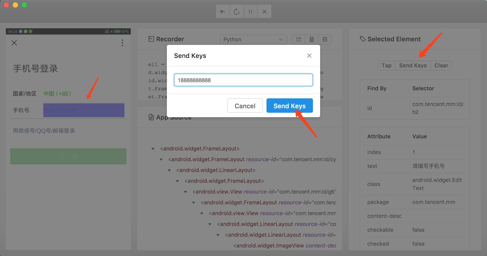

# Appium的基本使用

## 前言

Appium是一个跨平台移动端自动化测试工具，可以非常便捷地为iOS和Android平台创建自动化测试用例，然后就可以模拟APP内部的各种操作了，如点击、滑动、文本输入等等，只要我们手工操作的动作Appium都可以完成。在前面我们了解过Selenium，它是一个网页端的自动化测试工具，Appium实际上是继承了Selenium，因此Appium也是利用WebDriver来实现APP的自动化测试。对iOS设备来说，它使用UIAutomation来实现驱动，对于Android来说，它使用UiAutomator和Selendroid来实现驱动。

同时Appium也相当于一个服务器，我们可以向Appium发送一些操作指令，Appium就会根据不同的指令对移动设备进行驱动，完成不同的动作。

那么对于爬虫来说，我们用Selenium可以用来抓取JavaScript渲染的页面，可见即可爬，Appium同样如此，因此利用它来做APP爬虫不失为一个好的选择。

本节我们来了解一下Appium的基本使用方法。

## 本节目标

本节我们以Android平台的微信为例来演示一下Appium启动和操作APP的方法，主要目的是了解利用Appium来进行自动化测试的流程以及相关API的用法。

## 准备工作

在本节开始之前请确保PC上已经安装好了Appium、Android开发环境和Python版本的Appium API，安装方法可以参考第一章。另外还需要在Android手机上安装好微信APP。

## 启动APP

启动APP的方式有两种，一种是用Appium内置的驱动器来打开APP，另一种是利用Python程序实现此操作，下面我们分别进行说明。

首先我们打开Appium，启动界面如下：


我们直接点击Start Server按钮即可启动Appium的服务，相当于开启了一个Appium服务器，我们可以通过Appium内置的驱动或Python代码向Appium的服务器发送一系列操作指令，Appium就会根据不同的指令对移动设备进行驱动，完成不同的动作，启动后运行界面如下：


可以看到它正在监听4723端口，我们可以通过向此端口对应的服务接口发送一些操作指令，此页面就会显示这个过程的操作日志。

这时我们将Android手机通过数据线和运行Appium的PC相连，同时打开USB调试功能，确保PC可以连接到手机。

这时我们可以输入 adb 的命令来测试一下连接情况：

```
adb devices -l
```

如果出现类似如下结果就证明PC已经正确连接好了手机：

```
List of devices attached
2da42ac0 device usb:336592896X product:leo model:MI_NOTE_Pro device:leo
```

在这里model就是设备的名称，就是后文需要用到的deviceName变量，在这里我使用的是小米Note顶配版，所以此处名称为MI_NOTE_Pro。

如果提示找不到adb命令请检查Android开发环境和环境变量是否配置成功，如果可以成功调用adb命令但不显示设备信息请检查手机和PC的连接情况。

接下来我们首先用Appium内置的驱动器来打开APP，点击Appium中的Start New Session按钮，如图所示：


这时会出现一个配置页面，如图所示：


在这里我们需要配置启动APP时的Desired Capabilities参数，
在这里我们填入几个基本参数，分别是platformName、deviceName、appPackage、appActivity，在这里分别说明如下：
* platformName，平台名称，这里需要区分是Android还是iOS，此处填写Android。
* deviceName，设备名称，是手机的具体类型。
* appPackage，APP程序包名。
* appActivity，入口Activity名，这里通常需要以 . 开头。

在当前配置页面的左下角也有配置参数的相关说明，链接如下：[https://github.com/appium/appium/blob/master/docs/en/writing-running-appium/caps.md](https://github.com/appium/appium/blob/master/docs/en/writing-running-appium/caps.md)。

我们在Appium中加入如上的四个配置，如下：


可以点击下方的保存按钮保存下来，以后可以继续使用。

这时我们点击右下角的 Start Session 按钮即可启动Android手机上的微信APP并进入到启动页面，同时PC上会弹出一个调试窗口，可以预览当前手机页面，并可以查看页面的源码，如图所示：


这时我们可以点击左栏中屏幕的某个元素并选中，如选中登录按钮，它就会高亮显示，这时在中间栏中就显示了当前选中的按钮对应的源代码，右栏则显示了该元素的基本信息，如元素的id、class、text等，另外还显示了可以执行的操作，如Tap、Send Keys、Clear，如图所示：


这时我们可以点击中间栏最上方的第三个按钮，这时一个录制按钮，点击之后就可以开始录制一系列动作，这时我们在窗口中操作APP的行为都会被记录下来，在Recorder处可以自动生成对应语言的代码，例如这里我们点击了录制按钮，然后选中了APP中的登录按钮，然后点击Tap操作，即模拟了按钮点击功能，这时手机和窗口的APP都会跳转到登录页面，同时在中间栏会显示此动作对应的代码。如图所示：


接下来再选中需要操作的元素，如选中左侧的手机号文本框，然后点击Send Keys就会弹出对话框，输入需要填写的手机号，然后点击Send Keys即可完成文本的输入，如图所示：



按照这样的操作方式，我们可以在此页面通过点击不同的动作按钮即可完成APP的控制，同时在Recorder部分也可以生成对应的Python代码。

这就是通过Appium内置驱动器来控制APP的方法。

下面我们再来看下使用Python代码驱动APP的方法，使用代码达到同样的驱动效果，首先我们需要在代码中指定一个Appium Server，而这个Server在刚才打开Appium的时候就已经开启了，是在4723端口上运行的，配置如下：

```python
server = 'http://localhost:4723/wd/hub'
```

接下来我们需要用字典来配置Desired Capabilities参数，代码如下：

```python
desired_caps = {
    'platformName': 'Android',
    'deviceName': 'MI_NOTE_Pro',
    'appPackage': 'com.tencent.mm',
    'appActivity': '.ui.LauncherUI'
}
```

接下来就需要新建一个Session了，就类似于点击了Appium内置驱动的Start Session按钮相同的功能，我们用代码实现如下：

```python
from appium import webdriver
from selenium.webdriver.support.ui import WebDriverWait

driver = webdriver.Remote(server, desired_caps)
```

这样配置完成后运行就可以启动微信APP了，但是现在仅仅是可以启动APP，还没有做任何动作。

接着我们再用代码来模拟刚才所演示的两个动作，一个是点击登录按钮，一个是输入手机号。

这时我们可以把刚才Appium内置驱动器内的Recorder录制生成的Python代码拿过来看下，可以看到它自动生成的代码非常累赘，例如点击登录按钮的代码如下：

```python
el1 = driver.find_element_by_xpath("/hierarchy/android.widget.FrameLayout/android.widget.LinearLayout/android.widget.FrameLayout/android.view.View/android.widget.FrameLayout/android.widget.LinearLayout/android.widget.FrameLayout/android.widget.RelativeLayout/android.widget.RelativeLayout/android.widget.Button[1]")
el1.click()
```

它的XPath选择器路径太长而且选择方式没有那么科学，同时获取元素时也没有设置等待，很可能会报超时异常，所以这里我们修改一下，将其修改为通过id查找元素，另外设置延时等待，两次操作的代码改写如下：

```python
wait = WebDriverWait(driver, 30)
login = wait.until(EC.presence_of_element_located((By.ID, 'com.tencent.mm:id/cjk')))
login.click()
phone = wait.until(EC.presence_of_element_located((By.ID, 'com.tencent.mm:id/h2')))
phone.set_text('18888888888')
```

综上所属，完整的代码如下：

```python
from appium import webdriver
from selenium.webdriver.common.by import By
from selenium.webdriver.support.ui import WebDriverWait
from selenium.webdriver.support import expected_conditions as EC

server = 'http://localhost:4723/wd/hub'
desired_caps = {
    'platformName': 'Android',
    'deviceName': 'MI_NOTE_Pro',
    'appPackage': 'com.tencent.mm',
    'appActivity': '.ui.LauncherUI'
}
driver = webdriver.Remote(server, desired_caps)
wait = WebDriverWait(driver, 30)
login = wait.until(EC.presence_of_element_located((By.ID, 'com.tencent.mm:id/cjk')))
login.click()
phone = wait.until(EC.presence_of_element_located((By.ID, 'com.tencent.mm:id/h2')))
phone.set_text('18888888888')
```

这时我们重新连接一下手机，记住一定要重新连接一下手机再运行此代码，这时即可观察到手机上首先弹出了微信欢迎页面，然后模拟点击了登录按钮，接着输入了手机号，操作完成，这样我们就成功使用Python代码实现了APP的操作。

## 操作方法

接下来我们主要来看下使用代码如何操作APP，来总结一下相关API的用法，这里使用的Python库为AppiumPythonClient，其GitHub地址为：[https://github.com/appium/python-client](https://github.com/appium/python-client)，此库继承自Selenium，所以使用方法上与Selenium有很多共同之处。

### 初始化

这里初始化时需要的配置Desired Capabilities参数，完整的配置说明可以参考：[https://github.com/appium/appium/blob/master/docs/en/writing-running-appium/caps.md](https://github.com/appium/appium/blob/master/docs/en/writing-running-appium/caps.md)，一般来说我们我们配置几个基本参数即可：

```python
from appium import webdriver

server = 'http://localhost:4723/wd/hub'
desired_caps = {
    'platformName': 'Android',
    'deviceName': 'MI_NOTE_Pro',
    'appPackage': 'com.tencent.mm',
    'appActivity': '.ui.LauncherUI'
}
driver = webdriver.Remote(server, desired_caps)
```

比如这里配置了启动微信APP的Desired Capabilities，这样Appnium就会自动查找手机上的包名和入口类，然后将其启动起来，包名和入口类的名称可以查看安装包中的AndroidManifest.xml文件获取。

如果要打开的APP没有事先在手机上安装的话，我们可以直接指定app参数为安装包所在路径，这样在程序启动时就会自动向手机中安装这个APP然后启动，例如：

```python
from appium import webdriver

server = 'http://localhost:4723/wd/hub'
desired_caps = {
    'platformName': 'Android',
    'deviceName': 'MI_NOTE_Pro',
    'app': './weixin.apk'
}
driver = webdriver.Remote(server, desired_caps)
```

这样在程序启动的时候就会寻找PC当前路径下的APK安装包，然后将其安装到手机中并启动。

### 查找元素

我们可以使用Selenium中通用的查找方法来实现元素的查找，例如：

```python
el = driver.find_element_by_id('com.tencent.mm:id/cjk')
```

在Selenium中其他查找元素的方法同样适用，在此不再赘述。

在Android平台上，我们还可以使用UIAutomator来进行元素选择，例如：

```python
el = self.driver.find_element_by_android_uiautomator('new UiSelector().description("Animation")')
els = self.driver.find_elements_by_android_uiautomator('new UiSelector().clickable(true)')
```

在iOS平台上，我们可以使用UIAutomation来进行元素选择，例如：

```python
el = self.driver.find_element_by_ios_uiautomation('.elements()[0]')
els = self.driver.find_elements_by_ios_uiautomation('.elements()')
```

另外还可以使用iOS Predicates来进行元素选择，例如：

```python
el = self.driver.find_element_by_ios_predicate('wdName == "Buttons"')
els = self.driver.find_elements_by_ios_predicate('wdValue == "SearchBar" AND isWDDivisible == 1')
```

另外也可以使用iOS Class Chain来进行选择，例如：

```python
el = self.driver.find_element_by_ios_class_chain('XCUIElementTypeWindow/XCUIElementTypeButton[3]')
els = self.driver.find_elements_by_ios_class_chain('XCUIElementTypeWindow/XCUIElementTypeButton')
```

但是此种方法只适用于 XCUITest 驱动，具体可以参考：[https://github.com/appium/appium-xcuitest-driver](https://github.com/appium/appium-xcuitest-driver)。

### 点击

点击可以使用tap()方法，模拟手指点击（最多五个手指），可设置按住时间长度（毫秒），用法如下：

```python
tap(self, positions, duration=None)
```

参数：
* positions，点击的位置组成的列表。
* duration，点击持续时间。

实例如下：

```python
driver.tap([(100, 20), (100, 60), (100, 100)], 500)
```

这样就可以模拟点击屏幕的某几个点。

另外对于某个元素如按钮来说，我们可以直接调用cilck()方法实现模拟点击，实例如下：

```python
button = find_element_by_id('com.tencent.mm:id/btn')
button.click()
```

这样获取元素之后，然后调用click()方法即可实现该元素的模拟点击。

### 屏幕拖动

#### scroll()

可以使用scroll()模拟屏幕滚动，用法如下：

```python
scroll(self, origin_el, destination_el)
```

可以实现从元素origin_el滚动至元素destination_el。

参数：
* original_el，被操作的元素
* destination_el，目标元素

实例如下：

```python
driver.scroll(el1,el2)
```

#### swipe()

可以使用swipe()模拟从A点滑动到B点，用法如下：

```python
swipe(self, start_x, start_y, end_x, end_y, duration=None)
```

参数：
* start_x，开始位置的横坐标
* start_y，开始位置的纵坐标
* end_x，终止位置的横坐标
* end_y，终止位置的纵坐标
* duration，持续时间，毫秒

实例如下：
```python
driver.swipe(100, 100, 100, 400, 5000)
```

这样可以实现在5s由(100, 100)滑动到(100, 400)。

#### flick()

可以使用flick()模拟从A点快速滑动到B点，用法如下：

```python
flick(self, start_x, start_y, end_x, end_y)
```

参数：
* start_x，开始位置的横坐标
* start_y，开始位置的纵坐标
* end_x，终止位置的横坐标
* end_y，终止位置的纵坐标

实例如下：
```python
driver.flick(100, 100, 100, 400)
```

### 拖拽

可以使用drag_and_drop()实现某个元素拖动到另一个目标元素上。
用法如下：

```python
drag_and_drop(self, origin_el, destination_el)
```

可以实现元素origin_el拖拽至元素destination_el。

参数：
* original_el，被拖拽的元素
* destination_el，目标元素

实例如下：

```python
driver.drag_and_drop(el1, el2)
```

### 文本输入

可以使用set_text()方法实现文本输入，例如：

```python
el = find_element_by_id('com.tencent.mm:id/cjk')
el.set_text('Hello')
```

我们选中一个文本框元素之后，然后调用set_text()方法即可实现文本输入。

### 动作链

在Selenium中我们提到过ActionChains执行一系列动作，Appium中同样支持类似的操作，叫做TouchAction，支持的方法有tap()、press()、long_press()、release()、move_to()、wait()、cancel()等操作，实例如下：

```python
el = self.driver.find_element_by_accessibility_id('Animation')
action = TouchAction(self.driver)
action.tap(el).perform()
```

这样我们首先选中了一个元素，然后利用TouchAction实现了点击操作。

如果想要实现拖动操作可以用如下方式：

```python
els = self.driver.find_elements_by_class_name('listView')
a1 = TouchAction()
a1.press(els[0]).move_to(x=10, y=0).move_to(x=10, y=-75).move_to(x=10, y=-600).release()
a2 = TouchAction()
a2.press(els[1]).move_to(x=10, y=10).move_to(x=10, y=-300).move_to(x=10, y=-600).release()
```

以上是一些常用的操作，利用以上API我们就可以完成绝大部分操作了，更多的API操作可以参考：[https://testerhome.com/topics/3711](https://testerhome.com/topics/3711)。

