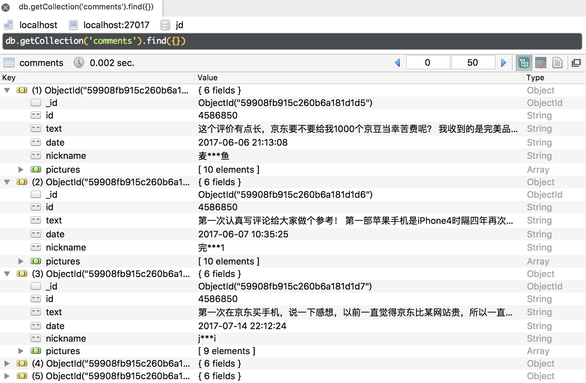

# Appium+MitmDump爬取京东商品评论

## 前言

在前文中我们曾经用Charles分析过京东商品的评论数据，但是可以发现其参数相当复杂，在Form表单中有很多加密参数，如果我们单单只用Charles探测到了这个接口链接和参数还是无法构造直接构造这个Request的参数，这里面涉及到一些加密算法，所以我们也就无法直接还原这个抓取过程。

所以在后面我们又了解了MitmProxy的用法，利用它的MitmDump组件我们可以直接对接Python脚本对抓取的数据包进行处理，将Request和Response直接用Python脚本进行处理，利用它我们自然就可以绕过Request的参数构造过程，直接监听Response进行处理即可。但是这个过程并不是自动化的，在前面我们抓取得到APP的时候实际上是人工模拟了这个拖动过程，如果这个操作可以用程序来实现就更好了。

所以接下来我们又了解了Appium的用法，它可以指定自动化脚本模拟实现APP的一系列动作，如点击、拖动等等动作，同时它也可以提取APP中呈现的信息，但是经过上节爬取微信朋友圈的实例我们可以知道这个解析过程还是比较繁琐的，而且速度需要加以限制，如果内容没有显示出来解析就会失败，而且还会导致重复提取的问题，更重要的是它只可以获取在APP中看到的信息，无法直接提取接口获取的真实数据，但是接口的数据往往是最易提取且信息量最全的，所以最恰当的提取来源就是提取原始接口的返回数据。

综合以上几点，我们就可以确定出一个解决方案了，如果我们用MitmDump去监听接口数据，用Appium去模拟APP的操作，那不就可以既绕过复杂的接口参数又可以实现自动化抓取了？这种方式可以称作是抓取APP数据的最佳方式，但是某些特殊情况除外，如微信朋友圈数据又经过了一次加密无法解析，只能用Appium提取，但是对于大多数APP来说，此种方法是奏效的，本节我们就来用一个实例感受一下这种抓取方式的便捷之处。

## 目标

本节我们以抓取京东APP商品评论为例，实现一下Appium和MitmDump二者结合的抓取。抓取的数据分为两部分，一部分是商品信息，需要获取商品的ID、名称和图片，组成一条商品数据，另一部分是商品的评论信息，将评论人的昵称、评论正文、评论日期、发表图片都提取下来，然后加入商品ID字段，组成一条评论数据。最后将数据保存到MongoDB数据库。

## 环境准备

在本节开始之前请确保PC上已经安装好了Charles、MitmDump和MitmDump、Appium、Android开发环境和Python版本的Appium API，还需要在Android手机上安装好京东APP。

## Charles抓包分析

首先在开始之前我们将手机代理设置到Charles上面，用Charles抓包分析一下获取商品详情和商品评论的接口。

首先是获取商品详情的接口，这里提取到的接口是来自 cdnware.m.jd.com 的链接，返回结果是一个Json字符串，里面包含了商品的ID和商品名称，如图所示：


接下来我们再获取商品评论的接口，这个过程我们在前文也提到过了，在此不再赘述，是来自 api.m.jd.com 的接口，返回结果也是Json字符串，里面包含了商品的数条评论信息。

分析好了接口之后我们就可以用MitmDump对接一个Python脚本来实现数据的抓取了。

## MitmDump抓取

接下来我们首先新建一个脚本文件，然后实现这个脚本以提取这两个接口的数据，首先我们提取一下商品的信息，代码如下：

```python
def response(flow):
    url = 'cdnware.m.jd.com'
    if url in flow.request.url:
        text = flow.response.text
        data = json.loads(text)
        if data.get('wareInfo') and data.get('wareInfo').get('basicInfo'):
            info = data.get('wareInfo').get('basicInfo')
            id = info.get('wareId')
            name = info.get('name')
            images = info.get('wareImage')
            print(id, name, images)
```

首先声明了接口的部分链接内容，然后与Request的URL作比较，如果出现在当前的URL中，那就证明当前的Response就是商品详情的Response，然后我们提取对应的Json信息即可，在这里我们将商品的ID、名称和图片提取了出来，这就是一条商品数据。

接下来我们再提取一下评论的数据，代码实现如下：

```python
# 提取评论数据
url = 'api.m.jd.com/client.action'
if url in flow.request.url:
    pattern = re.compile('sku\".*?\"(\d+)\"')
    # Request请求参数中包含商品ID
    body = unquote(flow.request.text)
    # 提取商品ID
    id = re.search(pattern, body).group(1) if re.search(pattern, body) else None
    # 提取Response Body
    text = flow.response.text
    data = json.loads(text)
    comments = data.get('commentInfoList') or []
    # 提取评论数据
    for comment in comments:
        if comment.get('commentInfo') and comment.get('commentInfo').get('commentData'):
            info = comment.get('commentInfo')
            text = info.get('commentData')
            date = info.get('commentDate')
            nickname = info.get('userNickName')
            pictures = info.get('pictureInfoList')
            print(id, nickname, text, date, pictures)
```

这里我们还是指定了接口的部分链接内容用以判断当前Request的URL是不是获取评论的URL，如果满足条件，那么就提取商品的ID和评论信息。

商品的ID实际上是隐藏在Request中，我们需要提取Request的表单内容提取商品的ID，这里直接用了正则表达式提取。

商品的评论信息是在Response中，所以在这里我们还是像刚才一样提取了Response的内容，然后对Json进行解析，最后提取出来了商品评论人的昵称、评论正文、评论日期和图片信息，然后再和商品的ID组合起来，形成一条评论数据。

最后我们用MongoDB将两部分数据分开保存到两个Collection即可，在此不再赘述。

运行此脚本，命令如下：

```
mitmdump -s script.py
```

这时将手机的代理设置到MitmDump上，我们在京东APP中打开某个商品，然后再打开商品评论部分，下拉即可看到控制台输出了两部分的抓取结果，并成功保存到了MongoDB数据库，如图所示：



现在如果我们手动操作京东APP就可以做到京东商品评论的抓取了，下一步我们要做的就是实现自动滚动刷新。

## Appium自动下拉

接下来我们再将Appium对接到手机上，用Appium驱动APP完成一系列动作，进入APP后我们需要做的操作有点击搜索框、输入搜索的商品名称、点击进入商品详情、进入评论页面、自动滚动刷新，基本的操作逻辑和爬取微信朋友圈的相同。

这里京东APP的Desired Capabilities配置如下：

```python
{
    'platformName': 'Android',
    'deviceName': 'MI_NOTE_Pro',
    'appPackage': 'com.jingdong.app.mall',
    'appActivity': 'main.MainActivity'
}
```

参考代码实现如下：

```python
from appium import webdriver
from selenium.webdriver.common.by import By
from selenium.webdriver.support.ui import WebDriverWait
from selenium.webdriver.support import expected_conditions as EC
from time import sleep

class Action():
    def __init__(self):
        # 驱动配置
        self.desired_caps = {
            'platformName': PLATFORM,
            'deviceName': DEVICE_NAME,
            'appPackage': 'com.jingdong.app.mall',
            'appActivity': 'main.MainActivity'
        }
        self.driver = webdriver.Remote(DRIVER_SERVER, self.desired_caps)
        self.wait = WebDriverWait(self.driver, TIMEOUT)
    
    def comments(self):
        # 点击进入搜索页面
        search = self.wait.until(EC.presence_of_element_located((By.ID, 'com.jingdong.app.mall:id/mp')))
        search.click()
        # 输入搜索文本
        box = self.wait.until(EC.presence_of_element_located((By.ID, 'com.jd.lib.search:id/search_box_layout')))
        box.set_text(KEYWORD)
        # 点击搜索按钮
        button = self.wait.until(EC.presence_of_element_located((By.ID, 'com.jd.lib.search:id/search_btn')))
        button.click()
        # 点击进入商品详情
        view = self.wait.until(EC.presence_of_element_located((By.ID, 'com.jd.lib.search:id/product_list_item')))
        view.click()
        # 进入评论详情
        tab = self.wait.until(EC.presence_of_element_located((By.ID, 'com.jd.lib.productdetail:id/pd_tab3')))
        tab.click()
    
    def scroll(self):
        while True:
            # 模拟拖动
            self.driver.swipe(FLICK_START_X, FLICK_START_Y + FLICK_DISTANCE, FLICK_START_X, FLICK_START_Y)
            sleep(SCROLL_SLEEP_TIME)
    
    def main(self):
        self.comments()
        self.scroll()

if __name__ == '__main__':
    action = Action()
    action.main()
```

实现比较简单，逻辑与上一节微信朋友圈的抓取类似。注意由于APP可能由于版本更新的原因，交互流程和元素ID可能有所更改，在这里代码仅做参考，以实际APP为准。

可以注意到在下拉的过程中已经省去了用Appium提取数据的过程，因为这个过程我们已经用MitmDump来帮助我们实现了。

运行之后便会启动京东APP，然后进入到商品的详情页，然后进入到评论页再无限滚动，这样就代替了我们人工操作，Appium一边实现模拟滚动，MitmDump一边进行抓取，这样APP的数据就会保存到数据库中了。

## 结语

以上便是Appium和MitmDump抓取京东APP数据的过程，本节代码：[https://github.com/Python3WebSpider/MitmAppiumJD](https://github.com/Python3WebSpider/MitmAppiumJD)。

