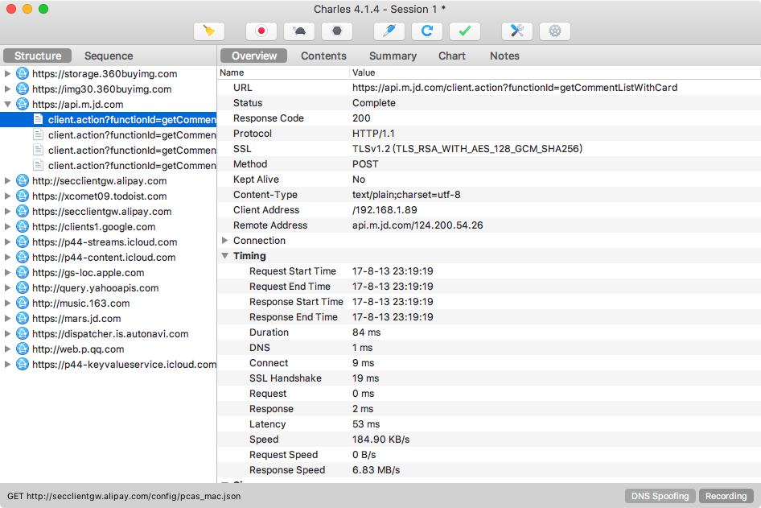
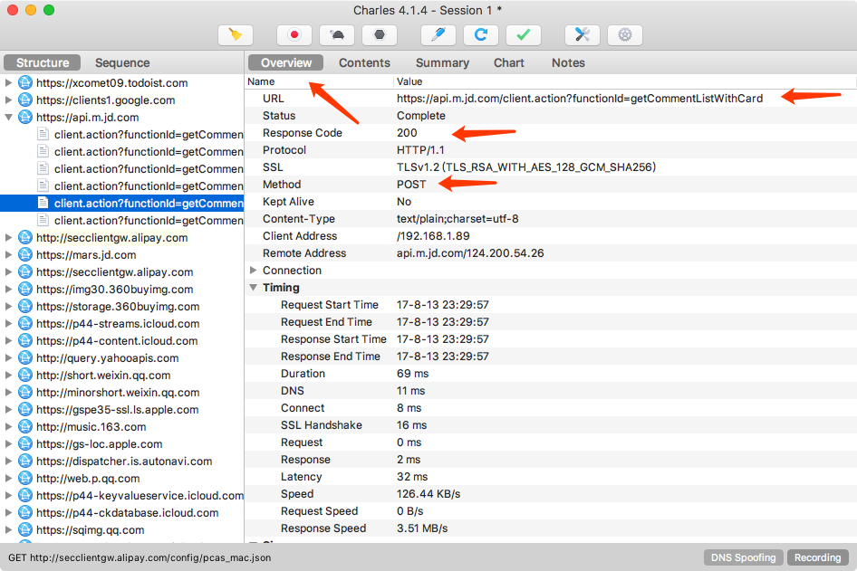
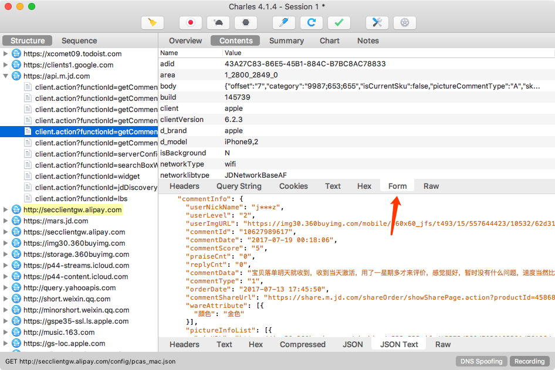
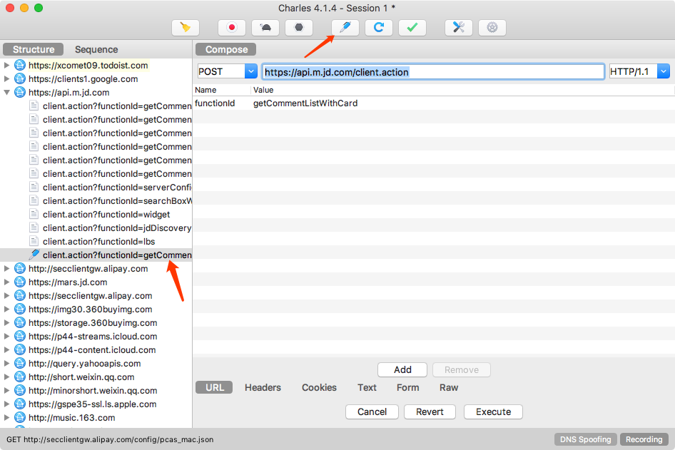

# 11.1 Charles 的使用

Charles 是一个网络抓包工具，我们可以用它来做 App 的抓包分析，得到 App 运行过程中发生的所有网络请求和响应内容，这就和 Web 端浏览器的开发者工具 Network 部分看到的结果一致。

相比 Fiddler 来说，Charles 的功能更强大，而且跨平台支持更好。所以我们选用 Charles 作为主要的移动端抓包工具，用于分析移动 App 的数据包，辅助完成 App 数据抓取工作。

### 1. 本节目标

本节我们以京东 App 为例，通过 Charles 抓取 App 运行过程中的网络数据包，然后查看具体的 Request 和 Response 内容，以此来了解 Charles 的用法。

### 2. 准备工作

请确保已经正确安装 Charles 并开启了代理服务，手机和 Charles 处于同一个局域网下，Charles 代理和 CharlesCA 证书设置好，另外需要开启 SSL 监听，具体的配置可以参考第 1 章的说明。

### 3. 原理

首先 Charles 运行在自己的 PC 上，Charles 运行的时候会在 PC 的 8888 端口开启一个代理服务，这个服务实际上是一个 HTTP/HTTPS 的代理。

确保手机和 PC 在同一个局域网内，我们可以使用手机模拟器通过虚拟网络连接，也可以使用手机真机和 PC 通过无线网络连接。

设置手机代理为 Charles 的代理地址，这样手机访问互联网的数据包就会流经 Charles，Charles 再转发这些数据包到真实的服务器，服务器返回的数据包再由 Charles 转发回手机，Charles 就起到中间人的作用，所有流量包都可以捕捉到，因此所有 HTTP 请求和响应都可以捕获到。同时 Charles 还有权力对请求和响应进行修改。

### 4. 抓包

初始状态下 Charles 的运行界面如图 11-1 所示：

图 11-1 Charles 运行界面

Charles 会一直监听 PC 和手机发生的网络数据包，捕获到的数据包就会显示在左侧，随着时间的推移，捕获的数据包越来越多，左侧列表的内容也会越来越多。

可以看到，图中左侧显示了 Charles 抓取到的请求站点，我们点击任意一个条目便可以查看对应请求的详细信息，其中包括 Request、Response 等内容。

接下来清空 Charles 的抓取结果，点击左侧的扫帚按钮即可清空当前捕获到的所有请求。然后点击第二个监听按钮，确保监听按钮是打开的，这表示 Charles 正在监听 App 的网络数据流，如图 11-2 所示。

图 11-2 监听过程

这时打开手机京东，注意一定要提前设置好 Charles 的代理并配置好 CA 证书，否则没有效果。

打开任意一个商品，如 iPhone，然后打开它的商品评论页面，如图 11-3 所示。

图 11-3 评论页面

不断上拉加载评论，可以看到 Charles 捕获到这个过程中京东 App 内发生的所有网络请求，如图 11-4 所示。

图 11-4 监听结果

左侧列表中会出现一个 api.m.jd.com 链接，而且它在不停闪动，很可能就是当前 App 发出的获取评论数据的请求被 Charles 捕获到了。我们点击将其展开，继续上拉刷新评论。随着上拉的进行，此处又会出现一个个网络请求记录，这时新出现的数据包请求确定就是获取评论的请求。

为了验证其正确性，我们点击查看其中一个条目的详情信息。切换到 Contents 选项卡，这时我们发现一些 JSON 数据，核对一下结果，结果有 commentData 字段，其内容和我们在 App 中看到的评论内容一致，如图 11-5 所示。

图 11-5 Json 数据结果

这时可以确定，此请求对应的接口就是获取商品评论的接口。这样我们就成功捕获到了在上拉刷新的过程中发生的请求和响应内容。

### 5. 分析

现在分析一下这个请求和响应的详细信息。首先可以回到 Overview 选项卡，上方显示了请求的接口 URL，接着是响应状态 Status Code、请求方式 Method 等，如图 11-6 所示。

图 11-6 监听结果

这个结果和原本在 Web 端用浏览器开发者工具内捕获到的结果形式是类似的。

接下来点击 Contents 选项卡，查看该请求和响应的详情信息。

上半部分显示的是 Request 的信息，下半部分显示的是 Response 的信息。比如针对 Reqeust，我们切换到 Headers 选项卡即可看到该 Request 的 Headers 信息，针对 Response，我们切换到 JSON TEXT 选项卡即可看到该 Response 的 Body 信息，并且该内容已经被格式化，如图 11-7 所示。

图 11-7 监听结果

由于这个请求是 POST 请求，所以我们还需要关心的就是 POST 的表单信息，切换到 Form 选项卡即可查看，如图 11-8 所示。

图 11-8 监听结果

这样我们就成功抓取 App 中的评论接口的请求和响应，并且可以查看 Response 返回的 JSON 数据。

至于其他 App，我们同样可以使用这样的方式来分析。如果我们可以直接分析得到请求的 URL 和参数的规律，直接用程序模拟即可批量抓取。

### 6. 重发

Charles 还有一个强大功能，它可以将捕获到的请求加以修改并发送修改后的请求。点击上方的修改按钮，左侧列表就多了一个以编辑图标为开头的链接，这就代表此链接对应的请求正在被我们修改，如图 11-9 所示。

图 11-9 编辑页面

我们可以将 Form 中的某个字段移除，比如这里将 partner 字段移除，然后点击 Remove。这时我们已经对原来请求携带的 Form Data 做了修改，然后点击下方的 Execute 按钮即可执行修改后的请求，如图 11-10 所示。

图 11-10 编辑页面

可以发现左侧列表再次出现了接口的请求结果，内容仍然不变，如图 11-11 所示。

图 11-11 重新请求后结果

删除 Form 表单中的 partner 字段并没有带来什么影响，所以这个字段是无关紧要的。

有了这个功能，我们就可以方便地使用 Charles 来做调试，可以通过修改参数、接口等来测试不同请求的响应状态，就可以知道哪些参数是必要的哪些是不必要的，以及参数分别有什么规律，最后得到一个最简单的接口和参数形式以供程序模拟调用使用。

### 7. 结语

以上内容便是通过 Charles 抓包分析 App 请求的过程。通过 Charles，我们成功抓取 App 中流经的网络数据包，捕获原始的数据，还可以修改原始请求和重新发起修改后的请求进行接口测试。

知道了请求和响应的具体信息，如果我们可以分析得到请求的 URL 和参数的规律，直接用程序模拟即可批量抓取，这当然最好不过了。

但是随着技术的发展，App 接口往往会带有密钥，我们并不能直接找到这些规律，那么怎么办呢？接下来，我们将了解利用 Charles 和 mitmdump 直接对接 Python 脚本实时处理抓取到的 Response 的过程。