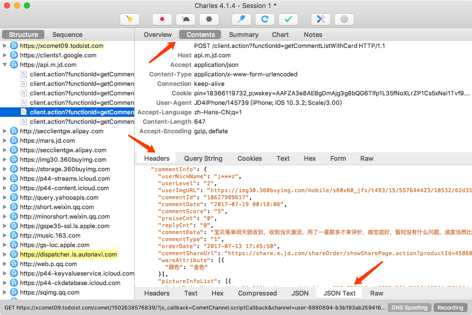

# 11.1 Charles的使用

Charles 是一个网络抓包工具，在做 APP 爬取的时候会用到，我们可以用它来做 APP 的抓包分析，得到 APP 运行过程中发生的所有网络请求和响应内容，就相当于 Web 端浏览器的开发者工具 Network 部分看到的结果。

相比 Fiddler 来说，Charles 的功能更为强大，而且跨平台支持更好，所以在这里我们选用 Charles 来作为主要的移动端抓包工具，用于分析移动 APP 的数据包，辅助完成 APP 数据抓取工作，本节来讲解一下 Charles 抓包工具的基本使用。

### 1. 本节目标

本节我们以京东APP为例，通过 Charles 来抓取一下 APP 内运行过程中的网络数据包是怎样的，然后查看具体的 Request 和 Response 内容，以此来了解Charles的用法。

### 2. 准备工作

在本节开始之前请确保已经正确安装好了 Charles 并开启了代理服务，并且手机和 Charles 处于同一个局域网下并设置好了 Charles 代理而且配置好了 Charles 的 CA 证书，具体的配置可以参考第一章的说明。

### 3. 原理

我们需要先知道使用的思路，首先 Charles 肯定是运行在我们自己的 PC 上的，Charles 运行的时候会在 PC 的 8888 端口上开启一个代理服务，这个实际上是一个 HTTP/HTTPS 的代理。

接下来手机需要和 PC 在同一个局域网内，可以考虑使用手机模拟器用虚拟网络连接，也可以使用真机和 PC 用无线网络连接，总之确保二者在同一个局域网内即可。

接下来手机需要设置代理为 Charles 的代理地址，这样手机在访问互联网的时候流量数据包就会流经 Charles，Charles 再去转发这些数据包到真实的服务器，服务器返回数据包时再由 Charles 转发回手机，这样 Charles 就相当于起了中间人的作用，所有流量包都可以捕捉到，因此所有HTTP 请求和响应就都可以捕获到，同时它还有权力对请求和响应进行修改，一切都在它的掌控之中，所以我们要把它用作爬虫抓包工具也不在话下。

### 4. 抓包

初始状态下 Charles 的运行界面如图所示：

它会一直在监听 PC 和手机上的发生的网络数据包，捕获到数据包之后就会显示在左侧，随着时间的推移，捕获的数据包越来越多，左侧的列表的内容也会越来越多。

图中可以看到在左侧显示了 Charles 抓取到的请求站点，我们点击任意一个条目便可以查看对应请求的详细信息，包括 Request、Response 的所有内容，我们可以点击进去查看具体的 Request 和 Response 的内容。

接下来我们清空一下Charles的抓取结果，点击左侧的扫帚按钮即可清空当前捕获到的所有请求，然后点击第二个监听按钮，确保监听按钮是打开的，这表示 Charles 正在监听 APP 中的网络数据流，如图所示：

这时我们打开手机京东，注意这里一定要提前设置好 Charles 的代理并配置好 CA 证书，否则没有效果，具体可以参考第一章。

打开任意一个商品，如 iPhone，然后打开它的商品评论页面，如图所示：

然后一直不断上拉加载评论，这时我们就可以看到在 Charles 中捕获到了这个过程中京东 APP 内发生的所有网络请求，如图所示：

这时我们会发现在左侧列表中会出现一个 api.m.jd.com 的链接，而且它在不停的闪动，这个很可能就是当前 APP 发出的获取评论数据的请求被 Charles 捕获到了，我们点击将其展开，继续上拉刷新评论，我们发现随着上拉的进行，此处又会出现一个个的网络请求记录，这基本可以确定新出现的数据包请求就是获取评论的请求了。

为了验证其正确性，我们点击查看其中一个条目的详情信息，切换到Contents 选项卡，这时我们可以发现一些 Json 数据，核对一下结果，可以看到其内有 commentData 字段，正是在 APP 中出现的评论内容：

这时我们就可以确定此请求对应的接口就是获取商品评论的接口，这样我们就成功捕获到了在上拉刷新的过程中发生的请求和响应内容。

### 5. 分析

抓取到之后我们再来分析一下这个请求和响应的详细信息。我们首先可以回到 Overview 选项卡，可以看到在上方显示了请求的接口 URL，接着显示了响应状态 Status Code，请求方式 Method 等等，如图所示：

这基本上和我们原本在 Web 端用浏览器开发者工具内捕获到的结果形式是类似的。

接下来我们可以点击 Contents 选项卡来查看该请求和响应的详情信息。

这时上半部分显示的是 Request 的信息，下半部分显示的是 Response 的信息，比如对于 Reqeust，我们切换到 Headers 选项卡即可看到该 Request 的 Headers 信息，对于 Response，我们切换到JSON TEXT 选项卡即可看到该 Response 的 Body 信息，并且已经将 Json 字符串格式化，如图所示：

由于这个请求是 POST 请求，所以我们还需要关心的就是 POST 的表单信息，切换到 Form 选项卡即可查看，如图所示：

这样我们就成功抓取到了 APP 中的评论接口的请求和响应，并且可以查看到 Response 返回的 Json 数据了。

对于其他的 APP，我们可以同样利用这样的方式分析，知道了这些信息，如果我们可以直接分析得到请求的 URL 和 参数的规律，直接用程序模拟即可批量抓取。

### 6. 重发

另外 Charles 还具有一个强大的功能，它可以将捕获到的请求加以修改然后重新发送修改后的请求，我们可以点击上方的修改按钮，然后可以发现在左侧列表就多了一个以编辑图标为开头的链接，这就代表此链接对应的请求正在被我们修改，如图所示：

比如我们可以修改 Form 表单的数据，例如将 Form 中的某个字段移除掉，在这里我们将 partner 字段移除，然后点击 Remove 即可，这时我们就已经对原来的请求携带的 Form Data 做了修改，然后再点击下方的 Execute 按钮即可执行修改后的请求，如图所示：

点击了 Execute 按钮之后，修改后的请求会被重新执行，可以发现左侧列表再次出现了接口的请求结果，内容完全一致，如图所示：

可见删除了 Form 表单中的 partner 字段并没有什么影响，所以这个字段是无关紧要的。

有了这个功能，我们就可以方便地使用 Charles 来做调试，我们可以通过修改参数、接口等来测试不同请求的响应状态，最后我们就可以知道哪些参数是必要的哪些是不必要的以及参数分别有着什么规律，最后得到一个最简单的接口和参数形式，供程序模拟调用使用就好了。

### 7. 结语

以上便是通过 Charles 抓包分析 APP 请求的过程，通过 Charles 我们成功抓取到了 APP 中流经的网络数据包，并可以捕获到原始的数据，同时我们还可以修改原始请求和重新发起修改后的请求进行接口测试。

知道了请求和响应的具体信息，如果我们可以直接分析得到请求的 URL 和 参数的规律，直接用程序模拟即可批量抓取，这当然最好不过了。

但是随着技术的发展，APP 中的这些接口往往会带有一些加密的密钥，我们有时候并不能直接找到这些规律，那么怎么办呢？在下一节我们来了解一下利用 Charles 和 MitmDump 直接对接 Python 脚本实时处理抓取到的 Response 的过程。

