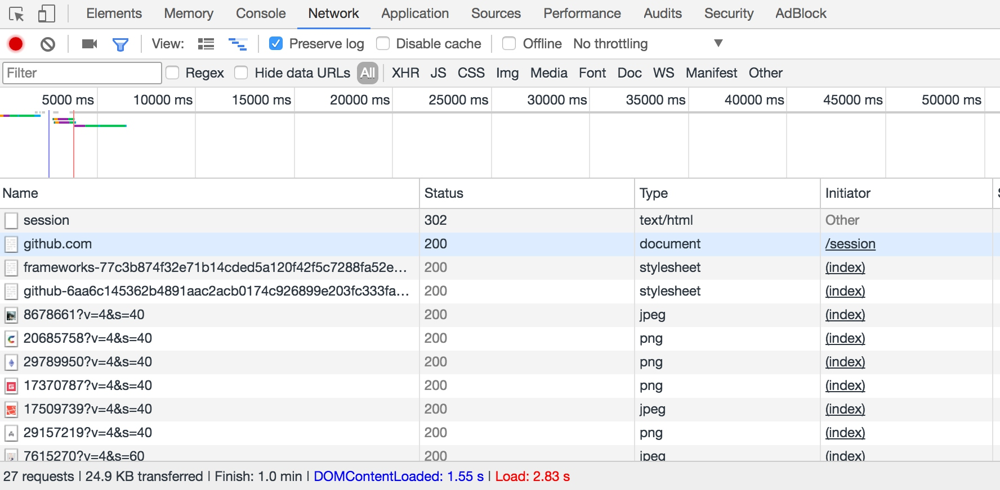
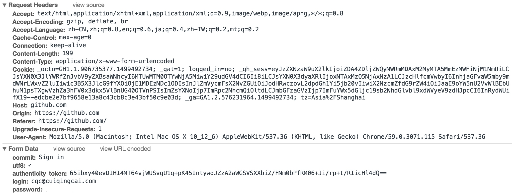
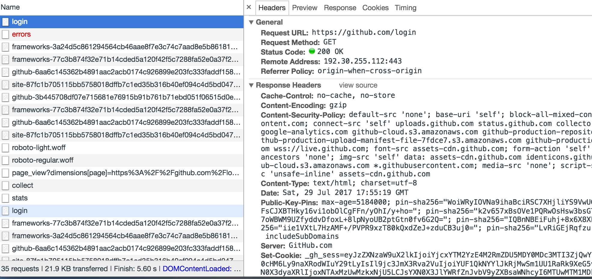

# 模拟登录抓取

本节我们来用一个简单的实例来实现一下模拟登录的过程，同时抓取登录后才可以访问的页面信息。

我们应该都知道听说过GitHub，如果在我们在Github上关注了某些人的话，在登录之后就会显示他们最近的动态信息，比如他们最近Star了哪个Repository，Create了哪个Organization，Push了哪些Code。但是如果退出登录之后，我们就无法再看到这些信息，因为毕竟我们关注了哪些人是需要登录之后才可以知道的。

所以如果我们想用爬虫获取自己关注的人最近有什么动态的话，就需要来模拟登录GitHub了，所以本节我们就来实现一下如何模拟登录并获取关注的人的动态信息和自己的相关信息。

## 分析登录过程

要想模拟登录，首先需要分析登录的过程，我们需要探究后台的登录请求是怎样发送的，登录之后又有怎样的处理过程。

所以接下来我们首先打开浏览器，如果已经登录了GitHub先退出登录，同时清除一下Cookies，让我们从登录页面开始一步步探究模拟登录的过程究竟发生了什么。

首先打开GitHub的登录页面，链接为[https://github.com/login](https://github.com/login)，输入GitHub的用户名密码，打开开发者工具，将Preserve Log选项勾选上，也就是显示持续日志。


点击登录按钮，这时便会看到在开发者工具下方显示了各个请求的发送过程。




这时我们需要观察点击登录按钮之后发生的第一个请求是怎样的，点击第一个请求进入其详情页面。


可以看到请求的的URL为[https://github.com/session](https://github.com/session)，请求方式为POST，那么POST请求下一步我们就需要观察它的Form Data和Headers，我们进一步再查看一下这两部分内容。



可以看到Headers里面包含了Cookies、Host、Origin、Referer、User-Agent等信息，同时Form Data包含了五个字段，commit是固定的字符串Sign in，utf8是一个勾选字符，authenticity_token较长，初步判断是一个Base64加密的字符串，login是登录的用户名，password就是登录的密码。

所以综上所述，如果要做模拟登录，我们现在无法直接构造的内容有两个，一个是Cookies，另一个是authenticity_token，下面我们再来探寻一下这两部分内容是怎样获取的。

在登录之前我们会首先访问到一个登录页面，此页面是GET形式访问的，输入用户名密码之后我们就点击了登录按钮，浏览器就已经可以发送这两部分信息了，也就是说Cookies和authenticity_token一定是在访问登录页的时候设置的。

这时我们再退出登录，回到登录页，同时清空一下Cookies，重新访问登录页，截获一下发生的请求。



这时访问登录页面的请求如图所示，发现其Response Headers有一个Set-Cookie字段，那么这就是设置Cookies的过程，这样登录时使用的Cookies就可以成功获取到了。

另外我们发现Response Headers没有和authenticity_token相关的信息，所以可能authenticity_token还隐藏在其他的地方或者是计算出来的。我们再从网页的源码里面探寻一下这个信息，搜索一下相关字段，发现在源代码里面隐藏着此信息，它是一个隐藏式表单元素。


所以我们要获取authenticity_token就直接从源码里获取即可。

那现在我们就已经把所有信息获取到了，接下来实现模拟登录就可以了。

首先我们定义一个Login类，初始化一些变量：

```python
class Login(object):
    def __init__(self):
        self.headers = {
            'Referer': 'https://github.com/',
            'User-Agent': 'Mozilla/5.0 (Windows NT 10.0; WOW64) AppleWebKit/537.36 (KHTML, like Gecko) Chrome/57.0.2987.133 Safari/537.36',
            'Host': 'github.com'
        }
        self.login_url = 'https://github.com/login'
        self.post_url = 'https://github.com/session'
        self.logined_url = 'https://github.com/settings/profile'
        self.session = requests.Session()
```

在这里最重要的一个变量就是Requests库里面的Session，它可以帮助我们维持一个会话，而且可以自动处理Cookies，我们不用再去担心Cookies的问题。

接下来我们需要先访问登录页面，要完成两件事，一是通过此页面获取初始的Cookies，二是提取出authenticity_token。

所以在这里我们实现一个token()方法，如下：

```python
from lxml import etree

def token(self):
    response = self.session.get(self.login_url, headers=self.headers)
    selector = etree.HTML(response.text)
    token = selector.xpath('//div/input[2]/@value')[0]
    return token
```

在这里我们用session对象的get()方法访问GitHub的登录页面，然后用XPath解析出来了登录所需的authenticity_token信息并返回。

现在我们已经获取了初始的Cookies，同时获取到了authenticity_token，开始模拟登录就好了，实现一个login()方法如下：

```python
def login(self, email, password):
    post_data = {
        'commit': 'Sign in',
        'utf8': '✓',
        'authenticity_token': self.token(),
        'login': email,
        'password': password
    }

    response = self.session.post(self.post_url, data=post_data, headers=self.headers)
    if response.status_code == 200:
        self.dynamics(response.text)
    
    response = self.session.get(self.logined_url, headers=self.headers)
    if response.status_code == 200:
        self.profile(response.text)
```

在这里我们首先构造一个表单，将各个字段复制，其中email和password是变量的形式传递进来，接下来再用session对象的post()方法模拟登录即可，由于Requests自动帮我们处理了重定向信息，所以登录成功后我们就可以直接跳转到首页了，首页会显示自己关注的人的动态信息，得到Response之后我们用dynamics()方法来处理，另外我们接下来再次用session对象请求了一次个人详情页，然后用profile()方法来处理个人详情页信息。

其中dynamics()方法和profile()方法的实现如下：

```python
def dynamics(self, html):
    selector = etree.HTML(html)
    dynamics = selector.xpath('//div[contains(@class, "news")]//div[contains(@class, "alert")]')
    for item in dynamics:
        dynamic = ' '.join(item.xpath('.//div[@class="title"]//text()')).strip()
        print(dynamic)

def profile(self, html):
    selector = etree.HTML(html)
    name = selector.xpath('//input[@id="user_profile_name"]/@value')[0]
    email = selector.xpath('//select[@id="user_profile_email"]/option[@value!=""]/text()')
    print(name, email)
```

在这里我们仍然是使用XPath对信息进行提取，dynamics()方法里我们提取了所有的动态信息，然后将其遍历输出。prifile()方法里我们提取了个人的昵称和绑定的邮箱，然后将其输出。

这样整个类的编写就完成了，我们新建一个Login对象，然后运行一下程序：

```python

if __name__ == "__main__":
    login = Login()
    login.login(email='cqc@cuiqingcai.com', password='password')

```

在login()方法传入用户名和密码，实现模拟登录。

可以看到控制台有类似如下输出：

```python
GrahamCampbell  starred  nunomaduro/zero-framework
GrahamCampbell  starred  nunomaduro/laravel-zero
happyAnger6  created repository  happyAnger6/nodejs_chatroom
viosey  starred  nitely/Spirit
lbgws2  starred  Germey/TaobaoMM
EasyChris  starred  ageitgey/face_recognition
callmewhy  starred  macmade/GitHubUpdates
sindresorhus  starred  sholladay/squatter
SamyPesse  starred  graphcool/chromeless
wbotelhos  starred  tkadlec/grunt-perfbudget
wbotelhos  created repository  wbotelhos/eggy
leohxj  starred  MacGesture/MacGesture
GrahamCampbell  starred  GrahamCampbell/Analyzer
EasyChris  starred  golang/go
mitulgolakiya  starred  veltman/flubber
liaoyuming  pushed to  student  at  Germey/SecurityCourse
leohxj  starred  jasonslyvia/a-cartoon-intro-to-redux-cn
ruanyf  starred  ericchiang/pup
ruanyf  starred  bpesquet/thejsway
louwailou  forked  Germey/ScrapyTutorial  to  louwailou/ScrapyTutorial
Lving  forked  shadowsocksr-backup/shadowsocksr  to  Lving/shadowsocksr
qifuren1985  starred  Germey/ADSLProxyPool
QWp6t  starred  laravel/framework
Germey ['1016903103@qq.com', 'cqc@cuiqingcai.com']
```

可以发现我们成功获取到了关注的人的动态信息和个人的昵称及绑定邮箱，模拟登录成功！

以上我们便利用Requests的Session实现了模拟登录操作，最主要的其实还是分析的思路，只要各个参数都成功获取，那么模拟登录是没有问题的。

登录之后我们就相当于建立了一个Session会话，Session对象会维护着Cookies的信息，后面我们直接请求就会得到模拟登录成功后的页面。

以上便是模拟登录的思路分析和相关实现过程。

本节源代码：[https://github.com/Python3WebSpider/GithubLogin](https://github.com/Python3WebSpider/GithubLogin)
