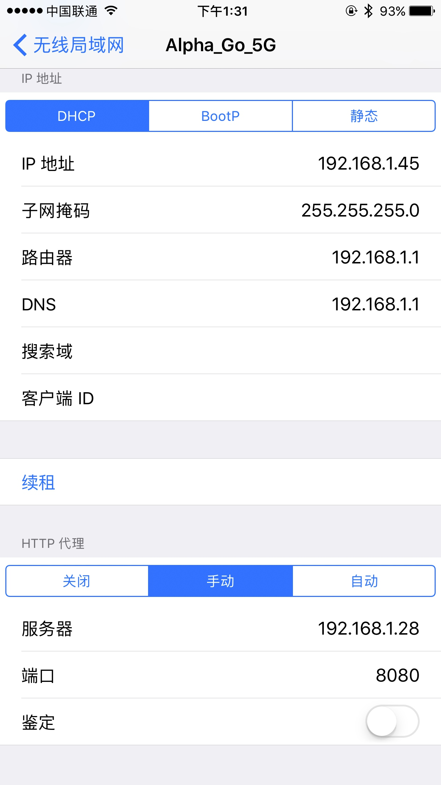
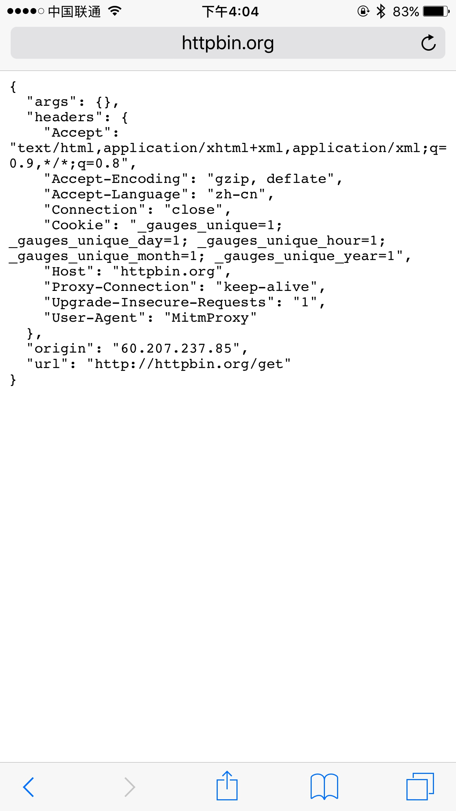
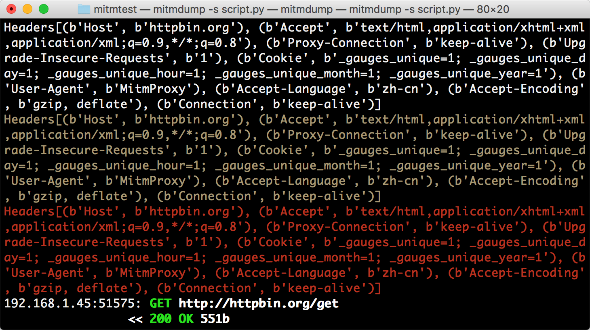
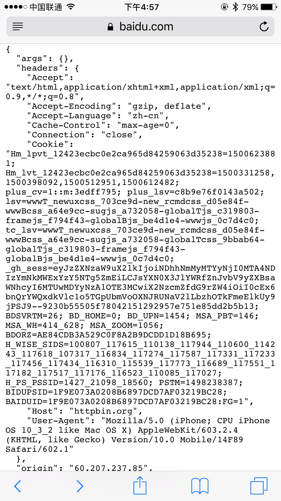

# 11.2 mitmproxy 的使用

mitmproxy 是一个支持 HTTP 和 HTTPS 的抓包程序，有类似 Fiddler、Charles 的功能，只不过它是一个控制台的形式操作。

mitmproxy 还有两个关联组件。一个是 mitmdump，它是 mitmproxy 的命令行接口，利用它我们可以对接 Python 脚本，用 Python 实现监听后的处理。另一个是 mitmweb，它是一个 Web 程序，通过它我们可以清楚观察 mitmproxy 捕获的请求。

下面我们来了解它们的用法。

### 1. 准备工作

请确保已经正确安装好了 mitmproxy，并且手机和 PC 处于同一个局域网下，同时配置好了 mitmproxy 的 CA 证书，具体的配置可以参考第 1 章的说明。

### 2. mitmproxy 的功能

mitmproxy 有如下几项功能。

* 拦截 HTTP 和 HTTPS 请求和响应
* 保存 HTTP 会话并进行分析
* 模拟客户端发起请求，模拟服务端返回响应
* 利用反向代理将流量转发给指定的服务器
* 支持 Mac 和 Linux 上的透明代理
* 利用 Python 对 HTTP 请求和响应进行实时处理

### 3. 抓包原理

和 Charles 一样，mitmproxy 运行于自己的 PC 上，mitmproxy 会在 PC 的 8080 端口运行，然后开启一个代理服务，这个服务实际上是一个 HTTP/HTTPS 的代理。

手机和 PC 在同一个局域网内，设置代理为 mitmproxy 的代理地址，这样手机在访问互联网的时候流量数据包就会流经 mitmproxy，mitmproxy 再去转发这些数据包到真实的服务器，服务器返回数据包时再由 mitmproxy 转发回手机，这样 mitmproxy 就相当于起了中间人的作用，抓取到所有 Request 和 Response，另外这个过程还可以对接 mitmdump，抓取到的 Request 和 Response 的具体内容都可以直接用 Python 来处理，比如得到 Response 之后我们可以直接进行解析，然后存入数据库，这样就完成了数据的解析和存储过程。

### 4. 设置代理

首先，我们需要运行 mitmproxy，命令如下所示：

启动 mitmproxy 的命令如下：

```
mitmproxy
```

运行之后会在 8080 端口上运行一个代理服务，如图 11-12 所示：


图 11-12 mitmproxy 运行结果

右下角会出现当前正在监听的端口。

或者启动 mitmdump，它也会监听 8080 端口，命令如下所示：

```
mitmdump
```

运行结果如图 11-13 所示。


图 11-13 MitmDump 运行结果

将手机和 PC 连接在同一局域网下，设置代理为当前代理。首先看看 PC 的当前局域网 IP。

Windows 上的命令如下所示：

```
ipconfig
```

Linux 和 Mac 上的命令如下所示：

```
ifconfig
```

输出结果如图 11-14 所示：


图 11-14 查看局域网 IP

一般类似 10.\*.\*.\* 或 172.16.\*.\* 或 192.168.1.\* 这样的 IP 就是当前 PC 的局域网 IP，例如此图中 PC 的 IP 为 192.168.1.28，手机代理设置类似如图 11-15 所示。



图 11-15 代理设置

这样我们就配置好了 mitmproxy 的的代理。

### 5. mitmproxy 的使用

确保 mitmproxy 正常运行，并且手机和 PC 处于同一个局域网内，设置了 mitmproxy 的代理，具体的配置方法可以参考第 1 章。

运行 mitmproxy，命令如下所示：

```
mitmproxy
```

设置成功之后，我们只需要在手机浏览器上访问任意的网页或浏览任意的 App 即可。例如在手机上打开百度，mitmproxy 页面便会呈现出手机上的所有请求，如图 11-16 所示。


图 11-16 所有请求

这就相当于之前我们在浏览器开发者工具监听到的浏览器请求，在这里我们借助于 mitmproxy 完成。Charles 完全也可以做到。

这里是刚才手机打开百度页面时的所有请求列表，左下角显示的 2/38 代表一共发生了 38 个请求，当前箭头所指的是第二个请求。

每个请求开头都有一个 GET 或 POST，这是各个请求的请求方式。紧接的是请求的 URL。第二行开头的数字就是请求对应的响应状态码，后面是响应内容的类型，如 text/html 代表网页文档、image/gif 代表图片。再往后是响应体的大小和响应的时间。

当前呈现了所有请求和响应的概览，我们可以通过这个页面观察到所有的请求。

如果想查看某个请求的详情，我们可以敲击回车，进入请求的详情页面，如图 11-17 所示。


图 11-17 详情页面

可以看到 Headers 的详细信息，如 Host、Cookies、User-Agent 等。

最上方是一个 Request、Response、Detail 的列表，当前处在 Request 这个选项上。这时我们再点击 TAB 键，即可查看这个请求对应的响应详情，如图 11-18 所示。


图 11-18 响应详情

最上面是响应头的信息，下拉之后我们可以看到响应体的信息。针对当前请求，响应体就是网页的源代码。

这时再敲击 TAB 键，切换到最后一个选项卡 Detail，即可看到当前请求的详细信息，如服务器的 IP 和端口、HTTP 协议版本、客户端的 IP 和端口等，如图 11-19 所示。


图 11-19 详细信息

mitmproxy 还提供了命令行式的编辑功能，我们可以在此页面中重新编辑请求。敲击 e 键即可进入编辑功能，这时它会询问你要编辑哪部分内容，如 Cookies、Query、URL 等，每个选项的第一个字母会高亮显示。敲击要编辑内容名称的首字母即可进入该内容的编辑页面，如敲击 m 即可编辑请求的方式，敲击 q 即可修改 GET 请求参数 Query。

这时我们敲击 q，进入到编辑 Query 的页面。由于没有任何参数，我们可以敲击 a 来增加一行，然后就可以输入参数对应的 Key 和 Value，如图 11-20 所示。


图 11-20 编辑页面

这里我们输入 Key 为 wd，Value 为 NBA。

然后再敲击 esc 键和 q 键，返回之前的页面，再敲击 e 和 p 键修改 Path。和上面一样，敲击 a 增加 Path 的内容，这时我们将 Path 修改为 s，如图 11-21 所示。


图 11-21 编辑页面

再敲击 esc 和 q 键返回，这时我们可以看到最上面的请求链接变成了 [https://www.baidu.com/s?wd=NBA](https://www.baidu.com/s?wd=NBA)，访问这个页面，可以看到百度搜索 NBA 关键词的搜索结果，如图 11-22 所示。


图 11-22 请求详情

敲击 a 保存修改，敲击 r 重新发起修改后的请求，即可看到上方请求方式前面多了一个回旋箭头，这说明重新执行了修改后的请求。这时我们再观察响应体内容，即可看到搜索 NBA 的页面结果的源代码，如图 11-23 所示。


图 11-23 响应结果

以上内容便是 mitmproxy 的简单用法。利用 mitmproxy，我们可以观察到手机上的所有请求，还可以对请求进行修改并重新发起。

Fiddler、Charles 也有这个功能，而且它们的图形界面操作更加方便。那么 mitmproxy 的优势何在？

mitmproxy 的强大之处体现在它的另一个工具 mitmdump，有了它我们可以直接对接 Python 对请求进行处理。下面我们来看看 mitmdump 的用法。

### 6. MitmDump 的使用

mitmdump 是 mitmproxy 的命令行接口，同时还可以对接 Python 对请求进行处理，这是相比 Fiddler、Charles 等工具更加方便的地方。有了它我们可以不用手动截获和分析 HTTP 请求和响应，只需写好请求和响应的处理逻辑即可。它还可以实现数据的解析、存储等工作，这些过程都可以通过 Python 实现。

#### 实例引入

我们可以使用命令启动 mitmproxy，并把截获的数据保存到文件中，命令如下所示：

```
mitmdump -w outfile
```

其中 outfile 的名称任意，截获的数据都会被保存到此文件中。

还可以指定一个脚本来处理截获的数据，使用 - s 参数即可：

```
mitmdump -s script.py
```

这里指定了当前处理脚本为 script.py，它需要放置在当前命令执行的目录下。

我们可以在脚本里写入如下的代码：

```python
def request(flow):
    flow.request.headers['User-Agent'] = 'MitmProxy'
    print(flow.request.headers)
```

我们定义了一个 request() 方法，参数为 flow，它其实是一个 HTTPFlow 对象，通过 request 属性即可获取到当前请求对象。然后打印输出了请求的请求头，将请求头的 User-Agent 修改成了 MitmProxy。

运行之后我们在手机端访问 [http://httpbin.org/get](http://httpbin.org/get)，就可以看到有如下情况发生。

手机端的页面显示如图 11-24 所示。



图 11-24 手机端页面

PC 端控制台输出如图 11-25 所示。


图 11-25 PC 端控制台

手机端返回结果的 Headers 实际上就是请求的 Headers，User-Agent 被修改成了 mitmproxy。PC 端控制台输出了修改后的 Headers 内容，其 User-Agent 的内容正是 mitmproxy。

所以，通过这三行代码我们就可以完成对请求的改写。print() 方法输出结果可以呈现在 PC 端控制台上，可以方便地进行调试。

#### 日志输出

mitmdump 提供了专门的日志输出功能，可以设定不同级别以不同颜色输出结果。我们把脚本修改成如下内容：

```python
from mitmproxy import ctx

def request(flow):
    flow.request.headers['User-Agent'] = 'MitmProxy'
    ctx.log.info(str(flow.request.headers))
    ctx.log.warn(str(flow.request.headers))
    ctx.log.error(str(flow.request.headers))
```

这里调用了 ctx 模块，它有一个 log 功能，调用不同的输出方法就可以输出不同颜色的结果，以方便我们做调试。例如，info() 方法输出的内容是白色的，warn() 方法输出的内容是黄色的，error() 方法输出的内容是红色的。运行结果如图 11-26 所示。



 图 11-26 运行结果

不同的颜色对应不同级别的输出，我们可以将不同的结果合理划分级别输出，以更直观方便地查看调试信息。

#### Request

最开始我们实现了 request() 方法并且对 Headers 进行了修改。下面我们来看看 Request 还有哪些常用的功能。我们先用一个实例来感受一下。

```python
from mitmproxy import ctx

def request(flow):
    request = flow.request
    info = ctx.log.info
    info(request.url)
    info(str(request.headers))
    info(str(request.cookies))
    info(request.host)
    info(request.method)
    info(str(request.port))
    info(request.scheme)
```

我们修改脚本，然后在手机上打开百度，即可看到 PC 端控制台输出了一系列的请求，在这里我们找到第一个请求。控制台打印输出了 Request 的一些常见属性，如 URL、Headers、Cookies、Host、Method、Scheme 等。输出结果如图 11-27 所示。


图 11-27 输出结果

结果中分别输出了请求链接、请求头、请求 Cookies、请求 Host、请求方法、请求端口、请求协议这些内容。

同时我们还可以对任意属性进行修改，就像最初修改 Headers 一样，直接赋值即可。例如，这里将请求的 URL 修改一下，脚本修改如下所示：

```python
def request(flow):
    url = 'https://httpbin.org/get'
    flow.request.url = url
```

手机端得到如下结果，如图 11-28 所示。



图 11-28 手机端页面

比较有意思的是，浏览器最上方还是呈现百度的 URL，但是页面已经变成了 httpbin.org 的页面了。另外，Cookies 明显还是百度的 Cookies。我们只是用简单的脚本就成功把请求修改为其他的站点。通过这种方式修改和伪造请求就变得轻而易举。

通过这个实例我们知道，有时候 URL 虽然是正确的，但是内容并非是正确的。我们需要进一步提高自己的安全防范意识。

Request 还有很多属性，在此不再一一列举。更多属性可以参考：[http://docs.mitmproxy.org/en/latest/scripting/api.html](http://docs.mitmproxy.org/en/latest/scripting/api.html)。

只要我们了解了基本用法，会很容易地获取和修改 Reqeust 的任意内容，比如可以用修改 Cookies、添加代理等方式来规避反爬。

#### Response

对于爬虫来说，我们更加关心的其实是响应的内容，因为 Response Body 才是爬取的结果。对于响应来说，mitmdump 也提供了对应的处理接口，就是 response() 方法。下面我们用一个实例感受一下。

```python
from mitmproxy import ctx

def response(flow):
    response = flow.response
    info = ctx.log.info
    info(str(response.status_code))
    info(str(response.headers))
    info(str(response.cookies))
    info(str(response.text))
```

将脚本修改为如上内容，然后手机访问：http://httpbin.org/get。

这里打印输出了响应的 status_code、headers、cookies、text 这几个属性，其中最主要的 text 属性就是网页的源代码。

PC 端控制台输出如图 11-29 所示。


图 11-29 PC 端控制台

控制台输出了响应的状态码、响应头、Cookies、响应体这几部分内容。

我们可以通过 response() 方法获取每个请求的响应内容。接下来再进行响应的信息提取和存储，我们就可以成功完成爬取了。

### 7. 结语

本节介绍了 mitmproxy 和 mitmdump 的用法，在下一节我们会利用它们来实现一个 App 的爬取实战。