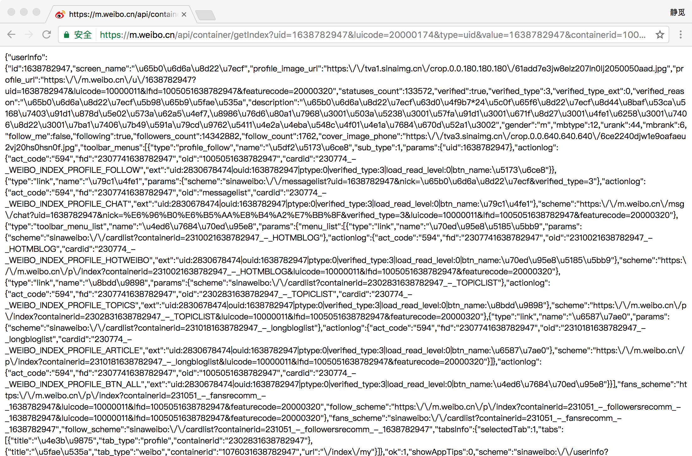
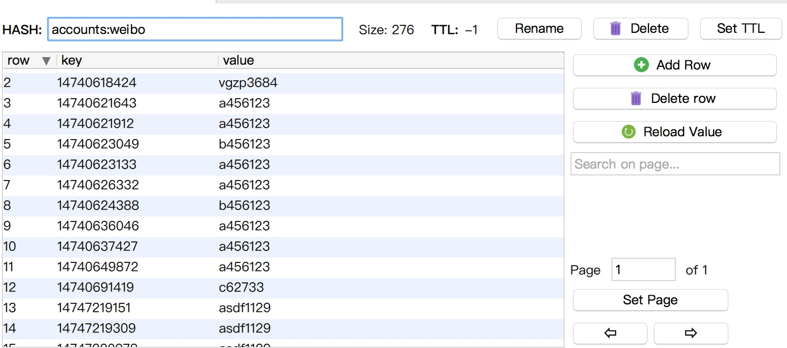

# Cookies池的搭建

很多情况下我们在做网站爬取的时候是没有登录的，在没有登录的情况下，我们可以访问一部分页面，也可以请求一些接口，因为毕竟网站本身需要做SEO，不能把所有的页面都做登录限制查看，所以网站一般都会有一些直接公开的页面或接口，我们可以直接进行爬取。

但是在不登录直接爬取会有一些弊端，在这里主要有两点：

* 设置了登录限制的页面无法爬取。如某论坛设置了登录才可查看资源，某博客设置了登录才可查看全文。或者如果想爬取和用户个人相关的数据，如淘宝某个用户所有的订单数据等等，这些页面都需要登录账号才可以查看和爬取。
* 一些页面和接口虽然可以直接请求，但是请求一旦频繁了就容易限制访问或者直接封IP，但是登录之后就会解除此限制，因此登录之后会降低接口无法访问的概率。

下面我们就第二种情况做一下简单的实验，以微博为例，我们先找到一个Ajax接口，例如新浪财经官方微博的信息接口，[https://m.weibo.cn/api/container/getIndex?uid=1638782947&luicode=20000174&type=uid&value=1638782947&containerid=1005051638782947](https://m.weibo.cn/api/container/getIndex?uid=1638782947&luicode=20000174&type=uid&value=1638782947&containerid=1005051638782947)，我们如果直接用浏览器打开就可以直接访问，返回的数据是Json格式，其中包含了新浪财经官方微博的一些信息，直接解析Json即可。



但是这个接口在没有登录的情况下会有请求频率检测，如果在一段时间内访问太过频繁，比如我们在浏览器里打开这个链接，一直不断刷新持续一小段时间，则会看到出现请求频率过高的提示，页面则会显示如下：


但此时如果我们重新打开一个浏览器窗口，打开[https://passport.weibo.cn/signin/login?entry=mweibo&r=https://m.weibo.cn/](https://passport.weibo.cn/signin/login?entry=mweibo&r=https://m.weibo.cn/)，登录微博账号之后再重新打开此链接，则仍然正常显示接口的结果，然而未登录的页面仍然显示请求过于频繁。


可以看到图中左侧是登录了账号之后请求接口的结果，右侧是未登录账号请求接口的结果，二者的接口链接是完全一样的。未登录状态无法正常访问，而登录状态依然可以正常显示。

因此，登录账号之后可以降低被封禁的概率。

因此我们可以尝试登录之后再做爬取，被封禁的几率会小很多，但是也不能完全排除被封禁的风险。如果是一直是同一个账号频繁请求，那就又可能就会遇到请求过于频繁而封号的问题。

所以如果需要做大规模抓取，我们就需要拥有很多个账号，每次请求随机选取一个账号，这样就降低了单个账号的访问频率，被封的概率又会大大降低。

那么如何维护这多个账号的登录信息呢？这时就需要用到Cookies池了，本节我们来看一下Cookies池的构建方法。


我们以新浪微博为例来介绍一下Cookies的搭建过程，在搭建之前肯定需要一些微博的账号，在淘宝上购买即可。

## Cookies池架构


## Cookies池的目标

Cookies池要做到易用、高效，我们一般需要做到下面的几个目标：

* 基本模块分为四块，存储模块、生成模块、检查模块、接口模块。
* 存储模块负责存储账号信息和Cookies信息。存储每个账号的用户名密码以及每个账号对应的Cookies信息，同时还需要提供一些方法来实现方便的存取操作。
* 生成模块负责生成新的Cookies。此模块会从存储模块逐个拿取账号的用户名和密码，然后模拟登录目标页面，判断登录成功就将Cookies返回回来，交给存储模块存储。
* 检测模块需要定时将数据库中的Cookies进行检测，在这里我们需要设置一个检测链接，不同的站点检测链接不同，检测模块会逐个把每个账号对应的Cookies拿来去请求这个链接，如果返回的状态是有效的，那么证明此Cookies没有失效，否则证明Cookies失效，将其移除，接下来等待生成模块重新生成即可。
* 接口模块需要用API来提供对外服务的接口，由于可用的Cookies可能有多个，我们可以提供随机返回一个Cookies的接口，这样保证每个Cookies每次都有可能被取到，Cookies越多，每个Cookies被取到的概率就会越小，从而减小了被封号的风险。

以上便是设计代理的一些基本思路，可以发现和前面讲的代理池有些相似之处。接下来我们就设计一下整体的架构，然后用代码该实现该Cookies池。

## Cookies池的架构

## Cookies池的实现

### 存储模块

首先我们想一下我们需要存储哪些内容，其实无非就是账号信息和Cookies信息。账号由两部分组成，用户名和密码，我们可以存成用户名和密码的映射。Cookies我们可以存成Json字符串，但是我们后面得需要根据账号来生成Cookies，生成的时候我们需要是哪些的账号已经生成了Cookies，哪些没有生成，所以我们需要同时保存该Cookies对应的用户名信息，其实也就是用户名和Cookies的映射。所以这里就是两组映射，我们自然而然想到Redis的Hash，所以在这里就建立两个Hash，结构分别如下：




这里的Hash的Key就是账号，Value就对应着密码或者Cookies。另外这里有一个架构上需要注意的点，由于我们的Cookies池需要做到可扩展，所以存储的账号和Cookies不一定单单只有本例中的微博，其他站点同样可以对接此Cookies池，所以在这里Hash的名称可以做二级分类，例如存账号的Hash的名称可以为accounts:weibo，Cookies的Hash的名称可以为cookies:weibo，以后如果有其他站点加入就可以灵活对接，如要扩展知乎的Cookies池就可以使用accounts:zhihu和cookies:zhihu，比较方便。所以在这里我们两个Hash的名称分别为accounts:weibo和cookies:weibo。

好，接下来我们就创建一个存储模块类，用以提供一些Hash的基本操作，代码如下：

```python
import random
import redis

class RedisClient(object):
    def __init__(self, type, website, host=REDIS_HOST, port=REDIS_PORT, password=REDIS_PASSWORD):
        """
        初始化Redis连接
        :param host: 地址
        :param port: 端口
        :param password: 密码
        """
        self.db = redis.StrictRedis(host=host, port=port, password=password, decode_responses=True)
        self.type = type
        self.website = website

    def name(self):
        """
        获取Hash的名称
        :return: Hash名称
        """
        return "{type}:{website}".format(type=self.type, website=self.website)

    def set(self, username, value):
        """
        设置键值对
        :param username: 用户名
        :param value: 密码或Cookies
        :return:
        """
        return self.db.hset(self.name(), username, value)

    def get(self, username):
        """
        根据键名获取键值
        :param username: 用户名
        :return:
        """
        return self.db.hget(self.name(), username)

    def delete(self, username):
        """
        根据键名删除键值对
        :param username: 用户名
        :return: 删除结果
        """
        return self.db.hdel(self.name(), username)

    def count(self):
        """
        获取数目
        :return: 数目
        """
        return self.db.hlen(self.name())

    def random(self):
        """
        随机得到键值，用于随机Cookies获取
        :return: 随机Cookies
        """
        return random.choice(self.db.hvals(self.name()))

    def usernames(self):
        """
        获取所有账户信息
        :return: 所有用户名
        """
        return self.db.hkeys(self.name())

    def all(self):
        """
        获取所有键值对
        :return: 用户名和密码或Cookies的映射表
        """
        return self.db.hgetall(self.name())
```

在这里我们新建了一个RedisClient类，其中初始化__init__()方法有两个关键参数type和website，分别代表类型和站点名称，就是用来拼接Hash的名称的两个字段，如果是账户的Hash，那么此处的type为accounts、website为weibo，如果是Cookies的Hash，那么此处的type为cookies、website为weibo。接下来还有几个字段就代表了Redis的连接信息，获得这些信息后初始化了StrictRedis对象，建立Redis连接。

name()方法则是拼接了type和website，组成Hash的名称，set()、get()、delete()方法分别代表设置、获取、删除Hash的某一个键值对，count()则是获取Hash的长度。

比较重要的方法是random()，主要是用于随机获取Cookies使用的，在这里从Hash里面随机选取了一个Cookies并返回，每调用一次random()方法都会获得随机的Cookies，此方法再与接口模块对接即可实现请求接口获取随机Cookies。

### 生成模块

生成模块负责获取各个账号信息并模拟登录，随后生成Cookies并保存。在这里我们首先需要获取两个Hash的信息，看一下账户的Hash比Cookies的Hash多了哪些还没有生成Cookies的账号，将剩余的账号遍历，再去生成Cookies。

所以这里的主要逻辑就是找出哪些还没有对应Cookies的账号，然后再去逐个获取Cookies，代码如下：

```python
for username in accounts_usernames:
    if not username in cookies_usernames:
        password = self.accounts_db.get(username)
        print('正在生成Cookies', '账号', username, '密码', password)
        result = self.new_cookies(username, password)
```

因为在这里我们对接的是新浪微博，所以在这里我们就需要模拟新浪微博登录，而在前面破解验证码一章我们已经破解了新浪微博的四宫格验证码，在这里我们直接对接过来即可，不过相比之前我们需要加一个获取Cookies的方法，并针对不同的情况返回不同的结果，逻辑如下：

```python
def get_cookies(self):
    return self.browser.get_cookies()

def main(self):
    self.open()
    if self.password_error():
        return {
            'status': 2,
            'content': '用户名或密码错误'
        }
    # 如果不需要验证码直接登录成功
    if self.login_successfully():
        cookies = self.get_cookies()
        return {
            'status': 1,
            'content': cookies
        }
    # 获取验证码图片
    image = self.get_image('captcha.png')
    numbers = self.detect_image(image)
    self.move(numbers)
    if self.login_successfully():
        cookies = self.get_cookies()
        return {
            'status': 1,
            'content': cookies
        }
    else:
        return {
            'status': 3,
            'content': '登录失败'
        }
```

在这里返回的类型是字典，并且附有状态码status，在生成模块我们可以根据不同的状态码做相应的情况处理。例如遇到状态码为1的情况，证明成功获取到了Cookies，只需要将Cookies保存到数据库即可。如遇到状态码为2的情况就代表用户名或密码错误，也就是当前数据库中存储的账号信息是不对的，那么我们就应该把它删除。如果遇到状态码为3的情况则代表登录失败的一些错误，此时不能判断出用户名或密码是错误的也不能成功获取Cookies，那么简单做一下提示，再进行下一个处理即可，类似代码实现如下：

```python
result = self.new_cookies(username, password)
# 成功获取
if result.get('status') == 1:
    cookies = self.process_cookies(result.get('content'))
    print('成功获取到Cookies', cookies)
    if self.cookies_db.set(username, json.dumps(cookies)):
        print('成功保存Cookies')
# 密码错误，移除账号
elif result.get('status') == 2:
    print(result.get('content'))
    if self.accounts_db.delete(username):
        print('成功删除账号')
else:
    print(result.get('content'))
```

当然如果要扩展其他站点的话，就遵循这个规则就好了，比如1即代表获取成功，2即代表用户名或密码错误。所以扩展其他节点时我们只需要实现new_cookies()方法即可，然后按此处理规则返回对应的模拟登录结果。

那么这样运行完毕之后就会遍历一次尚未生成Cookies的账号，模拟登录生成新的Cookies。

### 检测模块


