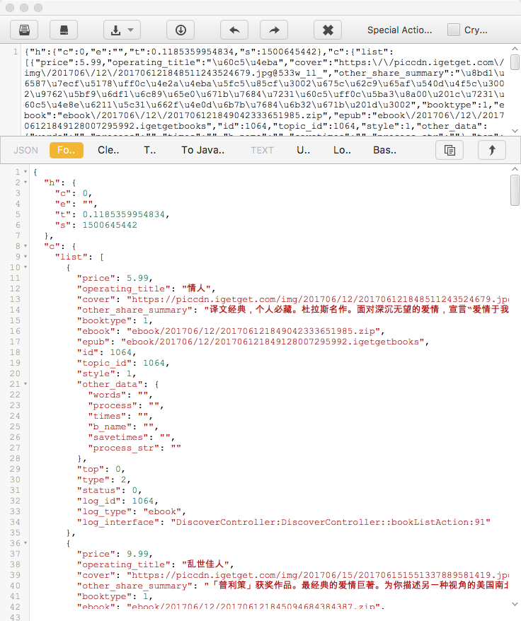
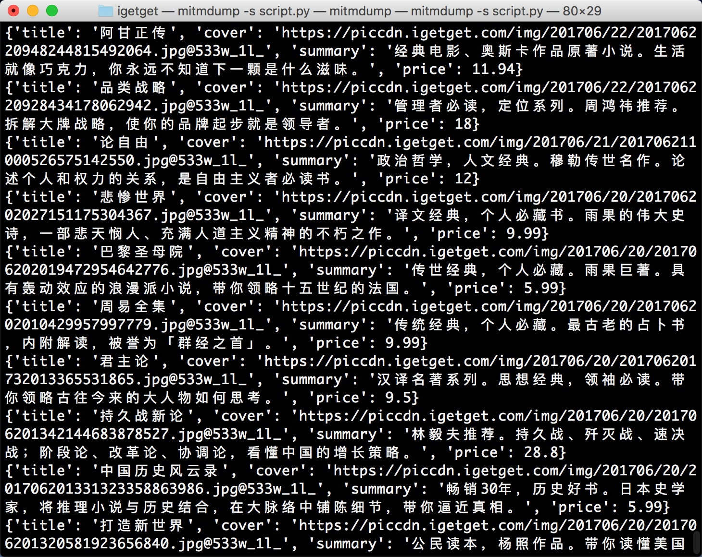

# 11.3 mitmdump 爬取 “得到” App 电子书信息

“得到” App 是罗辑思维出品的一款碎片时间学习的 App，其官方网站为 https://www.igetget.com，App 内有很多学习资源。不过 “得到” App 没有对应的网页版，所以信息必须要通过 App 才可以获取。这次我们通过抓取其 App 来练习 mitmdump 的用法。

### 1. 爬取目标

我们的爬取目标是 App 内电子书版块的电子书信息，并将信息保存到 MongoDB，如图 11-30 所示。


我们要把图书的名称、简介、封面、价格爬取下来，不过这次爬取的侧重点还是了解 mitmdump 工具的用法，所以暂不涉及自动化爬取，App 的操作还是手动进行。mitmdump 负责捕捉响应并将数据提取保存。

### 2. 准备工作

请确保已经正确安装好了 mitmproxy 和 mitmdump，手机和 PC 处于同一个局域网下，同时配置好了 mitmproxy 的 CA 证书，安装好 MongoDB 并运行其服务，安装 PyMongo 库，具体的配置可以参考第 1 章的说明。

### 3. 抓取分析

首先探寻一下当前页面的 URL 和返回内容，我们编写一个脚本如下所示：

```python
def response(flow):
    print(flow.request.url)
    print(flow.response.text)
```

这里只输出了请求的 URL 和响应的 Body 内容，也就是请求链接和响应内容这两个最关键的部分。脚本保存名称为 script.py。

接下来运行 mitmdump，命令如下所示：

```
mitmdump -s script.py
```

打开 “得到” App 的电子书页面，便可以看到 PC 端控制台有相应输出。接着滑动页面加载更多电子书，控制台新出现的输出内容就是 App 发出的新的加载请求，包含了下一页的电子书内容。控制台输出结果示例如图 11-31 所示。


图 11-31 控制台输出

可以看到 URL 为 https://dedao.igetget.com/v3/discover/bookList 的接口，其后面还加了一个 sign 参数。通过 URL 的名称，可以确定这就是获取电子书列表的接口。在 URL 的下方输出的是响应内容，是一个 JSON 格式的字符串，我们将它格式化，如图 11-32 所示。



图 11-32 格式化结果

格式化后的内容包含一个 c 字段、一个 list 字段，list 的每个元素都包含价格、标题、描述等内容。第一个返回结果是电子书《情人》，而此时 App 的内容也是这本电子书，描述的内容和价格也是完全匹配的，App 页面如图 11-33 所示。


图 11-33 APP 页面

这就说明当前接口就是获取电子书信息的接口，我们只需要从这个接口来获取内容就好了。然后解析返回结果，将结果保存到数据库。

### 4. 数据抓取

接下来我们需要对接口做过滤限制，抓取如上分析的接口，再提取结果中的对应字段。

这里，我们修改脚本如下所示：

```python
import json
from mitmproxy import ctx

def response(flow):
    url = 'https://dedao.igetget.com/v3/discover/bookList'
    if flow.request.url.startswith(url):
        text = flow.response.text
        data = json.loads(text)
        books = data.get('c').get('list')
        for book in books:
            ctx.log.info(str(book))
```

重新滑动电子书页面，在 PC 端控制台观察输出，如图 11-34 所示。


图 11-34 控制台输出

现在输出了图书的全部信息，一本图书信息对应一条 JSON 格式的数据。

### 5. 提取保存

接下来我们需要提取信息，再把信息保存到数据库中。方便起见，我们选择 MongoDB 数据库。

脚本还可以增加提取信息和保存信息的部分，修改代码如下所示：

```python
import json
import pymongo
from mitmproxy import ctx

client = pymongo.MongoClient('localhost')
db = client['igetget']
collection = db['books']


def response(flow):
    global collection
    url = 'https://dedao.igetget.com/v3/discover/bookList'
    if flow.request.url.startswith(url):
        text = flow.response.text
        data = json.loads(text)
        books = data.get('c').get('list')
        for book in books:
            data = {'title': book.get('operating_title'),
                'cover': book.get('cover'),
                'summary': book.get('other_share_summary'),
                'price': book.get('price')
            }
            ctx.log.info(str(data))
            collection.insert(data)
```

重新滑动页面，控制台便会输出信息，如图 11-35 所示。



图 11-35 控制台输出

现在输出的每一条内容都是经过提取之后的内容，包含了电子书的标题、封面、描述、价格信息。

最开始我们声明了 MongoDB 的数据库连接，提取出信息之后调用该对象的 insert() 方法将数据插入到数据库即可。

滑动几页，发现所有图书信息都被保存到 MongoDB 中，如图 11-36 所示。


目前为止，我们利用一个非常简单的脚本把 “得到” App 的电子书信息保存下来。

### 6. 本节代码

本节的代码地址是：[https://github.com/Python3WebSpider/IGetGet](https://github.com/Python3WebSpider/IGetGet)。

### 7. 结语

本节主要讲解了 mitmdump 的用法及脚本的编写方法。通过本节的实例，我们可以学习到如何实时将 App 的数据抓取下来。