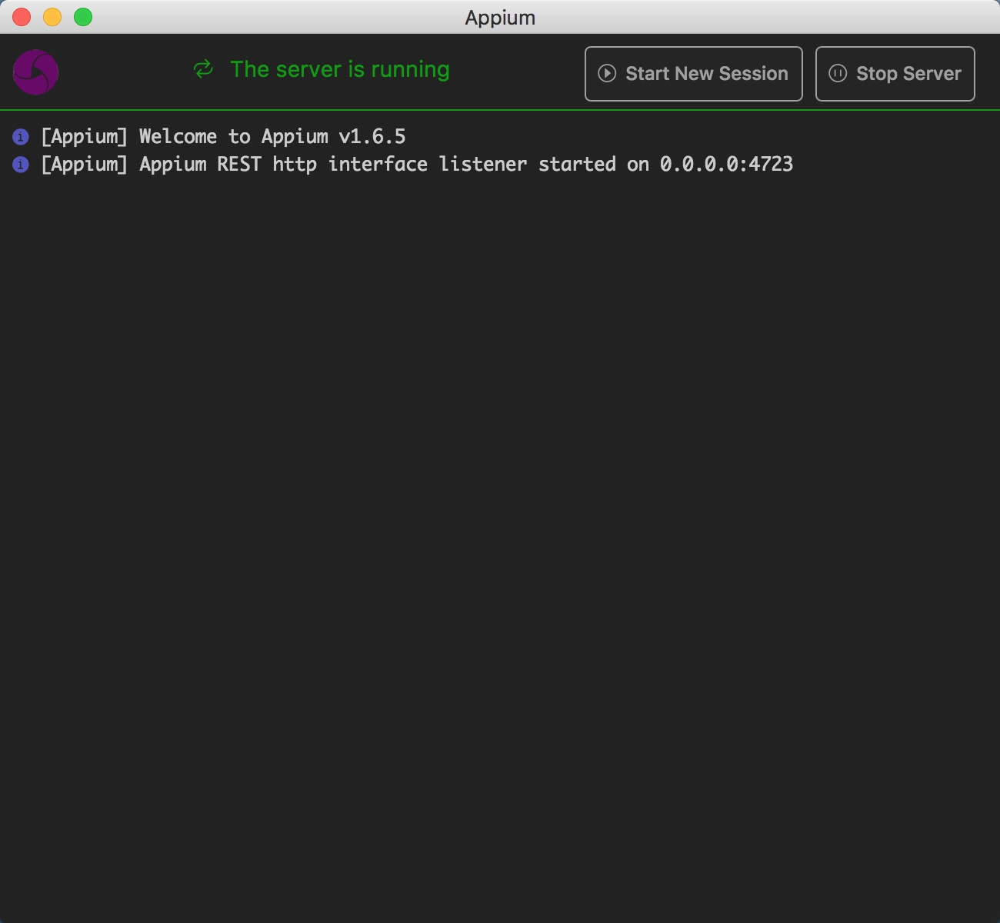
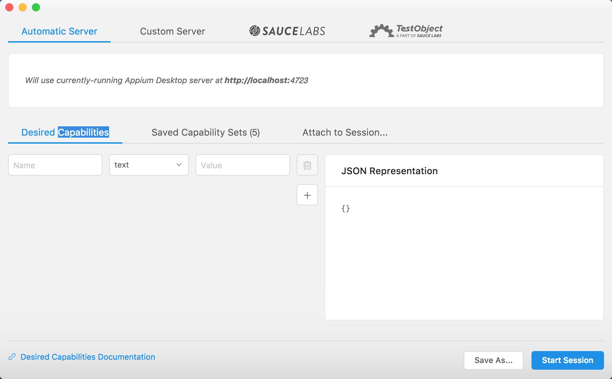
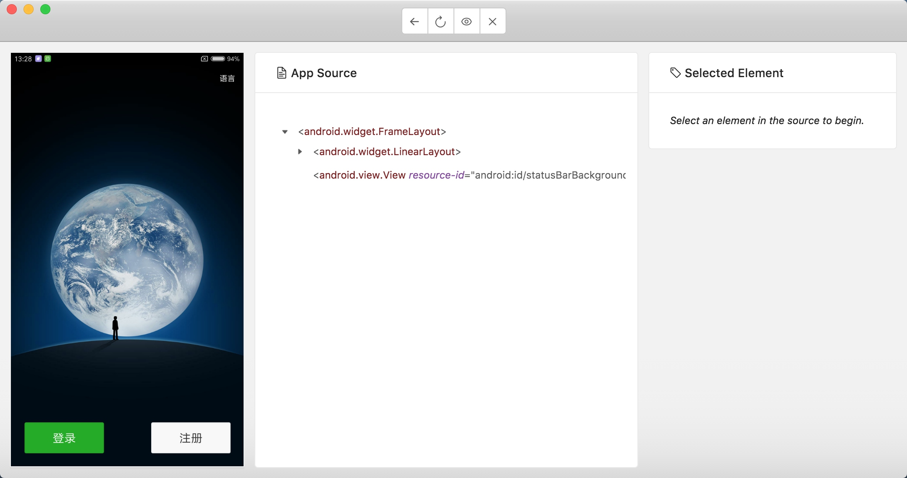
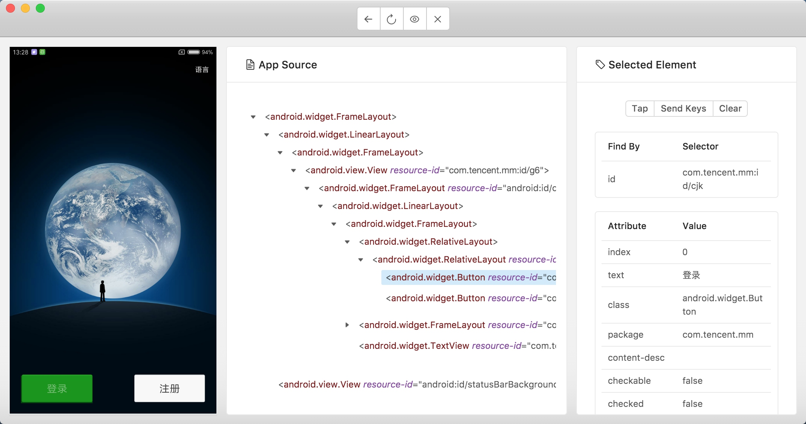

# 11.4 Appium 的基本使用

Appium 是一个跨平台移动端自动化测试工具，可以非常便捷地为 iOS 和 Android 平台创建自动化测试用例。它可以模拟 App 内部的各种操作，如点击、滑动、文本输入等，只要我们手工操作的动作 Appium 都可以完成。在前面我们了解过 Selenium，它是一个网页端的自动化测试工具。Appium 实际上继承了 Selenium，Appium 也是利用 WebDriver 来实现 App 的自动化测试。对 iOS 设备来说，Appium 使用 UIAutomation 来实现驱动。对于 Android 来说，它使用 UiAutomator 和 Selendroid 来实现驱动。

Appium 相当于一个服务器，我们可以向 Appium 发送一些操作指令，Appium 就会根据不同的指令对移动设备进行驱动，完成不同的动作。

对于爬虫来说，我们用 Selenium 来抓取 JavaScript 渲染的页面，可见即可爬。Appium 同样也可以，用 Appium 来做 App 爬虫不失为一个好的选择。

下面我们来了解 Appium 的基本使用方法。

### 1. 本节目标

我们以 Android 平台的微信为例来演示 Appium 启动和操作 App 的方法，主要目的是了解利用 Appium 进行自动化测试的流程以及相关 API 的用法。

### 2. 准备工作

请确保 PC 已经安装好 Appium、Android 开发环境和 Python 版本的 Appium API，安装方法可以参考第 1 章。另外，Android 手机安装好微信 App。

### 3. 启动 APP

Appium 启动 App 的方式有两种：一种是用 Appium 内置的驱动器来打开 App，另一种是利用 Python 程序实现此操作。下面我们分别进行说明。

首先打开 Appium，启动界面如图 11-37 所示。


图 11-37 Appium 启动界面

直接点击 Start Server 按钮即可启动 Appium 的服务，相当于开启了一个 Appium 服务器。我们可以通过 Appium 内置的驱动或 Python 代码向 Appium 的服务器发送一系列操作指令，Appium 就会根据不同的指令对移动设备进行驱动，完成不同的动作。启动后运行界面如图 11-38 所示。



图 11-38 Server 运行界面

Appium 运行之后正在监听 4723 端口。我们可以向此端口对应的服务接口发送操作指令，此页面就会显示这个过程的操作日志。

将 Android 手机通过数据线和运行 Appium 的 PC 相连，同时打开 USB 调试功能，确保 PC 可以连接到手机。

可以输入 adb 命令来测试连接情况，如下所示：

```
adb devices -l
```

如果出现类似如下结果，这就说明 PC 已经正确连接手机。

```
List of devices attached
2da42ac0 device usb:336592896X product:leo model:MI_NOTE_Pro device:leo
```

model 是设备的名称，就是后文需要用到的 deviceName 变量。我使用的是小米 Note 顶配版，所以此处名称为 MI_NOTE_Pro。

如果提示找不到 adb 命令，请检查 Android 开发环境和环境变量是否配置成功。如果可以成功调用 adb 命令但不显示设备信息，请检查手机和 PC 的连接情况。

接下来用 Appium 内置的驱动器打开 App，点击 Appium 中的 Start New Session 按钮，如图 11-39 所示。


图 11-39 操作示例

这时会出现一个配置页面，如图 11-40 所示。



图 11-40 配置页面

需要配置启动 App 时的 Desired Capabilities 参数，它们分别是 platformName、deviceName、appPackage、appActivity。
* platformName，平台名称，需要区分是 Android 还是 iOS，此处填写 Android。
* deviceName，设备名称，是手机的具体类型。
* appPackage，APP 程序包名。
* appActivity，入口 Activity 名，这里通常需要以。开头。

在当前配置页面的左下角也有配置参数的相关说明，链接是 [https://github.com/appium/appium/blob/master/docs/en/writing-running-appium/caps.md](https://github.com/appium/appium/blob/master/docs/en/writing-running-appium/caps.md)。

我们在 Appium 中加入上面 4 个配置，如图 11-41 所示。


图 11-41 配置信息

点击保存按钮，保存下来，我们以后可以继续使用这个配置。

点击右下角的 Start Session 按钮，即可启动 Android 手机上的微信 App 并进入到启动页面。同时 PC 上会弹出一个调试窗口，从这个窗口我们可以预览当前手机页面，并可以查看页面的源码，如图 11-42 所示。



图 11-42 调试窗口

点击左栏中屏幕的某个元素，如选中登录按钮，它就会高亮显示。这时中间栏就显示了当前选中的按钮对应的源代码，右栏则显示了该元素的基本信息，如元素的 id、class、text 等，以及可以执行的操作，如 Tap、Send Keys、Clear，如图 11-43 所示。



图 11-43 操作选项

点击中间栏最上方的第三个录制按钮，Appium 会开始录制操作动作，这时我们在窗口中操作 App 的行为都会被记录下来，Recorder 处可以自动生成对应语言的代码。例如，我们点击录制按钮，然后选中 App 中的登录按钮，点击 Tap 操作，即模拟了按钮点击功能，这时手机和窗口的 App 都会跳转到登录页面，同时中间栏会显示此动作对应的代码，如图 11-44 所示。


图 11-44 录制动作

接下来选中左侧的手机号文本框，点击 Send Keys，对话框就会弹出。输入手机号，点击 Send Keys，即可完成文本的输入，如图 11-45 所示。


图 11-45 文本输入

我们可以在此页面点击不同的动作按钮，即可实现对 App 的控制，同时 Recorder 部分也可以生成对应的 Python 代码。

下面我们看看使用 Python 代码驱动 App 的方法。首先需要在代码中指定一个 Appium Server，而这个 Server 在刚才打开 Appium 的时候就已经开启了，是在 4723 端口上运行的，配置如下所示：

```python
server = 'http://localhost:4723/wd/hub'
```
用字典来配置 Desired Capabilities 参数，代码如下所示：
```python
desired_caps = {
    'platformName': 'Android',
    'deviceName': 'MI_NOTE_Pro',
    'appPackage': 'com.tencent.mm',
    'appActivity': '.ui.LauncherUI'
}
```
新建一个 Session，这类似点击 Appium 内置驱动的 Start Session 按钮相同的功能，代码实现如下所示：
```python
from appium import webdriver
from selenium.webdriver.support.ui import WebDriverWait

driver = webdriver.Remote(server, desired_caps)
```

配置完成后运行，就可以启动微信 App 了。但是现在仅仅是可以启动 App，还没有做任何动作。

再用代码来模拟刚才演示的两个动作：一个是点击 “登录” 按钮，一个是输入手机号。

看看刚才 Appium 内置驱动器内的 Recorder 录制生成的 Python 代码，自动生成的代码非常累赘，例如点击 “登录” 按钮的代码如下所示：

```python
el1 = driver.find_element_by_xpath("/hierarchy/android.widget.FrameLayout/android.widget.LinearLayout/android.widget.FrameLayout/android.view.View/android.widget.FrameLayout/android.widget.LinearLayout/android.widget.FrameLayout/android.widget.RelativeLayout/android.widget.RelativeLayout/android.widget.Button[1]")
el1.click()
```
这段代码的 XPath 选择器路径太长，选择方式没有那么科学，获取元素时也没有设置等待，很可能会有超时异常。所以我们修改一下，将其修改为通过 ID 查找元素，设置延时等待，两次操作的代码改写如下所示：
```python
wait = WebDriverWait(driver, 30)
login = wait.until(EC.presence_of_element_located((By.ID, 'com.tencent.mm:id/cjk')))
login.click()
phone = wait.until(EC.presence_of_element_located((By.ID, 'com.tencent.mm:id/h2')))
phone.set_text('18888888888')
```
综上所述，完整的代码如下所示：
```python
from appium import webdriver
from selenium.webdriver.common.by import By
from selenium.webdriver.support.ui import WebDriverWait
from selenium.webdriver.support import expected_conditions as EC

server = 'http://localhost:4723/wd/hub'
desired_caps = {
    'platformName': 'Android',
    'deviceName': 'MI_NOTE_Pro',
    'appPackage': 'com.tencent.mm',
    'appActivity': '.ui.LauncherUI'
}
driver = webdriver.Remote(server, desired_caps)
wait = WebDriverWait(driver, 30)
login = wait.until(EC.presence_of_element_located((By.ID, 'com.tencent.mm:id/cjk')))
login.click()
phone = wait.until(EC.presence_of_element_located((By.ID, 'com.tencent.mm:id/h2')))
phone.set_text('18888888888')
```

一定要重新连接手机，再运行此代码，这时即可观察到手机上首先弹出了微信欢迎页面，然后模拟点击登录按钮、输入手机号，操作完成。这样我们就成功使用 Python 代码实现了 App 的操作。

### 4. API

接下来看看使用代码如何操作 App、总结相关 API 的用法。这里使用的 Python 库为 AppiumPythonClient，其 GitHub 地址为 https://github.com/appium/python-client，此库继承自 Selenium，使用方法与 Selenium 有很多共同之处。

#### 初始化

需要配置 Desired Capabilities 参数，完整的配置说明可以参考 [https://github.com/appium/appium/blob/master/docs/en/writing-running-appium/caps.md](https://github.com/appium/appium/blob/master/docs/en/writing-running-appium/caps.md)，一般来说我们我们配置几个基本参数即可：

```python
from appium import webdriver

server = 'http://localhost:4723/wd/hub'
desired_caps = {
    'platformName': 'Android',
    'deviceName': 'MI_NOTE_Pro',
    'appPackage': 'com.tencent.mm',
    'appActivity': '.ui.LauncherUI'
}
driver = webdriver.Remote(server, desired_caps)
```

这里配置了启动微信 App 的 Desired Capabilities，这样 Appnium 就会自动查找手机上的包名和入口类，然后将其启动。包名和入口类的名称可以在安装包中的 AndroidManifest.xml 文件获取。

如果要打开的 App 没有事先在手机上安装，我们可以直接指定 App 参数为安装包所在路径，这样程序启动时就会自动向手机安装并启动 App，如下所示：

```python
from appium import webdriver

server = 'http://localhost:4723/wd/hub'
desired_caps = {
    'platformName': 'Android',
    'deviceName': 'MI_NOTE_Pro',
    'app': './weixin.apk'
}
driver = webdriver.Remote(server, desired_caps)
```

程序启动的时候就会寻找 PC 当前路径下的 APK 安装包，然后将其安装到手机中并启动。

#### 查找元素

我们可以使用 Selenium 中通用的查找方法来实现元素的查找，如下所示：

```python
el = driver.find_element_by_id('com.tencent.mm:id/cjk')
```

在 Selenium 中，其他查找元素的方法同样适用，在此不再赘述。

在 Android 平台上，我们还可以使用 UIAutomator 来进行元素选择，如下所示：

```python
el = self.driver.find_element_by_android_uiautomator('new UiSelector().description("Animation")')
els = self.driver.find_elements_by_android_uiautomator('new UiSelector().clickable(true)')
```
在 iOS 平台上，我们可以使用 UIAutomation 来进行元素选择，如下所示：
```python
el = self.driver.find_element_by_ios_uiautomation('.elements()[0]')
els = self.driver.find_elements_by_ios_uiautomation('.elements()')
```
还可以使用 iOS Predicates 来进行元素选择，如下所示：
```python
el = self.driver.find_element_by_ios_predicate('wdName == "Buttons"')
els = self.driver.find_elements_by_ios_predicate('wdValue == "SearchBar" AND isWDDivisible == 1')
```
也可以使用 iOS Class Chain 来进行选择，如下所示：
```python
el = self.driver.find_element_by_ios_class_chain('XCUIElementTypeWindow/XCUIElementTypeButton[3]')
els = self.driver.find_elements_by_ios_class_chain('XCUIElementTypeWindow/XCUIElementTypeButton')
```

但是此种方法只适用于 XCUITest 驱动，具体可以参考：https://github.com/appium/appium-xcuitest-  
driver。

#### 点击

点击可以使用 tap() 方法，该方法可以模拟手指点击（最多五个手指），可设置按时长短（毫秒），代码如下所示：

```python
tap(self, positions, duration=None)
```

参数：
* positions，点击的位置组成的列表。
* duration，点击持续时间。

实例如下：

```python
driver.tap([(100, 20), (100, 60), (100, 100)], 500)
```

这样就可以模拟点击屏幕的某几个点。

另外对于某个元素如按钮来说，我们可以直接调用 cilck() 方法实现模拟点击，实例如下所示：

```python
button = find_element_by_id('com.tencent.mm:id/btn')
button.click()
```

这样获取元素之后，然后调用 click() 方法即可实现该元素的模拟点击。

#### 屏幕拖动

可以使用 scroll() 方法模拟屏幕滚动，用法如下所示：

```python
scroll(self, origin_el, destination_el)
```

可以实现从元素 origin_el 滚动至元素 destination_el。

参数：
* original_el，被操作的元素
* destination_el，目标元素

实例如下：

```python
driver.scroll(el1,el2)
```
我们还可以使用 swipe() 模拟从 A 点滑动到 B 点，用法如下：
```python
swipe(self, start_x, start_y, end_x, end_y, duration=None)
```

参数：
* start_x，开始位置的横坐标
* start_y，开始位置的纵坐标
* end_x，终止位置的横坐标
* end_y，终止位置的纵坐标
* duration，持续时间，毫秒

实例如下：
```python
driver.swipe(100, 100, 100, 400, 5000)
```

这样可以实现在 5s 由 (100, 100) 滑动到 (100, 400)。

另外可以使用 flick() 方法模拟从 A 点快速滑动到 B 点，用法如下：

```python
flick(self, start_x, start_y, end_x, end_y)
```

参数：
* start_x，开始位置的横坐标
* start_y，开始位置的纵坐标
* end_x，终止位置的横坐标
* end_y，终止位置的纵坐标

实例如下：
```python
driver.flick(100, 100, 100, 400)
```

#### 拖拽

可以使用 drag_and_drop() 实现某个元素拖动到另一个目标元素上。

用法如下：

```python
drag_and_drop(self, origin_el, destination_el)
```

可以实现元素 origin_el 拖拽至元素 destination_el。

参数：
* original_el，被拖拽的元素
* destination_el，目标元素

实例如下所示：

```python
driver.drag_and_drop(el1, el2)
```

#### 文本输入

可以使用 set_text() 方法实现文本输入，如下所示：

```python
el = find_element_by_id('com.tencent.mm:id/cjk')
el.set_text('Hello')
```

我们选中一个文本框元素之后，然后调用 set_text() 方法即可实现文本输入。

#### 动作链

与 Selenium 中的 ActionChains 类似，Appium 中的 TouchAction 可支持的方法有 tap()、press()、long_press()、release()、move_to()、wait()、cancel() 等，实例如下所示：

```python
el = self.driver.find_element_by_accessibility_id('Animation')
action = TouchAction(self.driver)
action.tap(el).perform()
```

首先选中一个元素，然后利用 TouchAction 实现点击操作。

如果想要实现拖动操作，可以用如下方式：

```python
els = self.driver.find_elements_by_class_name('listView')
a1 = TouchAction()
a1.press(els[0]).move_to(x=10, y=0).move_to(x=10, y=-75).move_to(x=10, y=-600).release()
a2 = TouchAction()
a2.press(els[1]).move_to(x=10, y=10).move_to(x=10, y=-300).move_to(x=10, y=-600).release()
```

利用以上 API，我们就可以完成绝大部分操作。更多的 API 操作可以参考 [https://testerhome.com/topics/3711](https://testerhome.com/topics/3711)。

### 5. 结语

本节中，我们主要了解了 Appium 的操作 App 的基本用法，以及常用 API 的用法。在下一节我们会用一个实例来演示 Appium 的使用方法。