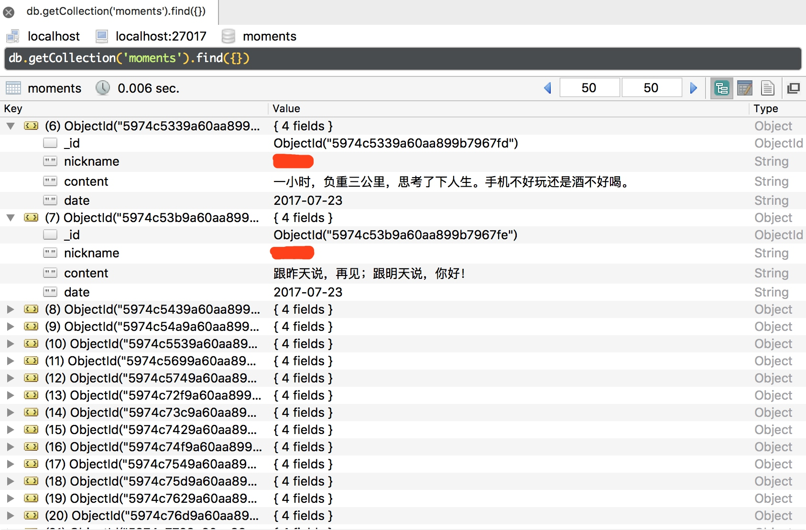

# 11.5 Appium 爬取微信朋友圈

接下来，我们将实现微信朋友圈的爬取。

如果直接用 Charles 或 mitmproxy 来监听微信朋友圈的接口数据，这是无法实现爬取的，因为数据都是被加密的。而 Appium 不同，Appium 作为一个自动化测试工具可以直接模拟 App 的操作并可以获取当前所见的内容。所以只要 App 显示了内容，我们就可以用 Appium 抓取下来。

### 1. 本节目标

本节我们以 Android 平台为例，实现抓取微信朋友圈的动态信息。动态信息包括好友昵称、正文、发布日期。其中发布日期还需要进行转换，如日期显示为 1 小时前，则时间转换为今天，最后动态信息保存到 MongoDB。

### 2. 准备工作

请确保 PC 已经安装好 Appium、Android 开发环境和 Python 版本的 Appium API。Android 手机安装好微信 App、PyMongo 库，安装 MongoDB 并运行其服务，安装方法可以参考第 1 章。

### 3. 初始化

首先新建一个 Moments 类，进行一些初始化配置，如下所示：

```python
PLATFORM = 'Android'
DEVICE_NAME = 'MI_NOTE_Pro'
APP_PACKAGE = 'com.tencent.mm'
APP_ACTIVITY = '.ui.LauncherUI'
DRIVER_SERVER = 'http://localhost:4723/wd/hub'
TIMEOUT = 300
MONGO_URL = 'localhost'
MONGO_DB = 'moments'
MONGO_COLLECTION = 'moments'

class Moments():
    def __init__(self):
        """初始化"""
        # 驱动配置
        self.desired_caps = {
            'platformName': PLATFORM,
            'deviceName': DEVICE_NAME,
            'appPackage': APP_PACKAGE,
            'appActivity': APP_ACTIVITY
        }
        self.driver = webdriver.Remote(DRIVER_SERVER, self.desired_caps)
        self.wait = WebDriverWait(self.driver, TIMEOUT)
        self.client = MongoClient(MONGO_URL)
        self.db = self.client[MONGO_DB]
        self.collection = self.db[MONGO_COLLECTION]
```

这里实现了一些初始化配置，如驱动的配置、延时等待配置、MongoDB 连接配置等。

### 4. 模拟登录

接下来要做的就是登录微信。点击登录按钮，输入用户名、密码，提交登录即可。实现样例如下所示：

```python
def login(self):
    # 登录按钮
    login = self.wait.until(EC.presence_of_element_located((By.ID, 'com.tencent.mm:id/cjk')))
    login.click()
    # 手机输入
    phone = self.wait.until(EC.presence_of_element_located((By.ID, 'com.tencent.mm:id/h2')))
    phone.set_text(USERNAME)
    # 下一步
    next = self.wait.until(EC.element_to_be_clickable((By.ID, 'com.tencent.mm:id/adj')))
    next.click()
    # 密码
    password = self.wait.until(EC.presence_of_element_located((By.XPATH, '//*[@resource-id="com.tencent.mm:id/h2"][1]')))
    password.set_text(PASSWORD)
    # 提交
    submit = self.wait.until(EC.element_to_be_clickable((By.ID, 'com.tencent.mm:id/adj')))
    submit.click()
```

这里依次实现了一些点击和输入操作，思路比较简单。对于不同的平台和版本来说，流程可能不太一致，这里仅作参考。

登录完成之后，进入朋友圈的页面。选中朋友圈所在的选项卡，点击朋友圈按钮，即可进入朋友圈，代码实现如下所示：

```python
def enter(self):
    # 选项卡
    tab = self.wait.until(EC.presence_of_element_located((By.XPATH, '//*[@resource-id="com.tencent.mm:id/bw3"][3]')))
    tab.click()
    # 朋友圈
    moments = self.wait.until(EC.presence_of_element_located((By.ID, 'com.tencent.mm:id/atz')))
    moments.click()
```

抓取工作正式开始。

### 5. 抓取动态

我们知道朋友圈可以一直拖动、不断刷新，所以这里需要模拟一个无限拖动的操作，如下所示：

```python
# 滑动点
FLICK_START_X = 300
FLICK_START_Y = 300
FLICK_DISTANCE = 700

def crawl(self):
    while True:
        # 上滑
        self.driver.swipe(FLICK_START_X, FLICK_START_Y + FLICK_DISTANCE, FLICK_START_X, FLICK_START_Y)
```

我们利用 swipe() 方法，传入起始和终止点实现拖动，加入无限循环实现无限拖动。

获取当前显示的朋友圈的每条状态对应的区块元素，遍历每个区块元素，再获取内部显示的用户名、正文和发布时间，代码实现如下所示：

```python
# 当前页面显示的所有状态
items = self.wait.until(
    EC.presence_of_all_elements_located((By.XPATH, '//*[@resource-id="com.tencent.mm:id/cve"]//android.widget.FrameLayout')))
# 遍历每条状态
for item in items:
    try:
        # 昵称
        nickname = item.find_element_by_id('com.tencent.mm:id/aig').get_attribute('text')
        # 正文
        content = item.find_element_by_id('com.tencent.mm:id/cwm').get_attribute('text')
        # 日期
        date = item.find_element_by_id('com.tencent.mm:id/crh').get_attribute('text')
        # 处理日期
        date = self.processor.date(date)
        print(nickname, content, date)
        data = {
            'nickname': nickname,
            'content': content,
            'date': date,
        }   
    except NoSuchElementException:
        pass
```

这里遍历每条状态，再调用 find_element_by_id() 方法获取昵称、正文、发布日期对应的元素，然后通过 get_attribute() 方法获取内容。这样我们就成功获取到朋友圈的每条动态信息。

针对日期的处理，我们调用了一个 Processor 类的 date() 处理方法，该方法实现如下所示：

```python
def date(self, datetime):
    """
    处理时间
    :param datetime: 原始时间
    :return: 处理后时间
    """
    if re.match('\d + 分钟前 ', datetime):
        minute = re.match('(\d+)', datetime).group(1)
        datetime = time.strftime('% Y-% m-% d', time.localtime(time.time() - float(minute) * 60))
    if re.match('\d + 小时前 ', datetime):
        hour = re.match('(\d+)', datetime).group(1)
        datetime = time.strftime('% Y-% m-% d', time.localtime(time.time() - float(hour) * 60 * 60))
    if re.match(' 昨天 ', datetime):
        datetime = time.strftime('% Y-% m-% d', time.localtime(time.time() - 24 * 60 * 60))
    if re.match('\d + 天前 ', datetime):
        day = re.match('(\d+)', datetime).group(1)
        datetime = time.strftime('% Y-% m-% d', time.localtime(time.time()) - float(day) * 24 * 60 * 60)
    return datetime
```

这个方法使用了正则匹配的方法来提取时间中的具体数值，再利用时间转换函数实现时间的转换。例如时间是 5 分钟前，这个方法先将 5 提取出来，用当前时间戳减去 300 即可得到发布时间的时间戳，然后再转化为标准时间即可。

最后调用 MongoDB 的 API 来实现爬取结果的存储。为了去除重复，这里调用了 update() 方法，实现如下所示：

```python
self.collection.update({'nickname': nickname, 'content': content}, {'$set': data}, True)
```

首先根据昵称和正文来查询信息，如果信息不存在，则插入数据，否则更新数据。这个操作的关键点是第三个参数 True，此参数设置为 True，这可以实现存在即更新、不存在则插入的操作。

最后实现一个入口方法调用以上的几个方法。调用此方法即可开始爬取，代码实现如下所示：

```python
def main(self):
    # 登录
    self.login()
    # 进入朋友圈
    self.enter()
    # 爬取
    self.crawl()
```

这样我们就完成了整个朋友圈的爬虫。代码运行之后，手机微信便会启动，并且可以成功进入到朋友圈然后一直不断执行拖动过程。控制台输出相应的爬取结果，结果被成功保存到 MongoDB 数据库中。

### 6. 结果查看

我们到 MongoDB 中查看爬取结果，如图 11-46 所示。



可以看到朋友圈的数据就成功保存到了数据库。

### 7. 本节代码

本节源代码地址为：[https://github.com/Python3WebSpider/Moments](https://github.com/Python3WebSpider/Moments)。

### 8. 结语

以上内容是利用 Appium 爬取微信朋友圈的过程。利用 Appium，我们可以做到 App 的可见即可爬，也可以实现自动化驱动和数据爬取。但是实际运行之后，Appium 的解析比较烦琐，而且容易发生重复和中断。如果我们可以用前文所说的 mitmdump 来监听 App 数据实时处理，而 Appium 只负责自动化驱动，它们各负其责，那么整个爬取效率和解析效率就会高很多。所以下一节我们会了解，将 mitmdump 和 Appium 结合起来爬取京东商品的过程。