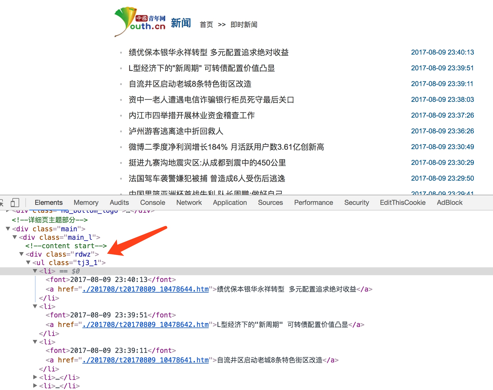
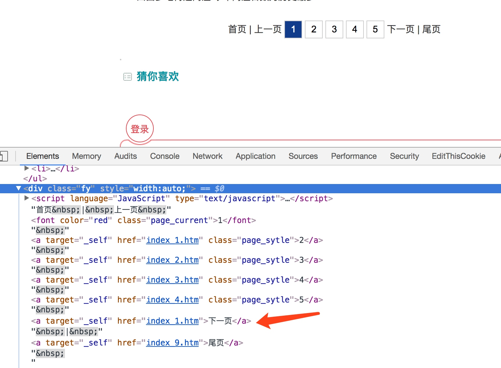

# Scrapy通用爬虫

使用Scrapy我们可以轻松地完成一个站点爬虫的编写，但如果抓取的站点量非常大的话，比如这里我们需要爬取各大媒体的新闻信息，多个Spider可能包含很多重复代码。

如果我们可以将各个站点的Spider的公共部分保留下来，不同的部分单独提取出来做成单独的配置，如将爬取规则、页面解析方式等抽离出来做成一个配置文件，那么这样我们在新增一个爬虫的时候只需要实现这些网站的爬取规则和提取规则即可。

本节我们就来探究一下Scrapy通用爬虫的实现方法。

## CrawlSpider

在实现通用爬虫之前我们需要先了解一下CrawlSpider，其官方文档链接为：[http://scrapy.readthedocs.io/en/latest/topics/spiders.html#crawlspider](http://scrapy.readthedocs.io/en/latest/topics/spiders.html#crawlspider)。它是Scrapy提供的一个通用Spider，在Spider里面我们可以通过指定一些爬取规则来实现页面的提取，这些爬取规则有一个专门的数据结构Rule来表示，Rule里面包含了提取和跟进页面的配置，配置好之后，Spider会根据分析Rule来得到当前页面中的哪些链接需要继续爬取，哪些页面的爬取结果需要用哪个方法解析等等。

它是继承自Spider类实现的，除了Spider类中的所有方法和属性，它还各提供了一个非常重要的属性和方法，如下：

* rules，爬取规则属性，它是一个包含一个(或多个) Rule 对象的列表。 每个 Rule 对爬取网站的动作都做了定义，CrawlSpider会读取rules的每一个Rule并进行解析，根据它来对网站进行爬取。

* parse_start_url(response)，这是一个可重写的方法，当start_urls里面对应的Request得到Response时，该方法被调用，该方法会分析Response并必须返回 Item 对象或者Request 对象。

那么在这里最重要的一点莫过于Rule的定义了，它的定义和参数如下：

```python
class scrapy.contrib.spiders.Rule(link_extractor, callback=None, cb_kwargs=None, follow=None, process_links=None, process_request=None)
```

下面对其参数依次说明：

* link_extractor，是一个 Link Extractor 对象。 利用它Spider可以知道从爬取的页面中提取哪些链接，提取出的链接会自动生成Request，它又是一个数据结构，一般常用LxmlLinkExtractor对象作为参数，其定义和参数如下：

```python
class scrapy.linkextractors.lxmlhtml.LxmlLinkExtractor(allow=(), deny=(), allow_domains=(), deny_domains=(), deny_extensions=None, restrict_xpaths=(), restrict_css=(), tags=('a', 'area'), attrs=('href', ), canonicalize=False, unique=True, process_value=None, strip=True)
```

这里allow，是一个正则表达式或正则表达式列表，它定义了从当前页面提取出的链接哪些是符合要求的，只有符合要求的链接才会被跟进，deny则相反。allow_domains则会是定义了符合要求的域名，只有此域名的链接才会被跟进生成新的Request，相当于域名白名单，deny_domains则相反，相当于域名黑名单。restrict_xpaths定义了从当前页面中XPath匹配的区域提取链接，其值是XPath表达式或XPath表达式列表，restrict_css定义了从当前页面中CSS选择器匹配的区域提取链接，其值是CSS选择器或CSS选择器列表。另外还有一些其他的参数代表了提取链接的标签、是否去重、链接的处理等内容，使用的频率不高，如果需要使用可以参考文档的参数说明，链接为：[http://scrapy.readthedocs.io/en/latest/topics/link-extractors.html#module-scrapy.linkextractors.lxmlhtml](http://scrapy.readthedocs.io/en/latest/topics/link-extractors.html#module-scrapy.linkextractors.lxmlhtml)。

* callback，即回调函数，和之前定义Request的callback相同的意义。 从link_extractor中每获取到链接时将会调用该函数。该回调函数接收一个response作为其第一个参数， 并返回一个包含 Item 或 Request 对象的列表。值得注意的是避免使用 parse 作为回调函数。 由于 CrawlSpider 使用 parse 方法来实现其逻辑，如果覆盖了 parse 方法，CrawlSpider 将会运行失败。

* cb_kwargs，是一个字典，它包含了传递给回调函数的参数。

* follow，是一个布尔值，即True或False，它指定了根据该规则从response提取的链接是否需要跟进。 如果 callback 参数为None， follow 默认设置为 True ，否则默认为 False 。

* process_links，指定一个处理函数，从link_extractor中获取到链接列表时将会调用该函数。该方法主要用来过滤。

* process_request，同样是指定一个处理函数，根据该Rule提取到每个Request时都会调用该函数，用来对Request进行处理。该函数必须返回一个Request或者None。

以上便是CrawlSpider中的核心Rule的基本用法，但只看它的定义可能还不足以利用它来完成一个CrawlSpider爬虫，下面我们用一个实例来利用CrawlSpider实现一个新闻网站的爬取，以此来更好地理解它的用法。

## 目标

这里我们以中国青年网为例来了解一下CrawlSpider的用法，官网链接为：[http://news.youth.cn/](http://news.youth.cn/)，我们需要爬取它的即时新闻内容，链接为：[http://news.youth.cn/jsxw/index.htm](http://news.youth.cn/jsxw/index.htm)，页面如图所示：


我们需要将新闻列表中的所有分页的新闻详情抓取下来，主要目的是为了了解CrawlSpider的基本用法。

## 实战

首先我们新建一个Scrapy项目，名称叫做 scrapycrawlspidertest，命令如下：

```
scrapy startproject scrapycrawlspidertest
```

接下来我们创建一个CrawlSpider，创建CrawlSpider需要制定一个模板，在这里我们可以先看下有哪些可用模板，命令如下：

```
scrapy genspider -l
```

运行结果：

```
Available templates:
  basic
  crawl
  csvfeed
  xmlfeed
```

在之前我们创建Spider的时候实际上是默认使用了第一个模板basic，这次如果我们要创建CrawlSpider，就需要使用第二个模板crawl，创建命令如下：

```
scrapy genspider -t crawl youth news.youth.cn
```

运行之后便会生成一个CrawlSpider，其内容如下：

```python
from scrapy.linkextractors import LinkExtractor
from scrapy.spiders import CrawlSpider, Rule

class YouthSpider(CrawlSpider):
    name = 'youth'
    allowed_domains = ['news.youth.cn']
    start_urls = ['http://news.youth.cn/']

    rules = (
        Rule(LinkExtractor(allow=r'Items/'), callback='parse_item', follow=True),
    )

    def parse_item(self, response):
        i = {}
        #i['domain_id'] = response.xpath('//input[@id="sid"]/@value').extract()
        #i['name'] = response.xpath('//div[@id="name"]').extract()
        #i['description'] = response.xpath('//div[@id="description"]').extract()
        return i
```

可以发现这次生成的Spider内容就有所不同了，多了一个rules属性的定义，Rule的第一个参数是LinkExtractor，其实就是上文所说的LxmlLinkExtractor，只是名称不同。同时默认的回调函数也不再是parse，而是parse_item。

要实现凤凰网新闻的爬取我们需要做的就是定义好Rule，然后实现解析函数就好了，下面我们就来一步步实现这个过程。

首先我们需要先将start_urls修改为起始链接，代码如下：

```python
start_urls = ['http://news.youth.cn/jsxw/index.htm']
```

定义好了之后Spider就会爬取start_urls里面的每一个链接，所以这里第一个爬取的页面就是我们刚才所定义的链接，得到Response之后Spider就会根据每一个Rule来去提取这个页面内的超链接去生成进一步的Request，所以我们接下来就需要定义Rule来指定提取哪些链接。

当前页面如图所示：


这是新闻的列表页，所以很自然地下一步必然是将列表中的每个新闻详情的链接提取出来，我们这里直接指定这些链接所在区域即可，审查源代码可以发现这所有链接都在class为rdwz的节点内，具体来说是其内的ul节点内部的li内，如图所示：



所以此处我们可以用LinkExtractor的restrict_xpaths属性来指定，指定了之后Spider就会从这个区域提取所有的超链接并生成Request。

另外这些链接对应的页面其实就是对应的新闻详情页，而我们需要解析的就是新闻的详情信息，所以此处还需要指定一个回调函数callback。

到现在我们分析了如上页面就可以构造出一个Rule了，代码如下：

```python
Rule(LinkExtractor(restrict_xpaths='//div[@class="rdwz"]/ul//li'), callback='parse_item')
```

接下来当前页面我们还需要让它做到分页功能，所以还需要提取下一页的链接，分析网页源码之后可以发现它是在class为fy的节点内，如图所示：



但是这里可以发现我们所需要的下一页节点和其他的分页链接区分度不高，要取出此链接我们可以直接用XPath的文本匹配方式，所以这里我们直接用LinkExtractor的restrict_xpaths属性来指定提取的链接即可。另外此分页链接对应的页面我们不需要像新闻详情页一样去提取详情信息，也就是不需要生成Item，所以不需要加callback参数。另外这下一页的页面如果请求成功了就需要继续像上述情况一样分析，所以它还需要加一个follow参数为True，代表继续跟进匹配分析。其实这个follow参数可以加可不加，因为当callback为空的时候，follow默认为True，所以此处Rule可以定义为：

```python
Rule(LinkExtractor(restrict_xpaths='//div[@class="nextPage"]'))
```

所以现在rules就变成了：

```python
rules = (
        Rule(LinkExtractor(restrict_xpaths='//div[@class="nextPage"]')),
        Rule(LinkExtractor(allow='a/.*.shtml',restrict_xpaths='//div[@class="newsList"]//a'), callback='parse_item')
    )
```


