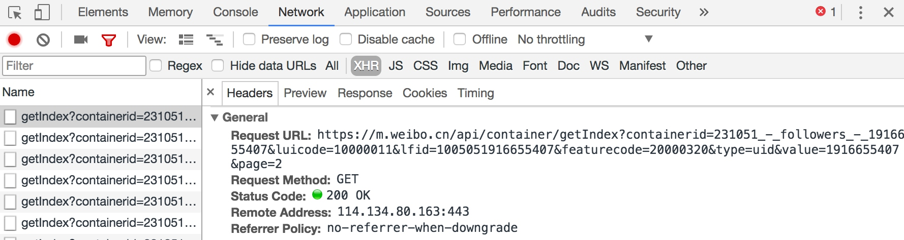

# 13.13 Scrapy 爬取新浪微博

前面讲解了 Scrapy 中各个模块基本使用方法以及代理池、Cookies 池。接下来我们以一个反爬比较强的网站新浪微博为例，来实现一下 Scrapy 的大规模爬取。

### 1. 本节目标

本次爬取的目标是新浪微博用户的公开基本信息，如用户昵称、头像、用户的关注、粉丝列表以及发布的微博等，这些信息抓取之后保存至 MongoDB。

### 2. 准备工作

请确保前文所讲的代理池、Cookies 池已经实现并可以正常运行，安装 Scrapy、PyMongo 库，如没有安装可以参考前文内容。

### 3. 爬取思路

首先我们要实现用户的大规模爬取。这里采用的爬取方式是，以微博的几个大 V 为起始点，爬取他们各自的粉丝和关注列表，然后获取粉丝和关注列表的粉丝和关注列表，以此类推，这样下去就可以实现递归爬取。如果一个用户与其他用户有社交网络上的关联，那他们的信息就会被爬虫抓取到，这样我们就可以做到对所有用户的爬取。通过这种方式，我们可以得到用户的唯一 ID，再根据 ID 获取每个用户发布的微博即可。

### 4. 爬取分析

这里我们选取的爬取站点是：https://m.weibo.cn，此站点是微博移动端的站点。打开该站点会跳转到登录页面，这是因为主页做了登录限制。不过我们可以直接打开某个用户详情页面，如图 13-32 所示。


图 13-32 个人详情页面

我们在页面最上方可以看到她的关注和粉丝数量。我们点击关注，进入到她的关注列表，如图 13-33 所示。


图 13-33 关注列表

我们打开开发者工具，切换到 XHR 过滤器，一直下拉关注列表，即可看到下方会出现很多 Ajax 请求，这些请求就是获取关注列表的 Ajax 请求，如图 13-34 所示。


图 13-37 请求列表

我们打开第一个 Ajax 请求看一下，发现它的链接为：[https://m.weibo.cn/api/container/getIndex?containerid=231051_-_followers_-_1916655407&luicode=10000011&lfid=1005051916655407&featurecode=20000320&type=uid&value=1916655407&page=2](https://m.weibo.cn/api/container/getIndex?containerid=231051_-_followers_-_1916655407&luicode=10000011&lfid=1005051916655407&featurecode=20000320&type=uid&value=1916655407&page=2)，详情如图 13-35 和 13-36 所示。



图 13-35 请求详情


图 13-36 响应结果

请求类型是 GET 类型，返回结果是 JSON 格式，我们将其展开之后即可看到其关注的用户的基本信息。接下来我们只需要构造这个请求的参数。此链接一共有 7 个参数，如图 13-37 所示。


图 13-37 参数信息

其中最主要的参数就是 containerid 和 page。有了这两个参数，我们同样可以获取请求结果。我们可以将接口精简为：[https://m.weibo.cn/api/container/getIndex?containerid=231051_-_followers_-_1916655407&page=2](https://m.weibo.cn/api/container/getIndex?containerid=231051_-_followers_-_1916655407&page=2)，这里的 containerid 的前半部分是固定的，后半部分是用户的 id。所以这里参数就可以构造出来了，只需要修改 containerid 最后的 id 和 page 参数即可获取分页形式的关注列表信息。

利用同样的方法，我们也可以分析用户详情的 Ajax 链接、用户微博列表的 Ajax 链接，如下所示：

```python
# 用户详情 API
user_url = 'https://m.weibo.cn/api/container/getIndex?uid={uid}&type=uid&value={uid}&containerid=100505{uid}'
# 关注列表 API
follow_url = 'https://m.weibo.cn/api/container/getIndex?containerid=231051_-_followers_-_{uid}&page={page}'
# 粉丝列表 API
fan_url = 'https://m.weibo.cn/api/container/getIndex?containerid=231051_-_fans_-_{uid}&page={page}'
# 微博列表 API
weibo_url = 'https://m.weibo.cn/api/container/getIndex?uid={uid}&type=uid&page={page}&containerid=107603{uid}'
```

此处的 uid 和 page 分别代表用户 ID 和分页页码。

注意，这个 API 可能随着时间的变化或者微博的改版而变化，以实测为准。

我们从几个大 V 开始抓取，抓取他们的粉丝、关注列表、微博信息，然后递归抓取他们的粉丝和关注列表的粉丝、关注列表、微博信息，递归抓取，最后保存微博用户的基本信息、关注和粉丝列表、发布的微博。

我们选择 MongoDB 作为存储的数据库，可以更方便地存储用户的粉丝和关注列表。

### 5. 新建项目

接下来，我们用 Scrapy 来实现这个抓取过程。首先创建一个项目，命令如下所示：

```
scrapy startproject weibo
```

进入项目中，新建一个 Spider，名为 weibocn，命令如下所示：

```
scrapy genspider weibocn m.weibo.cn
```

我们首先修改 Spider，配置各个 Ajax 的 URL，选取几个大 V，将他们的 ID 赋值成一个列表，实现 start_requests() 方法，也就是依次抓取各个大 V 的个人详情，然后用 parse_user() 进行解析，如下所示：

```python
from scrapy import Request, Spider

class WeiboSpider(Spider):
    name = 'weibocn'
    allowed_domains = ['m.weibo.cn']
    user_url = 'https://m.weibo.cn/api/container/getIndex?uid={uid}&type=uid&value={uid}&containerid=100505{uid}'
    follow_url = 'https://m.weibo.cn/api/container/getIndex?containerid=231051_-_followers_-_{uid}&page={page}'
    fan_url = 'https://m.weibo.cn/api/container/getIndex?containerid=231051_-_fans_-_{uid}&page={page}'
    weibo_url = 'https://m.weibo.cn/api/container/getIndex?uid={uid}&type=uid&page={page}&containerid=107603{uid}'
    start_users = ['3217179555', '1742566624', '2282991915', '1288739185', '3952070245', '5878659096']
    
    def start_requests(self):
        for uid in self.start_users:
            yield Request(self.user_url.format(uid=uid), callback=self.parse_user)
    
    def parse_user(self, response):
        self.logger.debug(response)
```

### 6. 创建 Item

接下来，我们解析用户的基本信息并生成 Item。这里我们先定义几个 Item，如用户、用户关系、微博的 Item，如下所示：

```python
from scrapy import Item, Field

class UserItem(Item):
    collection = 'users'
    id = Field()
    name = Field()
    avatar = Field()
    cover = Field()
    gender = Field()
    description = Field()
    fans_count = Field()
    follows_count = Field()
    weibos_count = Field()
    verified = Field()
    verified_reason = Field()
    verified_type = Field()
    follows = Field()
    fans = Field()
    crawled_at = Field()

class UserRelationItem(Item):
    collection = 'users'
    id = Field()
    follows = Field()
    fans = Field()

class WeiboItem(Item):
    collection = 'weibos'
    id = Field()
    attitudes_count = Field()
    comments_count = Field()
    reposts_count = Field()
    picture = Field()
    pictures = Field()
    source = Field()
    text = Field()
    raw_text = Field()
    thumbnail = Field()
    user = Field()
    created_at = Field()
    crawled_at = Field()
```

这里定义了 collection 字段，指明保存的 Collection 的名称。用户的关注和粉丝列表直接定义为一个单独的 UserRelationItem，其中 id 就是用户的 ID，follows 就是用户关注列表，fans 是粉丝列表，但这并不意味着我们会将关注和粉丝列表存到一个单独的 Collection 里。后面我们会用 Pipeline 对各个 Item 进行处理、合并存储到用户的 Collection 里，因此 Item 和 Collection 并不一定是完全对应的。

### 7. 提取数据

我们开始解析用户的基本信息，实现 parse_user() 方法，如下所示：

```python
def parse_user(self, response):
    """
    解析用户信息
    :param response: Response 对象
    """
    result = json.loads(response.text)
    if result.get('userInfo'):
        user_info = result.get('userInfo')
        user_item = UserItem()
        field_map = {
            'id': 'id', 'name': 'screen_name', 'avatar': 'profile_image_url', 'cover': 'cover_image_phone',
            'gender': 'gender', 'description': 'description', 'fans_count': 'followers_count',
            'follows_count': 'follow_count', 'weibos_count': 'statuses_count', 'verified': 'verified',
            'verified_reason': 'verified_reason', 'verified_type': 'verified_type'
        }
        for field, attr in field_map.items():
            user_item[field] = user_info.get(attr)
        yield user_item
        # 关注
        uid = user_info.get('id')
        yield Request(self.follow_url.format(uid=uid, page=1), callback=self.parse_follows,
                      meta={'page': 1, 'uid': uid})
        # 粉丝
        yield Request(self.fan_url.format(uid=uid, page=1), callback=self.parse_fans,
                      meta={'page': 1, 'uid': uid})
        # 微博
        yield Request(self.weibo_url.format(uid=uid, page=1), callback=self.parse_weibos,
                      meta={'page': 1, 'uid': uid})
```

在这里我们一共完成了两个操作。

* 解析 JSON 提取用户信息并生成 UserItem 返回。我们并没有采用常规的逐个赋值的方法，而是定义了一个字段映射关系。我们定义的字段名称可能和 JSON 中用户的字段名称不同，所以在这里定义成一个字典，然后遍历字典的每个字段实现逐个字段的赋值。

* 构造用户的关注、粉丝、微博的第一页的链接，并生成 Request，这里需要的参数只有用户的 ID。另外，初始分页页码直接设置为 1 即可。

接下来，我们还需要保存用户的关注和粉丝列表。以关注列表为例，其解析方法为 parse_follows()，实现如下所示：

```python
def parse_follows(self, response):
    """
    解析用户关注
    :param response: Response 对象
    """
    result = json.loads(response.text)
    if result.get('ok') and result.get('cards') and len(result.get('cards')) and result.get('cards')[-1].get('card_group'):
        # 解析用户
        follows = result.get('cards')[-1].get('card_group')
        for follow in follows:
            if follow.get('user'):
                uid = follow.get('user').get('id')
                yield Request(self.user_url.format(uid=uid), callback=self.parse_user)
        # 关注列表
        uid = response.meta.get('uid')
        user_relation_item = UserRelationItem()
        follows = [{'id': follow.get('user').get('id'), 'name': follow.get('user').get('screen_name')} for follow in
                   follows]
        user_relation_item['id'] = uid
        user_relation_item['follows'] = follows
        user_relation_item['fans'] = []
        yield user_relation_item
        # 下一页关注
        page = response.meta.get('page') + 1
        yield Request(self.follow_url.format(uid=uid, page=page),
                      callback=self.parse_follows, meta={'page': page, 'uid': uid})
```

那么在这个方法里面我们做了如下三件事。

* 解析关注列表中的每个用户信息并发起新的解析请求。我们首先解析关注列表的信息，得到用户的 ID，然后再利用 user_url 构造访问用户详情的 Request，回调就是刚才所定义的 parse_user() 方法。

* 提取用户关注列表内的关键信息并生成 UserRelationItem。id 字段直接设置成用户的 ID，JSON 返回数据中的用户信息有很多冗余字段。在这里我们只提取了关注用户的 ID 和用户名，然后把它们赋值给 follows 字段，fans 字段设置成空列表。这样我们就建立了一个存有用户 ID 和用户部分关注列表的 UserRelationItem，之后合并且保存具有同一个 ID 的 UserRelationItem 的关注和粉丝列表。

* 提取下一页关注。只需要将此请求的分页页码加 1 即可。分页页码通过 Request 的 meta 属性进行传递，Response 的 meta 来接收。这样我们构造并返回下一页的关注列表的 Request。

抓取粉丝列表的原理和抓取关注列表原理相同，在此不再赘述。

接下来我们还差一个方法的实现，即 parse_weibos()，它用来抓取用户的微博信息，实现如下所示：

```python
def parse_weibos(self, response):
    """
    解析微博列表
    :param response: Response 对象
    """
    result = json.loads(response.text)
    if result.get('ok') and result.get('cards'):
        weibos = result.get('cards')
        for weibo in weibos:
            mblog = weibo.get('mblog')
            if mblog:
                weibo_item = WeiboItem()
                field_map = {
                    'id': 'id', 'attitudes_count': 'attitudes_count', 'comments_count': 'comments_count', 'created_at': 'created_at',
                    'reposts_count': 'reposts_count', 'picture': 'original_pic', 'pictures': 'pics',
                    'source': 'source', 'text': 'text', 'raw_text': 'raw_text', 'thumbnail': 'thumbnail_pic'
                }
                for field, attr in field_map.items():
                    weibo_item[field] = mblog.get(attr)
                weibo_item['user'] = response.meta.get('uid')
                yield weibo_item
        # 下一页微博
        uid = response.meta.get('uid')
        page = response.meta.get('page') + 1
        yield Request(self.weibo_url.format(uid=uid, page=page), callback=self.parse_weibos,
                      meta={'uid': uid, 'page': page})
```

这里 parse_weibos() 方法完成了两件事。

* 提取用户的微博信息，并生成 WeiboItem。这里同样建立了一个字段映射表，实现批量字段赋值。

* 提取下一页的微博列表。这里同样需要传入用户 ID 和分页页码。

到目前为止，微博的 Spider 已经完成。后面还需要对数据进行数据清洗存储，以及对接代理池、Cookies 池来防止反爬虫。

### 8. 数据清洗

有些微博的时间可能不是标准的时间，比如它可能显示为刚刚、几分钟前、几小时前、昨天等。这里我们需要统一转化这些时间，实现一个 parse_time() 方法，如下所示：

```python
def parse_time(self, date):
    if re.match(' 刚刚 ', date):
        date = time.strftime('% Y-% m-% d % H:% M', time.localtime(time.time()))
    if re.match('\d + 分钟前 ', date):
        minute = re.match('(\d+)', date).group(1)
        date = time.strftime('% Y-% m-% d % H:% M', time.localtime(time.time() - float(minute) * 60))
    if re.match('\d + 小时前 ', date):
        hour = re.match('(\d+)', date).group(1)
        date = time.strftime('% Y-% m-% d % H:% M', time.localtime(time.time() - float(hour) * 60 * 60))
    if re.match(' 昨天.*', date):
        date = re.match(' 昨天 (.*)', date).group(1).strip()
        date = time.strftime('% Y-% m-% d', time.localtime() - 24 * 60 * 60) + ' ' + date
    if re.match('\d{2}-\d{2}', date):
        date = time.strftime('% Y-', time.localtime()) + date + ' 00:00'
    return date
```

我们用正则来提取一些关键数字，用 time 库来实现标准时间的转换。

以 X 分钟前的处理为例，爬取的时间会赋值为 created_at 字段。我们首先用正则匹配这个时间，表达式写作 \d + 分钟前，如果提取到的时间符合这个表达式，那么就提取出其中的数字，这样就可以获取分钟数了。接下来使用 time 模块的 strftime() 方法，第一个参数传入要转换的时间格式，第二个参数就是时间戳。这里我们用当前的时间戳减去此分钟数乘以 60 就是当时的时间戳，这样我们就可以得到格式化后的正确时间了。

然后 Pipeline 可以实现如下处理：

```python
class WeiboPipeline():
    def process_item(self, item, spider):
        if isinstance(item, WeiboItem):
            if item.get('created_at'):
                item['created_at'] = item['created_at'].strip()
                item['created_at'] = self.parse_time(item.get('created_at'))
```
我们在 Spider 里没有对 crawled_at 字段赋值，它代表爬取时间，我们可以统一将其赋值为当前时间，实现如下所示：
```python
class TimePipeline():
    def process_item(self, item, spider):
        if isinstance(item, UserItem) or isinstance(item, WeiboItem):
            now = time.strftime('% Y-% m-% d % H:% M', time.localtime())
            item['crawled_at'] = now
        return item
```

这里我们判断了 item 如果是 UserItem 或 WeiboItem 类型，那么就给它的 crawled_at 字段赋值为当前时间。

通过上面的两个 Pipeline，我们便完成了数据清洗工作，这里主要是时间的转换。

### 9. 数据存储

数据清洗完毕之后，我们就要将数据保存到 MongoDB 数据库。我们在这里实现 MongoPipeline 类，如下所示：

```python
import pymongo

class MongoPipeline(object):
    def __init__(self, mongo_uri, mongo_db):
        self.mongo_uri = mongo_uri
        self.mongo_db = mongo_db
    
    @classmethod
    def from_crawler(cls, crawler):
        return cls(mongo_uri=crawler.settings.get('MONGO_URI'), mongo_db=crawler.settings.get('MONGO_DATABASE')
        )
    
    def open_spider(self, spider):
        self.client = pymongo.MongoClient(self.mongo_uri)
        self.db = self.client[self.mongo_db]
        self.db[UserItem.collection].create_index([('id', pymongo.ASCENDING)])
        self.db[WeiboItem.collection].create_index([('id', pymongo.ASCENDING)])
    
    def close_spider(self, spider):
        self.client.close()
    
    def process_item(self, item, spider):
        if isinstance(item, UserItem) or isinstance(item, WeiboItem):
            self.db[item.collection].update({'id': item.get('id')}, {'$set': item}, True)
        if isinstance(item, UserRelationItem):
            self.db[item.collection].update({'id': item.get('id')},
                {'$addToSet':
                    {'follows': {'$each': item['follows']},
                        'fans': {'$each': item['fans']}
                    }
                }, True)
        return item
```

当前的 MongoPipeline 和前面我们所写的有所不同，主要有以下几点。
* 在 open_spider() 方法里面添加了 Collection 的索引，在这里为两个 Item 都做了索引，索引的字段是 id，由于我们这次是大规模爬取，同时在爬取过程中涉及到数据的更新问题，所以我们为每个 Collection 建立了索引，建立了索引之后可以大大提高检索效率。
* 在 process_item() 方法里存储使用的是 update() 方法，第一个参数是查询条件，第二个参数是爬取的 Item，这里我们使用了 $set 操作符，这样我们如果爬取到了重复的数据即可对数据进行更新，同时不会删除已存在的字段，如果这里不加 $set 操作符，那么会直接进行 item 替换，这样可能会导致已存在的字段如关注和粉丝列表清空，所以这里必须要加上 $set 操作符。第三个参数我们设置为了 True，这个参数起到的作用是如果数据不存在，则插入数据。这样我们就可以做到数据存在即更新、数据不存在即插入，这样就达到了去重的效果。
* 对于用户的关注和粉丝列表，我们在这里使用了一个新的操作符，叫做 $addToSet，这个操作符可以向列表类型的字段插入数据同时去重，接下来它的值就是需要操作的字段名称，我们在这里又利用了 $each 操作符对需要插入的列表数据进行了遍历，这样就可以逐条插入用户的关注或粉丝数据到指定的字段了，关于该操作更多的解释可以参考 MongoDB 的官方文档，链接为：[https://docs.mongodb.com/manual/reference/operator/update/addToSet/](https://docs.mongodb.com/manual/reference/operator/update/addToSet/)。

### 10. Cookies 池对接

新浪微博的反爬能力非常强，我们需要做一些防范反爬虫的措施才可以顺利完成数据爬取。

如果没有登录而直接请求微博的 API 接口，这非常容易导致 403 状态码。这个情况我们在 10.2 节也提过。所以在这里我们实现一个 Middleware，为每个 Request 添加随机的 Cookies。

我们先开启 Cookies 池，使 API 模块正常运行。例如在本地运行 5000 端口，访问：[http://localhost:5000/weibo/random](http://localhost:5000/weibo/random) 即可获取随机的 Cookies，当然也可以将 Cookies 池部署到远程的服务器，这样只需要更改一下访问的链接就好了。

那么在这里我们将 Cookies 池在本地启动起来，再实现一个 Middleware 如下：

```python

class CookiesMiddleware():
    def __init__(self, cookies_url):
        self.logger = logging.getLogger(__name__)
        self.cookies_url = cookies_url
    
    def get_random_cookies(self):
        try:
            response = requests.get(self.cookies_url)
            if response.status_code == 200:
                cookies = json.loads(response.text)
                return cookies
        except requests.ConnectionError:
            return False
    
    def process_request(self, request, spider):
        self.logger.debug(' 正在获取 Cookies')
        cookies = self.get_random_cookies()
        if cookies:
            request.cookies = cookies
            self.logger.debug(' 使用 Cookies ' + json.dumps(cookies))
    
    @classmethod
    def from_crawler(cls, crawler):
        settings = crawler.settings
        return cls(cookies_url=settings.get('COOKIES_URL')
        )
```

我们首先利用 from_crawler() 方法获取了 COOKIES_URL 变量，它定义在 settings.py 里，这就是刚才我们所说的接口。接下来实现 get_random_cookies() 方法，这个方法主要就是请求此 Cookies 池接口并获取接口返回的随机 Cookies。如果成功获取，则返回 Cookies；否则返回 False。

接下来，在 process_request() 方法里，我们给 request 对象的 cookies 属性赋值，其值就是获取的随机 Cookies，这样我们就成功地为每一次请求赋值 Cookies 了。

如果启用了该 Middleware，每个请求都会被赋值随机的 Cookies。这样我们就可以模拟登录之后的请求，403 状态码基本就不会出现。

### 11. 代理池对接

微博还有一个反爬措施就是，检测到同一 IP 请求量过大时就会出现 414 状态码。如果遇到这样的情况可以切换代理。例如，在本地 5555 端口运行，获取随机可用代理的地址为：[http://localhost:5555/random](http://localhost:5555/random)，访问这个接口即可获取一个随机可用代理。接下来我们再实现一个 Middleware，代码如下所示：

```python
class ProxyMiddleware():
    def __init__(self, proxy_url):
        self.logger = logging.getLogger(__name__)
        self.proxy_url = proxy_url
    
    def get_random_proxy(self):
        try:
            response = requests.get(self.proxy_url)
            if response.status_code == 200:
                proxy = response.text
                return proxy
        except requests.ConnectionError:
            return False
    
    def process_request(self, request, spider):
        if request.meta.get('retry_times'):
            proxy = self.get_random_proxy()
            if proxy:
                uri = 'https://{proxy}'.format(proxy=proxy)
                self.logger.debug(' 使用代理 ' + proxy)
                request.meta['proxy'] = uri

    @classmethod
    def from_crawler(cls, crawler):
        settings = crawler.settings
        return cls(proxy_url=settings.get('PROXY_URL')
        )
```

同样的原理，我们实现了一个 get_random_proxy() 方法用于请求代理池的接口获取随机代理。如果获取成功，则返回改代理，否则返回 False。在 process_request() 方法中，我们给 request 对象的 meta 属性赋值一个 proxy 字段，该字段的值就是代理。

另外，赋值代理的判断条件是当前 retry_times 不为空，也就是说第一次请求失败之后才启用代理，因为使用代理后访问速度会慢一些。所以我们在这里设置了只有重试的时候才启用代理，否则直接请求。这样就可以保证在没有被封禁的情况下直接爬取，保证了爬取速度。

### 12. 启用 Middleware

接下来，我们在配置文件中启用这两个 Middleware，修改 settings.py 如下所示：

```python
DOWNLOADER_MIDDLEWARES = {
    'weibo.middlewares.CookiesMiddleware': 554,
    'weibo.middlewares.ProxyMiddleware': 555,
}
```
注意这里的优先级设置，前文提到了 Scrapy 的默认 Downloader Middleware 的设置如下：
```python
{
    'scrapy.downloadermiddlewares.robotstxt.RobotsTxtMiddleware': 100,
    'scrapy.downloadermiddlewares.httpauth.HttpAuthMiddleware': 300,
    'scrapy.downloadermiddlewares.downloadtimeout.DownloadTimeoutMiddleware': 350,
    'scrapy.downloadermiddlewares.defaultheaders.DefaultHeadersMiddleware': 400,
    'scrapy.downloadermiddlewares.useragent.UserAgentMiddleware': 500,
    'scrapy.downloadermiddlewares.retry.RetryMiddleware': 550,
    'scrapy.downloadermiddlewares.ajaxcrawl.AjaxCrawlMiddleware': 560,
    'scrapy.downloadermiddlewares.redirect.MetaRefreshMiddleware': 580,
    'scrapy.downloadermiddlewares.httpcompression.HttpCompressionMiddleware': 590,
    'scrapy.downloadermiddlewares.redirect.RedirectMiddleware': 600,
    'scrapy.downloadermiddlewares.cookies.CookiesMiddleware': 700,
    'scrapy.downloadermiddlewares.httpproxy.HttpProxyMiddleware': 750,
    'scrapy.downloadermiddlewares.stats.DownloaderStats': 850,
    'scrapy.downloadermiddlewares.httpcache.HttpCacheMiddleware': 900,
}
```

要使得我们自定义的 CookiesMiddleware 生效，它在内置的 CookiesMiddleware 之前调用。内置的 CookiesMiddleware 的优先级为 700，所以这里我们设置一个比 700 小的数字即可。

要使得我们自定义的 ProxyMiddleware 生效，它在内置的 HttpProxyMiddleware 之前调用。内置的 HttpProxyMiddleware 的优先级为 750，所以这里我们设置一个比 750 小的数字即可。

### 13. 运行

到此为止，整个微博爬虫就实现完毕了，我们运行如下命令启动一下爬虫：

```
scrapy crawl weibocn
```

类似的输出结果如下：

```python
2017-07-11 17:27:34 [urllib3.connectionpool] DEBUG: http://localhost:5000 "GET /weibo/random HTTP/1.1" 200 339
2017-07-11 17:27:34 [weibo.middlewares] DEBUG: 使用 Cookies {"SCF": "AhzwTr_DxIGjgri_dt46_DoPzUqq-PSupu545JdozdHYJ7HyEb4pD3pe05VpbIpVyY1ciKRRWwUgojiO3jYwlBE.", "_T_WM": "8fe0bc1dad068d09b888d8177f1c1218", "SSOLoginState": "1501496388", "M_WEIBOCN_PARAMS": "uicode%3D20000174", "SUHB": "0tKqV4asxqYl4J", "SUB": "_2A250e3QUDeRhGeBM6VYX8y7NwjiIHXVXhBxcrDV6PUJbkdBeLXjckW2fUT8MWloekO4FCWVlIYJGJdGLnA.."}
2017-07-11 17:27:34 [weibocn] DEBUG: <200 https://m.weibo.cn/api/container/getIndex?uid=1742566624&type=uid&value=1742566624&containerid=1005051742566624>
2017-07-11 17:27:34 [scrapy.core.scraper] DEBUG: Scraped from <200 https://m.weibo.cn/api/container/getIndex?uid=1742566624&type=uid&value=1742566624&containerid=1005051742566624>
{'avatar': 'https://tva4.sinaimg.cn/crop.0.0.180.180.180/67dd74e0jw1e8qgp5bmzyj2050050aa8.jpg',
 'cover': 'https://tva3.sinaimg.cn/crop.0.0.640.640.640/6ce2240djw1e9oaqhwllzj20hs0hsdir.jpg',
 'crawled_at': '2017-07-11 17:27',
 'description': ' 成长，就是一个不断觉得以前的自己是个傻逼的过程 ',
 'fans_count': 19202906,
 'follows_count': 1599,
 'gender': 'm',
 'id': 1742566624,
 'name': ' 思想聚焦 ',
 'verified': True,
 'verified_reason': ' 微博知名博主，校导网编辑 ',
 'verified_type': 0,
 'weibos_count': 58393}
```

运行一段时间后，我们便可以到 MongoDB 数据库查看数据，爬取下来的数据如图 13-38 和图 13-39 所示。


图 13-38 用户信息


图 13-39 微博信息

针对用户信息，我们不仅爬取了其基本信息，还把关注和粉丝列表加到了 follows 和 fans 字段并做了去重操作。针对微博信息，我们成功进行了时间转换处理，同时还保存了微博的图片列表信息。

### 14. 本节代码

本节代码地址：[https://github.com/Python3WebSpider/Weibo](https://github.com/Python3WebSpider/Weibo)。

### 15. 结语

本节实现了新浪微博的用户及其粉丝关注列表和微博信息的爬取，还对接了 Cookies 池和代理池来处理反爬虫。不过现在是针对单机的爬取，后面我们会将此项目修改为分布式爬虫，以进一步提高抓取效率。