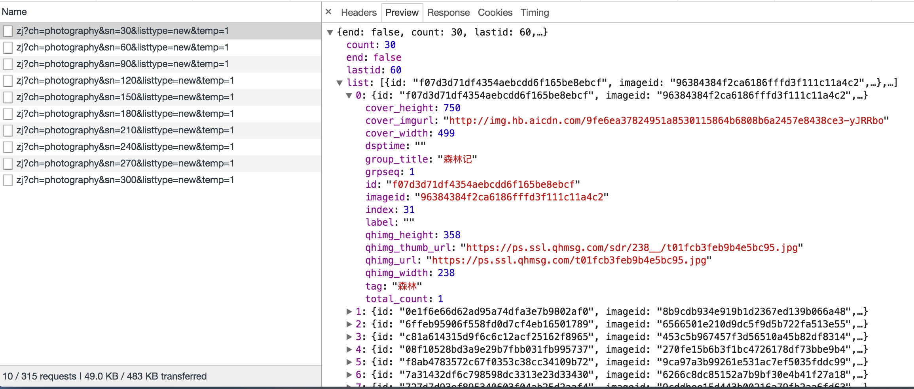
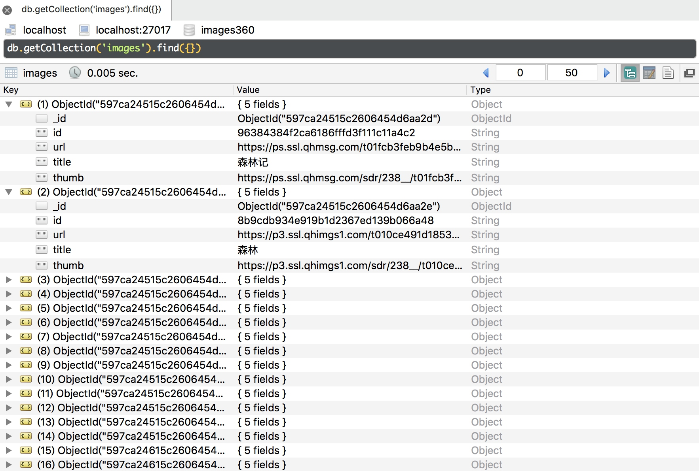

# 13.7 Item Pipeline 的用法

Item Pipeline 是项目管道。在前面我们已经了解了 Item Pipeline 的基本用法，本节我们再作详细了解它的用法。

首先我们看看 Item Pipeline 在 Scrapy 中的架构，如图 13-1 所示。

图中的最左侧即为 Item Pipeline，它的调用发生在 Spider 产生 Item 之后。当 Spider 解析完 Response 之后，Item 就会传递到 Item Pipeline，被定义的 Item Pipeline 组件会顺次调用，完成一连串的处理过程，比如数据清洗、存储等。

它的主要功能有：

* 清洗 HTML 数据
* 验证爬取数据，检查爬取字段
* 查重并丢弃重复内容
* 将爬取结果储存到数据库

### 1. 核心方法

我们可以自定义 Item Pipeline，只需要实现指定的方法就好，其中必须要实现的一个方法是：
* process_item(item, spider)

另外还有几个比较实用的方法，它们分别是：
* open_spider(spider)
* close_spider(spider)
* from_crawler(cls, crawler)

下面我们对这几个方法的用法作下详细的介绍：

#### process_item(item, spider)

process_item() 是必须要实现的方法，被定义的 Item Pipeline 会默认调用这个方法对 Item 进行处理。比如，我们可以进行数据处理或者将数据写入到数据库等操作。它必须返回 Item 类型的值或者抛出一个 DropItem 异常。

process_item() 方法的参数有如下两个。
* item，是 Item 对象，即被处理的 Item
* spider，是 Spider 对象，即生成该 Item 的 Spider

下面对该方法的返回类型归纳如下：
* 如果返回的是 Item 对象，那么此 Item 会接着被低优先级的 Item Pipeline 的 process_item() 方法进行处理，直到所有的方法被调用完毕。
* 如果抛出的是 DropItem 异常，那么此 Item 就会被丢弃，不再进行处理。

#### open_spider(self, spider)

open_spider() 方法是在 Spider 开启的时候被自动调用的，在这里我们可以做一些初始化操作，如开启数据库连接等。其中参数 spider 就是被开启的 Spider 对象。

#### close_spider(spider)

close_spider() 方法是在 Spider 关闭的时候自动调用的，在这里我们可以做一些收尾工作，如关闭数据库连接等，其中参数 spider 就是被关闭的 Spider 对象。

#### from_crawler(cls, crawler)

from_crawler() 方法是一个类方法，用 @classmethod 标识，是一种依赖注入的方式。它的参数是 crawler，通过 crawler 对象，我们可以拿到 Scrapy 的所有核心组件，如全局配置的每个信息，然后创建一个 Pipeline 实例。参数 cls 就是 Class，最后返回一个 Class 实例。

下面我们用一个实例来加深对 Item Pipeline 用法的理解。

### 2. 本节目标

我们以爬取 360 摄影美图为例，来分别实现 MongoDB 存储、MySQL 存储、Image 图片存储的三个 Pipeline。

### 3. 准备工作

请确保已经安装好 MongoDB 和 MySQL 数据库，安装好 Python 的 PyMongo、PyMySQL、Scrapy 框架，另外需要安装 pillow 图像处理库，如没有安装可以参考第 1 章的安装说明。

### 4. 抓取分析

我们这次爬取的目标网站为：https://image.so.com。打开此页面，切换到摄影页面，网页中呈现了许许多多的摄影美图。我们打开浏览器开发者工具，过滤器切换到 XHR 选项，然后下拉页面，可以看到下面就会呈现许多 Ajax 请求，如图 13-6 所示。


图 13-6 请求列表

我们查看一个请求的详情，观察返回的数据结构，如图 13-7 所示。



图 13-7 返回结果

返回格式是 JSON。其中 list 字段就是一张张图片的详情信息，包含了 30 张图片的 ID、名称、链接、缩略图等信息。另外观察 Ajax 请求的参数信息，有一个参数 sn 一直在变化，这个参数很明显就是偏移量。当 sn 为 30 时，返回的是前 30 张图片，sn 为 60 时，返回的就是第 31~60 张图片。另外，ch 参数是摄影类别，listtype 是排序方式，temp 参数可以忽略。

所以我们抓取时只需要改变 sn 的数值就好了。

下面我们用 Scrapy 来实现图片的抓取，将图片的信息保存到 MongoDB、MySQL，同时将图片存储到本地。

### 5. 新建项目

首先新建一个项目，命令如下：

```
scrapy startproject images360
```

接下来新建一个 Spider，命令如下：

```
scrapy genspider images images.so.com
```

这样我们就成功创建了一个 Spider。

### 6. 构造请求

接下来定义爬取的页数。比如爬取 50 页、每页 30 张，也就是 1500 张图片，我们可以先在 settings.py 里面定义一个变量 MAX_PAGE，添加如下定义：

```
MAX_PAGE = 50
```

定义 start_requests() 方法，用来生成 50 次请求，如下所示：

```python
def start_requests(self):
    data = {'ch': 'photography', 'listtype': 'new'}
    base_url = 'https://image.so.com/zj?'
    for page in range(1, self.settings.get('MAX_PAGE') + 1):
        data['sn'] = page * 30
        params = urlencode(data)
        url = base_url + params
        yield Request(url, self.parse)
```

在这里我们首先定义了初始的两个参数，sn 参数是遍历循环生成的。然后利用 urlencode() 方法将字典转化为 URL 的 GET 参数，构造出完整的 URL，构造并生成 Request。

还需要引入 scrapy.Request 和 urllib.parse 模块，如下所示：

```python
from scrapy import Spider, Request
from urllib.parse import urlencode
```
再修改 settings.py 中的 ROBOTSTXT_OBEY 变量，将其设置为 False，否则无法抓取，如下所示：
```python
ROBOTSTXT_OBEY = False
```
运行爬虫，即可以看到链接都请求成功，执行命令如下所示：
```
scrapy crawl images
```

运行示例结果如图 13-8 所示。


图 13-8 运行结果

所有请求的状态码都是 200，这就证明图片信息爬取成功了。

### 7. 提取信息

首先定义一个 Item，叫作 ImageItem，如下所示：

```python
from scrapy import Item, Field
class ImageItem(Item):
    collection = table = 'images'
    id = Field()
    url = Field()
    title = Field()
    thumb = Field()
```

在这里我们定义了 4 个字段，包括图片的 ID、链接、标题、缩略图。另外还有两个属性 collection 和 table，都定义为 images 字符串，分别代表 MongoDB 存储的 Collection 名称和 MySQL 存储的表名称。

接下来我们提取 Spider 里有关信息，将 parse() 方法改写为如下所示：

```python
def parse(self, response):
    result = json.loads(response.text)
    for image in result.get('list'):
        item = ImageItem()
        item['id'] = image.get('imageid')
        item['url'] = image.get('qhimg_url')
        item['title'] = image.get('group_title')
        item['thumb'] = image.get('qhimg_thumb_url')
        yield item
```

首先解析 JSON，遍历其 list 字段，取出一个个图片信息，然后再对 ImageItem 赋值，生成 Item 对象。

这样我们就完成了信息的提取。

### 8. 存储信息

接下来我们需要将图片的信息保存到 MongoDB、MySQL，同时将图片保存到本地。

#### MongoDB

首先确保 MongoDB 已经正常安装并且正常运行。

我们用一个 MongoPipeline 将信息保存到 MongoDB，在 pipelines.py 里添加如下类的实现：

```python
import pymongo

class MongoPipeline(object):
    def __init__(self, mongo_uri, mongo_db):
        self.mongo_uri = mongo_uri
        self.mongo_db = mongo_db
        
    @classmethod
    def from_crawler(cls, crawler):
        return cls(mongo_uri=crawler.settings.get('MONGO_URI'),
            mongo_db=crawler.settings.get('MONGO_DB')
        )

    def open_spider(self, spider):
        self.client = pymongo.MongoClient(self.mongo_uri)
        self.db = self.client[self.mongo_db]

    def process_item(self, item, spider):
        self.db[item.collection].insert(dict(item))
        return item

    def close_spider(self, spider):
        self.client.close()
```
这里需要用到两个变量，MONGO_URI 和 MONGO_DB，即存储到 MongoDB 的链接地址和数据库名称。我们在 settings.py 里添加这两个变量，如下所示：
```python
MONGO_URI = 'localhost'
MONGO_DB = 'images360'
```

这样一个保存到 MongoDB 的 Pipeline 的就创建好了。这里最主要的方法是 process_item() 方法，直接调用 Collection 对象的 insert() 方法即可完成数据的插入，最后返回 Item 对象。

#### MySQL

首先确保 MySQL 已经正确安装并且正常运行。

新建一个数据库，名字还是 images360，SQL 语句如下所示：

```sql
CREATE DATABASE images360 DEFAULT CHARACTER SET utf8 COLLATE utf8_general_ci
```
新建一个数据表，包含 id、url、title、thumb 四个字段，SQL 语句如下所示：
```sql
CREATE TABLE images (id VARCHAR(255) NULL PRIMARY KEY, url VARCHAR(255) NULL , title VARCHAR(255) NULL , thumb VARCHAR(255) NULL)
```

执行完 SQL 语句之后，我们就成功创建好了数据表。接下来就可以往表里存储数据了。

接下来我们实现一个 MySQLPipeline，代码如下所示：

```python
import pymysql

class MysqlPipeline():
    def __init__(self, host, database, user, password, port):
        self.host = host
        self.database = database
        self.user = user
        self.password = password
        self.port = port
    
    @classmethod
    def from_crawler(cls, crawler):
        return cls(host=crawler.settings.get('MYSQL_HOST'),
            database=crawler.settings.get('MYSQL_DATABASE'),
            user=crawler.settings.get('MYSQL_USER'),
            password=crawler.settings.get('MYSQL_PASSWORD'),
            port=crawler.settings.get('MYSQL_PORT'),
        )
    
    def open_spider(self, spider):
        self.db = pymysql.connect(self.host, self.user, self.password, self.database, charset='utf8', port=self.port)
        self.cursor = self.db.cursor()
    
    def close_spider(self, spider):
        self.db.close()
    
    def process_item(self, item, spider):
        data = dict(item)
        keys = ', '.join(data.keys())
        values = ', '.join(['% s'] * len(data))
        sql = 'insert into % s (% s) values (% s)' % (item.table, keys, values)
        self.cursor.execute(sql, tuple(data.values()))
        self.db.commit()
        return item
```

如前所述，这里用到的数据插入方法是一个动态构造 SQL 语句的方法。

这里又需要几个 MySQL 的配置，我们在 settings.py 里添加几个变量，如下所示：

```python
MYSQL_HOST = 'localhost'
MYSQL_DATABASE = 'images360'
MYSQL_PORT = 3306
MYSQL_USER = 'root'
MYSQL_PASSWORD = '123456'
```

这里分别定义了 MySQL 的地址、数据库名称、端口、用户名、密码。

这样，MySQL Pipeline 就完成了。

#### Image Pipeline

Scrapy 提供了专门处理下载的 Pipeline，包括文件下载和图片下载。下载文件和图片的原理与抓取页面的原理一样，因此下载过程支持异步和多线程，下载十分高效。下面我们来看看具体的实现过程。

官方文档地址为：https://doc.scrapy.org/en/latest/topics/media-pipeline.html。

首先定义存储文件的路径，需要定义一个 IMAGES_STORE 变量，在 settings.py 中添加如下代码：

```python
IMAGES_STORE = './images'
```

在这里我们将路径定义为当前路径下的 images 子文件夹，即下载的图片都会保存到本项目的 images 文件夹中。

内置的 ImagesPipeline 会默认读取 Item 的 image_urls 字段，并认为该字段是一个列表形式，它会遍历 Item 的 image_urls 字段，然后取出每个 URL 进行图片下载。

但是现在生成的 Item 的图片链接字段并不是 image_urls 字段表示的，也不是列表形式，而是单个的 URL。所以为了实现下载，我们需要重新定义下载的部分逻辑，即要自定义 ImagePipeline，继承内置的 ImagesPipeline，重写几个方法。

我们定义 ImagePipeline，如下所示：

```python
from scrapy import Request
from scrapy.exceptions import DropItem
from scrapy.pipelines.images import ImagesPipeline

class ImagePipeline(ImagesPipeline):
    def file_path(self, request, response=None, info=None):
        url = request.url
        file_name = url.split('/')[-1]
        return file_name
    
    def item_completed(self, results, item, info):
        image_paths = [x['path'] for ok, x in results if ok]
        if not image_paths:
            raise DropItem('Image Downloaded Failed')
        return item
    
    def get_media_requests(self, item, info):
        yield Request(item['url'])
```

在这里我们实现了 ImagePipeline，继承 Scrapy 内置的 ImagesPipeline，重写下面几个方法。

- get_media_requests()。它的第一个参数 item 是爬取生成的 Item 对象。我们将它的 url 字段取出来，然后直接生成 Request 对象。此 Request 加入到调度队列，等待被调度，执行下载。

- file_path()。它的第一个参数 request 就是当前下载对应的 Request 对象。这个方法用来返回保存的文件名，直接将图片链接的最后一部分当作文件名即可。它利用 split() 函数分割链接并提取最后一部分，返回结果。这样此图片下载之后保存的名称就是该函数返回的文件名。

- item_completed()，它是当单个 Item 完成下载时的处理方法。因为并不是每张图片都会下载成功，所以我们需要分析下载结果并剔除下载失败的图片。如果某张图片下载失败，那么我们就不需保存此 Item 到数据库。该方法的第一个参数 results 就是该 Item 对应的下载结果，它是一个列表形式，列表每一个元素是一个元组，其中包含了下载成功或失败的信息。这里我们遍历下载结果找出所有成功的下载列表。如果列表为空，那么该 Item 对应的图片下载失败，随即抛出异常 DropItem，该 Item 忽略。否则返回该 Item，说明此 Item 有效。

现在为止，三个 Item Pipeline 的定义就完成了。最后只需要启用就可以了，修改 settings.py，设置 ITEM_PIPELINES，如下所示：

```python
ITEM_PIPELINES = {
    'images360.pipelines.ImagePipeline': 300,
    'images360.pipelines.MongoPipeline': 301,
    'images360.pipelines.MysqlPipeline': 302,
}
```

这里注意调用的顺序。我们需要优先调用 ImagePipeline 对 Item 做下载后的筛选，下载失败的 Item 就直接忽略，它们就不会保存到 MongoDB 和 MySQL 里。随后再调用其他两个存储的 Pipeline，这样就能确保存入数据库的图片都是下载成功的。

接下来运行程序，执行爬取，如下所示：

```
scrapy crawl images
```

爬虫一边爬取一边下载，下载速度非常快，对应的输出日志如图 13-9 所示。


图 13-9 输出日志

查看本地 images 文件夹，发现图片都已经成功下载，如图 13-10 所示。


图 13-10 下载结果

查看 MySQL，下载成功的图片信息也已成功保存，如图 13-11 所示。


图 13-11 MySQL 结果

查看 MongoDB，下载成功的图片信息同样已成功保存，如图 13-12 所示。



图 13-12 MongoDB 结果

这样我们就可以成功实现图片的下载并把图片的信息存入数据库了。

### 9. 本节代码

本节代码地址为：[https://github.com/Python3WebSpider/Images360](https://github.com/Python3WebSpider/Images360)。

### 10. 结语

Item Pipeline 是 Scrapy 非常重要的组件，数据存储几乎都是通过此组件实现的。请读者认真掌握此内容。