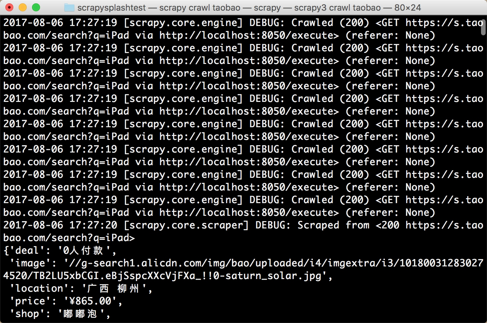
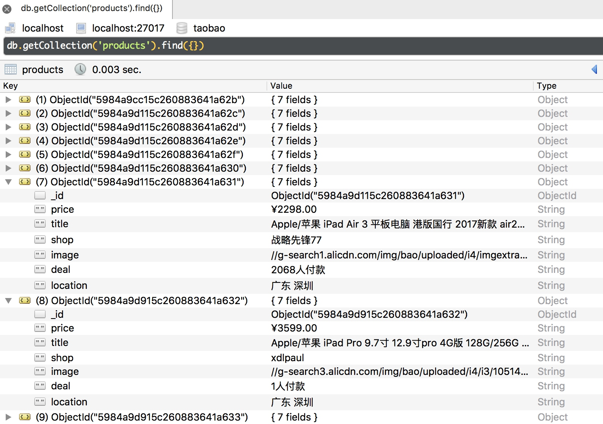

# 13.9 Scrapy对接Splash

在上一节我们实现了 Scrapy 对接 Selenium 抓取淘宝商品的过程，这是一种抓取 JavaScript 动态渲染页面的方式，除了使用Selenium 还有 Splash 同样可以达到同样的功能，本节我们来了解下 Scrapy 对接 Splash 来进行页面抓取的方式。

### 1. 准备工作

首先在这之前请确保已经正确安装好了 Splash 并正常运行，同时安装好了 ScrapySplash 库，如果没有安装好可以参考第一章的安装说明。

### 2. 新建项目

接下来我们首先新建一个项目，名称叫做 scrapysplashtest，命令如下：

```
scrapy startproject scrapysplashtest
```

随后新建一个 Spider，命令如下：

```
scrapy genspider taobao www.taobao.com
```

### 3. 添加配置

随后我们可以参考 ScrapySplash 的配置说明进行一步步的配置，链接如下：[https://github.com/scrapy-plugins/scrapy-splash#configuration](https://github.com/scrapy-plugins/scrapy-splash#configuration)。

修改 settings.py，首先将 SPLASH_URL 配置一下，在这里我们的 Splash 是在本地运行的，所以可以直接配置本地的地址：

```python
SPLASH_URL = 'http://localhost:8050'
```

如果 Splash 是在远程服务器运行的，那此处就应该配置为远程的地址，例如如果运行在 IP 为 120.27.34.25 的服务器上，则此处应该配置为：

```python
SPLASH_URL = 'http://120.27.34.25:8050'
```

接下来我们还需要配置几个 Middleware，代码如下：

```python
DOWNLOADER_MIDDLEWARES = {
    'scrapy_splash.SplashCookiesMiddleware': 723,
    'scrapy_splash.SplashMiddleware': 725,
    'scrapy.downloadermiddlewares.httpcompression.HttpCompressionMiddleware': 810,
}
SPIDER_MIDDLEWARES = {
    'scrapy_splash.SplashDeduplicateArgsMiddleware': 100,
}
```

在这里配置了三个 Downloader Middleware 和一个 Spider Middleware，这是 ScrapySplash 的核心部分，配置了它们我们就可以对接 Splash 进行页面抓取，在这里我们不再需要像对接 Selenium 那样实现一个 Downloader Middleware， ScrapySplash 库都为我们准备好了，直接配置即可。

接着还需要配置一个去重的类 DUPEFILTER_CLASS，代码如下：

```python
DUPEFILTER_CLASS = 'scrapy_splash.SplashAwareDupeFilter'
```

最后还需要配置一个 Cache 存储 HTTPCACHE_STORAGE，代码如下：

```python
HTTPCACHE_STORAGE = 'scrapy_splash.SplashAwareFSCacheStorage'
```

### 4. 新建请求

配置完成之后我们就可以利用 Splash 来抓取页面了，例如我们可以直接生成一个 SplashRequest 对象并传递相应的参数， Scrapy 会将此请求转发给 Splash，Splash 对页面进行渲染加载，然后再将渲染结果传递回来，此时 Response 的内容就是渲染完成的页面结果了，最后交给 Spider 解析即可。

示例用法如下：

```python
yield SplashRequest(url, self.parse_result,
    args={
        # optional; parameters passed to Splash HTTP API
        'wait': 0.5,
        # 'url' is prefilled from request url
        # 'http_method' is set to 'POST' for POST requests
        # 'body' is set to request body for POST requests
    },
    endpoint='render.json', # optional; default is render.html
    splash_url='<url>',     # optional; overrides SPLASH_URL
)
```

在这里构造了一个 SplashRequest 对象，前两个参数依然是请求的 URL 和回调函数，另外还可以通过 args 传递一些渲染参数，例如等待时间 wait 等，还可以根据 endpoint 参数指定渲染接口，另外还有更多的参数可以参考文档的说明：[https://github.com/scrapy-plugins/scrapy-splash#requests](https://github.com/scrapy-plugins/scrapy-splash#requests)。

另外我们也可以生成 Request 对象，关于 Splash 的配置通过 meta 属性配置即可，代码如下：

```python
yield scrapy.Request(url, self.parse_result, meta={
    'splash': {
        'args': {
            # set rendering arguments here
            'html': 1,
            'png': 1,
            # 'url' is prefilled from request url
            # 'http_method' is set to 'POST' for POST requests
            # 'body' is set to request body for POST requests
        },
        # optional parameters
        'endpoint': 'render.json',  # optional; default is render.json
        'splash_url': '<url>',      # optional; overrides SPLASH_URL
        'slot_policy': scrapy_splash.SlotPolicy.PER_DOMAIN,
        'splash_headers': {},       # optional; a dict with headers sent to Splash
        'dont_process_response': True, # optional, default is False
        'dont_send_headers': True,  # optional, default is False
        'magic_response': False,    # optional, default is True
    }
})
```

两种方式达到的效果是相同的。

本节我们要做的抓取是淘宝商品信息，涉及到页面加载等待、模拟点击翻页等操作，所以这里就需要 Lua 脚本来实现了，所以我们在这里可以首先定义一个 Lua 脚本，来实现页面加载、模拟点击翻页的功能，代码如下：

```lua
function main(splash, args)
  args = {
    url="https://s.taobao.com/search?q=iPad",
    wait=5,
    page=5
  }
  splash.images_enabled = false
  assert(splash:go(args.url))
  assert(splash:wait(args.wait))
  js = string.format("document.querySelector('#mainsrp-pager div.form > input').value=%d;document.querySelector('#mainsrp-pager div.form > span.btn.J_Submit').click()", args.page)
  splash:evaljs(js)
  assert(splash:wait(args.wait))
  return splash:png()
end
```

在这里我们定义了三个参数，请求的链接 url、等待时间 wait、分页页码 page，然后将图片加载禁用，随后请求淘宝的商品列表页面，然后通过 evaljs() 方法调用了 JavaScript 代码实现了页码填充和翻页点击，最后将页面截图返回。我们将脚本放到 Splash 中运行一下，正常获取到了页面截图，如图 13-18 所示：


图 13-18 页面截图

可以看到翻页操作也成功实现，如图所示即为当前页码，和我们传入的页码 page 参数是相同的，如图 13-19 所示：


图 13-19 翻页结果

所以在这里我们只需要在 Spide r里面用 SplashRequest 对接这个 Lua 脚本就好了，实现如下：

```python
from scrapy import Spider
from urllib.parse import quote
from scrapysplashtest.items import ProductItem
from scrapy_splash import SplashRequest

script = """
function main(splash, args)
  splash.images_enabled = false
  assert(splash:go(args.url))
  assert(splash:wait(args.wait))
  js = string.format("document.querySelector('#mainsrp-pager div.form > input').value=%d;document.querySelector('#mainsrp-pager div.form > span.btn.J_Submit').click()", args.page)
  splash:evaljs(js)
  assert(splash:wait(args.wait))
  return splash:html()
end
"""

class TaobaoSpider(Spider):
    name = 'taobao'
    allowed_domains = ['www.taobao.com']
    base_url = 'https://s.taobao.com/search?q='
    
    def start_requests(self):
        for keyword in self.settings.get('KEYWORDS'):
            for page in range(1, self.settings.get('MAX_PAGE') + 1):
                url = self.base_url + quote(keyword)
                yield SplashRequest(url, callback=self.parse, endpoint='execute', args={'lua_source': script, 'page': page, 'wait': 7})
```

在这里我们把 Lua 脚本定义成长字符串，通过 SplashRequest 的 args 来传递参数，同时接口修改为 execute，另外 args 参数里还有一个 lua_source 字段用于指定 Lua 脚本内容，这样我们就成功构造了一个 SplashRequest，对接 Splash 的工作就完成了。

其他的配置不需要更改，Item、Item Pipeline等设置同上节对接 Selenium 的方式，同时 parse() 回调函数也是完全一致的。

### 5. 运行

接下来我们通过如下命令运行爬虫：

```
scrapy crawl taobao
```

运行结果如图 13-20 所示：



图 13-20 运行结果

由于 Splash 和 Scrapy 都支持异步处理，我们可以看到同时会有多个抓取成功的结果，而 Selenium 的对接过程中每个页面渲染下载过程是在 Downloader Middleware 里面完成的，所以整个过程是阻塞式的，Scrapy 会等待这个过程完成后再继续处理和调度其他请求，影响了爬取效率，因此使用 Splash 爬取效率上比 Selenium 高出很多。

最后我们再看下 MongoDB 的结果，如图 13-21 所示：



图 13-21 存储结果

结果同样正常保存到了 MongoDB 中。

### 6. 本节代码

本节代码地址：[https://github.com/Python3WebSpider/ScrapySplashTest](https://github.com/Python3WebSpider/ScrapySplashTest)。

### 7. 结语

因此，在 Scrapy 中要处理 JavaScript 动态渲染的页面建议使用 Splash，这样不会破坏 Scrapy中 的异步处理过程，会大大提高爬取效率，而且 Splash 的安装和配置比较简单，通过 API 调用的方式也实现了模块分离，大规模爬取时部署起来也更加方便。
