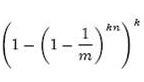
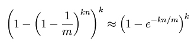

# 14.4 Bloom Filter 的对接

首先回顾一下 Scrapy-Redis 的去重机制。Scrapy-Redis 将 Request 的指纹存储到了 Redis 集合中，每个指纹的长度为 40，例如 27adcc2e8979cdee0c9cecbbe8bf8ff51edefb61 就是一个指纹，它的每一位都是 16 进制数。

我们计算一下用这种方式耗费的存储空间。每个十六进制数占用 4 b，1 个指纹用 40 个十六进制数表示，占用空间为 20 B，1 万个指纹即占用空间 200 KB，1 亿个指纹占用 2 GB。当爬取数量达到上亿级别时，Redis 的占用的内存就会变得很大，而且这仅仅是指纹的存储。Redis 还存储了爬取队列，内存占用会进一步提高，更别说有多个 Scrapy 项目同时爬取的情况了。当爬取达到亿级别规模时，Scrapy-Redis 提供的集合去重已经不能满足我们的要求。所以我们需要使用一个更加节省内存的去重算法 Bloom Filter。

### 1. 了解 BloomFilter

Bloom Filter，中文名称叫作布隆过滤器，是 1970 年由 Bloom 提出的，它可以被用来检测一个元素是否在一个集合中。Bloom Filter 的空间利用效率很高，使用它可以大大节省存储空间。Bloom Filter 使用位数组表示一个待检测集合，并可以快速地通过概率算法判断一个元素是否存在于这个集合中。利用这个算法我们可以实现去重效果。

本节我们来了解 Bloom Filter 的基本算法，以及 Scrapy-Redis 中对接 Bloom Filter 的方法。

### 2. BloomFilter 的算法

在 Bloom Filter 中使用位数组来辅助实现检测判断。在初始状态下，我们声明一个包含 m 位的位数组，它的所有位都是 0，如图 14-7 所示。


图 14-7 初始位数组

现在我们有了一个待检测集合，我们表示为 S={x1, x2, ..., xn}，我们接下来需要做的就是检测一个 x 是否已经存在于集合 S 中。在 BloomFilter 算法中首先使用 k 个相互独立的、随机的哈希函数来将这个集合 S 中的每个元素 x1、x2、...、xn 映射到这个长度为 m 的位数组上，哈希函数得到的结果记作位置索引，然后将位数组该位置索引的位置 1。例如这里我们取 k 为 3，即有三个哈希函数，x1 经过三个哈希函数映射得到的结果分别为 1、4、8，x2 经过三个哈希函数映射得到的结果分别为 4、6、10，那么就会将位数组的 1、4、6、8、10 这五位置 1，如图 14-8 所示：


图 14-8 映射后位数组

这时如果再有一个新的元素 x，我们要判断 x 是否属于 S 这个集合，我们便会将仍然用 k 个哈希函数对 x 求映射结果，如果所有结果对应的位数组位置均为 1，那么我们就认为 x 属于 S 这个集合，否则如果有一个不为 1，则 x 不属于 S 集合。

例如一个新元素 x 经过三个哈希函数映射的结果为 4、6、8，对应的位置均为 1，则判断 x 属于 S 这个集合。如果结果为 4、6、7，7 对应的位置为 0，则判定 x 不属于 S 这个集合。

注意这里 m、n、k 满足的关系是 m>nk，也就是说位数组的长度 m 要比集合元素 n 和哈希函数 k 的乘积还要大。

这样的判定方法很高效，但是也是有代价的，它可能把不属于这个集合的元素误认为属于这个集合，我们来估计一下它的错误率。当集合 S={x1, x2,…, xn} 的所有元素都被 k 个哈希函数映射到 m 位的位数组中时，这个位数组中某一位还是 0 的概率是：


因为哈希函数是随机的，所以任意一个哈希函数选中这一位的概率为 1/m，那么 1-1/m 就代表哈希函数一次没有选中这一位的概率，要把 S 完全映射到 m 位数组中，需要做 kn 次哈希运算，所以最后的概率就是 1-1/m 的 kn 次方。

一个不属于 S 的元素 x 如果要被误判定为在 S 中，那么这个概率就是 k 次哈希运算得到的结果对应的位数组位置都为 1，所以误判概率为：



根据：


可以将误判概率转化为：



在给定 m、n 时，可以求出使得 f 最小化的 k 值为：


在这里将误判概率归纳如下：

表 14-1　误判概率

| m/n | 最优 k | k=1 | 	k=2 | 	k=3 | 	k=4 | 	k=5 | 	k=6 | 	k=7 | 	k=8 |
| --- | --- | --- | --- | --- | --- | --- | --- | --- |  --- |
| 2 | 	1.39 | 0.393 | 	0.400 | 	 |   | 	 |   | 	 |   |
| 3 | 	2.08 | 	0.283 | 	0.237 | 	0.253 | 	 |   | 	 |   | 	 |
| 4 | 	2.77 | 	0.221 | 	0.155 | 	0.147 | 	0.160 | 	 |   | 	 |   |
| 5 | 	3.46 | 	0.181 | 	0.109 | 	0.092 | 	0.092 | 	0.101 | 	 |   | 	 |
| 6 | 	4.16 | 	0.154 | 	0.0804 | 	0.0609 | 	0.0561 | 	0.0578 | 	0.0638 | 	 |   |
| 7 | 	4.85 | 	0.133 | 	0.0618 | 	0.0423 | 	0.0359 | 	0.0347 | 	0.0364 | 	 |   |
| 8 | 	5.55 | 	0.118 | 	0.0489 | 	0.0306 | 	0.024 | 	0.0217 | 	0.0216 | 	0.0229 |    |
| 9 | 	6.24 | 	0.105 | 	0.0397 | 	0.0228 | 	0.0166 | 	0.0141 | 	0.0133 | 	0.0135 | 	0.0145 |
| 10 | 	6.93 | 	0.0952 | 	0.0329 | 	0.0174 | 	0.0118 | 	0.00943 | 	0.00844 | 	0.00819 | 	0.00846 |
| 11 | 	7.62 | 	0.0869 | 	0.0276 | 	0.0136 | 	0.00864 | 	0.0065 | 	0.00552 | 	0.00513 | 	0.00509 |
| 12 | 	8.32 | 	0.08 | 	0.0236 | 	0.0108 | 	0.00646 | 	0.00459 | 	0.00371 | 	0.00329 | 	0.00314 |
| 13 | 	9.01 | 	0.074 | 	0.0203 | 	0.00875 | 	0.00492 | 	0.00332 | 	0.00255 | 	0.00217 | 	0.00199 |
| 14 | 	9.7 | 	0.0689 | 	0.0177 | 	0.00718 | 	0.00381 | 	0.00244 | 	0.00179 | 	0.00146 | 	0.00129 |
| 15 | 	10.4 | 	0.0645 | 	0.0156 | 	0.00596 | 	0.003 | 	0.00183 | 	0.00128 | 	0.001 | 	0.000852 |
| 16 | 	11.1 | 	0.0606 | 	0.0138 | 	0.005 | 	0.00239 | 	0.00139 | 	0.000935 | 	0.000702 | 	0.000574 |
| 17 | 	11.8 | 	0.0571 | 	0.0123 | 	0.00423 | 	0.00193 | 	0.00107 | 	0.000692 | 	0.000499 | 	0.000394 |
| 18 | 	12.5 | 	0.054 | 	0.0111 | 	0.00362 | 	0.00158 | 	0.000839 | 	0.000519 | 	0.00036 | 	0.000275 |
| 19 | 	13.2 | 	0.0513 | 	0.00998 | 	0.00312 | 	0.0013 | 	0.000663 | 	0.000394 | 	0.000264 | 	0.000194 |
| 20 | 	13.9 | 	0.0488 | 	0.00906 | 	0.0027 | 	0.00108 | 	0.00053 | 	0.000303 | 	0.000196 | 	0.00014 |
| 21 | 	14.6 | 	0.0465 | 	0.00825 | 	0.00236 | 	0.000905 | 	0.000427 | 	0.000236 | 	0.000147 | 	0.000101 |
| 22 | 	15.2 | 	0.0444 | 	0.00755 | 	0.00207 | 	0.000764 | 	0.000347 | 	0.000185 | 	0.000112 | 	7.46e-05 |
| 23 | 	15.9 | 	0.0425 | 	0.00694 | 	0.00183 | 	0.000649 | 	0.000285 | 	0.000147 | 	8.56e-05 | 	5.55e-05 |
| 24 | 	16.6 | 	0.0408 | 	0.00639 | 	0.00162 | 	0.000555 | 	0.000235 | 	0.000117 | 	6.63e-05 | 	4.17e-05 |
| 25 | 	17.3 | 	0.0392 | 	0.00591 | 	0.00145 | 	0.000478 | 	0.000196 | 	9.44e-05 | 	5.18e-05 | 	3.16e-05 |
| 26 | 	18 | 	0.0377 | 	0.00548 | 	0.00129 | 	0.000413 | 	0.000164 | 	7.66e-05 | 	4.08e-05 | 	2.42e-05 |
| 27 | 	18.7 | 	0.0364 | 	0.0051 | 	0.00116 | 	0.000359 | 	0.000138 | 	6.26e-05 | 	3.24e-05 | 	1.87e-05 |
| 28 | 	19.4 | 	0.0351 | 	0.00475 | 	0.00105 | 	0.000314 | 	0.000117 | 	5.15e-05 | 	2.59e-05 | 	1.46e-05 |
| 29 | 	20.1 | 	0.0339 | 	0.00444 | 	0.000949 | 	0.000276 | 	9.96e-05 | 	4.26e-05 | 	2.09e-05 | 	1.14e-05 |
| 30 | 	20.8 | 	0.0328 | 	0.00416 | 	0.000862 | 	0.000243 | 	8.53e-05 | 	3.55e-05 | 	1.69e-05 | 	9.01e-06 |
| 31 | 	21.5 | 	0.0317 | 	0.0039 | 	0.000785 | 	0.000215 | 	7.33e-05 | 	2.97e-05 | 	1.38e-05 | 	7.16e-06 |
| 32 | 	22.2 | 	0.0308 | 	0.00367 | 	0.000717 | 	0.000191 | 	6.33e-05 | 	2.5e-05 | 	1.13e-05 | 	5.73e-06 |


表 14-1 中第一列为 m/n 的值，第二列为最优 k 值，其后列为不同 k 值的误判概率，可以看到当 k 值确定时，随着 m/n 的增大，误判概率逐渐变小。当 m/n 的值确定时，当 k 越靠近最优 K 值，误判概率越小。另外误判概率总体来看都是极小的，在容忍此误判概率的情况下，大幅减小存储空间和判定速度是完全值得的。

接下来我们就将 BloomFilter 算法应用到 Scrapy-Redis 分布式爬虫的去重过程中，以解决 Redis 内存不足的问题。

### 3. 对接 Scrapy-Redis

实现 BloomFilter 时，我们首先要保证不能破坏 Scrapy-Redis 分布式爬取的运行架构，所以我们需要修改 Scrapy-Redis 的源码，将它的去重类替换掉。同时 BloomFilter 的实现需要借助于一个位数组，所以既然当前架构还是依赖于 Redis 的，那么正好位数组的维护直接使用 Redis 就好了。

首先我们实现一个基本的哈希算法，可以实现将一个值经过哈希运算后映射到一个 m 位位数组的某一位上，代码实现如下：

```python
class HashMap(object):
    def __init__(self, m, seed):
        self.m = m
        self.seed = seed
    
    def hash(self, value):
        """
        Hash Algorithm
        :param value: Value
        :return: Hash Value
        """
        ret = 0
        for i in range(len(value)):
            ret += self.seed * ret + ord(value[i])
        return (self.m - 1) & ret
```

在这里新建了一个 HashMap 类，构造函数传入两个值，一个是 m 位数组的位数，另一个是种子值 seed，不同的哈希函数需要有不同的 seed，这样可以保证不同的哈希函数的结果不会碰撞。

在 hash() 方法的实现中，value 是要被处理的内容，在这里我们遍历了该字符的每一位并利用 ord() 方法取到了它的 ASCII 码值，然后混淆 seed 进行迭代求和运算，最终会得到一个数值。这个数值的结果就由 value 和 seed 唯一确定，然后我们再将它和 m 进行按位与运算，即可获取到 m 位数组的映射结果，这样我们就实现了一个由字符串和 seed 来确定的哈希函数。当 m 固定时，只要 seed 值相同，就代表是同一个哈希函数，相同的  value 必然会映射到相同的位置。所以如果我们想要构造几个不同的哈希函数，只需要改变其 seed 就好了，以上便是一个简易的哈希函数的实现。

接下来我们再实现 BloomFilter，BloomFilter 里面需要用到 k 个哈希函数，所以在这里我们需要对这几个哈希函数指定相同的 m 值和不同的 seed 值，在这里构造如下：

```python
BLOOMFILTER_HASH_NUMBER = 6
BLOOMFILTER_BIT = 30

class BloomFilter(object):
    def __init__(self, server, key, bit=BLOOMFILTER_BIT, hash_number=BLOOMFILTER_HASH_NUMBER):
        """
        Initialize BloomFilter
        :param server: Redis Server
        :param key: BloomFilter Key
        :param bit: m = 2 ^ bit
        :param hash_number: the number of hash function
        """
        # default to 1 << 30 = 10,7374,1824 = 2^30 = 128MB, max filter 2^30/hash_number = 1,7895,6970 fingerprints
        self.m = 1 << bit
        self.seeds = range(hash_number)
        self.maps = [HashMap(self.m, seed) for seed in self.seeds]
        self.server = server
        self.key = key
```

由于我们需要亿级别的数据的去重，即前文介绍的算法中的 n 为 1 亿以上，哈希函数的个数 k 大约取 10 左右的量级，而 m>kn，所以这里 m 值大约保底在 10 亿，由于这个数值比较大，所以这里用移位操作来实现，传入位数 bit，定义 30，然后做一个移位操作 1 << 30，相当于 2 的 30 次方，等于 1073741824，量级也是恰好在 10 亿左右，由于是位数组，所以这个位数组占用的大小就是 2^30b=128MB，而本文开头我们计算过 Scrapy-Redis 集合去重的占用空间大约在 2G 左右，可见 BloomFilter 的空间利用效率之高。

随后我们再传入哈希函数的个数，用它来生成几个不同的 seed，用不同的 seed 来定义不同的哈希函数，这样我们就可以构造一个哈希函数列表，遍历 seed，构造带有不同 seed 值的 HashMap 对象，保存成变量 maps 供后续使用。

另外 server 就是 Redis 连接对象，key 就是这个 m 位数组的名称。

接下来我们就要实现比较关键的两个方法了，一个是判定元素是否重复的方法 exists()，另一个是添加元素到集合中的方法 insert()，实现如下：

```python
def exists(self, value):
    """
    if value exists
    :param value:
    :return:
    """
    if not value:
        return False
    exist = 1
    for map in self.maps:
        offset = map.hash(value)
        exist = exist & self.server.getbit(self.key, offset)
    return exist

def insert(self, value):
    """
    add value to bloom
    :param value:
    :return:
    """
    for f in self.maps:
        offset = f.hash(value)
        self.server.setbit(self.key, offset, 1)
```

首先我们先看下 insert() 方法，BloomFilter 算法中会逐个调用哈希函数对放入集合中的元素进行运算得到在 m 位位数组中的映射位置，然后将位数组对应的位置置 1，所以这里在代码中我们遍历了初始化好的哈希函数，然后调用其 hash() 方法算出映射位置 offset，再利用 Redis 的 setbit() 方法将该位置 1。

在 exists() 方法中我们就需要实现判定是否重复的逻辑了，方法参数 value 即为待判断的元素，在这里我们首先定义了一个变量 exist，然后遍历了所有哈希函数对 value 进行哈希运算，得到映射位置，然后我们用 getbit() 方法取得该映射位置的结果，依次进行与运算。这样只有每次 getbit() 得到的结果都为 1 时，最后的 exist 才为 True，即代表 value 属于这个集合。如果其中只要有一次 getbit() 得到的结果为 0，即 m 位数组中有对应的 0 位，那么最终的结果 exist 就为 False，即代表 value 不属于这个集合。这样此方法最后的返回结果就是判定重复与否的结果了。

到现在为止 BloomFilter 的实现就已经完成了，我们可以用一个实例来测试一下，代码如下：

```python
conn = StrictRedis(host='localhost', port=6379, password='foobared')
bf = BloomFilter(conn, 'testbf', 5, 6)
bf.insert('Hello')
bf.insert('World')
result = bf.exists('Hello')
print(bool(result))
result = bf.exists('Python')
print(bool(result))
```

在这里我们首先定义了一个 Redis 连接对象，然后传递给 BloomFilter，为了避免内存占用过大这里传的位数 bit 比较小，设置为 5，哈希函数的个数设置为 6。

首先我们调用 insert() 方法插入了 Hello 和 World 两个字符串，随后判断了一下 Hello 和 Python 这两个字符串是否存在，最后输出它的结果，运行结果如下：

```python
True
False
```

很明显，结果完全没有问题，这样我们就借助于 Redis 成功实现了 BloomFilter 的算法。

接下来我们需要继续修改 Scrapy-Redis 的源码，将它的 dupefilter 逻辑替换为 BloomFilter 的逻辑，在这里主要是修改 RFPDupeFilter 类的 request_seen() 方法，实现如下：

```python
def request_seen(self, request):
    fp = self.request_fingerprint(request)
    if self.bf.exists(fp):
        return True
    self.bf.insert(fp)
    return False
```

首先还是利用 request_fingerprint() 方法获取了 Request 的指纹，然后调用 BloomFilter 的 exists() 方法判定了该指纹是否存在，如果存在，则证明该 Request 是重复的，返回 True，否则调用 BloomFilter 的 insert() 方法将该指纹添加并返回 False，这样就成功利用 BloomFilter 替换了 Scrapy-Redis 的集合去重。

对于 BloomFilter 的初始化定义，我们可以将 __init__() 方法修改为如下内容：

```python
def __init__(self, server, key, debug, bit, hash_number):
    self.server = server
    self.key = key
    self.debug = debug
    self.bit = bit
    self.hash_number = hash_number
    self.logdupes = True
    self.bf = BloomFilter(server, self.key, bit, hash_number)
```
其中 bit 和 hash_number 需要使用 from_settings() 方法传递，修改如下：
```python
@classmethod
def from_settings(cls, settings):
    server = get_redis_from_settings(settings)
    key = defaults.DUPEFILTER_KEY % {'timestamp': int(time.time())}
    debug = settings.getbool('DUPEFILTER_DEBUG', DUPEFILTER_DEBUG)
    bit = settings.getint('BLOOMFILTER_BIT', BLOOMFILTER_BIT)
    hash_number = settings.getint('BLOOMFILTER_HASH_NUMBER', BLOOMFILTER_HASH_NUMBER)
    return cls(server, key=key, debug=debug, bit=bit, hash_number=hash_number)
```
其中常量的定义 DUPEFILTER_DEBUG 和 BLOOMFILTER_BIT 统一定义在 defaults.py 中，默认如下：
```python
BLOOMFILTER_HASH_NUMBER = 6
BLOOMFILTER_BIT = 30
```

到此为止我们就成功实现了 BloomFilter 和 Scrapy-Redis 的对接。

### 4. 本节代码

本节代码地址为：[https://github.com/Python3WebSpider/ScrapyRedisBloomFilter](https://github.com/Python3WebSpider/ScrapyRedisBloomFilter)。

### 5. 使用

为了方便使用，本节的代码已经打包成了一个 Python 包并发布到了 PyPi，链接为：[https://pypi.python.org/pypi/scrapy-redis-bloomfilter](https://pypi.python.org/pypi/scrapy-redis-bloomfilter)，因此我们以后如果想使用 ScrapyRedisBloomFilter 直接使用就好了，不需要再自己实现一遍。

我们可以直接使用 Pip 来安装，命令如下：

```
pip3 install scrapy-redis-bloomfilter
```

使用的方法和 Scrapy-Redis 基本相似，在这里说明几个关键配置：

```python
# 去重类，要使用 BloomFilter 请替换 DUPEFILTER_CLASS
DUPEFILTER_CLASS = "scrapy_redis_bloomfilter.dupefilter.RFPDupeFilter"
# 哈希函数的个数，默认为 6，可以自行修改
BLOOMFILTER_HASH_NUMBER = 6
# BloomFilter 的 bit 参数，默认 30，占用 128MB 空间，去重量级 1 亿
BLOOMFILTER_BIT = 30
```

DUPEFILTER_CLASS 是去重类，如果要使用 BloomFilter 需要将 DUPEFILTER_CLASS 修改为该包的去重类。

BLOOMFILTER_HASH_NUMBER 是 BloomFilter 使用的哈希函数的个数，默认为 6，可以根据去重量级自行修改。

BLOOMFILTER_BIT 即前文所介绍的 BloomFilter 类的 bit 参数，它决定了位数组的位数，如果 BLOOMFILTER_BIT 为 30，那么位数组位数为 2 的 30 次方，将占用 Redis 128MB 的存储空间，去重量级在 1 亿左右，即对应爬取量级 1 亿左右。如果爬取量级在 10 亿、20 亿甚至 100 亿，请务必将此参数对应调高。

### 6. 测试

在源代码中附有一个测试项目，放在 tests 文件夹，该项目使用了 Scrapy-RedisBloomFilter 来去重，Spider 的实现如下：

```python
from scrapy import Request, Spider

class TestSpider(Spider):
    name = 'test'
    base_url = 'https://www.baidu.com/s?wd='
    
    def start_requests(self):
        for i in range(10):
            url = self.base_url + str(i)
            yield Request(url, callback=self.parse)
            
        # Here contains 10 duplicated Requests    
        for i in range(100): 
            url = self.base_url + str(i)
            yield Request(url, callback=self.parse)
    
    def parse(self, response):
        self.logger.debug('Response of ' + response.url)
```
在 start_requests() 方法中首先循环 10 次，构造参数为 0-9 的 URL，然后重新循环了 100 次，构造了参数为 0-99 的 URL，那么这里就会包含 10 个重复的 Request，我们运行项目测试一下：
```
scrapy crawl test
```
可以看到最后的输出结果如下：
```python
{'bloomfilter/filtered': 10,
 'downloader/request_bytes': 34021,
 'downloader/request_count': 100,
 'downloader/request_method_count/GET': 100,
 'downloader/response_bytes': 72943,
 'downloader/response_count': 100,
 'downloader/response_status_count/200': 100,
 'finish_reason': 'finished',
 'finish_time': datetime.datetime(2017, 8, 11, 9, 34, 30, 419597),
 'log_count/DEBUG': 202,
 'log_count/INFO': 7,
 'memusage/max': 54153216,
 'memusage/startup': 54153216,
 'response_received_count': 100,
 'scheduler/dequeued/redis': 100,
 'scheduler/enqueued/redis': 100,
 'start_time': datetime.datetime(2017, 8, 11, 9, 34, 26, 495018)}
```
可以看到最后统计的第一行的结果：
```python
'bloomfilter/filtered': 10,
```

这就是 BloomFilter 过滤后的统计结果，可以看到它的过滤个数为 10 个，也就是它成功将重复的 10 个 Reqeust 识别出来了，测试通过。

### 7. 结语

以上便是 BloomFilter 的原理及对接实现，使用了 BloomFilter 可以大大节省 Redis 内存，在数据量大的情况下推荐使用此方案。