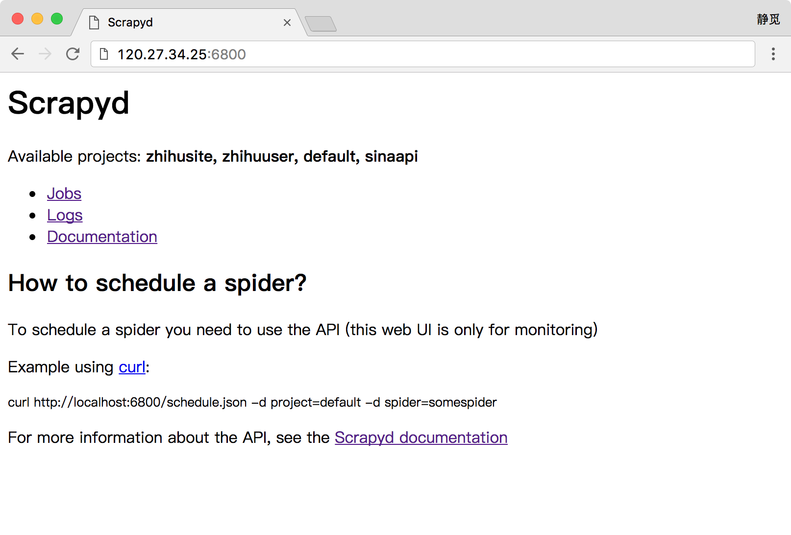

# 15.1 Scrapyd 分布式部署

分布式爬虫完成并可以成功运行了，但是有个环节非常烦琐，那就是代码部署。

我们设想下面的几个场景。

* 如果采用上传文件的方式部署代码，我们首先将代码压缩，然后采用 SFTP 或 FTP 的方式将文件上传到服务器，之后再连接服务器将文件解压，每个服务器都需要这样配置。

* 如果采用 Git 同步的方式部署代码，我们可以先把代码 Push 到某个 Git 仓库里，然后再远程连接各台主机执行 Pull 操作，同步代码，每个服务器同样需要做一次操作。

如果代码突然有更新，那我们必须更新每个服务器，而且万一哪台主机的版本没控制好，这可能会影响整体的分布式爬取状况。

所以我们需要一个更方便的工具来部署 Scrapy 项目，如果可以省去一遍遍逐个登录服务器部署的操作，那将会方便很多。

本节我们就来看看提供分布式部署的工具 Scrapyd。

### 1. 了解 Scrapyd

Scrapyd 是一个运行 Scrapy 爬虫的服务程序，它提供一系列 HTTP 接口来帮助我们部署、启动、停止、删除爬虫程序。Scrapyd 支持版本管理，同时还可以管理多个爬虫任务，利用它我们可以非常方便地完成 Scrapy 爬虫项目的部署任务调度。

### 2. 准备工作

请确保本机或服务器已经正确安装好了 Scrapyd，安装和配置的方法可以参见第 1 章的内容。

### 3. 访问 Scrapyd

安装并运行了 Scrapyd 之后，我们就可以访问服务器的 6800 端口看到一个 WebUI 页面了，例如我的服务器地址为 120.27.34.25，在上面安装好了 Scrapyd 并成功运行，那么我就可以在本地的浏览器中打开：[http://120.27.34.25:6800](http://120.27.34.25:6800)，就可以看到 Scrapyd 的首页，这里请自行替换成你的服务器地址查看即可，如图 15-1 所示：



图 15-1 Scrapyd 首页

如果可以成功访问到此页面，那么证明 Scrapyd 配置就没有问题了。

### 4. Scrapyd 的功能

Scrapyd 提供了一系列 HTTP 接口来实现各种操作，在这里我们可以将接口的功能梳理一下，以 Scrapyd 所在的 IP 为 120.27.34.25 为例：

#### daemonstatus.json

这个接口负责查看 Scrapyd 当前的服务和任务状态，我们可以用 curl 命令来请求这个接口，命令如下：

```
curl http://139.217.26.30:6800/daemonstatus.json
```

这样我们就会得到如下结果：

```json
{"status": "ok", "finished": 90, "running": 9, "node_name": "datacrawl-vm", "pending": 0}
```

返回结果是 Json 字符串，status 是当前运行状态， finished 代表当前已经完成的 Scrapy 任务，running 代表正在运行的 Scrapy 任务，pending 代表等待被调度的 Scrapyd 任务，node_name 就是主机的名称。

#### addversion.json

这个接口主要是用来部署 Scrapy 项目用的，在部署的时候我们需要首先将项目打包成 Egg 文件，然后传入项目名称和部署版本。

我们可以用如下的方式实现项目部署：

```
curl http://120.27.34.25:6800/addversion.json -F project=wenbo -F version=first -F egg=@weibo.egg
```

在这里 -F 即代表添加一个参数，同时我们还需要将项目打包成 Egg 文件放到本地。

这样发出请求之后我们可以得到如下结果：

```json
{"status": "ok", "spiders": 3}
```

这个结果表明部署成功，并且其中包含的 Spider 的数量为 3。

此方法部署可能比较繁琐，在后文会介绍更方便的工具来实现项目的部署。

#### schedule.json

这个接口负责调度已部署好的 Scrapy 项目运行。

我们可以用如下接口实现任务调度：

```
curl http://120.27.34.25:6800/schedule.json -d project=weibo -d spider=weibocn
```

在这里需要传入两个参数，project 即 Scrapy 项目名称，spider 即 Spider 名称。

返回结果如下：

```json
{"status": "ok", "jobid": "6487ec79947edab326d6db28a2d86511e8247444"}
```

status 代表 Scrapy 项目启动情况，jobid 代表当前正在运行的爬取任务代号。

#### cancel.json

这个接口可以用来取消某个爬取任务，如果这个任务是 pending 状态，那么它将会被移除，如果这个任务是 running 状态，那么它将会被终止。

我们可以用下面的命令来取消任务的运行：

```
curl http://120.27.34.25:6800/cancel.json -d project=weibo -d job=6487ec79947edab326d6db28a2d86511e8247444
```

在这里需要传入两个参数，project 即项目名称，job 即爬取任务代号。

返回结果如下：

```json
{"status": "ok", "prevstate": "running"}
```

status 代表请求执行情况，prevstate 代表之前的运行状态。

#### listprojects.json

这个接口用来列出部署到 Scrapyd 服务上的所有项目描述。

我们可以用下面的命令来获取 Scrapyd 服务器上的所有项目描述：

```
curl http://120.27.34.25:6800/listprojects.json
```

这里不需要传入任何参数。

返回结果如下：

```json
{"status": "ok", "projects": ["weibo", "zhihu"]}
```

status 代表请求执行情况，projects 是项目名称列表。

#### listversions.json

这个接口用来获取某个项目的所有版本号，版本号是按序排列的，最后一个条目是最新的版本号。

我们可以用如下命令来获取项目的版本号：

```
curl http://120.27.34.25:6800/listversions.json?project=weibo
```

在这里需要一个参数 project，就是项目的名称。

返回结果如下：

```json
{"status": "ok", "versions": ["v1", "v2"]}
```

status 代表请求执行情况，versions 是版本号列表。

#### listspiders.json

这个接口用来获取某个项目最新的一个版本的所有 Spider 名称。

我们可以用如下命令来获取项目的 Spider 名称：

```
curl http://120.27.34.25:6800/listspiders.json?project=weibo
```

在这里需要一个参数 project，就是项目的名称。

返回结果如下：

```json
{"status": "ok", "spiders": ["weibocn"]}
```

status 代表请求执行情况，spiders 是 Spider 名称列表。


#### listjobs.json

这个接口用来获取某个项目当前运行的所有任务详情。

我们可以用如下命令来获取所有任务详情：

```
curl http://120.27.34.25:6800/listjobs.json?project=weibo
```

在这里需要一个参数 project，就是项目的名称。

返回结果如下：

```json
{"status": "ok",
 "pending": [{"id": "78391cc0fcaf11e1b0090800272a6d06", "spider": "weibocn"}],
 "running": [{"id": "422e608f9f28cef127b3d5ef93fe9399", "spider": "weibocn", "start_time": "2017-07-12 10:14:03.594664"}],
 "finished": [{"id": "2f16646cfcaf11e1b0090800272a6d06", "spider": "weibocn", "start_time": "2017-07-12 10:14:03.594664", "end_time": "2017-07-12 10:24:03.594664"}]}
```

status 代表请求执行情况，pendings 代表当前正在等待的任务，running 代表当前正在运行的任务，finished 代表已经完成的任务。

#### delversion.json

这个接口用来删除项目的某个版本。

我们可以用如下命令来删除项目版本：

```
curl http://120.27.34.25:6800/delversion.json -d project=weibo -d version=v1
```

在这里需要一个参数 project，就是项目的名称，还需要一个参数 version，就是项目的版本。

返回结果如下：

```json
{"status": "ok"}
```

status 代表请求执行情况，这样就代表删除成功了。

#### delproject.json

这个接口用来删除某个项目。

我们可以用如下命令来删除某个项目：

```
curl http://120.27.34.25:6800/delproject.json -d project=weibo
```

在这里需要一个参数 project，就是项目的名称。

返回结果如下：

```json
{"status": "ok"}
```

status 代表请求执行情况，这样就代表删除成功了。

以上就是 Scrapyd 所有的接口，我们可以直接请求 HTTP 接口即可控制项目的部署、启动、运行等操作。

### 5. ScrapydAPI 的使用

以上的这些接口可能使用起来还不是很方便，没关系，还有一个 ScrapydAPI 库对这些接口又做了一层封装，其安装方式也可以参考第一章的内容。

下面我们来看下 ScrapydAPI 的使用方法，其实核心原理和 HTTP 接口请求方式并无二致，只不过用 Python 封装后使用更加便捷。

我们可以用如下方式建立一个 ScrapydAPI 对象：

```python
from scrapyd_api import ScrapydAPI
scrapyd = ScrapydAPI('http://120.27.34.25:6800')
```
然后就可以调用它的方法来实现对应接口的操作了，例如部署的操作可以使用如下方式：
```python
egg = open('weibo.egg', 'rb')
scrapyd.add_version('weibo', 'v1', egg)
```

这样我们就可以将项目打包为 Egg 文件，然后把本地打包的的 Egg 项目部署到远程 Scrapyd 了。

另外 ScrapydAPI 还实现了所有 Scrapyd 提供的 API 接口，名称都是相同的，参数也是相同的。

例如我们可以调用 list_projects() 方法即可列出 Scrapyd 中所有已部署的项目：

```python
scrapyd.list_projects()
['weibo', 'zhihu']
```

另外还有其他的方法在此不再一一列举了，名称和参数都是相同的，更加详细的操作可以参考其官方文档：[http://python-scrapyd-api.readthedocs.io/](http://python-scrapyd-api.readthedocs.io/)。


### 6. 结语

本节介绍了 Scrapyd 及 ScrapydAPI 的相关用法，我们可以通过它来部署项目，并通过 HTTP 接口来控制人物的运行，不过这里有一个不方便的地方就是部署过程，首先它需要打包 Egg 文件然后再上传，还是比较繁琐的，在下一节我们介绍一个更加方便的工具来完成部署过程。