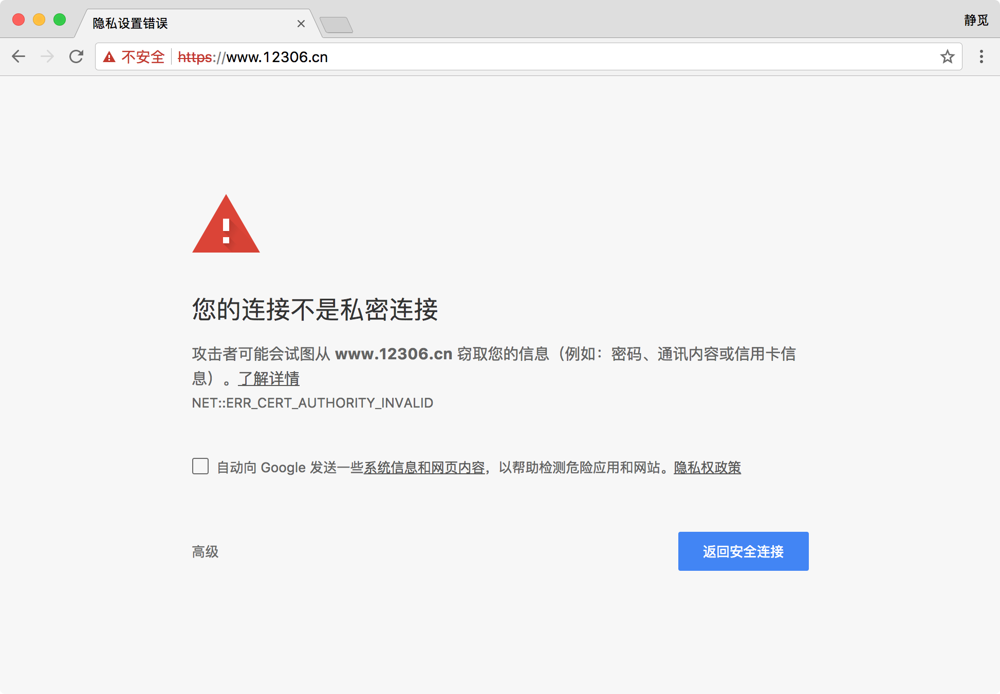

# 2.1 HTTP基本原理

在本节我们会详细了解 HTTP 的基本原理，了解在浏览器中敲入一个 URL 到获取网页内容发生了一个怎样的过程，了解了这些内容，有助于去进一步了解爬虫的基本原理。

### 1. URI、URL

在了解 HTTP 之前我们先了解一下 URI 和 URL。我们经常会听到 URI 和 URL 两个术语，URI 全称为 Uniform Resource Identifier，即统一资源标志符，URL 全称为 Universal Resource Locator，即统一资源定位符。

举例来说，[https://github.com/favicon.ico](https://github.com/favicon.ico)，这是 GitHub 的网站图标链接，它是一个 URL，也是一个 URI，即有这样的一个图标资源，我们用 URL/URI 来唯一指定了它的访问方式，这其中包括了访问协议 https、访问路径/即根目录，资源名称 favicon.ico，通过这样的一个链接我们便可以从互联网上找到这个资源，这就是 URL/URI。

URL 是 URI 的子集，也就是说每个 URL 都是 URI，但不是每个 URI 都是 URL。那么怎样的 URI 不是 URL 呢？URI 还包括一个子类叫做 URN，它的全称为 Universal Resource Name，即统一资源名称。URN 只命名资源而不指定如何定位资源，如 urn:isbn:0451450523，它指定了一本书的 ISBN，可以唯一标识这一本书，但是没有指定到哪里定位这本书，这就是 URN，URL、URN、URI 的关系可以用图表示如下：

但是在目前的互联网，URN 的使用非常少，所以几乎所有的 URI 都是 URL，所以一般的网页链接我们可以称之为 URL，也可以称之为 URI，我个人习惯称之为 URL。

### 2. 超文本

接下来我们再了解一个概念，超文本。超文本英文名称叫做 Hypertext，我们在浏览器里面看到的网页就是超文本解析而成的，其网页源代码是一系列 HTML 代码，里面包含了一系列标签，如 img 显示图片，p 指定显示段落等，浏览器解析这些标签后便形成了我们平常看到的网页，而这网页的源代码 HTML 就可以称作超文本。

例如我们在 Chrome 浏览器里面打开任意一个页面，如淘宝首页，右键点击检查，或按下快捷键 F12 即可打开浏览器的开发者工具，这时我们在 Elements 选项卡即可看到当前网页的源代码，这些源代码都是超文本，如图所示：

### 3. HTTP、HTTPS

我们在前面了解了 URI 和 URL，例如淘宝的首页：[https://www.taobao.com/](https://www.taobao.com/)，在 URL 的开头会有 http 或 https，这个就是访问资源需要的协议类型，有时我们还会看到 ftp、sftp、smb 开头的 URL，那么这里的 ftp、sftp、smb 都是指的协议类型。在爬虫中，我们抓取的页面通常就是 http 或 https 协议的，我们在这里首先来了解一下这两个协议的含义。

HTTP 的全称是 Hyper Text Transfer Protocol，中文名叫做超文本传输协议，HTTP 协议是用于从网络传输超文本数据到本地浏览器的传送协议，它能保证传送高效而准确地传送超文本文档。HTTP 由万维网协会（World Wide Web Consortium）和 Internet 工作小组IETF（Internet Engineering Task Force）共同合作制定的规范，目前广泛使用的是 HTTP 1.1 版本。

HTTPS 的全称是 Hyper Text Transfer Protocol over Secure Socket Layer，是以安全为目标的 HTTP 通道，简单讲是 HTTP 的安全版，即 HTTP 下加入 SSL 层，简称为 HTTPS。

HTTPS 的安全基础是 SSL，因此通过它传输的内容都是经过 SSL 加密的，它的主要作用可以分为两种：
* 是建立一个信息安全通道，来保证数据传输的安全。
* 确认网站的真实性，凡是使用了 https 的网站，都可以通过点击浏览器地址栏的锁头标志来查看网站认证之后的真实信息，也可以通过 CA 机构颁发的安全签章来查询。

现在越来越多的网站和 APP 都已经向 HTTPS 方向发展。例如：
* 苹果公司强制所有 iOS App 在 2017 年 1 月 1 日 前全部改为使用 HTTPS 加密，否则 APP 就无法在应用商店上架。
* 谷歌从 2017 年 1 月推出的 Chrome 56 开始，对未进行 HTTPS 加密的网址链接亮出风险提示，即在地址栏的显著位置提醒用户“此网页不安全”。
* 腾讯微信小程序的官方需求文档要求后台使用 HTTPS 请求进行网络通信，不满足条件的域名和协议无法请求。

而某些网站虽然使用了 HTTPS 协议还是会被浏览器提示不安全，例如我们在 Chrome 浏览器里面打开 12306，链接为：[https://www.12306.cn/](https://www.12306.cn/)，这时浏览器就会提示“您的连接不是私密连接”这样的话，如图所示：

这是因为 12306 的 CA 证书是中国铁道部自己颁发给自己的，而这个证书是不被官方机构认可的，所以这里证书验证就不会通过而提示这样的话，但是实际上它的数据传输依然是经过 SSL 加密的。我们如果要爬取这样的站点就需要设置忽略证书的选项，否则会提示 SSL 链接错误，在后文会进行详细说明。

### 4. HTTP请求过程

我们在浏览器中输入一个 URL，回车之后便会在浏览器中观察到页面内容，实际上这个过程是浏览器向网站所在的服务器发送了一个 Request，即请求，网站服务器接收到这个 Request 之后进行处理和解析，然后返回对应的一个 Response，即响应，然后传回给浏览器，Response里面就包含了页面的源代码等内容，浏览器再对其进行解析便将网页呈现了出来，模型如图所示：

此处客户端即代表我们自己的 PC 或手机浏览器，服务器即要访问的网站所在的服务器。

为了更直观地地说明这个的过程，我们在这里用 Chrome 浏览器的开发者模式下的 Network 监听组件来做下演示，它可以显示访问当前请求网页时发生的所有网络请求和响应。

打开 Chrome 浏览器，右键点击检查，或按下快捷键 F12 即可打开浏览器的开发者工具，我们在这里访问百度：[http://www.baidu.com/](http://www.baidu.com/)，输入该 URL，敲击回车访问这个页面，观察一下在这个过程中发生了怎样的网络请求，这时我们可以看到在 Network 页面的下方出现了一个个的条目，那么这一个条目就代表一次发送 Request 和接收 Response 的过程，如图所示：

我们观察第一个网络请求，即 www.baidu.com。

这一个条目的各列分别代表：
* 第一列 Name，即 Request 的名称。一般会用URL的最后一部分内容当做名称。
* 第二列 Status，即 Response 的状态码。这里显示为 200，代表 Response 是正常的，通过状态码我们可以判断发送了 Request 之后是否得到了正常的 Response。
* 第三列 Type，即 Request 请求的文档类型。这里为 document，代表我们这次请求的是一个 HTML 文档，内容就是一些 HTML 代码。
* 第四列 Initiator，即请求源。用来标记 Request 是由哪个对象或进程发起的。
* 第五列 Size，即从服务器下载的文件和请求的资源大小。如果是从缓存中取得的资源则该列会显示 from cache。
* 第六列 Time，即发起 Request 到获取到 Response 所用的总时间。
* 第七列 Timeline，即网络请求的可视化瀑布流。

我们点击这个条目即可看到其更详细的信息，如图所示：

首先是 General 部分，Request URL 为 Request 的 URL，Request Method 为请求的方法，Status Code 为响应状态码，Remote Address 为远程服务器的地址和端口，Referrer Policy 为 Referrer 判别策略。

再继续往下看可以看到有一个 Response Headers 和一个 Request Headers，这分别代表响应头和请求头，请求头里面带有许多请求信息，例如浏览器标识、Cookies、Host 等信息，这是 Request 的一部分，服务器会根据请求头内的信息判断请求是否合法，进而作出对应的响应，返回 Response，那么在图中看到的 Response Headers 就是 Response 的一部分，例如其中包含了服务器的类型、文档类型、日期等信息，浏览器接受到 Response 后，会解析响应内容，进而呈现网页内容。

下面我们分别来介绍一下请求 Request 和响应 Response 都包含了哪些内容，在这里进行对其组成进行总结：

### 5. Request

Request，即请求，由客户端向服务端发出。可以将 Request 划分为四部分内容：Request Method、Request URL、Request Headers、Request Body，即请求方式、请求链接、请求头、请求体。

#### Request Method

请求方式，请求方式常见的有两种类型，GET 和 POST。

我们在浏览器中直接输入一个 URL 并回车，这便发起了一个 GET 请求，请求的参数会直接包含到 URL 里，例如百度搜索 Python，这就是一个 GET 请求，链接为：[https://www.baidu.com/s?wd=Python](https://www.baidu.com/s?wd=Python)，URL 中包含了请求的参数信息，这里参数 wd 就是要搜寻的关键字。POST 请求大多为表单提交发起，如一个登录表单，输入用户名密码，点击登录按钮，这通常会发起一个 POST 请求，其数据通常以 Form Data 即表单的形式传输，不会体现在 URL 中。

GET 和 POST 请求方法有如下区别：
* GET 方式请求中参数是包含在 URL 里面的，数据可以在 URL 中看到，而 POST 请求的 URL 不会包含这些数据，数据都是通过表单的形式传输，会包含在 Request Body 中。
* GET 方式请求提交的数据最多只有 1024 字节，而 POST 方式没有限制。

所以一般来说，网站登录验证的时候，需要提交用户名密码，这里包含了敏感信息，使用GET方式请求的话密码就会暴露在URL里面，造成密码泄露，所以这里最好以POST方式发送。文件的上传时，由于文件内容比较大，也会选用POST方式。

我们平常遇到的绝大部分请求都是 GET 或 POST 请求，另外还有一些请求方式，如 HEAD、PUT、DELETE、OPTIONS、CONNECT、TRACE，我们简单将其总结如下：

| 方法	| 描述 |
| --- | ---- |
| GET	| 请求指定的页面信息，并返回实体主体。|
| HEAD | 类似于 GET 请求，只不过返回的响应中没有具体的内容，用于获取报头。 |
| POST | 向指定资源提交数据进行处理请求，数据被包含在请求体中。| 
| PUT	| 从客户端向服务器传送的数据取代指定的文档的内容。 |
| DELETE | 请求服务器删除指定的页面。 |
| CONNECT | 	HTTP/1.1 协议中预留给能够将连接改为管道方式的代理服务器。 |
| OPTIONS	| 允许客户端查看服务器的性能。|
| TRACE	| 回显服务器收到的请求，主要用于测试或诊断。|

本表参考：[http://www.runoob.com/http/http-methods.html](http://www.runoob.com/http/http-methods.html)。

#### Request URL

顾名思义，就是请求的网址，即统一资源定位符，用 URL 可以唯一确定我们想请求的资源。

#### Request Headers

请求头，用来说明服务器要使用的附加信息，比较重要的信息有 Cookie、Referer、User-Agent 等，下面将一些常用的头信息说明如下：

* Accept，请求报头域，用于指定客户端可接受哪些类型的信息。
* Accept-Language，指定客户端可接受的语言类型。
* Accept-Encoding，指定客户端可接受的内容编码。
* Host，用于指定请求资源的主机 IP 和端口号，其内容为请求 URL 的原始服务器或网关的位置。从 HTTP 1.1 版本开始，Request 必须包含此内容。
* Cookie，也常用复数形式 Cookies，是网站为了辨别用户进行 Session 跟踪而储存在用户本地的数据。Cookies 的主要功能就是维持当前访问会话，例如我们输入用户名密码登录了某个网站，登录成功之后服务器会用 Session 保存我们的登录状态信息，后面我们每次刷新或请求该站点的其他页面时会发现都是保持着登录状态的，在这里就是 Cookies 的功劳，Cookies 里有信息标识了我们所对应的服务器的 Session 会话，每次浏览器在请求该站点的页面时都会在请求头中加上 Cookies 并将其发送给服务器，服务器通过 Cookies 识别出是我们自己，并且查出当前状态是登录的状态，所以返回的结果就是登录之后才能看到的网页内容。
* Referer，此内容用来标识这个请求是从哪个页面发过来的，服务器可以拿到这一信息并做相应的处理，如做来源统计、做防盗链处理等。
* User-Agent，简称 UA，它是一个特殊字符串头，使得服务器能够识别客户使用的操作系统及版本、浏览器及版本等信息。在做爬虫时加上此信息可以伪装为浏览器，如果不加很可能会被识别出为爬虫。
* Content-Type，即 Internet Media Type，互联网媒体类型，也叫做 MIME 类型，在 HTTP 协议消息头中，使用它来表示具体请求中的媒体类型信息。例如 text/html 代表 HTML 格式，image/gif 代表 GIF 图片，application/json 代表 Json 类型，更多对应关系可以查看此对照表：[http://tool.oschina.net/commons](http://tool.oschina.net/commons)。

因此，Request Headers 是 Request 等重要组成部分，在写爬虫的时候大部分情况都需要设定 Request Headers。

#### Request Body

即请求体，一般承载的内容是 POST 请求中的 Form Data，即表单数据，而对于 GET 请求 Request Body 则为空。

例如在这里我登录 GitHub 时捕获到的 Request 和 Response 如下：

在登录之前我们填写了用户名和密码信息，提交时就这些内容就会以 Form Data 的形式提交给服务器，此时注意 Request Headers 中指定了 Content-Type 为 application/x-www-form-urlencoded，只有设置 Content-Type 为 application/x-www-form-urlencoded 才会以 Form Data 形式提交，另外我们也可以将 Content-Type 设置为 application/json 来提交 Json 数据，或者设置为 multipart/form-data 来上传文件。

下面列出了 Content-Type 和 POST 提交数据方式的关系：

| Content-Type | 提交数据方式 |
| --- | ---- |
| application/x-www-form-urlencoded | Form 表单提交 |
| multipart/form-data | 表单文件上传提交 |
| application/json | 序列化 Json 数据提交 |
| text/xml | XML 数据提交 |

在爬虫中如果我们要构造 POST 请求需要注意这几种 Content-Type，了解各种请求库的各个参数设置时使用的是哪种 Content-Type，不然可能会导致 POST 提交后得不到正常的 Response。

以上便是对 Request 各部分内容的解释。

### 6. Response

Response，即响应，由服务端返回给客户端。Response 可以划分为三部分，Response Status Code、Response Headers、Response Body。

#### Response Status Code

响应状态码，此状态码表示了服务器的响应状态，如 200 则代表服务器正常响应，404 则代表页面未找到，500 则代表服务器内部发生错误。在爬虫中，我们可以根据状态码来判断服务器响应状态，如判断状态码为 200，则证明成功返回数据，再进行进一步的处理，否则直接忽略。

下面用表格列出了常见的错误代码及错误原因：

| 状态码  | 说明        | 详情                                 |
| ---- | :-------- | :--------------------------------- |
| 100  | 继续        | 请求者应当继续提出请求。服务器已收到请求的一部分，正在等待其余部分。 |
| 101  | 切换协议      | 请求者已要求服务器切换协议，服务器已确认并准备切换。         |
| 200  | 成功        | 服务器已成功处理了请求。                       |
| 201  | 已创建       | 请求成功并且服务器创建了新的资源。                  |
| 202  | 已接受       | 服务器已接受请求，但尚未处理。                    |
| 203  | 非授权信息     | 服务器已成功处理了请求，但返回的信息可能来自另一来源。        |
| 204  | 无内容       | 服务器成功处理了请求，但没有返回任何内容。              |
| 205  | 重置内容      | 服务器成功处理了请求，内容被重置。                  |
| 206  | 部分内容      | 服务器成功处理了部分请求。                      |
| 300  | 多种选择      | 针对请求，服务器可执行多种操作。                   |
| 301  | 永久移动      | 请求的网页已永久移动到新位置，即永久重定向。             |
| 302  | 临时移动      | 请求的网页暂时跳转到其他页面，即暂时重定向。             |
| 303  | 查看其他位置    | 如果原来的请求是 POST，重定向目标文档应该通过 GET 提取。     |
| 304  | 未修改       | 此次请求返回的网页未修改，继续使用上次的资源。            |
| 305  | 使用代理      | 请求者应该使用代理访问该网页。                    |
| 307  | 临时重定向     | 请求的资源临时从其他位置响应。                    |
| 400  | 错误请求      | 服务器无法解析该请求。                        |
| 401  | 未授权       | 请求没有进行身份验证或验证未通过。                  |
| 403  | 禁止访问      | 服务器拒绝此请求。                          |
| 404  | 未找到       | 服务器找不到请求的网页。                       |
| 405  | 方法禁用      | 服务器禁用了请求中指定的方法。                    |
| 406  | 不接受       | 无法使用请求的内容响应请求的网页。                  |
| 407  | 需要代理授权    | 请求者需要使用代理授权。                       |
| 408  | 请求超时      | 服务器请求超时。                           |
| 409  | 冲突        | 服务器在完成请求时发生冲突。                     |
| 410  | 已删除       | 请求的资源已永久删除。                        |
| 411  | 需要有效长度    | 服务器不接受不含有效内容长度标头字段的请求。             |
| 412  | 未满足前提条件   | 服务器未满足请求者在请求中设置的其中一个前提条件。          |
| 413  | 请求实体过大    | 请求实体过大，超出服务器的处理能力。                 |
| 414  | 请求 URI 过长   | 请求网址过长，服务器无法处理。                    |
| 415  | 不支持类型     | 请求的格式不受请求页面的支持。                    |
| 416  | 请求范围不符    | 页面无法提供请求的范围。                       |
| 417  | 未满足期望值    | 服务器未满足期望请求标头字段的要求。                 |
| 500  | 服务器内部错误   | 服务器遇到错误，无法完成请求。                    |
| 501  | 未实现       | 服务器不具备完成请求的功能。                     |
| 502  | 错误网关      | 服务器作为网关或代理，从上游服务器收到无效响应。           |
| 503  | 服务不可用     | 服务器目前无法使用。                         |
| 504  | 网关超时      | 服务器作为网关或代理，但是没有及时从上游服务器收到请求。       |
| 505  | HTTP 版本不支持 | 服务器不支持请求中所用的 HTTP 协议版本。            |

#### Response Headers

响应头，其中包含了服务器对请求的应答信息，如 Content-Type、Server、Set-Cookie 等，下面将一些常用的头信息说明如下：

* Date，标识 Response 产生的时间。
* Last-Modified，指定资源的最后修改时间。
* Content-Encoding，指定 Response 内容的编码。
* Server，包含了服务器的信息，名称，版本号等。
* Content-Type，文档类型，指定了返回的数据类型是什么，如text/html 则代表返回 HTML 文档，application/x-javascript 则代表返回 JavaScript 文件，image/jpeg 则代表返回了图片。
* Set-Cookie，设置Cookie，Response Headers 中的 Set-Cookie即告诉浏览器需要将此内容放在 Cookies 中，下次请求携带 Cookies 请求。
* Expires，指定 Response 的过期时间，使用它可以控制代理服务器或浏览器将内容更新到缓存中，如果再次访问时，直接从缓存中加载，降低服务器负载，缩短加载时间。

#### Resposne Body

即响应体，最重要的当属响应体内容了，响应的正文数据都是在响应体中，如请求一个网页，它的响应体就是网页的 HTML 代码，请求一张图片，它的响应体就是图片的二进制数据。所以最主要的数据都包含在响应体中了，我们做爬虫请求网页后要解析的内容就是解析响应体。

我们在浏览器开发者工具中点击 Preview，就可以看到网页的源代码，这也就是响应体内容，是解析的目标。

我们在做爬虫时主要解析的内容就是 Resposne Body，通过 Resposne Body 我们可以得到网页的源代码、Json 数据等等，然后从中做相应内容的提取。

以上便是 Response 的组成部分。

### 7. 结语

本节我们了解了 HTTP 的基本原理，通过如上描述，我们应该对访问网页背后的请求和响应过程有了大体的认识，本节涉及到的知识点需要好好掌握，在后面分析网页请求的时候会经常用到。

