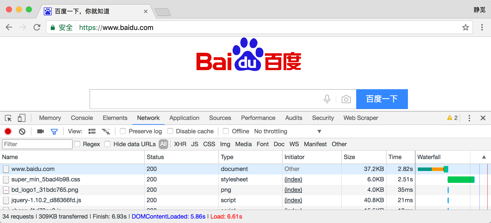

# HTTP基本原理

在本节我们会详细了解HTTP的基本原理，了解在浏览器中敲入一个URL到获取网页内容发生了一个怎样的过程，了解了这些内容，有助于去进一步了解爬虫的基本原理。

## URI和URL

在了解HTTP之前我们先了解一下URI和URL。我们经常会听到URI和URL两个术语，URI全称为Uniform Resource Identifier，即统一资源标志符，URL全称为Universal Resource Locator，即统一资源定位符。

举例来说，[https://github.com/favicon.ico](https://github.com/favicon.ico)，这是GitHub的网站图标链接，它是一个URL，也是一个URI，即有这样的一个图标资源，我们用URL/URI来唯一指定了它的访问方式，这其中包括了访问协议https、访问路径/即根目录，资源名称favicon.ico，通过这样的一个链接我们便可以从互联网上找到这个资源，这就是URL/URI。

URL是URI的子集，也就是说每个URL都是URI，但不是每个URI都是URL。那么怎样的URI不是URL呢？URI还包括一个子类叫做URN，它的全称为Universal Resource Name，即统一资源名称。URN只命名资源而不指定如何定位资源，如urn:isbn:0451450523，它指定了一本书的ISBN，可以唯一标识这一本书，但是没有指定到哪里定位这本书，这就是URN。

但是在目前的互联网，URN的使用非常少，所以几乎所有的URI都是URL，所以一般的网页链接我们可以称之为URL，也可以称之为URI。

我个人习惯称之为URL。

## HTTP

我们在前面了解了URI和URL，它们的开头会有http、https，它指定了访问资源所用的协议类型。

接下来我们再了解一个概念，超文本。超文本英文名称叫做Hypertext，我们在浏览器里面看到的网页就是超文本解析而成的，其网页源代码是一系列HTML代码，里面包含了一系列标签，如``显示图片，`
`指定显示段落等，浏览器解析这些标签后便形成了我们平常看到的网页，而这网页的源代码HTML就可以称作超文本。

HTTP的全称是Hyper Text Transfer Protocol，中文名叫做超文本传输协议，HTTP协议是用于从网络传输超文本数据到本地浏览器的传送协议，它能保证传送高效而准确地传送超文本文档。HTTP由万维网协会（World Wide Web Consortium）和Internet工作小组IETF（Internet Engineering Task Force）共同合作制定的规范，目前广泛使用的是HTTP 1.1版本。

## 请求与响应

我们在浏览器中输入一个URL，回车之后便会在浏览器中观察到页面内容，实际上这个过程是浏览器向网站所在的服务器发送了一个请求，网站服务器返回了一个响应，浏览器解析响应的内容便将网页呈现了出来。

为了更好地说明请求与响应的过程，我们在这里用Chrome浏览器的开发者模式下的Network监听组件来做下演示，它可以显示访问当前网页时发生的所有网络请求。

打开Chrome浏览器，右键点击审查元素，或按下快捷键F12即可打开浏览器的开发者模式，我们在这里访问百度[http://www.baidu.com/](http://www.baidu.com/)，观察一下在从敲击回车到加载出网页发生了怎样的网络请求。

我们观察第一个网络请求，即www.baidu.com。

可以发现它的Status即状态码为200，Type为document，Size为36.4KB。这就是敲击回车之后发出的一个网络请求，我们点击这个请求即可看到其更详细的信息。

首先是General部分，Request URL为请求的链接，Request Method为请求的方法，Status Code为响应状态码，Remote Address为远程服务器的地址和端口，Referrer Policy为Referrer判别策略。

再继续往下看可以看到有一个Response Headers还有一个Request Headers，这分别代表响应头和请求头，请求头里面带有许多请求信息，例如浏览器标识、Cookies、Host等信息，这是Request的一部分，服务器会根据请求头内的信息判断请求是否合法，进而作出对应的响应，返回Response，那么在图中看到的Response Headers就是Response的一部分，例如其中包含了服务器的类型、文档类型、日期等信息，浏览器接受到Response后，会解析响应内容，进而呈现网页内容。

下面我们分别来介绍一下请求Request和响应Response都包含了哪些内容，在这里进行对其组成进行总结：

### Request

Request，即请求，由客户端向服务端发出。可以将Request划分为四部分内容：Request Method、Request URL、Request Headers、Request Body，即请求方式、请求链接、请求头、请求体。

#### Request Method

请求方式，请求方式常见的有两种类型，Get和Post。

我们在浏览器中直接输入一个URL并回车，这便发起了一个GET请求，请求的参数会直接包含到URL里，这通常是。POST请求大多为表单提交发起，如一个登录表单，输入用户名密码，点击登录按钮，这通常会发起一个POST请求，其数据通常以Form Data即表单的形式传输，不会体现在URL中。

关于更多GET和POST请求的区别可以参考W3School的解释，[https://www.w3schools.com/tags/ref_httpmethods.asp](https://www.w3schools.com/tags/ref_httpmethods.asp)。

我们平常遇到的绝大部分请求都是GET或POST请求，另外还有一些请求方式，如HEAD、PUT、DELETE、OPTIONS、CONNECT。

#### Request URL

顾名思义，就是请求的网址，即统一资源定位符，用URL可以唯一确定我们想请求的资源。

#### Request Headers

请求头，用来说明服务器要使用的附加信息，比较重要的信息有Cookie、Referer、User-Agent等。

Cookie，也常用复数形式Cookies，是网站为了辨别用户进行Session跟踪而储存在用户本地的数据。Cookies的主要功能就是维持当前访问会话，例如我们输入用户名密码登录了某个网站，登录成功之后服务器会用Session保存我们的登录状态信息，后面我们每次刷新或请求该站点的其他页面时会发现都是保持着登录状态的，在这里就是Cookies的功劳，Cookies里有信息标识了我们所对应的服务器的Session会话，每次浏览器在请求该站点的页面时都会在请求头中加上Cookies并将其发送给服务器，服务器通过Cookies识别出是我们自己，并且查出当前状态是登录的状态，所以返回的结果就是登录之后才能看到的网页内容。

Referer，一般就是当前访问的URL，加在请求头中用来标识这个请求是从哪个页面发过来的，服务器可以拿到这一信息并做相应的处理，如做来源统计、做防盗链处理等。

User-Agent，简称UA，它是一个特殊字符串头，使得服务器能够识别客户使用的操作系统及版本、浏览器及版本等信息。在做爬虫时加上此信息可以伪装为浏览器，如果不加很可能会被识别出为爬虫。

因此，Request Headers是Request等重要组成部分，在写爬虫的时候大部分情况都需要指定一个请求头来请求。

#### Request Body

即请求体，一般承载的内容是POST请求中的Form Data，即表单数据，而对于GET请求Request Body则为空。

以上便是对Request各部分内容的解释。

### Response

Response，即响应，由服务端返回给客户端。Response可以划分为三部分，Response Status Code、Response Headers、Response Body。

#### Response Status Code

响应状态码，此状态码表示了服务器的响应状态，如200则代表服务器正常响应，404则代表页面未找到，500则代表服务器内部发生错误。在爬虫中，我们可以根据状态码来判断服务器响应状态，如判断状态码为200，则证明成功返回数据，再进行进一步的处理，否则直接忽略。

下面用表格列出了常见的错误代码及错误原因：

| 状态码  | 说明        | 详情                                 |
| ---- | :-------- | :--------------------------------- |
| 100  | 继续        | 请求者应当继续提出请求。服务器已收到请求的一部分，正在等待其余部分。 |
| 101  | 切换协议      | 请求者已要求服务器切换协议，服务器已确认并准备切换。         |
| 200  | 成功        | 服务器已成功处理了请求。                       |
| 201  | 已创建       | 请求成功并且服务器创建了新的资源。                  |
| 202  | 已接受       | 服务器已接受请求，但尚未处理。                    |
| 203  | 非授权信息     | 服务器已成功处理了请求，但返回的信息可能来自另一来源。        |
| 204  | 无内容       | 服务器成功处理了请求，但没有返回任何内容。              |
| 205  | 重置内容      | 服务器成功处理了请求，内容被重置。                  |
| 206  | 部分内容      | 服务器成功处理了部分请求。                      |
| 300  | 多种选择      | 针对请求，服务器可执行多种操作。                   |
| 301  | 永久移动      | 请求的网页已永久移动到新位置，即永久重定向。             |
| 302  | 临时移动      | 请求的网页暂时跳转到其他页面，即暂时重定向。             |
| 303  | 查看其他位置    | 如果原来的请求是POST，重定向目标文档应该通过GET提取。     |
| 304  | 未修改       | 此次请求返回的网页未修改，继续使用上次的资源。            |
| 305  | 使用代理      | 请求者应该使用代理访问该网页。                    |
| 307  | 临时重定向     | 请求的资源临时从其他位置响应。                    |
| 400  | 错误请求      | 服务器无法解析该请求。                        |
| 401  | 未授权       | 请求没有进行身份验证或验证未通过。                  |
| 403  | 禁止访问      | 服务器拒绝此请求。                          |
| 404  | 未找到       | 服务器找不到请求的网页。                       |
| 405  | 方法禁用      | 服务器禁用了请求中指定的方法。                    |
| 406  | 不接受       | 无法使用请求的内容响应请求的网页。                  |
| 407  | 需要代理授权    | 请求者需要使用代理授权。                       |
| 408  | 请求超时      | 服务器请求超时。                           |
| 409  | 冲突        | 服务器在完成请求时发生冲突。                     |
| 410  | 已删除       | 请求的资源已永久删除。                        |
| 411  | 需要有效长度    | 服务器不接受不含有效内容长度标头字段的请求。             |
| 412  | 未满足前提条件   | 服务器未满足请求者在请求中设置的其中一个前提条件。          |
| 413  | 请求实体过大    | 请求实体过大，超出服务器的处理能力。                 |
| 414  | 请求URI过长   | 请求网址过长，服务器无法处理。                    |
| 415  | 不支持类型     | 请求的格式不受请求页面的支持。                    |
| 416  | 请求范围不符    | 页面无法提供请求的范围。                       |
| 417  | 未满足期望值    | 服务器未满足期望请求标头字段的要求。                 |
| 500  | 服务器内部错误   | 服务器遇到错误，无法完成请求。                    |
| 501  | 未实现       | 服务器不具备完成请求的功能。                     |
| 502  | 错误网关      | 服务器作为网关或代理，从上游服务器收到无效响应。           |
| 503  | 服务不可用     | 服务器目前无法使用。                         |
| 504  | 网关超时      | 服务器作为网关或代理，但是没有及时从上游服务器收到请求。       |
| 505  | HTTP版本不支持 | 服务器不支持请求中所用的 HTTP 协议版本。            |

#### Response Headers

响应头，其中包含了服务器对请求的应答信息，如Content-Type、Server、Set-Cookie等。

Content-Type，文档类型，指定了返回的数据类型是什么，如text/html则代表返回HTML文档，application/x-javascript则代表返回JavaScript文件，image/jpeg则代表返回了图片。

Server，包含了服务器的信息，名称，版本号等。

Set-Cookie，设置Cookie，Response Headers中的Set-Cookie即告诉浏览器需要将此内容放在Cookies中，下次请求携带Cookies请求。

#### Resposne Body

响应体，最重要的当属响应体内容了，响应的正文数据都是在响应体中，如请求一个网页，它的响应体就是网页的HTML代码，请求一张图片，它的响应体就是图片的二进制数据。所以最主要的数据都包含在响应体中了，我们做爬虫请求网页后要解析的内容就是解析响应体。

我们在浏览器开发者工具中点击Preview，就可以看到网页的源代码，这也就是响应体内容，是解析的目标。

以上便是Response的组成部分。

通过如上描述，我们应该对访问网页背后的请求和响应过程有了大体的认识。

