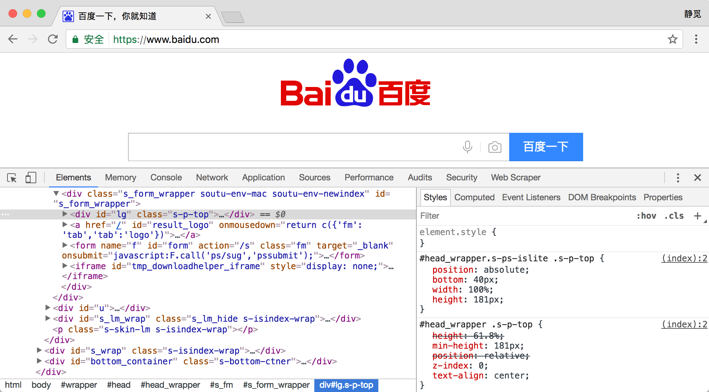

## 2.2　网页基础

用浏览器访问网站时，页面各不相同，你有没有想过它为何会呈现这个样子呢？本节中，我们就来了解一下网页的基本组成、结构和节点等内容。

### 2.2.1　网页的组成

网页可以分为三大部分 —— HTML、CSS 和 JavaScript。如果把网页比作一个人的话，HTML 相当于骨架，JavaScript 相当于肌肉，CSS 相当于皮肤，三者结合起来才能形成一个完善的网页。下面我们分别来介绍一下这三部分的功能。

#### 1. HTML

HTML 是用来描述网页的一种语言，其全称叫作 Hyper Text Markup Language，即超文本标记语言。网页包括文字、按钮、图片和视频等各种复杂的元素，其基础架构就是 HTML。不同类型的元素通过不同类型的标签来表示，如图片用 img 标签表示，视频用 video 标签表示，段落用 p 标签表示，它们之间的布局又常通过布局标签 div 嵌套组合而成，各种标签通过不同的排列和嵌套才形成了网页的框架。

在 Chrome 浏览器中打开百度，右击并选择 “检查” 项（或按 F12 键），打开开发者模式，这时在 Elements 选项卡中即可看到网页的源代码，如图 2-9 所示。


图 2-9　源代码

这就是 HTML，整个网页就是由各种标签嵌套组合而成的。这些标签定义的节点元素相互嵌套和组合形成了复杂的层次关系，就形成了网页的架构。

#### 2. CSS

HTML 定义了网页的结构，但是只有 HTML 页面的布局并不美观，可能只是简单的节点元素的排列，为了让网页看起来更好看一些，这里借助了 CSS。

CSS，全称叫作 Cascading Style Sheets，即层叠样式表。“层叠” 是指当在 HTML 中引用了数个样式文件，并且样式发生冲突时，浏览器能依据层叠顺序处理。“样式” 指网页中文字大小、颜色、元素间距、排列等格式。

CSS 是目前唯一的网页页面排版样式标准，有了它的帮助，页面才会变得更为美观。

图 2-9 的右侧即为 CSS，例如：

```
#head_wrapper.s-ps-islite .s-p-top {  
    position: absolute;  
    bottom: 40px;  
    width: 100%;  
    height: 181px;  
}
```

就是一个 CSS 样式。大括号前面是一个 CSS 选择器。此选择器的意思是首先选中 id 为 head_wrapper 且 class 为 s-ps-islite 的节点，然后再选中其内部的 class 为 s-p-top 的节点。大括号内部写的就是一条条样式规则，例如 position 指定了这个元素的布局方式为绝对布局，bottom 指定元素的下边距为 40 像素，width 指定了宽度为 100% 占满父元素，height 则指定了元素的高度。也就是说，我们将位置、宽度、高度等样式配置统一写成这样的形式，然后用大括号括起来，接着在开头再加上 CSS 选择器，这就代表这个样式对 CSS 选择器选中的元素生效，元素就会根据此样式来展示了。

在网页中，一般会统一定义整个网页的样式规则，并写入 CSS 文件中（其后缀为 c ss）。在 HTML 中，只需要用 link 标签即可引入写好的 CSS 文件，这样整个页面就会变得美观、优雅。

#### 3. JavaScript

JavaScript，简称 JS，是一种脚本语言。HTML 和 CSS 配合使用，提供给用户的只是一种静态信息，缺乏交互性。我们在网页里可能会看到一些交互和动画效果，如下载进度条、提示框、轮播图等，这通常就是 JavaScript 的功劳。它的出现使得用户与信息之间不只是一种浏览与显示的关系，而是实现了一种实时、动态、交互的页面功能。

JavaScript 通常也是以单独的文件形式加载的，后缀为 js，在 HTML 中通过 script 标签即可引入，例如：

```
<script src="jquery-2.1.0.js"></script>
```

综上所述，HTML 定义了网页的内容和结构，CSS 描述了网页的布局，JavaScript 定义了网页的行为。

### 2.2.2　网页的结构

我们首先用例子来感受一下 HTML 的基本结构。新建一个文本文件，名称可以自取，后缀为 html，内容如下：

```
<!DOCTYPE html>
<html>
<head>
<meta charset="UTF-8">
<title>This is a Demo</title>
</head>
<body>
<div id="container">
<div class="wrapper">
<h2 class="title">Hello World</h2>
<p class="text">Hello, this is a paragraph.</p>
</div>
</div>
</body>
</html>
```
这就是一个最简单的 HTML 实例。开头用 DOCTYPE 定义了文档类型，其次最外层是 html 标签，最后还有对应的结束标签来表示闭合，其内部是 head 标签和 body 标签，分别代表网页头和网页体，它们也需要结束标签。head 标 签内定义了一些页面的配置和引用，如：
```
<meta charset="UTF-8">
```

它指定了网页的编码为 UTF-8。

title 标签则定义了网页的标题，会显示在网页的选项卡中，不会显示在正文中。body 标签内则是在网页正文中显示的内容。div 标签定义了网页中的区块，它的 id 是 container，这是一个非常常用的属性，且 id 的内容在网页中是唯一的，我们可以通过它来获取这个区块。然后在此区块内又有一个 div 标签，它的 class 为 wrapper，这也是一个非常常用的属性，经常与 CSS 配合使用来设定样式。然后此区块内部又有一个 h2 标签，这代表一个二级标题。另外，还有一个 p 标签，这代表一个段落。在这两者中直接写入相应的内容即可在网页中呈现出来，它们也有各自的 class 属性。

将代码保存后，在浏览器中打开该文件，可以看到如图 2-10 所示的内容。



图 2-10　运行结果

可以看到，在选项卡上显示了 This is a Demo 字样，这是我们在 head 中的 title 里定义的文字。而网页正文是 body 标签内部定义的各个元素生成的，可以看到这里显示了二级标题和段落。

这个实例便是网页的一般结构。一个网页的标准形式是 html 标签内嵌套 head 和 body 标签，head 内定义网页的配置和引用，body 内定义网页的正文。

### 2.2.3　节点树及节点间的关系

在 HTML 中，所有标签定义的内容都是节点，它们构成了一个 HTML DOM 树。

我们先看下什么是 DOM。DOM 是 W3C（万维网联盟）的标准，其英文全称 Document Object Model，即文档对象模型。它定义了访问 HTML 和 XML 文档的标准：

> W3C 文档对象模型（DOM）是中立于平台和语言的接口，它允许程序和脚本动态地访问和更新文档的内容、结构和样式。

W3C DOM 标准被分为 3 个不同的部分：
* 核心 DOM - 针对任何结构化文档的标准模型
* XML DOM - 针对 XML 文档的标准模型
* HTML DOM - 针对 HTML 文档的标准模型

根据 W3C 的 HTML DOM 标准，HTML 文档中的所有内容都是节点：
* 整个文档是一个文档节点
* 每个 HTML 元素是元素节点
* HTML 元素内的文本是文本节点
* 每个 HTML 属性是属性节点
* 注释是注释节点

HTML DOM 将 HTML 文档视作树结构，这种结构被称为节点树，如图 2-11 所示。


图 2-11　节点树

通过 HTML DOM，树中的所有节点均可通过 JavaScript 访问，所有 HTML 节点元素均可被修改，也可以被创建或删除。

节点树中的节点彼此拥有层级关系。我们常用父（parent）、子（child）和兄弟（sibling）等术语描述这些关系。父节点拥有子节点，同级的子节点被称为兄弟节点。

在节点树中，顶端节点称为根（root）。除了根节点之外，每个节点都有父节点，同时可拥有任意数量的子节点或兄弟节点。图 2-12 展示了节点树以及节点之间的关系。


图 2-12　节点树及节点间的关系

本段参考 W3SCHOOL，链接：[http://www.w3school.com.cn/htmldom/dom_nodes.asp](http://www.w3school.com.cn/htmldom/dom_nodes.asp)。

### 2.2.4　选择器

我们知道网页由一个个节点组成，CSS 选择器会根据不同的节点设置不同的样式规则，那么怎样来定位节点呢？

在 CSS 中，我们使用 CSS 选择器来定位节点。例如，上例中 div 节点的 id 为 container，那么就可以表示为 #container，其中 # 开头代表选择 id，其后紧跟 id 的名称。另外，如果我们想选择 class 为 wrapper 的节点，便可以使用.wrapper，这里以点（.）开头代表选择 class，其后紧跟 class 的名称。另外，还有一种选择方式，那就是根据标签名筛选，例如想选择二级标题，直接用 h2 即可。这是最常用的 3 种表示，分别是根据 id、class、标签名筛选，请牢记它们的写法。

另外，CSS 选择器还支持嵌套选择，各个选择器之间加上空格分隔开便可以代表嵌套关系，如 #container .wrapper p 则代表先选择 id 为 container 的节点，然后选中其内部的 class 为 wrapper 的节点，然后再进一步选中其内部的 p 节点。另外，如果不加空格，则代表并列关系，如 div#container .wrapper p.text 代表先选择 id 为 container 的 div 节点，然后选中其内部的 class 为 wrapper 的节点，再进一步选中其内部的 class 为 text 的 p 节点。这就是 CSS 选择器，其筛选功能还是非常强大的。

另外，CSS 选择器还有一些其他语法规则，具体如表 2-4 所示。

表 2-4　CSS 选择器的其他语法规则

|  选　择　器           | 例　　子     | 例子描述                                   |
| ------------------- | ------------- | --------------------------------- |
|  .class                    | .intro          | 选择 class="intro" 的所有节点    |
|  #id                       | #firstname | 选择 id="firstname" 的所有节点 |
|  *                          | *                 | 选择所有节点                            |
|  element               | p                | 选择所有 p 节点                          |
|  element,element | div,p           | 选择所有 div 节点和所有 p 节点    |
|  element element      | div p                      | 选择 div 节点内部的所有 p 节点                          |
|  element&gt;element   | div&gt;p                  | 选择父节点为 div 节点的所有 p 节点                    |
|  element+element     | div+p                    | 选择紧接在 div 节点之后的所有 p 节点                |
|  [attribute]                 | [target]                  | 选择带有 target 属性的所有节点                        |
|  [attribute=value]      | [target=blank]      | 选择 target="blank" 的所有节点                       |
|  [attribute~=value]    | [title~=flower]      | 选择 title 属性包含单词 flower 的所有节点          |
|  :link                           | a:link                     | 选择所有未被访问的链接                                 |
|  :visited                      | a:visited                 | 选择所有已被访问的链接                                 |
|  :active                       | a:active                  | 选择活动链接                                                  |
|  :hover                        | a:hover                  | 选择鼠标指针位于其上的链接                           |
|  :focus                        | input:focus            | 选择获得焦点的 input 节点                                |
|  :first-letter                 | p:first-letter           | 选择每个 p 节点的首字母                                   |
|  :first-line                   | p:first-line             | 选择每个 p 节点的首行                                      |
|  :first-child                 | p:first-child           | 选择属于父节点的第一个子节点的所有 p 节点    |
|  :before                      | p:before                | 在每个 p 节点的内容之前插入内容                     |
|  :after                         | p:after                   | 在每个 p 节点的内容之后插入内容                     |
|  :lang(language)         | p:lang                    | 选择带有以 it 开头的 lang 属性值的所有 p 节点     |
|  element1~element2 | p~ul                      | 选择前面有 p 节点的所有 ul 节点                         |
|  [attribute^=value]    | a[src^="https"]     | 选择其 src 属性值以 https 开头的所有 a 节点         |
|  [attribute$=value]     | a[src$=".pdf"]       | 选择其 src 属性以.pdf 结尾的所有 a 节点              |
|  [attribute*=value]     | a[src*="abc"]        | 选择其 src 属性中包含 abc 子串的所有 a 节点        |
|  :first-of-type             | p:first-of-type       | 选择属于其父节点的首个 p 节点的所有 p 节点      |
|  :last-of-type              | p:last-of-type        | 选择属于其父节点的最后 p 节点的所有 p 节点      |
|  :only-of-type             | p:only-of-type       | 选择属于其父节点唯一的 p 节点的所有 p 节点      |
|  :only-child                 | p:only-child           | 选择属于其父节点的唯一子节点的所有 p 节点    |
|  :nth-child(n)              | p:nth-child            | 选择属于其父节点的第二个子节点的所有 p 节点 |
|  :nth-last-child(n)       | p:nth-last-child     | 同上，从最后一个子节点开始计数                    |
|  :nth-of-type(n)          | p:nth-of-type        | 选择属于其父节点第二个 p 节点的所有 p 节点      |
|  :nth-last-of-type(n)   | p:nth-last-of-type | 同上，但是从最后一个子节点开始计数             |
|  :last-child                  | p:last-child            | 选择属于其父节点最后一个子节点的所有 p 节点 |
|  :root                          | :root                      | 选择文档的根节点                                           |
|  :empty                       | p:empty                | 选择没有子节点的所有 p 节点（包括文本节点） |
|  :target                       | #news:target         | 选择当前活动的 #news 节点                              |
|  :enabled                    | input:enabled       | 选择每个启用的 input 节点                                |
|  :disabled                   | input:disabled       | 选择每个禁用的 input 节点                                |
|  :checked                    | input:checked       | 选择每个被选中的 input 节点                            |
|  :not(selector)             | :not                       | 选择非 p 节点的所有节点                                   |
|  ::selection                  | ::selection              | 选择被用户选取的节点部分                              |

另外，还有一种比较常用的选择器是 XPath，这种选择方式后面会详细介绍。

本节介绍了网页的基本结构和节点间的关系，了解了这些内容，我们才有更加清晰的思路去解析和提取网页内容。