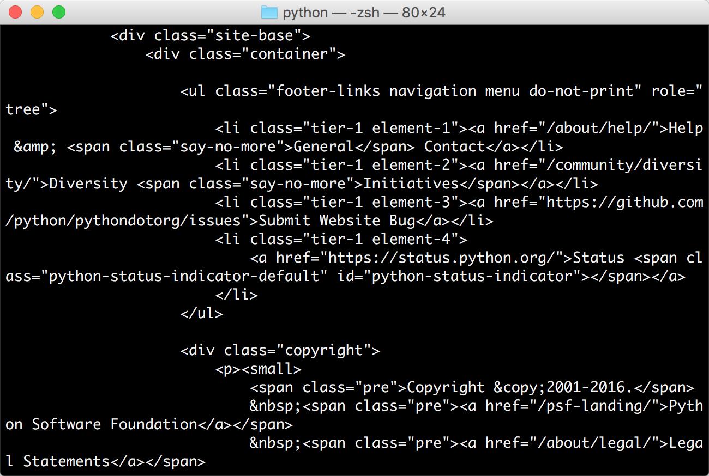

## 3.1 使用 urllib
在 Python 2 中，有 urllib 和 urllib2 两个库来实现请求的发送。而在 Python 3 中，已经不存在 urllib2 这个库了，统一为 urllib，其官方文档链接为：[https://docs.python.org/3/library/urllib.html](https://docs.python.org/3/library/urllib.html)。

首先，了解一下 urllib 库，它是 Python 内置的 HTTP 请求库，也就是说不需要额外安装即可使用。它包含如下 4 个模块。

* **request**：它是最基本的 HTTP 请求模块，可以用来模拟发送请求。就像在浏览器里输入网址然后回车一样，只需要给库方法传入 URL 以及额外的参数，就可以模拟实现这个过程了。
* **error**：异常处理模块，如果出现请求错误，我们可以捕获这些异常，然后进行重试或其他操作以保证程序不会意外终止。
* **parse**：一个工具模块，提供了许多 URL 处理方法，比如拆分、解析、合并等。
* **robotparser**：主要是用来识别网站的 robots.txt 文件，然后判断哪些网站可以爬，哪些网站不可以爬，它其实用得比较少。

这里重点讲解一下前 3 个模块。

### 3.1.1　发送请求

使用 urllib 的 request 模块，我们可以方便地实现请求的发送并得到响应。本节就来看下它的具体用法。

#### 1. urlopen

urllib.request 模块提供了最基本的构造 HTTP 请求的方法，利用它可以模拟浏览器的一个请求发起过程，同时它还带有处理授权验证（authentication）、重定向（redirection)、浏览器 Cookies 以及其他内容。

下面我们来看一下它的强大之处。这里以 Python 官网为例，我们来把这个网页抓下来：

```python
import urllib.request  

response = urllib.request.urlopen('https://www.python.org')  
print(response.read().decode('utf-8'))
```

运行结果如图 3-1 所示。



图 3-1　运行结果

这里我们只用了两行代码，便完成了 Python 官网的抓取，输出了网页的源代码。得到源代码之后呢？我们想要的链接、图片地址、文本信息不就都可以提取出来了吗？

接下来，看看它返回的到底是什么。利用 type 方法输出响应的类型：

```python
import urllib.request  

response = urllib.request.urlopen('https://www.python.org')  
print(type(response))
```
输出结果如下：
```python
<class 'http.client.HTTPResponse'>
```

可以发现，它是一个 HTTPResposne 类型的对象，主要包含 read、readinto、getheader、getheaders、fileno 等方法，以及 msg、version、status、reason、debuglevel、closed 等属性。

得到这个对象之后，我们把它赋值为 response 变量，然后就可以调用这些方法和属性，得到返回结果的一系列信息了。

例如，调用 read 方法可以得到返回的网页内容，调用 status 属性可以得到返回结果的状态码，如 200 代表请求成功，404 代表网页未找到等。

下面再通过一个实例来看看：

```python
import urllib.request  

response = urllib.request.urlopen('https://www.python.org')  
print(response.status)  
print(response.getheaders())  
print(response.getheader('Server'))
```
运行结果如下：
```python
200  
[('Server', 'nginx'), ('Content-Type', 'text/html; charset=utf-8'), ('X-Frame-Options', 'SAMEORIGIN'),   
    ('X-Clacks-Overhead', 'GNU Terry Pratchett'), ('Content-Length', '47397'), ('Accept-Ranges', 'bytes'),   
    ('Date', 'Mon, 01 Aug 2016 09:57:31 GMT'), ('Via', '1.1 varnish'), ('Age', '2473'), ('Connection', 'close'),   
    ('X-Served-By', 'cache-lcy1125-LCY'), ('X-Cache', 'HIT'), ('X-Cache-Hits', '23'), ('Vary', 'Cookie'),   
    ('Strict-Transport-Security', 'max-age=63072000; includeSubDomains')]  
nginx
```

可见，前两个输出分别输出了响应的状态码和响应的头信息，最后一个输出通过调用 getheader 方法并传递一个参数 Server 获取了响应头中的 Server 值，结果是 nginx，意思是服务器是用 Nginx 搭建的。

利用最基本的 urlopen 方法，可以完成最基本的简单网页的 GET 请求抓取。

如果想给链接传递一些参数，该怎么实现呢？首先看一下 urlopen 方法的 API：

```
urllib.request.urlopen(url, data=None, [timeout,]*, cafile=None, capath=None, cadefault=False, context=None)
```

可以发现，除了第一个参数可以传递 URL 之外，我们还可以传递其他内容，比如 data（附加数据）、timeout（超时时间）等。

下面我们详细说明下这几个参数的用法。

##### data 参数

data 参数是可选的。如果要添加该参数，需要使用 bytes 方法将参数转化为字节流编码格式的内容，即 bytes 类型。另外，如果传递了这个参数，则它的请求方式就不再是 GET 方式，而是 POST 方式。

下面用实例来看一下：

```python
import urllib.parse  
import urllib.request  

data = bytes(urllib.parse.urlencode({'word': 'hello'}), encoding='utf8')  
response = urllib.request.urlopen('http://httpbin.org/post', data=data)  
print(response.read())
```

这里我们传递了一个参数 word，值是 hello。它需要被转码成 bytes（字节流）类型。其中转字节流采用了 bytes 方法，该方法的第一个参数需要是 str（字符串）类型，需要用 urllib.parse 模块里的 urlencode 方法来将参数字典转化为字符串；第二个参数指定编码格式，这里指定为 utf8。

在这里请求的站点是 httpbin.org，它可以提供 HTTP 请求测试，本次我们请求的 URL 为：[http://httpbin.org/post](http://httpbin.org/post)，这个链接可以用来测试 POST 请求，它可以输出 Request 的一些信息，其中就包含我们传递的 data 参数。

运行结果如下：

```json
{"args": {},  
     "data": "","files": {},"form": {"word":"hello"},"headers": {"Accept-Encoding":"identity","Content-Length":"10","Content-Type":"application/x-www-form-urlencoded","Host":"httpbin.org","User-Agent":"Python-urllib/3.5"},"json": null,"origin":"123.124.23.253","url":"http://httpbin.org/post"}```

我们传递的参数出现在了 form 字段中，这表明是模拟了表单提交的方式，以 POST 方式传输数据。

##### timeout 参数

timeout 参数用于设置超时时间，单位为秒，意思就是如果请求超出了设置的这个时间，还没有得到响应，就会抛出异常。如果不指定该参数，就会使用全局默认时间。它支持 HTTP、HTTPS、FTP 请求。

下面用实例来看一下：

```python
import urllib.request  

response = urllib.request.urlopen('http://httpbin.org/get', timeout=1)  
print(response.read())
```
运行结果如下：
```python
During handling of the above exception, another exception occurred:
Traceback (most recent call last): File "/var/py/python/urllibtest.py", line 4, in <module> response =
urllib.request.urlopen('http://httpbin.org/get', timeout=1)
...
urllib.error.URLError: <urlopen error timed out>
```

这里我们设置超时时间是 1 秒。程序 1 秒过后，服务器依然没有响应，于是抛出了 URLError 异常。该异常属于 urllib.error 模块，错误原因是超时。

因此，可以通过设置这个超时时间来控制一个网页如果长时间未响应，就跳过它的抓取。这可以利用 try except 语句来实现，相关代码如下：

```python
import socket  
import urllib.request  
import urllib.error  

try:  
    response = urllib.request.urlopen('http://httpbin.org/get', timeout=0.1)  
except urllib.error.URLError as e:  
    if isinstance(e.reason, socket.timeout):  
        print('TIME OUT')
```

在这里我们请求了 [http://httpbin.org/get](http://httpbin.org/get) 这个测试链接，设置了超时时间是 0.1 秒，然后捕获了 URLError 这个异常，然后判断异常原因是 socket.timeout 类型，意思就是超时异常，就得出它确实是因为超时而报错，打印输出了 TIME OUT。

运行结果如下：

```
TIME OUT
```

按照常理来说，0.1 秒内基本不可能得到服务器响应，因此输出了 TIME OUT 的提示。

通过设置 timeout 这个参数来实现超时处理，有时还是很有用的。

##### 其他参数

除了 data 参数和 timeout 参数外，还有 context 参数，它必须是 ssl.SSLContext 类型，用来指定 SSL 设置。

此外，cafile 和 capath 这两个参数分别指定 CA 证书和它的路径，这个在请求 HTTPS 链接时会有用。

cadefault 参数现在已经弃用了，其默认值为 False。

前面讲解了 urlopen 方法的用法，通过这个最基本的方法，我们可以完成简单的请求和网页抓取。若需更加详细的信息，可以参见官方文档：[https://docs.python.org/3/library/urllib.request.html](https://docs.python.org/3/library/urllib.request.html)。

#### 2. Request

我们知道利用 urlopen 方法可以实现最基本请求的发起，但这几个简单的参数并不足以构建一个完整的请求。如果请求中需要加入 Headers 等信息，就可以利用更强大的 Request 类来构建。

首先，我们用实例来感受一下 Request 的用法：

```python
import urllib.request  

request = urllib.request.Request('https://python.org')  
response = urllib.request.urlopen(request)  
print(response.read().decode('utf-8'))
```

可以发现，我们依然是用 urlopen 方法来发送这个请求，只不过这次该方法的参数不再是 URL，而是一个 Request 类型的对象。通过构造这个数据结构，一方面我们可以将请求独立成一个对象，另一方面可更加丰富和灵活地配置参数。

下面我们看一下 Request 可以通过怎样的参数来构造，它的构造方法如下：

```python
class urllib.request.Request(url, data=None, headers={}, origin_req_host=None, unverifiable=False, method=None)
```

第一个参数 url 用于请求 URL，这是必传参数，其他都是可选参数。

第二个参数 data 如果要传，必须传 bytes（字节流）类型的。如果它是字典，可以先用 urllib.parse 模块里的 urlencode() 编码。

第三个参数 headers 是一个字典，它就是请求头，我们可以在构造请求时通过 headers 参数直接构造，也可以通过调用请求实例的 add_header() 方法添加。

添加请求头最常用的用法就是通过修改 User-Agent 来伪装浏览器，默认的 User-Agent 是 Python-urllib，我们可以通过修改它来伪装浏览器。比如要伪装火狐浏览器，你可以把它设置为：

```
Mozilla/5.0 (X11; U; Linux i686) Gecko/20071127 Firefox/2.0.0.11
第四个参数 origin_req_host 指的是请求方的 host 名称或者 IP 地址。
```

第五个参数 unverifiable 表示这个请求是否是无法验证的，默认是 False，意思就是说用户没有足够权限来选择接收这个请求的结果。例如，我们请求一个 HTML 文档中的图片，但是我们没有自动抓取图像的权限，这时 unverifiable 的值就是 True。

第六个参数 method 是一个字符串，用来指示请求使用的方法，比如 GET、POST 和 PUT 等。

下面我们传入多个参数构建请求来看一下：

```python
from urllib import request, parse  

url = 'http://httpbin.org/post'  
headers = {'User-Agent': 'Mozilla/4.0 (compatible; MSIE 5.5; Windows NT)',  
    'Host': 'httpbin.org'  
}  
dict = {'name': 'Germey'}  
data = bytes(parse.urlencode(dict), encoding='utf8')  
req = request.Request(url=url, data=data, headers=headers, method='POST')  
response = request.urlopen(req)  
print(response.read().decode('utf-8'))
```

这里我们通过 4 个参数构造了一个请求，其中 url 即请求 URL，headers 中指定了 User-Agent 和 Host，参数 data 用 urlencode 和 bytes 方法转成字节流。另外，指定了请求方式为 POST。

运行结果如下：

```json
{"args": {},   
  "data": "","files": {},"form": {"name":"Germey"},"headers": {"Accept-Encoding":"identity","Content-Length":"11","Content-Type":"application/x-www-form-urlencoded","Host":"httpbin.org","User-Agent":"Mozilla/4.0 (compatible; MSIE 5.5; Windows NT)"},"json": null,"origin":"219.224.169.11","url":"http://httpbin.org/post"}```

观察结果可以发现，我们成功设置了 data、headers 和 method。

另外，headers 也可以用 add_header 方法来添加：

```python
req = request.Request(url=url, data=data, method='POST')  
req.add_header('User-Agent', 'Mozilla/4.0 (compatible; MSIE 5.5; Windows NT)')
```

如此一来，我们就可以更加方便地构造请求，实现请求的发送啦。

#### 3. 高级用法
在上面的过程中，我们虽然可以构造请求，但是对于一些更高级的操作（比如 Cookies 处理、代理设置等），我们该怎么办呢？

接下来，就需要更强大的工具 Handler 登场了。简而言之，我们可以把它理解为各种处理器，有专门处理登录验证的，有处理 Cookies 的，有处理代理设置的。利用它们，我们几乎可以做到 HTTP 请求中所有的事情。

首先，介绍一下 urllib.request 模块里的 BaseHandler 类，它是所有其他 Handler 的父类，它提供了最基本的方法，例如 default_open、protocol_request 等。

接下来，就有各种 Handler 子类继承这个 BaseHandler 类，举例如下。

* HTTPDefaultErrorHandler 用于处理 HTTP 响应错误，错误都会抛出 HTTPError 类型的异常。
* HTTPRedirectHandler 用于处理重定向。
* HTTPCookieProcessor 用于处理 Cookies。
* ProxyHandler 用于设置代理，默认代理为空。
* HTTPPasswordMgr 用于管理密码，它维护了用户名密码的表。
* HTTPBasicAuthHandler 用于管理认证，如果一个链接打开时需要认证，那么可以用它来解决认证问题。

另外还有其他的 Handler 类，在这不一一列举了，详情可以参考官方文档： [https://docs.python.org/3/library/urllib.request.html#urllib.request.BaseHandler](https://docs.python.org/3/library/urllib.request.html#urllib.request.BaseHandler)

关于怎么使用它们，现在先不用着急，后面会有实例演示。

另一个比较重要的类就是 OpenerDirector，我们可以称为 Opener。我们之前用过 urlopen 这个方法，实际上它就是 urllib 为我们提供的一个 Opener。

那么，为什么要引入 Opener 呢？因为需要实现更高级的功能。之前使用的 Request 和 urlopen 相当于类库为你封装好了极其常用的请求方法，利用它们可以完成基本的请求，但是现在不一样了，我们需要实现更高级的功能，所以需要深入一层进行配置，使用更底层的实例来完成操作，所以这里就用到了 Opener。

Opener 可以使用 open 方法，返回的类型和 urlopen 如出一辙。那么，它和 Handler 有什么关系呢？简而言之，就是利用 Handler 来构建 Opener。

下面用几个实例来看看它们的用法。

##### 验证
有些网站在打开时就会弹出提示框，直接提示你输入用户名和密码，验证成功后才能查看页面，如图 3-2 所示。


图 3-2　验证页面

那么，如果要请求这样的页面，该怎么办呢？借助 HTTPBasicAuthHandler 就可以完成，相关代码如下：

```python
from urllib.request import HTTPPasswordMgrWithDefaultRealm, HTTPBasicAuthHandler, build_opener  
from urllib.error import URLError  

username = 'username'  
password = 'password'  
url = 'http://localhost:5000/'  

p = HTTPPasswordMgrWithDefaultRealm()  
p.add_password(None, url, username, password)  
auth_handler = HTTPBasicAuthHandler(p)  
opener = build_opener(auth_handler)  

try:  
    result = opener.open(url)  
    html = result.read().decode('utf-8')  
    print(html)  
except URLError as e:  
    print(e.reason)
```

这里首先实例化 HTTPBasicAuthHandler 对象，其参数是 HTTPPasswordMgrWithDefaultRealm 对象，它利用 add_password 方法添加进去用户名和密码，这样就建立了一个处理验证的 Handler。

接下来，利用这个 Handler 并使用 build_opener 方法构建一个 Opener，这个 Opener 在发送请求时就相当于已经验证成功了。

接下来，利用 Opener 的 open 方法打开链接，就可以完成验证了。这里获取到的结果就是验证后的页面源码内容。

##### 代理
在做爬虫的时候，免不了要使用代理，如果要添加代理，可以这样做：

```python
from urllib.error import URLError  
from urllib.request import ProxyHandler, build_opener  

proxy_handler = ProxyHandler({  
    'http': 'http://127.0.0.1:9743',  
    'https': 'https://127.0.0.1:9743'  
})  
opener = build_opener(proxy_handler)  
try:  
    response = opener.open('https://www.baidu.com')  
    print(response.read().decode('utf-8'))  
except URLError as e:  
    print(e.reason)
```

这里我们在本地搭建了一个代理，它运行在 9743 端口上。

这里使用了 ProxyHandler，其参数是一个字典，键名是协议类型（比如 HTTP 或者 HTTPS 等），键值是代理链接，可以添加多个代理。

然后，利用这个 Handler 及 build_opener 方法构造一个 Opener，之后发送请求即可。

##### Cookies
Cookies 的处理就需要相关的 Handler 了。

我们先用实例来看看怎样将网站的 Cookies 获取下来，相关代码如下：

```python
import http.cookiejar, urllib.request  

cookie = http.cookiejar.CookieJar()  
handler = urllib.request.HTTPCookieProcessor(cookie)  
opener = urllib.request.build_opener(handler)  
response = opener.open('http://www.baidu.com')  
for item in cookie:  
    print(item.name+"="+item.value)
```

首先，我们必须声明一个 CookieJar 对象。接下来，就需要利用 HTTPCookieProcessor 来构建一个 Handler，最后利用 build_opener 方法构建出 Opener，执行 open 函数即可。

运行结果如下：

```
BAIDUID=2E65A683F8A8BA3DF521469DF8EFF1E1:FG=1  
BIDUPSID=2E65A683F8A8BA3DF521469DF8EFF1E1  
H_PS_PSSID=20987_1421_18282_17949_21122_17001_21227_21189_21161_20927  
PSTM=1474900615  
BDSVRTM=0  
BD_HOME=0
```

可以看到，这里输出了每条 Cookie 的名称和值。

不过既然能输出，那可不可以输出成文件格式呢？我们知道 Cookies 实际上也是以文本形式保存的。

答案当然是肯定的，这里通过下面的实例来看看：

```python
filename = 'cookies.txt'  
cookie = http.cookiejar.MozillaCookieJar(filename)  
handler = urllib.request.HTTPCookieProcessor(cookie)  
opener = urllib.request.build_opener(handler)  
response = opener.open('http://www.baidu.com')  
cookie.save(ignore_discard=True, ignore_expires=True)
```

这时 CookieJar 就需要换成 MozillaCookieJar，它在生成文件时会用到，是 CookieJar 的子类，可以用来处理 Cookies 和文件相关的事件，比如读取和保存 Cookies，可以将 Cookies 保存成 Mozilla 型浏览器的 Cookies 格式。

运行之后，可以发现生成了一个 cookies.txt 文件，其内容如下：

```
# Netscape HTTP Cookie File  
# http://curl.haxx.se/rfc/cookie_spec.html  
# This is a generated file!  Do not edit.  

.baidu.com       TRUE   / FALSE   3622386254    BAIDUID     05AE39B5F56C1DEC474325CDA522D44F:FG=1  
.baidu.com       TRUE   / FALSE   3622386254    BIDUPSID    05AE39B5F56C1DEC474325CDA522D44F  
.baidu.com       TRUE   / FALSE                 H_PS_PSSID  19638_1453_17710_18240_21091_18560_17001_  
                                                            21191_21161  
.baidu.com       TRUE   / FALSE   3622386254    PSTM        1474902606  
www.baidu.com    FALSE  / FALSE                 BDSVRTM     0  
www.baidu.com    FALSE  / FALSE                 BD_HOME     0
```

另外，LWPCookieJar 同样可以读取和保存 Cookies，但是保存的格式和 MozillaCookieJar 不一样，它会保存成 libwww-perl(LWP) 格式的 Cookies 文件。

要保存成 LWP 格式的 Cookies 文件，可以在声明时就改为：

```python
cookie = http.cookiejar.LWPCookieJar(filename)
```
此时生成的内容如下：
```
#LWP-Cookies-2.0  
Set-Cookie3: BAIDUID="0CE9C56F598E69DB375B7C294AE5C591:FG=1"; path="/"; domain=".baidu.com"; path_spec;   
    domain_dot; expires="2084-10-14 18:25:19Z"; version=0  
Set-Cookie3: BIDUPSID=0CE9C56F598E69DB375B7C294AE5C591; path="/"; domain=".baidu.com"; path_spec; domain_dot;  
    expires="2084-10-14 18:25:19Z"; version=0  
Set-Cookie3: H_PS_PSSID=20048_1448_18240_17944_21089_21192_21161_20929; path="/"; domain=".baidu.com";  
    path_spec; domain_dot; discard; version=0  
Set-Cookie3: PSTM=1474902671; path="/"; domain=".baidu.com"; path_spec; domain_dot; expires="2084-10-14  
    18:25:19Z"; version=0  
Set-Cookie3: BDSVRTM=0; path="/"; domain="www.baidu.com"; path_spec; discard; version=0  
Set-Cookie3: BD_HOME=0; path="/"; domain="www.baidu.com"; path_spec; discard; version=0
```

由此看来，生成的格式还是有比较大差异的。

那么，生成了 Cookies 文件后，怎样从文件中读取并利用呢？

下面我们以 LWPCookieJar 格式为例来看一下：

```python
cookie = http.cookiejar.LWPCookieJar()  
cookie.load('cookies.txt', ignore_discard=True, ignore_expires=True)  
handler = urllib.request.HTTPCookieProcessor(cookie)  
opener = urllib.request.build_opener(handler)  
response = opener.open('http://www.baidu.com')  
print(response.read().decode('utf-8'))
```

可以看到，这里调用 load 方法来读取本地的 Cookies 文件，获取到了 Cookies 的内容。不过前提是我们首先生成了 LWPCookieJar 格式的 Cookies，并保存成文件，然后读取 Cookies 之后使用同样的方法构建 Handler 和 Opener 即可完成操作。

运行结果正常的话，会输出百度网页的源代码。

通过上面的方法，我们可以实现绝大多数请求功能的设置了。

这便是 urllib 库中 request 模块的基本用法，如果想实现更多的功能，可以参考官方文档的说明：[https://docs.python.org/3/library/urllib.request.html#basehandler-objects](https://docs.python.org/3/library/urllib.request.html#basehandler-objects)。

### 3.1.2　处理异常

前一节我们了解了请求的发送过程，但是在网络不好的情况下，如果出现了异常，该怎么办呢？这时如果不处理这些异常，程序很可能因报错而终止运行，所以异常处理还是十分有必要的。

urllib 的 error 模块定义了由 request 模块产生的异常。如果出现了问题，request 模块便会抛出 error 模块中定义的异常。

#### 1. URLError
URLError 类来自 urllib 库的 error 模块，它继承自 OSError 类，是 error 异常模块的基类，由 request 模块产生的异常都可以通过捕获这个类来处理。

它具有一个属性 reason，即返回错误的原因。

下面用一个实例来看一下：

```python
from urllib import request, error  
try:  
    response = request.urlopen('https://cuiqingcai.com/index.htm')  
except error.URLError as e:  
    print(e.reason)
```
我们打开一个不存在的页面，照理来说应该会报错，但是这时我们捕获了 URLError 这个异常，运行结果如下：
```
Not Found
```

程序没有直接报错，而是输出了如上内容，这样通过如上操作，我们就可以避免程序异常终止，同时异常得到了有效处理。

#### 2. HTTPError

它是 URLError 的子类，专门用来处理 HTTP 请求错误，比如认证请求失败等。它有如下 3 个属性。

* code：返回 HTTP 状态码，比如 404 表示网页不存在，500 表示服务器内部错误等。

* reason：同父类一样，用于返回错误的原因。

* headers：返回请求头。

下面我们用几个实例来看看：

```python
from urllib import request,error  
try:  
    response = request.urlopen('https://cuiqingcai.com/index.htm')  
except error.HTTPError as e:  
    print(e.reason, e.code, e.headers, sep='\n')
```
运行结果如下：
```
Not Found
404
Server: nginx/1.4.6 (Ubuntu)
Date: Wed, 03 Aug 2016 08:54:22 GMT
Content-Type: text/html; charset=UTF-8
Transfer-Encoding: chunked
Connection: close
X-Powered-By: PHP/5.5.9-1ubuntu4.14
Vary: Cookie
Expires: Wed, 11 Jan 1984 05:00:00 GMT
Cache-Control: no-cache, must-revalidate, max-age=0
Pragma: no-cache
Link: <https://cuiqingcai.com/wp-json/>; rel="https://api.w.org/"
```

依然是同样的网址，这里捕获了 HTTPError 异常，输出了 reason、code 和 headers 属性。

因为 URLError 是 HTTPError 的父类，所以可以先选择捕获子类的错误，再去捕获父类的错误，所以上述代码更好的写法如下：

```python
from urllib import request, error  

try:  
    response = request.urlopen('https://cuiqingcai.com/index.htm')  
except error.HTTPError as e:  
    print(e.reason, e.code, e.headers, sep='\n')  
except error.URLError as e:  
    print(e.reason)  
else:  
    print('Request Successfully')
```

这样就可以做到先捕获 HTTPError，获取它的错误状态码、原因、headers 等信息。如果不是 HTTPError 异常，就会捕获 URLError 异常，输出错误原因。最后，用 else 来处理正常的逻辑。这是一个较好的异常处理写法。

有时候，reason 属性返回的不一定是字符串，也可能是一个对象。再看下面的实例：

```
import socket  
import urllib.request  
import urllib.error  

try:  
    response = urllib.request.urlopen('https://www.baidu.com', timeout=0.01)  
except urllib.error.URLError as e:  
    print(type(e.reason))  
    if isinstance(e.reason, socket.timeout):  
        print('TIME OUT')
```

这里我们直接设置超时时间来强制抛出 timeout 异常。

运行结果如下：

```python
<class'socket.timeout'>
TIME OUT
```

可以发现，reason 属性的结果是 socket.timeout 类。所以，这里我们可以用 isinstance 方法来判断它的类型，作出更详细的异常判断。

本节中，我们讲述了 error 模块的相关用法，通过合理地捕获异常可以做出更准确的异常判断，使程序更加稳健。

### 3.1.3　解析链接

前面说过，urllib 库里还提供了 parse 模块，它定义了处理 URL 的标准接口，例如实现 URL 各部分的抽取、合并以及链接转换。它支持如下协议的 URL 处理：file、ftp、gopher、hdl、http、https、imap、mailto、 mms、news、nntp、prospero、rsync、rtsp、rtspu、sftp、 sip、sips、snews、svn、svn+ssh、telnet 和 wais。本节中，我们介绍一下该模块中常用的方法来看一下它的便捷之处。

#### 1. urlparse

该方法可以实现 URL 的识别和分段，这里先用一个实例来看一下：

```python
from urllib.parse import urlparse  

result = urlparse('http://www.baidu.com/index.html;user?id=5#comment')  
print(type(result), result)
```

这里我们利用 urlparse 方法进行了一个 URL 的解析。首先，输出了解析结果的类型，然后将结果也输出出来。

运行结果如下：

```python
<class 'urllib.parse.ParseResult'>
ParseResult(scheme='http', netloc='www.baidu.com', path='/index.html', params='user', query='id=5',
fragment='comment')
```

可以看到，返回结果是一个 ParseResult 类型的对象，它包含 6 个部分，分别是 scheme、netloc、path、params、query 和 fragment。

观察一下该实例的 URL：
```
http://www.baidu.com/index.html;user?id=5#comment
```
可以发现，urlparse 方法将其拆分成了 6 个部分。大体观察可以发现，解析时有特定的分隔符。比如，:// 前面的就是 scheme，代表协议；第一个 / 符号前面便是 netloc，即域名，后面是 path，即访问路径；分号；后面是 params，代表参数；问号？后面是查询条件 query，一般用作 GET 类型的 URL；井号 #后面是锚点，用于直接定位页面内部的下拉位置。

所以，可以得出一个标准的链接格式，具体如下：

```
scheme://netloc/path;params?query#fragment
```

一个标准的 URL 都会符合这个规则，利用 urlparse 方法可以将它拆分开来。

除了这种最基本的解析方式外，urlparse 方法还有其他配置吗？接下来，看一下它的 API 用法：

```python
urllib.parse.urlparse(urlstring, scheme='', allow_fragments=True)
```

可以看到，它有 3 个参数。

* urlstring：这是必填项，即待解析的 URL。
* scheme：它是默认的协议（比如 http 或 https 等）。假如这个链接没有带协议信息，会将这个作为默认的协议。我们用实例来看一下：

```python
from urllib.parse import urlparse  

result = urlparse('www.baidu.com/index.html;user?id=5#comment', scheme='https')  
print(result)
```
运行结果如下：
```python
ParseResult(scheme='https', netloc='', path='www.baidu.com/index.html', params='user', query='id=5', fragment='comment')
```

可以发现，我们提供的 URL 没有包含最前面的 scheme 信息，但是通过指定默认的 scheme 参数，返回的结果是 https。

假设我们带上了 scheme：

```python
result = urlparse('http://www.baidu.com/index.html;user?id=5#comment', scheme='https')
```
则结果如下：
```python
ParseResult(scheme='http', netloc='www.baidu.com', path='/index.html', params='user', query='id=5', fragment='comment')
```

可见，scheme 参数只有在 URL 中不包含 scheme 信息时才生效。如果 URL 中有 scheme 信息，就会返回解析出的 scheme。

* allow_fragments：即是否忽略 fragment。如果它被设置为 False，fragment 部分就会被忽略，它会被解析为 path、parameters 或者 query 的一部分，而 fragment 部分为空。

下面我们用实例来看一下：

```python
from urllib.parse import urlparse  

result = urlparse('http://www.baidu.com/index.html;user?id=5#comment', allow_fragments=False)  
print(result)
```
运行结果如下：
```python
ParseResult(scheme='http', netloc='www.baidu.com', path='/index.html', params='user', query='id=5#comment', fragment='')
```
假设 URL 中不包含 params 和 query，我们再通过实例看一下：
```python
from urllib.parse import urlparse  

result = urlparse('http://www.baidu.com/index.html#comment', allow_fragments=False)  
print(result)
```
运行结果如下：
```python
ParseResult(scheme='http', netloc='www.baidu.com', path='/index.html#comment', params='', query='', fragment='')
```

可以发现，当 URL 中不包含 params 和 query 时，fragment 便会被解析为 path 的一部分。

返回结果 ParseResult 实际上是一个元组，我们可以用索引顺序来获取，也可以用属性名获取。示例如下：

```python
from urllib.parse import urlparse  

result = urlparse('http://www.baidu.com/index.html#comment', allow_fragments=False)  
print(result.scheme, result[0], result.netloc, result[1], sep='\n')
```
这里我们分别用索引和属性名获取了 scheme 和 netloc，其运行结果如下：
```
http  
http  
www.baidu.com  
www.baidu.com
```

可以发现，二者的结果是一致的，两种方法都可以成功获取。

#### 2. urlunparse

有了 urlparse 方法，相应地就有了它的对立方法 urlunparse。它接受的参数是一个可迭代对象，但是它的长度必须是 6，否则会抛出参数数量不足或者过多的问题。先用一个实例看一下：

```python
from urllib.parse import urlunparse  

data = ['http', 'www.baidu.com', 'index.html', 'user', 'a=6', 'comment']  
print(urlunparse(data))
```

这里参数 data 用了列表类型。当然，你也可以用其他类型，比如元组或者特定的数据结构。

运行结果如下：

```
http://www.baidu.com/index.html;user?a=6#comment
```

这样我们就成功实现了 URL 的构造。

#### 3. urlsplit

这个方法和 urlparse 方法非常相似，只不过它不再单独解析 params 这一部分，只返回 5 个结果。上面例子中的 params 会合并到 path 中。示例如下：

```python
from urllib.parse import urlsplit  

result = urlsplit('http://www.baidu.com/index.html;user?id=5#comment')  
print(result)
```
运行结果如下：
```python
SplitResult(scheme='http', netloc='www.baidu.com', path='/index.html;user', query='id=5', fragment='comment')
```
可以发现，返回结果是 SplitResult，它其实也是一个元组类型，既可以用属性获取值，也可以用索引来获取。示例如下：
```python
from urllib.parse import urlsplit  

result = urlsplit('http://www.baidu.com/index.html;user?id=5#comment')  
print(result.scheme, result[0])
```
运行结果如下：
```
http http
```

#### 4. urlunsplit
与 urlunparse 方法类似，它也是将链接各个部分组合成完整链接的方法，传入的参数也是一个可迭代对象，例如列表、元组等，唯一的区别是长度必须为 5。示例如下：

```python
from urllib.parse import urlunsplit  

data = ['http', 'www.baidu.com', 'index.html', 'a=6', 'comment']  
print(urlunsplit(data))
```
运行结果如下：
```
http://www.baidu.com/index.html?a=6#comment
```

#### 5. urljoin
有了 urlunparse 和 urlunsplit 方法，我们可以完成链接的合并，不过前提必须要有特定长度的对象，链接的每一部分都要清晰分开。

此外，生成链接还有另一个方法，那就是 urljoin 方法。我们可以提供一个 base_url（基础链接）作为第一个参数，将新的链接作为第二个参数，该方法会分析 base_url 的 scheme、netloc 和 path 这 3 个内容并对新链接缺失的部分进行补充，最后返回结果。

下面通过几个实例看一下：

```python
from urllib.parse import urljoin  

print(urljoin('http://www.baidu.com', 'FAQ.html'))  
print(urljoin('http://www.baidu.com', 'https://cuiqingcai.com/FAQ.html'))  
print(urljoin('http://www.baidu.com/about.html', 'https://cuiqingcai.com/FAQ.html'))  
print(urljoin('http://www.baidu.com/about.html', 'https://cuiqingcai.com/FAQ.html?question=2'))  
print(urljoin('http://www.baidu.com?wd=abc', 'https://cuiqingcai.com/index.php'))  
print(urljoin('http://www.baidu.com', '?category=2#comment'))  
print(urljoin('www.baidu.com', '?category=2#comment'))  
print(urljoin('www.baidu.com#comment', '?category=2'))
```
运行结果如下：
```
http://www.baidu.com/FAQ.html  
https://cuiqingcai.com/FAQ.html  
https://cuiqingcai.com/FAQ.html  
https://cuiqingcai.com/FAQ.html?question=2  
https://cuiqingcai.com/index.php  
http://www.baidu.com?category=2#comment  
www.baidu.com?category=2#comment  
www.baidu.com?category=2
```

可以发现，base_url 提供了三项内容 scheme、netloc 和 path。如果这 3 项在新的链接里不存在，就予以补充；如果新的链接存在，就使用新的链接的部分。而 base_url 中的 params、query 和 fragment 是不起作用的。

通过 urljoin 方法，我们可以轻松实现链接的解析、拼合与生成。

#### 6. urlencode

这里我们再介绍一个常用的方法 ——urlencode，它在构造 GET 请求参数的时候非常有用，示例如下：

```python
from urllib.parse import urlencode  

params = {  
    'name': 'germey',  
    'age': 22  
}  
base_url = 'http://www.baidu.com?'  
url = base_url + urlencode(params)  
print(url)
```

这里首先声明了一个字典来将参数表示出来，然后调用 urlencode 方法将其序列化为 GET 请求参数。

运行结果如下：

```
http://www.baidu.com?name=germey&amp;age=22
```

可以看到，参数就成功地由字典类型转化为 GET 请求参数了。

这个方法非常常用。有时为了更加方便地构造参数，我们会事先用字典来表示。要转化为 URL 的参数时，只需要调用该方法即可。

#### 7. parse_qs
有了序列化，必然就有反序列化。如果我们有一串 GET 请求参数，利用 parse_qs 方法，就可以将它转回字典，示例如下：

```python
from urllib.parse import parse_qs  

query = 'name=germey&amp;age=22'  
print(parse_qs(query))
```
运行结果如下：
```python
{'name': ['germey'], 'age': ['22']}
```

可以看到，这样就成功转回为字典类型了。

#### 8. parse_qsl
另外，还有一个 parse_qsl 方法，它用于将参数转化为元组组成的列表，示例如下：

```python
from urllib.parse import parse_qsl  

query = 'name=germey&amp;age=22'  
print(parse_qsl(query))
```
运行结果如下：
```python
[('name', 'germey'), ('age', '22')]
```

可以看到，运行结果是一个列表，而列表中的每一个元素都是一个元组，元组的第一个内容是参数名，第二个内容是参数值。

#### 9. quote
该方法可以将内容转化为 URL 编码的格式。URL 中带有中文参数时，有时可能会导致乱码的问题，此时用这个方法可以将中文字符转化为 URL 编码，示例如下：

```python
from urllib.parse import quote  

keyword = ' 壁纸 '  
url = 'https://www.baidu.com/s?wd=' + quote(keyword)  
print(url)
```
这里我们声明了一个中文的搜索文字，然后用 quote 方法对其进行 URL 编码，最后得到的结果如下：
```
https://www.baidu.com/s?wd=% E5% A3%81% E7% BA% B8
```

#### 10. unquote
有了 quote 方法，当然还有 unquote 方法，它可以进行 URL 解码，示例如下：

```python
from urllib.parse import unquote  

url = 'https://www.baidu.com/s?wd=% E5% A3%81% E7% BA% B8'  
print(unquote(url))
```
这是上面得到的 URL 编码后的结果，这里利用 unquote 方法还原，结果如下：
```
https://www.baidu.com/s?wd = 壁纸
```

可以看到，利用 unquote 方法可以方便地实现解码。

本节中，我们介绍了 parse 模块的一些常用 URL 处理方法。有了这些方法，我们可以方便地实现 URL 的解析和构造，建议熟练掌握。

### 3.1.4　分析 Robots 协议
利用 urllib 的 robotparser 模块，我们可以实现网站 Robots 协议的分析。本节中，我们来简单了解一下该模块的用法。

#### 1. Robots 协议
Robots 协议也称作爬虫协议、机器人协议，它的全名叫作网络爬虫排除标准（Robots Exclusion Protocol），用来告诉爬虫和搜索引擎哪些页面可以抓取，哪些不可以抓取。它通常是一个叫作 robots.txt 的文本文件，一般放在网站的根目录下。

当搜索爬虫访问一个站点时，它首先会检查这个站点根目录下是否存在 robots.txt 文件，如果存在，搜索爬虫会根据其中定义的爬取范围来爬取。如果没有找到这个文件，搜索爬虫便会访问所有可直接访问的页面。

下面我们看一个 robots.txt 的样例：

```
User-agent: *  
Disallow: /  
Allow: /public/
```

这实现了对所有搜索爬虫只允许爬取 public 目录的功能，将上述内容保存成 robots.txt 文件，放在网站的根目录下，和网站的入口文件（比如 index.php、index.html 和 index.jsp 等）放在一起。

上面的 User-agent 描述了搜索爬虫的名称，这里将其设置为 * 则代表该协议对任何爬取爬虫有效。比如，我们可以设置：

```
User-agent: Baiduspider
```

这就代表我们设置的规则对百度爬虫是有效的。如果有多条 User-agent 记录，则就会有多个爬虫会受到爬取限制，但至少需要指定一条。

Disallow 指定了不允许抓取的目录，比如上例子中设置为 / 则代表不允许抓取所有页面。

Allow 一般和 Disallow 一起使用，一般不会单独使用，用来排除某些限制。现在我们设置为 /public/，则表示所有页面不允许抓取，但可以抓取 public 目录。

下面我们再来看几个例子。禁止所有爬虫访问任何目录的代码如下：

```
User-agent: *   
Disallow: /
```
允许所有爬虫访问任何目录的代码如下：
```
User-agent: *  
Disallow:
```

另外，直接把 robots.txt 文件留空也是可以的。

禁止所有爬虫访问网站某些目录的代码如下：

```
User-agent: *  
Disallow: /private/  
Disallow: /tmp/
```
只允许某一个爬虫访问的代码如下：
```
User-agent: WebCrawler  
Disallow:  
User-agent: *  
Disallow: /
```

这些是 robots.txt 的一些常见写法。

#### 2. 爬虫名称
大家可能会疑惑，爬虫名是哪儿来的？为什么就叫这个名？其实它是有固定名字的了，比如百度的就叫作 BaiduSpider。表 3-1 列出了一些常见的搜索爬虫的名称及对应的网站。

表 3-1　一些常见搜索爬虫的名称及其对应的网站

|  爬虫名称       | 名　　称 | 网　　站                 |
| -------------- | ---------- | --------------------- |
|  BaiduSpider | 百度        | www.baidu.com     |
|  Googlebot   | 谷歌        | www.google.com   |
|  360Spider    | 360 搜索  | www.so.com          |
|  YodaoBot     | 有道        | www.youdao.com  |
|  ia_archiver   | Alexa      | www.alexa.cn         |
|  Scooter        | altavista | www.altavista.com |

#### 3. robotparser
了解 Robots 协议之后，我们就可以使用 robotparser 模块来解析 robots.txt 了。该模块提供了一个类 RobotFileParser，它可以根据某网站的 robots.txt 文件来判断一个爬取爬虫是否有权限来爬取这个网页。

该类用起来非常简单，只需要在构造方法里传入 robots.txt 的链接即可。首先看一下它的声明：

```python
urllib.robotparser.RobotFileParser(url='')
```
当然，也可以在声明时不传入，默认为空，最后再使用 set_url() 方法设置一下也可。

下面列出了这个类常用的几个方法。

* set_url ：用来设置 robots.txt 文件的链接。如果在创建 RobotFileParser 对象时传入了链接，那么就不需要再使用这个方法设置了。

* read：读取 robots.txt 文件并进行分析。注意，这个方法执行一个读取和分析操作，如果不调用这个方法，接下来的判断都会为 False，所以一定记得调用这个方法。这个方法不会返回任何内容，但是执行了读取操作。

* parse：用来解析 robots.txt 文件，传入的参数是 robots.txt 某些行的内容，它会按照 robots.txt 的语法规则来分析这些内容。

* can_fetch：该方法传入两个参数，第一个是 User-agent，第二个是要抓取的 URL。返回的内容是该搜索引擎是否可以抓取这个 URL，返回结果是 True 或 False。

* mtime：返回的是上次抓取和分析 robots.txt 的时间，这对于长时间分析和抓取的搜索爬虫是很有必要的，你可能需要定期检查来抓取最新的 robots.txt。

* modified：它同样对长时间分析和抓取的搜索爬虫很有帮助，将当前时间设置为上次抓取和分析 robots.txt 的时间。

下面我们用实例来看一下：

```python
from urllib.robotparser import RobotFileParser
rp = RobotFileParser()
rp.set_url('http://www.jianshu.com/robots.txt')
rp.read()
print(rp.can_fetch('*', 'http://www.jianshu.com/p/b67554025d7d'))
print(rp.can_fetch('*', "http://www.jianshu.com/search?q=python&page=1&type=collections"))
```
这里以简书为例，首先创建 RobotFileParser 对象，然后通过 set_url 方法设置了 robots.txt 的链接。当然，不用这个方法的话，可以在声明时直接用如下方法设置：
```
rp = RobotFileParser('http://www.jianshu.com/robots.txt')
```

接着利用 can_fetch 方法判断了网页是否可以被抓取。

运行结果如下：
```
True  
False
```
这里同样可以使用 parse 方法执行读取和分析，示例如下：
```python
from urllib.robotparser import RobotFileParser
from urllib.request import urlopen
rp = RobotFileParser()
rp.parse(urlopen('http://www.jianshu.com/robots.txt').read().decode('utf-8').split('\n'))
print(rp.can_fetch('*', 'http://www.jianshu.com/p/b67554025d7d'))
print(rp.can_fetch('*', "http://www.jianshu.com/search?q=python&page=1&type=collections"))
```
运行结果一样：
```
True  
False
```
本节介绍了 robotparser 模块的基本用法和实例，利用它，我们可以方便地判断哪些页面可以抓取，哪些页面不可以抓取。