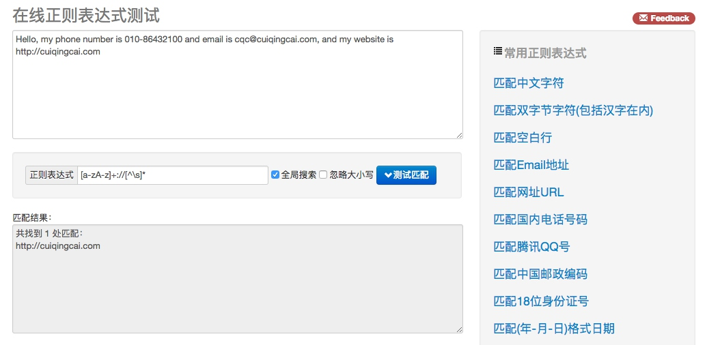

## 3.3　正则表达式

本节中，我们看一下正则表达式的相关用法。正则表达式是处理字符串的强大工具，它有自己特定的语法结构，有了它，实现字符串的检索、替换、匹配验证都不在话下。

当然，对于爬虫来说，有了它，从 HTML 里提取想要的信息就非常方便了。

#### 1. 实例引入

说了这么多，可能我们对它到底是个什么还是比较模糊，下面就用几个实例来看一下正则表达式的用法。

打开开源中国提供的正则表达式测试工具 [http://tool.oschina.net/regex/](http://tool.oschina.net/regex/)，输入待匹配的文本，然后选择常用的正则表达式，就可以得出相应的匹配结果了。例如，这里输入待匹配的文本如下：

```
Hello, my phone number is 010-86432100 and email is cqc@cuiqingcai.com, and my website is https://cuiqingcai.com.
```

这段字符串中包含了一个电话号码和一个电子邮件，接下来就尝试用正则表达式提取出来，如图 3-10 所示。



图 3-10　运行页面

在网页右侧选择 “匹配 Email 地址”，就可以看到下方出现了文本中的 E-mail。如果选择 “匹配网址 URL”，就可以看到下方出现了文本中的 URL。是不是非常神奇？

其实，这里就是用了正则表达式匹配，也就是用一定的规则将特定的文本提取出来。比如，电子邮件开头是一段字符串，然后是一个 @符号，最后是某个域名，这是有特定的组成格式的。另外，对于 URL，开头是协议类型，然后是冒号加双斜线，最后是域名加路径。

对于 URL 来说，可以用下面的正则表达式匹配：

```
[a-zA-z]+://[^\s]*
```

用这个正则表达式去匹配一个字符串，如果这个字符串中包含类似 URL 的文本，那就会被提取出来。

这个正则表达式看上去是乱糟糟的一团，其实不然，这里面都是有特定的语法规则的。比如，a-z 代表匹配任意的小写字母，\s 表示匹配任意的空白字符，* 就代表匹配前面的字符任意多个，这一长串的正则表达式就是这么多匹配规则的组合。

写好正则表达式后，就可以拿它去一个长字符串里匹配查找了。不论这个字符串里面有什么，只要符合我们写的规则，统统可以找出来。对于网页来说，如果想找出网页源代码里有多少 URL，用匹配 URL 的正则表达式去匹配即可。

上面我们说了几个匹配规则，表 3-2 列出了常用的匹配规则。

表 3-2　常用的匹配规则

|  模　　式 | 描　　述                                                                                                                             |
| ---------- | ------------------------------------------------------------------------------------------------ |
|  \w          | 匹配字母、数字及下划线                                                                                                      |
|  \W          | 匹配不是字母、数字及下划线的字符                                                                                     |
|  \s           | 匹配任意空白字符，等价于 [\t\n\r\f]                                                                                     |
|  \S           | 匹配任意非空字符                                                                                                                |
|  \d           | 匹配任意数字，等价于 [0-9]                                                                                                 |
|  \D          | 匹配任意非数字的字符                                                                                                         |
|  \A           | 匹配字符串开头                                                                                                                   |
|  \Z           | 匹配字符串结尾，如果存在换行，只匹配到换行前的结束字符串                                             |
|  \z           | 匹配字符串结尾，如果存在换行，同时还会匹配换行符                                                          |
|  \G           | 匹配最后匹配完成的位置                                                                                                      |
|  \n           | 匹配一个换行符                                                                                                                   |
|  \t            | 匹配一个制表符                                                                                                                   |
|  ^            | 匹配一行字符串的开头                                                                                                         |
|  $            | 匹配一行字符串的结尾                                                                                                         |
|  .              | 匹配任意字符，除了换行符，当 re.DOTALL 标记被指定时，则可以匹配包括换行符的任意字符 |
|  [...]          | 用来表示一组字符，单独列出，比如 [amk] 匹配 a、m 或 k                                                        |
|  [^...]       | 不在 [] 中的字符，比如 [^abc] 匹配除了 a、b、c 之外的字符                                                     |
|  *             | 匹配 0 个或多个表达式                                                                                                          |
|  +            | 匹配 1 个或多个表达式                                                                                                          |
|  ?             | 匹配 0 个或 1 个前面的正则表达式定义的片段，非贪婪方式                                                      |
|  {n}          | 精确匹配 n 个前面的表达式                                                                                                    |
|  {n, m}     | 匹配 n 到 m 次由前面正则表达式定义的片段，贪婪方式                                                            |
|  a|b         | 匹配 a 或 b                                                                                                                             |
|  ( )           | 匹配括号内的表达式，也表示一个组                                                                                     |

看完了之后，可能有点晕晕的吧，不过不用担心，后面我们会详细讲解一些常见规则的用法。

其实正则表达式不是 Python 独有的，它也可以用在其他编程语言中。但是 Python 的 re 库提供了整个正则表达式的实现，利用这个库，可以在 Python 中使用正则表达式。在 Python 中写正则表达式几乎都用这个库，下面就来了解它的一些常用方法。

#### 2. match

这里首先介绍第一个常用的匹配方法 —— match，向它传入要匹配的字符串以及正则表达式，就可以检测这个正则表达式是否匹配字符串。

match 方法会尝试从字符串的起始位置匹配正则表达式，如果匹配，就返回匹配成功的结果；如果不匹配，就返回 None。示例如下：

```python
import re

content = 'Hello 123 4567 World_This is a Regex Demo'
print(len(content))
result = re.match('^Hello\s\d\d\d\s\d{4}\s\w{10}', content)
print(result)
print(result.group())
print(result.span())
```
运行结果如下：
```python
41
<_sre.SRE_Match object; span=(0, 25), match='Hello 123 4567 World_This'>
Hello 123 4567 World_This
(0, 25)
```
这里首先声明了一个字符串，其中包含英文字母、空白字符、数字等。接下来，我们写一个正则表达式：
```
^Hello\s\d\d\d\s\d{4}\s\w{10}
```

用它来匹配这个长字符串。开头的 ^ 是匹配字符串的开头，也就是以 Hello 开头；然后 \s 匹配空白字符，用来匹配目标字符串的空格；\d 匹配数字，3 个 \d 匹配 123；然后再写 1 个 \s 匹配空格；后面还有 4567，我们其实可以依然用 4 个 \d 来匹配，但是这么写比较烦琐，所以后面可以跟 {4} 以代表匹配前面的规则 4 次，也就是匹配 4 个数字；然后后面再紧接 1 个空白字符，最后 \w{10} 匹配 10 个字母及下划线。我们注意到，这里其实并没有把目标字符串匹配完，不过这样依然可以进行匹配，只不过匹配结果短一点而已。

而在 match 方法中，第一个参数传入了正则表达式，第二个参数传入了要匹配的字符串。

打印输出结果，可以看到结果是 SRE_Match 对象，这证明成功匹配。该对象有两个方法：group 方法可以输出匹配到的内容，结果是 Hello 123 4567 World_This，这恰好是正则表达式规则所匹配的内容；span 方法可以输出匹配的范围，结果是 (0, 25)，这就是匹配到的结果字符串在原字符串中的位置范围。

通过上面的例子，我们基本了解了如何在 Python 中使用正则表达式来匹配一段文字。

##### 匹配目标
刚才我们用 match 方法可以得到匹配到的字符串内容，但是如果想从字符串中提取一部分内容，该怎么办呢？就像最前面的实例一样，从一段文本中提取出邮件或电话号码等内容。

这里可以使用 () 括号将想提取的子字符串括起来。() 实际上标记了一个子表达式的开始和结束位置，被标记的每个子表达式会依次对应每一个分组，调用 group 方法传入分组的索引即可获取提取的结果。示例如下：

```python
import re

content = 'Hello 1234567 World_This is a Regex Demo'
result = re.match('^Hello\s(\d+)\sWorld', content)
print(result)
print(result.group())
print(result.group(1))
print(result.span())
```

这里我们想把字符串中的 1234567 提取出来，此时可以将数字部分的正则表达式用 () 括起来，然后调用了 group(1) 获取匹配结果。

运行结果如下：

```python
<_sre.SRE_Match object; span=(0, 19), match='Hello 1234567 World'>
Hello 1234567 World
1234567
(0, 19)
```

可以看到，我们成功得到了 1234567。这里用的是 group(1)，它与 group() 有所不同，后者会输出完整的匹配结果，而前者会输出第一个被 () 包围的匹配结果。假如正则表达式后面还有 () 包括的内容，那么可以依次用 group(2)、group(3) 等来获取。

##### 通用匹配

刚才我们写的正则表达式其实比较复杂，出现空白字符我们就写 \s 匹配，出现数字我们就用 \d 匹配，这样的工作量非常大。其实完全没必要这么做，因为还有一个万能匹配可以用，那就是.*（点星）。其中.（点）可以匹配任意字符（除换行符），*（星）代表匹配前面的字符无限次，所以它们组合在一起就可以匹配任意字符了。有了它，我们就不用挨个字符地匹配了。

接着上面的例子，我们可以改写一下正则表达式：

```python
import re

content = 'Hello 123 4567 World_This is a Regex Demo'
result = re.match('^Hello.*Demo$', content)
print(result)
print(result.group())
print(result.span())
```
这里我们将中间部分直接省略，全部用 .* 来代替，最后加一个结尾字符串就好了。运行结果如下：
```python
<_sre.SRE_Match object; span=(0, 41), match='Hello 123 4567 World_This is a Regex Demo'>
Hello 123 4567 World_This is a Regex Demo
(0, 41)
```

可以看到，group 方法输出了匹配的全部字符串，也就是说我们写的正则表达式匹配到了目标字符串的全部内容；span 方法输出 (0, 41)，这是整个字符串的长度。

因此，我们可以使用 .* 简化正则表达式的书写。

##### 贪婪与非贪婪
使用上面的通用匹配 .* 时，可能有时候匹配到的并不是我们想要的结果。看下面的例子：

```python
import re

content = 'Hello 1234567 World_This is a Regex Demo'
result = re.match('^He.*(\d+).*Demo$', content)
print(result)
print(result.group(1))
```

这里我们依然想获取中间的数字，所以中间依然写的是 (\d+)。而数字两侧由于内容比较杂乱，所以想省略来写，都写成 .*。最后，组成 ^He.*(\d+).*Demo$，看样子并没有什么问题。我们看下运行结果：

```python
<_sre.SRE_Match object; span=(0, 40), match='Hello 1234567 World_This is a Regex Demo'>
7
```

奇怪的事情发生了，我们只得到了 7 这个数字，这是怎么回事呢？

这里就涉及一个贪婪匹配与非贪婪匹配的问题了。在贪婪匹配下，.* 会匹配尽可能多的字符。正则表达式中.* 后面是 \d+，也就是至少一个数字，并没有指定具体多少个数字，因此，.* 就尽可能匹配多的字符，这里就把 123456 匹配了，给 \d + 留下一个可满足条件的数字 7，最后得到的内容就只有数字 7 了。

但这很明显会给我们带来很大的不便。有时候，匹配结果会莫名其妙少了一部分内容。其实，这里只需要使用非贪婪匹配就好了。非贪婪匹配的写法是 .*?，多了一个 ？，那么它可以达到怎样的效果？我们再用实例看一下：


```python
import re

content = 'Hello 1234567 World_This is a Regex Demo'
result = re.match('^He.*?(\d+).*Demo$', content)
print(result)
print(result.group(1))
```
这里我们只是将第一个 .* 改成了 .*?，转变为非贪婪匹配。结果如下：

```python
<_sre.SRE_Match object; span=(0, 40), match='Hello 1234567 World_This is a Regex Demo'>
1234567
```

此时就可以成功获取 1234567 了。原因可想而知，贪婪匹配是尽可能匹配多的字符，非贪婪匹配就是尽可能匹配少的字符。当 .*? 匹配到 Hello 后面的空白字符时，再往后的字符就是数字了，而 \d + 恰好可以匹配，那么这里 .*? 就不再进行匹配，交给 \d+ 去匹配后面的数字。所以这样 .*? 匹配了尽可能少的字符，\d+ 的结果就是 1234567 了。

所以说，在做匹配的时候，字符串中间尽量使用非贪婪匹配，也就是用 .*? 来代替 .*，以免出现匹配结果缺失的情况。

但这里需要注意，如果匹配的结果在字符串结尾，.*? 就有可能匹配不到任何内容了，因为它会匹配尽可能少的字符。例如：

```python
import re

content = 'http://weibo.com/comment/kEraCN'
result1 = re.match('http.*?comment/(.*?)', content)
result2 = re.match('http.*?comment/(.*)', content)
print('result1', result1.group(1))
print('result2', result2.group(1))
```
运行结果如下：
```
result1 
result2 kEraCN
```

可以观察到，.*? 没有匹配到任何结果，而 .* 则尽量匹配多的内容，成功得到了匹配结果。

##### 修饰符
正则表达式可以包含一些可选标志修饰符来控制匹配的模式。修饰符被指定为一个可选的标志。我们用实例来看一下：

```python
import re

content = '''Hello 1234567 World_This
is a Regex Demo
'''
result = re.match('^He.*?(\d+).*?Demo$', content)
print(result.group(1))
```
和上面的例子相仿，我们在字符串中加了换行符，正则表达式还是一样的，用来匹配其中的数字。看一下运行结果：
```python
AttributeError Traceback (most recent call last)
<ipython-input-18-c7d232b39645> in <module>()
      5 '''
      6 result = re.match('^He.*?(\d+).*?Demo$', content)
----> 7 print(result.group(1))

AttributeError: 'NoneType' object has no attribute 'group'
```

运行直接报错，也就是说正则表达式没有匹配到这个字符串，返回结果为 None，而我们又调用了 group 方法导致 AttributeError。

那么，为什么加了一个换行符，就匹配不到了呢？这是因为。匹配的是除换行符之外的任意字符，当遇到换行符时，.*? 就不能匹配了，所以导致匹配失败。这里只需加一个修饰符 re.S，即可修正这个错误：

```python
result = re.match('^He.*?(\d+).*?Demo$', content, re.S)
```
这个修饰符的作用是使。匹配包括换行符在内的所有字符。此时运行结果如下：
```
1234567
```

这个 re.S 在网页匹配中经常用到。因为 HTML 节点经常会有换行，加上它，就可以匹配节点与节点之间的换行了。

另外，还有一些修饰符，在必要的情况下也可以使用，如表 3-3 所示。

表 3-3　修饰符

|  修饰符 | 描　　述                                                                                        |
| -------- | ---------------------------------------------------------------------- |
|  re.I      | 使匹配对大小写不敏感                                                                    |
|  re.L     | 做本地化识别（locale-aware）匹配                                                |
|  re.M    | 多行匹配，影响 ^ 和 $                                                                      |
|  re.S     | 使。匹配包括换行在内的所有字符                                                      |
|  re.U     | 根据 Unicode 字符集解析字符。这个标志影响 \w、\W、\b 和 \B         |
|  re.X     | 该标志通过给予你更灵活的格式以便你将正则表达式写得更易于理解 |

在网页匹配中，较为常用的有 re.S 和 re.I。

##### 转义匹配
我们知道正则表达式定义了许多匹配模式，如。匹配除换行符以外的任意字符，但是如果目标字符串里面就包含.，那该怎么办呢？

这里就需要用到转义匹配了，示例如下：

```python
import re

content = '(百度) www.baidu.com'
result = re.match('\(百度 \) www\.baidu\.com', content)
print(result)
```
当遇到用于正则匹配模式的特殊字符时，在前面加反斜线转义一下即可。例如。就可以用 \. 来匹配，运行结果如下：
```python
<_sre.SRE_Match object; span=(0, 17), match='(百度) www.baidu.com'>
```

可以看到，这里成功匹配到了原字符串。

这些是写正则表达式常用的几个知识点，熟练掌握它们对后面写正则表达式匹配非常有帮助。

#### 3. search
前面提到过，match 方法是从字符串的开头开始匹配的，一旦开头不匹配，那么整个匹配就失败了。我们看下面的例子：

```python
import re

content = 'Extra stings Hello 1234567 World_This is a Regex Demo Extra stings'
result = re.match('Hello.*?(\d+).*?Demo', content)
print(result)
```
这里的字符串以 Extra 开头，但是正则表达式以 Hello 开头，整个正则表达式是字符串的一部分，但是这样匹配是失败的。运行结果如下：
```python
None
```

因为 match 方法在使用时需要考虑到开头的内容，这在做匹配时并不方便。它更适合用来检测某个字符串是否符合某个正则表达式的规则。

这里就有另外一个方法 search，它在匹配时会扫描整个字符串，然后返回第一个成功匹配的结果。也就是说，正则表达式可以是字符串的一部分，在匹配时，search 方法会依次扫描字符串，直到找到第一个符合规则的字符串，然后返回匹配内容，如果搜索完了还没有找到，就返回 None。

我们把上面代码中的 match 方法修改成 search，再看下运行结果：

```python
<_sre.SRE_Match object; span=(13, 53), match='Hello 1234567 World_This is a Regex Demo'>
1234567
```

这时就得到了匹配结果。

因此，为了匹配方便，我们可以尽量使用 search 方法。

下面再用几个实例来看看 search 方法的用法。

首先，这里有一段待匹配的 HTML 文本，接下来写几个正则表达式实例来实现相应信息的提取：

```html
html = '''<div id="songs-list">
<h2 class="title"> 经典老歌 </h2>
<p class="introduction">
经典老歌列表
</p>
<ul id="list" class="list-group">
<li data-view="2"> 一路上有你 </li>
<li data-view="7">
<a href="/2.mp3" singer="任贤齐"> 沧海一声笑 </a>
</li>
<li data-view="4" class="active">
<a href="/3.mp3" singer="齐秦"> 往事随风 </a>
</li>
<li data-view="6"><a href="/4.mp3" singer="beyond"> 光辉岁月 </a></li>
<li data-view="5"><a href="/5.mp3" singer="陈慧琳"> 记事本 </a></li>
<li data-view="5">
<a href="/6.mp3" singer="邓丽君"> 但愿人长久 </a>
</li>
</ul>
</div>'''
```

可以观察到，ul 节点里有许多 li 节点，其中 li 节点中有的包含 a 节点，有的不包含 a 节点，a 节点还有一些相应的属性 —— 超链接和歌手名。

首先，我们尝试提取 class 为 active 的 li 节点内部的超链接包含的歌手名和歌名，此时需要提取第三个 li 节点下 a 节点的 singer 属性和文本。

此时正则表达式可以以 li 开头，然后寻找一个标志符 active，中间的部分可以用 .*? 来匹配。接下来，要提取 singer 这个属性值，所以还需要写入 singer="(.*?)"，这里需要提取的部分用小括号括起来，以便用 group 方法提取出来，它的两侧边界是双引号。然后还需要匹配 a 节点的文本，其中它的左边界是 & gt;，右边界是 & lt;/a&gt;。然后目标内容依然用 (.*?) 来匹配，所以最后的正则表达式就变成了：

```
<li.*?active.*?singer="(.*?)">(.*?)</a>
```

然后再调用 search 方法，它会搜索整个 HTML 文本，找到符合正则表达式的第一个内容返回。

另外，由于代码有换行，所以这里第三个参数需要传入 re.S。整个匹配代码如下：

```python
result = re.search('<li.*?active.*?singer="(.*?)">(.*?)</a>', html, re.S) 
if result:  
    print(result.group(1), result.group(2))
```

由于需要获取的歌手和歌名都已经用小括号包围，所以可以用 group 方法获取。

运行结果如下：

```
齐秦往事随风
```

可以看到，这正是 class 为 active 的 li 节点内部的超链接包含的歌手名和歌名。

如果正则表达式不加 active（也就是匹配不带 class 为 active 的节点内容），那会怎样呢？我们将正则表达式中的 active 去掉，代码改写如下：

```python
result = re.search('<li.*?singer="(.*?)">(.*?)</a>', html, re.S)
if result:  
    print(result.group(1), result.group(2))
```
由于 search 方法会返回第一个符合条件的匹配目标，这里结果就变了：

```
任贤齐沧海一声笑
```

把 active 标签去掉后，从字符串开头开始搜索，此时符合条件的节点就变成了第二个 li 节点，后面的就不再匹配，所以运行结果就变成第二个 li 节点中的内容。

注意，在上面的两次匹配中，search 方法的第三个参数都加了 re.S，这使得 .*? 可以匹配换行，所以含有换行的 li 节点被匹配到了。如果我们将其去掉，结果会是什么？代码如下：

```python
result = re.search('<li.*?singer="(.*?)">(.*?)</a>', html)
if result:  
    print(result.group(1), result.group(2))
```
运行结果如下：
```
beyond 光辉岁月
```

可以看到，结果变成了第四个 li 节点的内容。这是因为第二个和第三个 li 节点都包含了换行符，去掉 re.S 之后，.*? 已经不能匹配换行符，所以正则表达式不会匹配到第二个和第三个 li 节点，而第四个 li 节点中不包含换行符，所以成功匹配。

由于绝大部分的 HTML 文本都包含了换行符，所以尽量都需要加上 re.S 修饰符，以免出现匹配不到的问题。

#### 4. findall

前面我们介绍了 search 方法的用法，它可以返回匹配正则表达式的第一个内容，但是如果想要获取匹配正则表达式的所有内容，那该怎么办呢？这时就要借助 findall 方法了。该方法会搜索整个字符串，然后返回匹配正则表达式的所有内容。

还是上面的 HTML 文本，如果想获取所有 a 节点的超链接、歌手和歌名，就可以将 search 方法换成 findall 方法。如果有返回结果的话，就是列表类型，所以需要遍历一下来依次获取每组内容。代码如下：

```python
results = re.findall('<li.*?href="(.*?)".*?singer="(.*?)">(.*?)</a>', html, re.S)
print(results)  
print(type(results))  
for result in results:  
    print(result)  
    print(result[0], result[1], result[2])
```
运行结果如下：
```
[('/2.mp3', ' 任贤齐 ', ' 沧海一声笑 '), ('/3.mp3', ' 齐秦 ', ' 往事随风 '), ('/4.mp3', 'beyond', ' 光辉岁月 '), ('/5.mp3', ' 陈慧琳 ', ' 记事本 '), ('/6.mp3', ' 邓丽君 ', ' 但愿人长久 ')]
<class 'list'>
('/2.mp3', ' 任贤齐 ', ' 沧海一声笑 ')
/2.mp3 任贤齐 沧海一声笑
('/3.mp3', ' 齐秦 ', ' 往事随风 ')
/3.mp3 齐秦 往事随风
('/4.mp3', 'beyond', ' 光辉岁月 ')
/4.mp3 beyond 光辉岁月
('/5.mp3', ' 陈慧琳 ', ' 记事本 ')
/5.mp3 陈慧琳 记事本
('/6.mp3', ' 邓丽君 ', ' 但愿人长久 ')
/6.mp3 邓丽君 但愿人长久
```

可以看到，返回的列表中的每个元素都是元组类型，我们用对应的索引依次取出即可。

如果只是获取第一个内容，可以用 search 方法。当需要提取多个内容时，可以用 findall 方法。

#### 5. sub

除了使用正则表达式提取信息外，有时候还需要借助它来修改文本。比如，想要把一串文本中的所有数字都去掉，如果只用字符串的 replace 方法，那就太烦琐了，这时可以借助 sub 方法。示例如下：

```python
import re

content = '54aK54yr5oiR54ix5L2g'
content = re.sub('\d+', '', content)
print(content)
```
运行结果如下：
```python
aKyroiRixLg
```

这里只需要给第一个参数传入 \d+ 来匹配所有的数字，第二个参数为替换成的字符串（如果去掉该参数的话，可以赋值为空），第三个参数是原字符串。

在上面的 HTML 文本中，如果想获取所有 li 节点的歌名，直接用正则表达式来提取可能比较烦琐。比如，可以写成这样子：

```python
results = re.findall('<li.*?>\s*?(<a.*?>)?(\w+)(</a>)?\s*?</li>', html, re.S)
for result in results:
    print(result[1])
```
运行结果如下：
```python
一路上有你
沧海一声笑
往事随风
光辉岁月
记事本
但愿人长久
```

此时借助 sub 方法就比较简单了。可以先用 sub 方法将 a 节点去掉，只留下文本，然后再利用 findall 提取就好了：

```python
html = re.sub('<a.*?>|</a>', '', html)
print(html)
results = re.findall('<li.*?>(.*?)</li>', html, re.S)
for result in results:
    print(result.strip())
```

运行结果如下：

```python
<div id="songs-list">
    <h2 class="title"> 经典老歌 </h2>
    <p class="introduction">
        经典老歌列表
    </p>
    <ul id="list" class="list-group">
        <li data-view="2"> 一路上有你 </li>
        <li data-view="7">
            沧海一声笑
        </li>
        <li data-view="4" class="active">
            往事随风
        </li>
        <li data-view="6"> 光辉岁月 </li>
        <li data-view="5"> 记事本 </li>
        <li data-view="5">
            但愿人长久
        </li>
    </ul>
</div>
一路上有你
沧海一声笑
往事随风
光辉岁月
记事本
但愿人长久
```

可以看到，a 节点经过 sub 方法处理后就没有了，然后再通过 findall 方法直接提取即可。可以看到，在适当的时候，借助 sub 方法可以起到事半功倍的效果。

#### 6. compile

前面所讲的方法都是用来处理字符串的方法，最后再介绍一下 compile 方法，这个方法可以将正则字符串编译成正则表达式对象，以便在后面的匹配中复用。示例代码如下：

```python
import re

content1 = '2016-12-15 12:00'
content2 = '2016-12-17 12:55'
content3 = '2016-12-22 13:21'
pattern = re.compile('\d{2}:\d{2}')
result1 = re.sub(pattern, '', content1)
result2 = re.sub(pattern, '', content2)
result3 = re.sub(pattern, '', content3)
print(result1, result2, result3)
```

例如，这里有 3 个日期，我们想分别将 3 个日期中的时间去掉，这时可以借助 sub 方法。该方法的第一个参数是正则表达式，但是这里没有必要重复写 3 个同样的正则表达式，此时可以借助 compile 方法将正则表达式编译成一个正则表达式对象，以便复用。

运行结果如下：

```python
2016-12-15  2016-12-17  2016-12-22 
```

另外，compile 还可以传入修饰符，例如 re.S 等修饰符，这样在 search、findall 等方法中就不需要额外传了。所以，compile 方法可以说是给正则表达式做了一层封装，以便我们更好地复用。

到此为止，正则表达式的基本用法就介绍完了，后面会通过具体的实例来讲解正则表达式的用法。