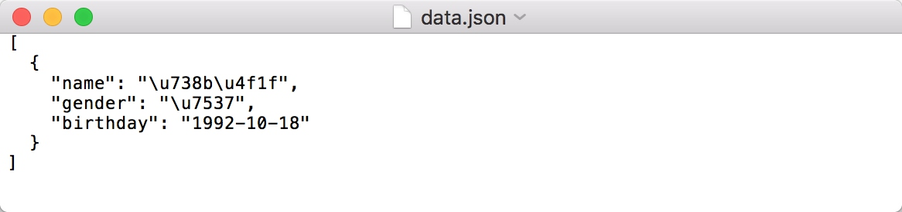

## 5.1.2 Json文件存储

Json，全称为 JavaScript Object Notation, 也就是 JavaScript 对象标记，通过对象和数组的组合来表示数据，构造简洁但是结构化程度非常高，它是一种轻量级的数据交换格式，本节我们来了解一下利用 Python 保存数据到 Json 文件的方法。

### 1. 对象和数组

在 JavaScript 语言中，一切都是对象。因此，任何支持的类型都可以通过 Json 来表示，例如字符串、数字、对象、数组等。但是对象和数组是比较特殊且常用的两种类型。

* 对象，对象在 JavaScript 中是使用花括号 {} 包裹起来的内容，数据结构为 {key1：value1, key2：value2, ...} 的键值对结构。在面向对象的语言中，key 为对象的属性，value 为对应的值。键名可以使用整数和字符串来表示。值的类型可以是任意类型。
* 数组，数组在 JavaScript 中是方括号 [] 包裹起来的内容，数据结构为 ["java", "javascript", "vb", ...] 的索引结构。在 JavaScript 中，数组是一种比较特殊的数据类型，它也可以像对象那样使用键值对，但还是索引使用得多。同样，值的类型可以是任意类型。

所以一个 Json 对象可以写为如下形式：

```json
[{
    "name": "Bob",
    "gender": "male",
    "birthday": "1992-10-18"
}, {
     "name": "Selina",
    "gender": "female",
    "birthday": "1995-10-18"
}]
```

由中括号包围的就相当于列表类型，列表的每个元素可以是任意类型，在示例中它是字典类型，由大括号包围。

Json 可以由以上两种形式自由组合而成，可以无限次嵌套，结构清晰，是数据交换的极佳方式。

### 2. 读取Json

Python 为我们提供了简单易用的 json 库来供我们实现 Json 文件的读写操作，我们可以调用 json 库的 loads() 方法将 Json 文本字符串转为 Json 对象，可以通过 dumps()方法将 Json 对象转为文本字符串。

例如在这里有一段 Json 形式的字符串，它是 str 类型，我们用 Python 将可其转换为可操作的数据结构，如列表或字典。

```python
import json

str = '''
[{
    "name": "Bob",
    "gender": "male",
    "birthday": "1992-10-18"
}, {
    "name": "Selina",
    "gender": "female",
    "birthday": "1995-10-18"
}]
'''
print(type(str))
data = json.loads(str)
print(data)
print(type(data))
```

运行结果：

```python
<class 'str'>
[{'name': 'Bob', 'gender': 'male', 'birthday': '1992-10-18'}, {'name': 'Selina', 'gender': 'female', 'birthday': '1995-10-18'}]
<class 'list'>
```

在这里我们使用了 loads() 方法将字符串转为 Json 对象，由于最外层是中括号，所以最终的类型是列表类型。

这样一来我们就可以用索引来取到对应的内容了，例如我们想取第一个元素里的 name 属性，就可以使用如下方式获取：

```python
data[0]['name']
data[0].get('name')
```

得到的结果都是：

```
Bob
```

通过中括号加 0 索引我们可以拿到第一个字典元素，然后再调用其键名即可得到相应的键值。在获取键值的时候有两种方式，一种是中括号加键名，另一种是 get() 方法传入键名。推荐使用 get() 方法来获取内容，这样如果键名不存在的话不会报错，会返回None。另外 get() 方法还可以传入第二个参数即默认值，我们用一个示例感受一下：

```python
data[0].get('age')
data[0].get('age', 25)
```

运行结果：

```python
None
25
```

在这里我们尝试获取年龄 age，其实在原字典中是不存在该键名的，如果不存在，默认会返回 None，如果传入第二个参数即默认值，那么在不存在的情况下则返回该默认值。

值得注意的是 Json 的数据需要用双引号来包围，不能使用单引号。例如若使用如下形式表示则会出现错误：

```python
import json

str = '''
[{
    'name': 'Bob',
    'gender': 'male',
    'birthday': '1992-10-18'
}]
'''
data = json.loads(str)
```

运行结果：

```python
json.decoder.JSONDecodeError: Expecting property name enclosed in double quotes: line 3 column 5 (char 8)
```

在这里会出现 Json 解析错误的提示，是因为在这里数据用了单括号来包围，请千万注意 Json 字符串的表示需要用双引号，否则 loads() 方法会解析失败。

如果我们是从 Json 文本中读取内容，例如在这里有一个data.json 文本文件，其内容是刚才我们所定义的 Json 字符串。

我们可以先将文本文件内容读出，然后再利用 loads() 方法转化。

```python
import json

with open('data.json', 'r') as file:
    str = file.read()
    data = json.loads(str)
    print(data)
```

运行结果：

```python
[{'name': 'Bob', 'gender': 'male', 'birthday': '1992-10-18'}, {'name': 'Selina', 'gender': 'female', 'birthday': '1995-10-18'}]
```

以上是读取 Json 文件的方法。

### 3. 输出Json

另外我们还可以调用 dumps() 方法来将 Json 对象转化为字符串。

例如我们将刚上例中的列表重新写入到文本。

```python
import json

data = [{
    'name': 'Bob',
    'gender': 'male',
    'birthday': '1992-10-18'
}]
with open('data.json', 'w') as file:
    file.write(json.dumps(data))
```

利用 dumps() 方法我们可以将 Json 对象转为字符串，然后再调用文件的 write() 方法即可写入到文本，结果如图 5-2 所示：


图 5-2 写入结果

另外如果我们想保存 Json 的格式，可以再加一个参数 indent，代表缩进字符个数。

```python
with open('data.json', 'w') as file:
    file.write(json.dumps(data, indent=2))
```

写入结果如图 5-3 所示：


图 5-3 写入结果

这样得到的内容会自动带有缩进，格式会更加清晰。

另外如果 Json 中包含中文字符，例如我们将之前的 Json 的部分值改为中文，再用之前的方法写入到文本。

```python
import json

data = [{
    'name': '王伟',
    'gender': '男',
    'birthday': '1992-10-18'
}]
with open('data.json', 'w') as file:
    file.write(json.dumps(data, indent=2))
```

写入结果如图 5-4 所示：



图 5-4 写入结果

可以看到中文字符都变成了 Unicode 字符，这并不是我们想要的结果。

为了输出中文，我们还需要指定一个参数 ensure_ascii 为 False，另外规定文件输出的编码。

```python
with open('data.json', 'w', encoding='utf-8') as file:
    file.write(json.dumps(data, indent=2, ensure_ascii=False))
```

写入结果如图 5-5 所示：


图 5-5 写入结果

这样我们就可以输出 Json 为中文了，所以如果字典中带有中文的内容我们需要设置 ensure_ascii 参数为 False 才可正常写入中文。

### 4. 结语

本节我们了解了用 Python 进行 Json 文件读写的方法，在后面做数据解析时经常会用到，建议熟练掌握。

