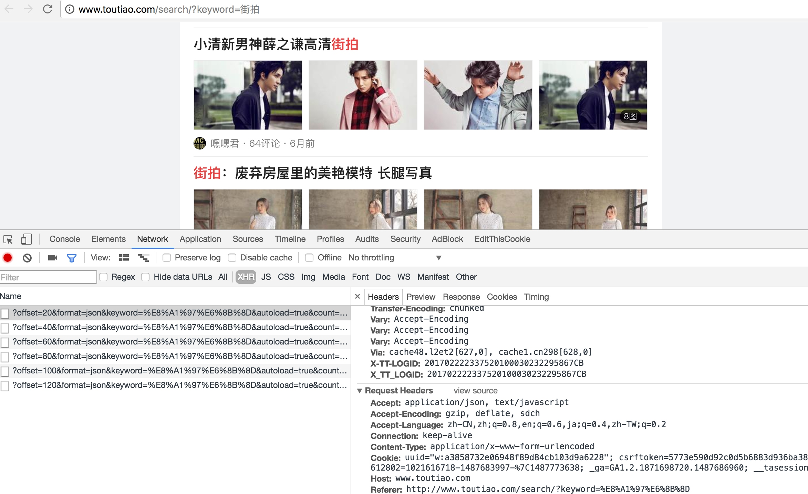
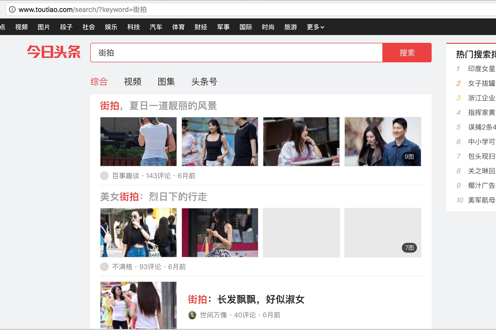
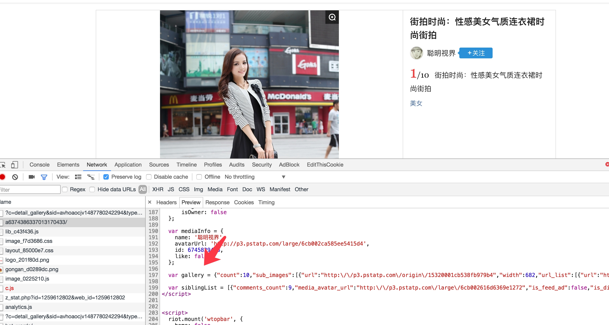
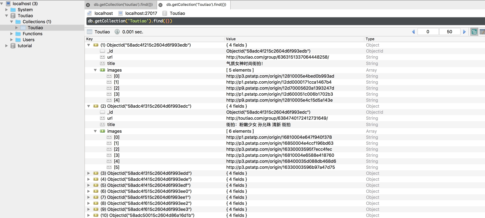

本节课我们以今日头条为例来讲解通过分析Ajax请求来抓取网页数据的方法，有些网页可能直接请求得到的HTML代码里面并没有我们在浏览器中看到的内容，这是因为一些信息是通过Ajax加载并通过JS渲染生成的，这时候就需要我们来分析网页的请求，本节使用的网络库依然还是requests，解析库有用到BeautifulSoup和正则表达式，存储数据使用MongoDB，要用到pymongo库，在这之前请确保这些库已经正确安装。







```python
from urllib.parse import urlencode
import requests
from requests.exceptions import ConnectionError

def get_page_index(offset, keyword):
    data = {
        'autoload': 'true',
        'count': 20,
        'cur_tab': 3,
        'format': 'json',
        'keyword': keyword,
        'offset': offset,
    }
    params = urlencode(data)

    base = 'http://www.toutiao.com/search_content/'
    url = base + '?' + params
    try:
        response = requests.get(url)
        if response.status_code == '200':
            return response.text
        return None
    except ConnectionError:
        print('Error occurred')
        return None
```

```python
import json
```

```python
def parse_page_index(text):
    data = json.loads(text)
    if data and 'data' in data.keys():
        for item in data.get('data'):
            yield item.get('article_url')


def main():
    text = get_page_index(20, '街拍')
    urls = parse_page_index(text)
    for url in urls:
        print(url)
```




```json
[{'url': 'http://p3.pstatp.com/origin/15320001cb538fb979b4', 'width': 682, 'height': 1024, 'uri': 'origin/15320001cb538fb979b4', 'url_list': [{'url': 'http://p3.pstatp.com/origin/15320001cb538fb979b4'}, {'url': 'http://pb2.pstatp.com/origin/15320001cb538fb979b4'}, {'url': 'http://pb3.pstatp.com/origin/15320001cb538fb979b4'}]}, {'url': 'http://p3.pstatp.com/origin/15380001bea82c074e50', 'width': 682, 'height': 1024, 'uri': 'origin/15380001bea82c074e50', 'url_list': [{'url': 'http://p3.pstatp.com/origin/15380001bea82c074e50'}, {'url': 'http://pb2.pstatp.com/origin/15380001bea82c074e50'}, {'url': 'http://pb3.pstatp.com/origin/15380001bea82c074e50'}]}, {'url': 'http://p3.pstatp.com/origin/15360001ccb5431cbc08', 'width': 682, 'height': 1024, 'uri': 'origin/15360001ccb5431cbc08', 'url_list': [{'url': 'http://p3.pstatp.com/origin/15360001ccb5431cbc08'}, {'url': 'http://pb2.pstatp.com/origin/15360001ccb5431cbc08'}, {'url': 'http://pb3.pstatp.com/origin/15360001ccb5431cbc08'}]}, {'url': 'http://p3.pstatp.com/origin/153100072a2065bb33e5', 'width': 682, 'height': 1024, 'uri': 'origin/153100072a2065bb33e5', 'url_list': [{'url': 'http://p3.pstatp.com/origin/153100072a2065bb33e5'}, {'url': 'http://pb2.pstatp.com/origin/153100072a2065bb33e5'}, {'url': 'http://pb3.pstatp.com/origin/153100072a2065bb33e5'}]}, {'url': 'http://p3.pstatp.com/origin/153300047b3f590ee207', 'width': 682, 'height': 1024, 'uri': 'origin/153300047b3f590ee207', 'url_list': [{'url': 'http://p3.pstatp.com/origin/153300047b3f590ee207'}, {'url': 'http://pb2.pstatp.com/origin/153300047b3f590ee207'}, {'url': 'http://pb3.pstatp.com/origin/153300047b3f590ee207'}]}, {'url': 'http://p2.pstatp.com/origin/15320001cb93f289d78d', 'width': 682, 'height': 1024, 'uri': 'origin/15320001cb93f289d78d', 'url_list': [{'url': 'http://p2.pstatp.com/origin/15320001cb93f289d78d'}, {'url': 'http://pb3.pstatp.com/origin/15320001cb93f289d78d'}, {'url': 'http://pb3.pstatp.com/origin/15320001cb93f289d78d'}]}, {'url': 'http://p3.pstatp.com/origin/153300047b4d1241f854', 'width': 682, 'height': 1024, 'uri': 'origin/153300047b4d1241f854', 'url_list': [{'url': 'http://p3.pstatp.com/origin/153300047b4d1241f854'}, {'url': 'http://pb2.pstatp.com/origin/153300047b4d1241f854'}, {'url': 'http://pb3.pstatp.com/origin/153300047b4d1241f854'}]}, {'url': 'http://p3.pstatp.com/origin/15320001cba2c6da9db0', 'width': 682, 'height': 1024, 'uri': 'origin/15320001cba2c6da9db0', 'url_list': [{'url': 'http://p3.pstatp.com/origin/15320001cba2c6da9db0'}, {'url': 'http://pb2.pstatp.com/origin/15320001cba2c6da9db0'}, {'url': 'http://pb3.pstatp.com/origin/15320001cba2c6da9db0'}]}, {'url': 'http://p9.pstatp.com/origin/15320001cbaa7d2035f3', 'width': 682, 'height': 1024, 'uri': 'origin/15320001cbaa7d2035f3', 'url_list': [{'url': 'http://p9.pstatp.com/origin/15320001cbaa7d2035f3'}, {'url': 'http://pb3.pstatp.com/origin/15320001cbaa7d2035f3'}, {'url': 'http://pb3.pstatp.com/origin/15320001cbaa7d2035f3'}]}, {'url': 'http://p3.pstatp.com/origin/15360001ccf1220ecb5f', 'width': 682, 'height': 1024, 'uri': 'origin/15360001ccf1220ecb5f', 'url_list': [{'url': 'http://p3.pstatp.com/origin/15360001ccf1220ecb5f'}, {'url': 'http://pb2.pstatp.com/origin/15360001ccf1220ecb5f'}, {'url': 'http://pb3.pstatp.com/origin/15360001ccf1220ecb5f'}]}]
```


```
['http://p3.pstatp.com/origin/15320001cb538fb979b4', 'http://p3.pstatp.com/origin/15380001bea82c074e50', 'http://p3.pstatp.com/origin/15360001ccb5431cbc08', 'http://p3.pstatp.com/origin/153100072a2065bb33e5', 'http://p3.pstatp.com/origin/153300047b3f590ee207', 'http://p2.pstatp.com/origin/15320001cb93f289d78d', 'http://p3.pstatp.com/origin/153300047b4d1241f854', 'http://p3.pstatp.com/origin/15320001cba2c6da9db0', 'http://p9.pstatp.com/origin/15320001cbaa7d2035f3', 'http://p3.pstatp.com/origin/15360001ccf1220ecb5f']
```

```python
import pymongo
MONGO_URL = 'localhost'
MONGO_DB = 'Toutiao'
MONGO_TABLE = 'Toutiao'

client = pymongo.MongoClient(MONGO_URL)
db = client[MONGO_DB]
```


```python

def save_to_mongo(result):
    if db[MONGO_TABLE].insert(result):
        print('Successfully Saved to Mongo', result)
        return True
    return False
```
```python

def main():
    text = get_page_index(20, '街拍')
    urls = parse_page_index(text)
    for url in urls:
        html = get_page_detail(url)
        result = parse_page_detail(html, url)
        if result: save_to_mongo(result)
```

```python
GROUP_START = 1
GROUP_END = 20
KEYWORD='街拍'
```

```python
def main(offset):
    text = get_page_index(offset, KEYWORD)
    urls = parse_page_index(text)
    for url in urls:
        html = get_page_detail(url)
        result = parse_page_detail(html, url)
        if result: save_to_mongo(result)

pool = Pool()
groups = ([x * 20 for x in range(GROUP_START, GROUP_END + 1)])
pool.map(main, groups)
```

```python
import json
from urllib.parse import urlencode
import pymongo
import requests
from bs4 import BeautifulSoup
from requests.exceptions import ConnectionError
import re
from multiprocessing import Pool

MONGO_URL = 'localhost'
MONGO_DB = 'Toutiao'
MONGO_TABLE = 'Toutiao'

GROUP_START = 1
GROUP_END = 20
KEYWORD='街拍'

client = pymongo.MongoClient(MONGO_URL)
db = client[MONGO_DB]


def get_page_index(offset, keyword):
    data = {
        'autoload': 'true',
        'count': 20,
        'cur_tab': 3,
        'format': 'json',
        'keyword': keyword,
        'offset': offset,
    }
    params = urlencode(data)
    base = 'http://www.toutiao.com/search_content/'
    url = base + '?' + params
    try:
        response = requests.get(url)
        if response.status_code == 200:
            return response.text
        return None
    except ConnectionError:
        print('Error occurred')
        return None


def parse_page_index(text):
    data = json.loads(text)
    if data and 'data' in data.keys():
        for item in data.get('data'):
            yield item.get('article_url')

def get_page_detail(url):
    try:
        response = requests.get(url)
        if response.status_code == 200:
            return response.text
        return None
    except ConnectionError:
        print('Error occurred')
        return None

def parse_page_detail(html, url):
    soup = BeautifulSoup(html, 'lxml')
    result = soup.select('title')
    title = result[0].get_text() if result else ''
    images_pattern = re.compile('var gallery = (.*?);', re.S)
    result = re.search(images_pattern, html)
    if result:
        data = json.loads(result.group(1))
        if data and 'sub_images' in data.keys():
            sub_images = data.get('sub_images')
            images = [item.get('url') for item in sub_images]
            return {
                'title': title,
                'url': url,
                'images': images
            }

def save_to_mongo(result):
    if db[MONGO_TABLE].insert(result):
        print('Successfully Saved to Mongo', result)
        return True
    return False

def main(offset):
    text = get_page_index(offset, KEYWORD)
    urls = parse_page_index(text)
    for url in urls:
        html = get_page_detail(url)
        result = parse_page_detail(html, url)
        if result: save_to_mongo(result)

pool = Pool()
groups = ([x * 20 for x in range(GROUP_START, GROUP_END + 1)])
pool.map(main, groups)
```



