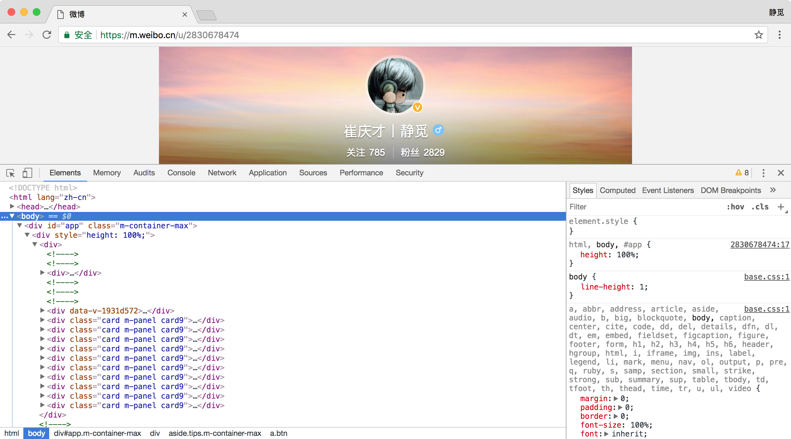
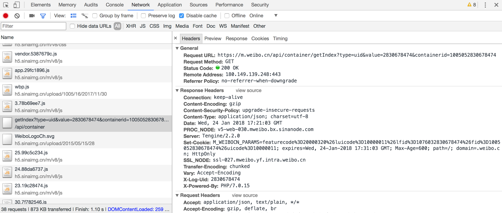
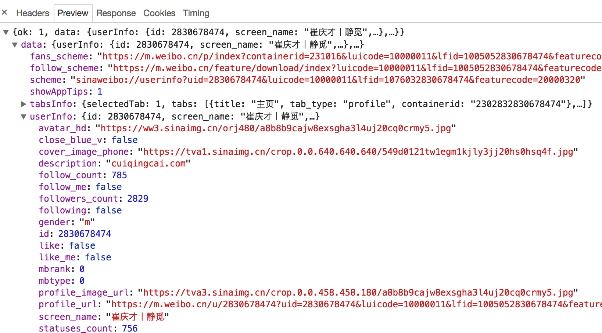
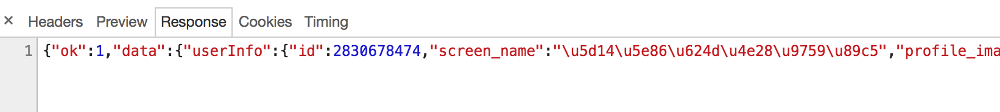

# 6.2 Ajax 分析方法

这里还以前面的微博为例，我们知道拖动刷新的内容由 Ajax 加载，而且页面的 URL 没有变化，那么应该到哪里去查看这些 Ajax 请求呢？

### 1. 查看请求

这里还需要借助浏览器的开发者工具，下面以 Chrome 浏览器为例来介绍。

首先，用 Chrome 浏览器打开微博的链接 https://m.weibo.cn/u/2830678474，随后在页面中点击鼠标右键，从弹出的快捷菜单中选择 “检查” 选项，此时便会弹出开发者工具，如图 6-2 所示。

图 6-2　开发者工具

此时在 Elements 选项卡中便会观察到网页的源代码，右侧便是节点的样式。

不过这不是我们想要寻找的内容。切换到 Network 选项卡，随后重新刷新页面，可以发现这里出现了非常多的条目，如图 6-3 所示。

图 6-3　Network 面板结果

前面也提到过，这里其实就是在页面加载过程中浏览器与服务器之间发送请求和接收响应的所有记录。

Ajax 其实有其特殊的请求类型，它叫作 xhr。在图 6-4 中，我们可以发现一个名称以 getIndex 开头的请求，其 Type 为 xhr，这就是一个 Ajax 请求。用鼠标点击这个请求，可以查看这个请求的详细信息。

图 6-4　详细信息

在右侧可以观察到其 Request Headers、URL 和 Response Headers 等信息。其中 Request Headers 中有一个信息为 X-Requested-With:XMLHttpRequest，这就标记了此请求是 Ajax 请求，如图 6-5 所示。

图 6-5　详细信息

随后点击一下 Preview，即可看到响应的内容，它是 JSON 格式的。这里 Chrome 为我们自动做了解析，点击箭头即可展开和收起相应内容，如图 6-6 所示。

观察可以发现，这里的返回结果是我的个人信息，如昵称、简介、头像等，这也是用来渲染个人主页所使用的数据。JavaScript 接收到这些数据之后，再执行相应的渲染方法，整个页面就渲染出来了。

图 6-6　JSON 结果

另外，也可以切换到 Response 选项卡，从中观察到真实的返回数据，如图 6-7 所示。

图 6-7　Response 内容

接下来，切回到第一个请求，观察一下它的 Response 是什么，如图 6-8 所示。

图 6-8　Response 内容

这是最原始的链接 [https://m.weibo.cn/u/2830678474](https://m.weibo.cn/u/2830678474) 返回的结果，其代码只有不到 50 行，结构也非常简单，只是执行了一些 JavaScript。

所以说，我们看到的微博页面的真实数据并不是最原始的页面返回的，而是后来执行 JavaScript 后再次向后台发送了 Ajax 请求，浏览器拿到数据后再进一步渲染出来的。

### 2. 过滤请求

接下来，再利用 Chrome 开发者工具的筛选功能筛选出所有的 Ajax 请求。在请求的上方有一层筛选栏，直接点击 XHR，此时在下方显示的所有请求便都是 Ajax 请求了，如图 6-9 所示。

图 6-9　Ajax 请求

接下来，不断滑动页面，可以看到页面底部有一条条新的微博被刷出，而开发者工具下方也一个个地出现 Ajax 请求，这样我们就可以捕获到所有的 Ajax 请求了。

随意点开一个条目，都可以清楚地看到其 Request URL、Request Headers、Response Headers、Response Body 等内容，此时想要模拟请求和提取就非常简单了。

图 6-10 所示的内容便是我的某一页微博的列表信息。

图 6-10　微博列表信息

到现在为止，我们已经可以分析出 Ajax 请求的一些详细信息了，接下来只需要用程序模拟这些 Ajax 请求，就可以轻松提取我们所需要的信息了。

在下一节中，我们用 Python 实现 Ajax 请求的模拟，从而实现数据的抓取。