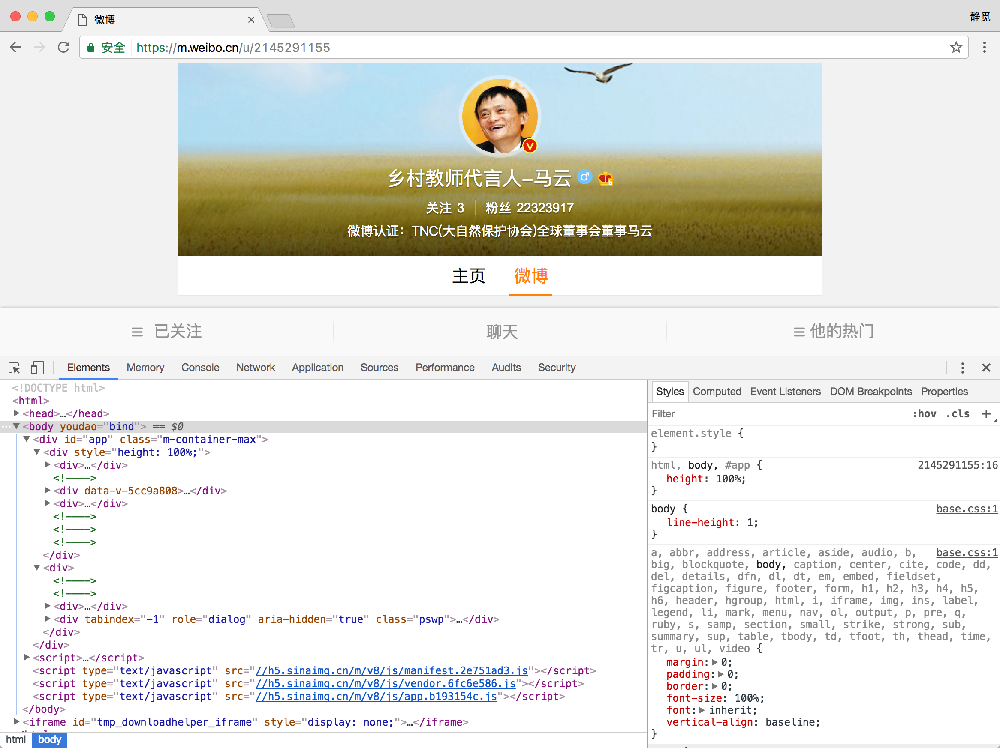
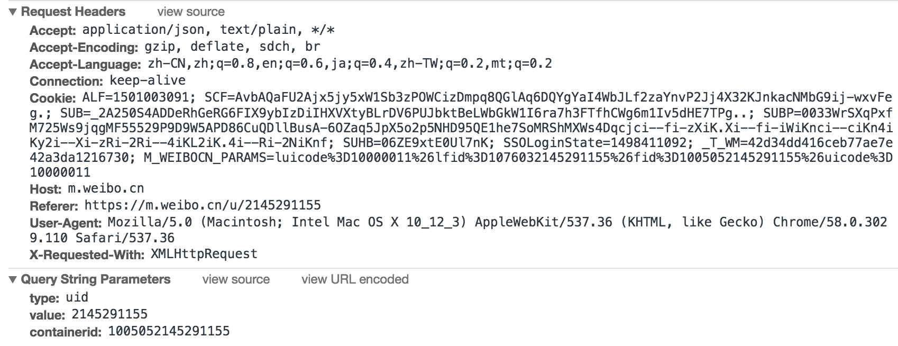

# Ajax分析方法

还是以上文中的微博为例，我们已经知道了拖动刷新的内容是由Ajax加载的，而且页面的URL没有变化，那么我们应该到哪去查看这些Ajax请求呢？

在这里我们就需要借助于浏览器的开发者工具了，我们首先以Chrome浏览器为例来看一下怎样操作。

首先用Chrome浏览器打开微博的链接，[https://m.weibo.cn/u/2145291155](https://m.weibo.cn/u/2145291155)，随后在页面中点击鼠标右键，会出现一个检查的选项，点击它便会弹出开发者工具。

那么在Elements选项卡便会观察到网页的源代码，右侧便是节点的样式。

不过这不是我们想要寻找的内容，我们切换到Network选项卡，随后重新刷新页面，可以发现在这里出现了非常多的条目。

那么这里其实就是在页面加载过程中浏览器与服务器之间发送Request和接收Response的所有记录。

在这里每一条记录都分了好多个列，下面我们来一一进行介绍。

* 第一列为Name，即请求的名称，一般来说会以请求URL的最后一段作为请求的名称，例如第一个请求的名称为2145291155，这也就是我们我们最初访问的链接[https://m.weibo.cn/u/2145291155](https://m.weibo.cn/u/2145291155)，它取了链接的最后一段作为其名称，其他的名称也是根据请求的URL通过这样的方式命名的。

* 第二列为Status，就是请求的状态码，前面我们已经介绍了HTTP请求状态码，如200代表请求成功，404代表页面找不到等等。

* 第三列Type是文件类型，即这个请求返回的文件类型是什么，如document即文档类型，其内容一般为HTML代码，当我们访问一个网页时，第一个请求都是这种类型，script一般为JavaScript文件，font为字体文件等。

* 第四列Initiator解释请求是怎样发起的，如果为Other，则代表是由Link点击或浏览器输入URL发起的，否则则会呈现发起程序的Name，如第二个ios.js的Initiator则是2145291155，这代表此ios.js的请求是由名为2145291155进一步发起的，因为2145291155这个请求的返回结果是HTML代表，而HTML代表中又包含了script标签来加载JavaScript，所以这里的ios.js就由它来发起。

* 第五列Size是这个请求得到的响应内容的大小，例如第一行2145291155这个请求的Size是1.5KB，这代表这个请求得到的HTML文档是1.5KB，下面我们还会注意到还有一种from memory cache，这代表是直接从缓存加载。

* 第六列Time即加载时间，是从请求开始到接收到最后一个字节的总时长，如第一个请求到到接收到响应总用时为179毫秒，但如果是from memory cache加载，其时间为0，也就是不费时。

* 第七列Waterfall，它是一个加载流水线进度条，其起始点和长度会根据加载的时间变化。

那么说了这么多，这些和Ajax有什么关系呢？

Ajax其实也有其请求类型，它叫做xhr，在上图中我们可以发现一个名称为getIndex开头的请求，其Type为xhr，这就是一个Ajax请求，我们鼠标点击这个请求，可以查看这个请求的详细信息。

我们在右侧可以观察到其Request Headers、URL和Response Headers等信息。

其中Request Headers中有一个信息为X-Requested-With:XMLHttpRequest，这就标记了此请求是Ajax请求。

随后我们点击一下Preview，即可看到响应的内容，响应内容是Json格式，在这里Chrome为我们自动做了解析，我们可以点击箭头来展开和收起相应内容。

观察可以发现，这里的返回结果是马云的个人信息，如昵称、简介、头像等等，这也就是用来渲染个人主页所使用的数据，JavaScript接收到这些数据之后，再执行相应的渲染方法，整个页面就被渲染出来了。

另外也可以切换到Response选项卡，可以观察到真实的返回数据。

接下来我们切回到第一个请求，观察一下它的Response是什么。

这是最原始的链接[https://m.weibo.cn/u/2145291155](https://m.weibo.cn/u/2145291155)返回的结果，其代码只有五十行，结构也非常简单，只是执行了一些JavaScript。

所以说，我们所看到的微博页面的真实数据并不是加载最原始的URL返回的，而是后来执行JavaScript后再次向后台发送了Ajax请求，拿到数据后再进一步渲染出来的。

接下来我们再利用Chrome开发者工具的筛选功能筛选出所有的Ajax请求，在请求的上方有一层筛选栏，我们可以点击XHR，这样在下方显示的所有请求便都是Ajax请求了。

再接下来我们我们不断滑动页面，可以看到在页面底部有一条条新的微博被刷出，而开发者工具下方也一个个地出现Ajax请求。这样我们就可以捕获到所有的Ajax请求了。

随意点开一个请求都可以清楚地看到其Request URL、Request Headers、Response Headers、Response Body等内容，想要模拟请求和提取就非常简单了。

如图所示内容便是马云某一页微博的列表信息。

那么下一步，我们只需要用程序来模拟这些Ajax请求就可以轻松提取我们所需要的信息了。
