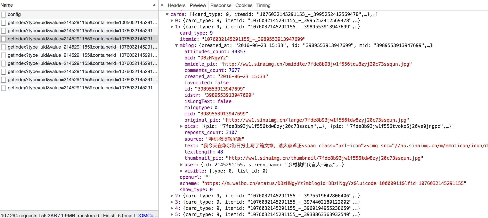

# 6.2 Ajax分析方法

还是以上文中的微博为例，我们已经知道了拖动刷新的内容是由 Ajax 加载的，而且页面的 URL 没有变化，那么我们应该到哪去查看这些 Ajax 请求呢？

### 1. 查看请求

在这里我们还是需要借助于浏览器的开发者工具，我们以 Chrome 浏览器为例来看一下怎样操作。

首先用 Chrome 浏览器打开微博的链接：[https://m.weibo.cn/u/2145291155](https://m.weibo.cn/u/2145291155)，随后在页面中点击鼠标右键，会出现一个检查的选项，点击它便会弹出开发者工具，如图 6-2 所示：

图 6-2 开发者工具

那么在 Elements 选项卡便会观察到网页的源代码，右侧便是节点的样式。

不过这不是我们想要寻找的内容，我们切换到 Network 选项卡，随后重新刷新页面，可以发现在这里出现了非常多的条目，如图 6-3 所示：

图 6-3 Network 面板结果

前文我们也提到过，这里其实就是在页面加载过程中浏览器与服务器之间发送 Request 和接收 Response 的所有记录。

Ajax其实有其特殊的请求类型，它叫做 xhr，在上图中我们可以发现一个名称为 getIndex 开头的请求，其 Type 为 xhr，这就是一个 Ajax 请求，我们鼠标点击这个请求，可以查看这个请求的详细信息，如图 6-4 所示：

图 6-4 详细信息

我们在右侧可以观察到其 Request Headers、URL 和 Response Headers 等信息，如图 6-5 所示：

图 6-5 详细信息

其中 Request Headers 中有一个信息为 X-Requested-With:XMLHttpRequest，这就标记了此请求是 Ajax 请求。

随后我们点击一下 Preview，即可看到响应的内容，响应内容是 Json 格式，在这里 Chrome 为我们自动做了解析，我们可以点击箭头来展开和收起相应内容，如图 6-6 所示：

图 6-6 Json 结果

观察可以发现，这里的返回结果是马云的个人信息，如昵称、简介、头像等等，这也就是用来渲染个人主页所使用的数据，JavaScript 接收到这些数据之后，再执行相应的渲染方法，整个页面就被渲染出来了。

另外也可以切换到 Response 选项卡，可以观察到真实的返回数据，如图 6-7 所示：

图 6-7 Response 内容

接下来我们切回到第一个请求，观察一下它的 Response 是什么，如图 6-8 所示：

图 6-8 Response 内容

这是最原始的链接 [https://m.weibo.cn/u/2145291155](https://m.weibo.cn/u/2145291155) 返回的结果，其代码只有五十行，结构也非常简单，只是执行了一些 JavaScript。

所以说，我们所看到的微博页面的真实数据并不是最原始的页面返回的，而是后来执行 JavaScript 后再次向后台发送了 Ajax 请求，拿到数据后再进一步渲染出来的。

### 2. 过滤请求

接下来我们再利用 Chrome 开发者工具的筛选功能筛选出所有的 Ajax 请求，在请求的上方有一层筛选栏，我们可以点击 XHR，这样在下方显示的所有请求便都是 Ajax 请求了，如图 6-9 所示：

图 6-9 Ajax 请求

再接下来我们我们不断滑动页面，可以看到在页面底部有一条条新的微博被刷出，而开发者工具下方也一个个地出现 Ajax 请求，这样我们就可以捕获到所有的 Ajax 请求了。

随意点开一个条目都可以清楚地看到其 Request URL、Request Headers、Response Headers、Response Body等内容，想要模拟请求和提取就非常简单了。

如图所示内容便是马云某一页微博的列表信息，如图 6-10 所示：

图 6-10 微博列表信息

### 3. 结语

到现在为止我们已经可以分析出来 Ajax 请求的一些详细信息了，接下来我们只需要用程序来模拟这些 Ajax 请求就可以轻松提取我们所需要的信息了。

所以在下一节我们来用 Python 实现 Ajax 请求的模拟，从而实现数据的抓取。

