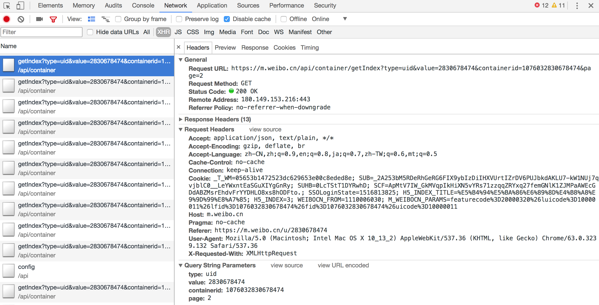
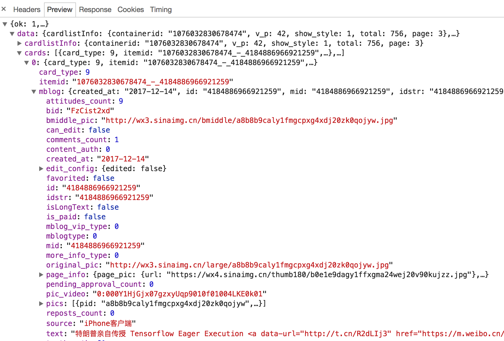

## 6.3　Ajax 结果提取
这里仍然以微博为例，接下来用 Python 来模拟这些 Ajax 请求，把我发过的微博爬取下来。

#### 1. 分析请求
打开 Ajax 的 XHR 过滤器，然后一直滑动页面以加载新的微博内容。可以看到，会不断有 Ajax 请求发出。

选定其中一个请求，分析它的参数信息。点击该请求，进入详情页面，如图 6-11 所示。



图 6-11　详情页面

可以发现，这是一个 GET 类型的请求，请求链接为 [https://m.weibo.cn/api/container/getIndex?type=uid&value=2145291155&containerid=1076032145291155&page=2](https://m.weibo.cn/api/container/getIndex?type=uid&value=2145291155&containerid=1076032145291155&page=2)，请求的参数有四个：type、value、containerid、page。

随后再看看其他请求，可以发现，它们的 type、value 和 containerid 始终如一。type 始终为 uid，value 的值就是页面链接中的数字，其实这就是用户的 id。另外，还有 containerid。可以发现，它就是 107603 加上用户 id。改变的值就是 page，很明显这个参数是用来控制分页的，page=1 代表第一页，page=2 代表第二页，以此类推。

#### 2. 分析响应
随后，观察这个请求的响应内容，如图 6-12 所示。


图 6-12　响应内容

这个内容是 JSON 格式的，浏览器开发者工具自动做了解析以方便我们查看。可以看到，最关键的两部分信息就是 cardlistInfo 和 cards：前者包含一个比较重要的信息 total，观察后可以发现，它其实是微博的总数量，我们可以根据这个数字来估算分页数；后者则是一个列表，它包含 10 个元素，展开其中一个看一下，如图 6-13 所示。



图 6-13　列表内容

可以发现，这个元素有一个比较重要的字段 mblog。展开它，可以发现它包含的正是微博的一些信息，比如 attitudes_count（赞数目）、comments_count（评论数目）、reposts_count（转发数目）、created_at（发布时间）、text（微博正文）等，而且它们都是一些格式化的内容。

这样我们请求一个接口，就可以得到 10 条微博，而且请求时只需要改变 page 参数即可。

这样的话，我们只需要简单做一个循环，就可以获取所有微博了。

#### 3. 实战演练
这里我们用程序模拟这些 Ajax 请求，将我的前 10 页微博全部爬取下来。

首先，定义一个方法来获取每次请求的结果。在请求时，page 是一个可变参数，所以我们将它作为方法的参数传递进来，相关代码如下：

```python
from urllib.parse import urlencode  
import requests  
base_url = 'https://m.weibo.cn/api/container/getIndex?'  

headers = {  
    'Host': 'm.weibo.cn',  
    'Referer': 'https://m.weibo.cn/u/2830678474',  
    'User-Agent': 'Mozilla/5.0 (Macintosh; Intel Mac OS X 10_12_3) AppleWebKit/537.36 (KHTML, like Gecko)   
        Chrome/58.0.3029.110 Safari/537.36',  
    'X-Requested-With': 'XMLHttpRequest',  
}  

def get_page(page):  
    params = {  
        'type': 'uid',  
        'value': '2830678474',  
        'containerid': '1076032830678474',  
        'page': page  
    }  
    url = base_url + urlencode(params)  
    try:  
        response = requests.get(url, headers=headers)  
        if response.status_code == 200:  
            return response.json()  
    except requests.ConnectionError as e:  
        print('Error', e.args)
```

首先，这里定义了 base_url 来表示请求的 URL 的前半部分。接下来，构造参数字典，其中 type、value 和 containerid 是固定参数，page 是可变参数。接下来，调用 urlencode 方法将参数转化为 URL 的 GET 请求参数，即类似于 type=uid&value=2145291155&containerid=1076032145291155&page=2 这样的形式。随后，base_url 与参数拼合形成一个新的 URL。接着，我们用 requests 请求这个链接，加入 headers 参数。然后判断响应的状态码，如果是 200，则直接调用 json 方法将内容解析为 JSON 返回，否则不返回任何信息。如果出现异常，则捕获并输出其异常信息。

随后，我们需要定义一个解析方法，用来从结果中提取想要的信息，比如这次想保存微博的 id、正文、赞数、评论数和转发数这几个内容，那么可以先遍历 cards，然后获取 mblog 中的各个信息，赋值为一个新的字典返回即可：

```python
from pyquery import PyQuery as pq  

def parse_page(json):  
    if json:  
        items = json.get('data').get('cards')  
        for item in items:  
            item = item.get('mblog')  
            weibo = {}  
            weibo['id'] = item.get('id')  
            weibo['text'] = pq(item.get('text')).text()  
            weibo['attitudes'] = item.get('attitudes_count')  
            weibo['comments'] = item.get('comments_count')  
            weibo['reposts'] = item.get('reposts_count')  
            yield weibo
```

这里我们借助 pyquery 将正文中的 HTML 标签去掉。

最后，遍历一下 page，一共 10 页，将提取到的结果打印输出即可：

```python
if __name__ == '__main__':  
    for page in range(1, 11):  
        json = get_page(page)  
        results = parse_page(json)  
        for result in results:  
            print(result)
```
另外，我们还可以加一个方法将结果保存到 MongoDB 数据库：
```python
from pymongo import MongoClient  

client = MongoClient()  
db = client['weibo']  
collection = db['weibo']  

def save_to_mongo(result):  
    if collection.insert(result):  
        print('Saved to Mongo')
```
这样所有功能就实现完成了。运行程序后，样例输出结果如下：
```
{'id': '4134879836735238', 'text': ' 惊不惊喜，刺不刺激，意不意外，感不感动 ', 'attitudes': 3,   
    'comments': 1, 'reposts': 0}  
Saved to Mongo  
{'id': '4143853554221385', 'text': ' 曾经梦想仗剑走天涯，后来过安检给收走了。分享单曲远走高飞 ',   
    'attitudes': 5, 'comments': 1, 'reposts': 0}  
Saved to Mongo
```

查看一下 MongoDB，相应的数据也被保存到 MongoDB，如图 6-14 所示。


图 6-14　保存结果

这样，我们就顺利通过分析 Ajax 并编写爬虫爬取下来微博列表。最后，给出本节的代码地址：[https://github.com/Python3WebSpider/WeiboList](https://github.com/Python3WebSpider/WeiboList)。

本节的目的是为了演示 Ajax 的模拟请求过程，爬取的结果不是重点。该程序仍有很多可以完善的地方，如页码的动态计算、微博查看全文等，若感兴趣，可以尝试一下。

通过这个实例，我们主要学会了怎样去分析 Ajax 请求，怎样用程序来模拟抓取 Ajax 请求。了解了抓取原理之后，下一节的 Ajax 实战演练会更加得心应手。