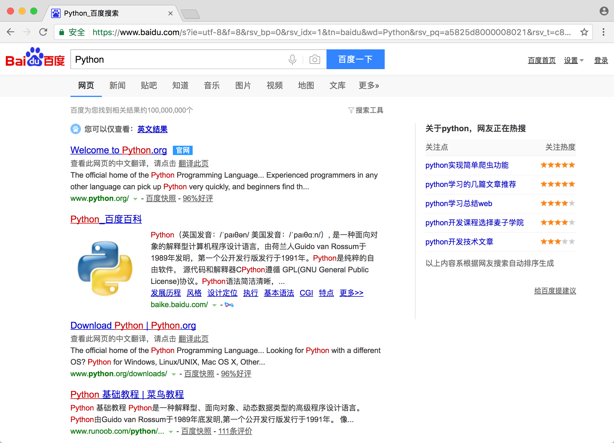

# Selenium的使用

## 基本使用

首先我们来大体看一下Selenium有一些怎样的功能，先用一段实例代码来演示一下：

```python
from selenium import webdriver
from selenium.webdriver.common.by import By
from selenium.webdriver.common.keys import Keys
from selenium.webdriver.support import expected_conditions as EC
from selenium.webdriver.support.wait import WebDriverWait

browser = webdriver.Chrome()
try:
    browser.get('https://www.baidu.com')
    input = browser.find_element_by_id('kw')
    input.send_keys('Python')
    input.send_keys(Keys.ENTER)
    wait = WebDriverWait(browser, 10)
    wait.until(EC.presence_of_element_located((By.ID, 'content_left')))
    print(browser.current_url)
    print(browser.get_cookies())
    print(browser.page_source)
finally:
    browser.close()
```

运行代码之后，如果正确配置好了ChromeDriver，可以发现会自动弹出一个浏览器，浏览器首先会跳转到百度，然后在搜索框中输入Python进行搜索，然后跳转到搜索结果页，等待搜索结果加载出来之后，控制台分别会输出当前的URL，当前的Cookies还有网页源代码。





控制台输出结果：

```
https://www.baidu.com/s?ie=utf-8&f=8&rsv_bp=0&rsv_idx=1&tn=baidu&wd=Python&rsv_pq=c94d0df9000a72d0&rsv_t=07099xvun1ZmC0bf6eQvygJ43IUTTUOl5FCJVPgwG2YREs70GplJjH2F%2BCQ&rqlang=cn&rsv_enter=1&rsv_sug3=6&rsv_sug2=0&inputT=87&rsv_sug4=87
[{'secure': False, 'value': 'B490B5EBF6F3CD402E515D22BCDA1598', 'domain': '.baidu.com', 'path': '/', 'httpOnly': False, 'name': 'BDORZ', 'expiry': 1491688071.707553}, {'secure': False, 'value': '22473_1441_21084_17001', 'domain': '.baidu.com', 'path': '/', 'httpOnly': False, 'name': 'H_PS_PSSID'}, {'secure': False, 'value': '12883875381399993259_00_0_I_R_2_0303_C02F_N_I_I_0', 'domain': '.www.baidu.com', 'path': '/', 'httpOnly': False, 'name': '__bsi', 'expiry': 1491601676.69722}]
<!DOCTYPE html><!--STATUS OK-->...</html>
```

源代码过长在此省略，那么当前的URL，Cookies，源代码都是浏览器中的真实内容。所以说，如果我们用Selenium来驱动浏览器加载网页的话，我们就可以拿到JavaScrit渲染的结果了。

下面我们来详细介绍一下Selenium的用法。

## 声明浏览器对象

Selenium支持非常多的浏览器，如Chrome、Firefox、Edge等，还有手机端的浏览器Android、BlackBerry等，另外无界面浏览器PhantomJS也同样支持。

我们可以用如下的方式初始化：

```python
from selenium import webdriver

browser = webdriver.Chrome()
browser = webdriver.Firefox()
browser = webdriver.Edge()
browser = webdriver.PhantomJS()
browser = webdriver.Safari()
```

这样我们就完成了一个浏览器对象的初始化，接下来我们要做的就是调用browser对象，让其执行各个动作，就可以模拟浏览器操作了。

## 访问页面

我们可以用get()方法来请求一个网页，参数传入链接URL即可，比如在这里我们用get()方法访问淘宝，然后打印出源代码，代码如下：

```python
from selenium import webdriver

browser = webdriver.Chrome()
browser.get('https://www.taobao.com')
print(browser.page_source)
browser.close()
```

## 查找元素

### 单个元素

Selenium可以驱动浏览器完成各种操作，比如填充表单，模拟点击等等，比如我们想要完成向某个输入框输入文字的操作，总得需要知道这个输入框在哪里吧？所以Selenium提供了一系列查找元素的方法，我们可以用这些方法来获取想要的元素，以便于下一步执行一些动作或者提取信息。

比如我们想要从淘宝页面中提取搜索框这个元素，首先观察它的源代码：


可以发现它的ID是q，Name也是q，还有许多其他属性，我们获取它的方式就有多种形式了，比如find_element_by_name()是根据Name值获取，ind_element_by_id()是根据ID获取，另外还有根据XPath、CSS Selector等获取。

我们代码实现一下：

```python
from selenium import webdriver

browser = webdriver.Chrome()
browser.get('https://www.taobao.com')
input_first = browser.find_element_by_id('q')
input_second = browser.find_element_by_css_selector('#q')
input_third = browser.find_element_by_xpath('//*[@id="q"]')
print(input_first, input_second, input_third)
browser.close()
```

在这里我们使用了三种方式获取输入框，根据ID，CSS Selector，和XPath获取，它们返回的结果是完全一致的。

运行结果：

```python
<selenium.webdriver.remote.webelement.WebElement (session="5e53d9e1c8646e44c14c1c2880d424af", element="0.5649563096161541-1")> 
<selenium.webdriver.remote.webelement.WebElement (session="5e53d9e1c8646e44c14c1c2880d424af", element="0.5649563096161541-1")> 
<selenium.webdriver.remote.webelement.WebElement (session="5e53d9e1c8646e44c14c1c2880d424af", element="0.5649563096161541-1")>
```

可以看到三个元素都是WebElement类型，是完全一致的。

在这里列出所有获取单个元素的方法：

find_element_by_id
find_element_by_name
find_element_by_xpath
find_element_by_link_text
find_element_by_partial_link_text
find_element_by_tag_name
find_element_by_class_name
find_element_by_css_selector

另外Selenium还提供了通用的find_element()方法，它需要传入两个参数，一个是查找的方式By，另一个就是值，实际上它就是find_element_by_id()这种方法的通用函数版本，比如find_element_by_id(id)就等价于find_element(By.ID, id)。

我们用代码实现一下：

```python
from selenium import webdriver
from selenium.webdriver.common.by import By

browser = webdriver.Chrome()
browser.get('https://www.taobao.com')
input_first = browser.find_element(By.ID, 'q')
print(input_first)
browser.close()
```

这样的查找方式实际上功能和上面列举的查找函数完全一致，不过参数更加灵活。

### 多个元素

如果我们查找的目标在网页中只有一个，那么完全可以用find_element()方法，但如果有多个元素，再用find_element()方法查找就只能得到第一个元素了，如果要查找所有满足条件的元素，那就需要用find_elements()这样的方法了，方法名称中element多了一个s。

比如我们在这里查找淘宝导航条的所有条目就可以这样来写：

```python
from selenium import webdriver

browser = webdriver.Chrome()
browser.get('https://www.taobao.com')
lis = browser.find_elements_by_css_selector('.service-bd li')
print(lis)
browser.close()
```

运行结果：

```
[<selenium.webdriver.remote.webelement.WebElement (session="c26290835d4457ebf7d96bfab3740d19", element="0.09221044033125603-1")>, <selenium.webdriver.remote.webelement.WebElement (session="c26290835d4457ebf7d96bfab3740d19", element="0.09221044033125603-2")>, <selenium.webdriver.remote.webelement.WebElement (session="c26290835d4457ebf7d96bfab3740d19", element="0.09221044033125603-3")>...<selenium.webdriver.remote.webelement.WebElement (session="c26290835d4457ebf7d96bfab3740d19", element="0.09221044033125603-16")>]
```

在此简化了一下输出结果，中间部分省略。

可以看到得到的内容就变成了list类型，list的每个元素都是WebElement类型。

也就是说，如果我们用find_element()方法，只能获取匹配的第一个元素，结果是WebElement类型，如果用find_elements()方法，则结果是list类型，listd每个元素是WebElement类型。

函数的列表如下：

find_elements_by_id
find_elements_by_name
find_elements_by_xpath
find_elements_by_link_text
find_elements_by_partial_link_text
find_elements_by_tag_name
find_elements_by_class_name
find_elements_by_css_selector

当然我们和刚才一样，也可可以直接find_elements()方法来选择，所以也可以这样来写：

```python
lis = browser.find_elements(By.CSS_SELECTOR, '.service-bd li')
```

结果是完全一致的。

## 元素交互

Selenium可以驱动浏览器来执行一些操作，也就是说我们可以让浏览器模拟执行一些动作，比较常见的用法有：

输入文字用send_keys()方法，清空文字用clear()方法，另外还有按钮点击，用click()方法。

我们用一个实例来感受一下：

```python
from selenium import webdriver
import time

browser = webdriver.Chrome()
browser.get('https://www.taobao.com')
input = browser.find_element_by_id('q')
input.send_keys('iPhone')
time.sleep(1)
input.clear()
input.send_keys('iPad')
button = browser.find_element_by_class_name('btn-search')
button.click()
```

在这里我们首先驱动浏览器打开淘宝，然后用find_element_by_id()方法获取输入框，然后用send_keys()方法输入iPhone文字，等待一秒之后用clear()方法清空输入框，再次调用send_keys()方法输入iPad文字，之后再用find_element_by_class_name()方法获取搜索按钮，最后调用click()方法完成搜索动作。

通过上面的方法我们就完成了一些常见元素的动作操作，更多的操作可以参见官方文档的交互动作介绍：[http://selenium-python.readthedocs.io/api.html#module-selenium.webdriver.remote.webelement](http://selenium-python.readthedocs.io/api.html#module-selenium.webdriver.remote.webelement)

## 动作链

在上面的实例中，一些交互动作都是针对某个元素执行的，比如输入框我们就调用它的输入文字和清空文字方法，按钮就调用它的点击方法，其实还有另外的一些操作它是没有特定的执行对象的。比如鼠标拖拽，键盘按键等操作。所以这些动作我们有另一种方式来执行，那就是加到动作链中。

比如我们现在实现一个元素拖拽操作，将某个元素从一处拖拽到另外一处，我们用代码来感受一下：

```python
from selenium import webdriver
from selenium.webdriver import ActionChains

browser = webdriver.Chrome()
url = 'http://www.runoob.com/try/try.php?filename=jqueryui-api-droppable'
browser.get(url)
browser.switch_to.frame('iframeResult')
source = browser.find_element_by_css_selector('#draggable')
target = browser.find_element_by_css_selector('#droppable')
actions = ActionChains(browser)
actions.drag_and_drop(source, target)
actions.perform()
```

首先我们打开网页中的一个拖拽实例，然后依次选中要被拖拽的元素和拖拽到的目标元素，然后声明了ActionChains对象赋值为actions变量，然后通过调用actions变量的drag_and_drop()方法，然后再调用perform()方法执行动作，就完成了拖拽操作。


更多的动作链操作可以参考官方文档的动作链介绍：[http://selenium-python.readthedocs.io/api.html#module-selenium.webdriver.common.action_chains](http://selenium-python.readthedocs.io/api.html#module-selenium.webdriver.common.action_chains)

## 执行JavaScript

另外对于某些操作，API没有提供的，如下拉进度条等，可以直接模拟运行JavaScript，使用execute_script()方法。

```python
from selenium import webdriver

browser = webdriver.Chrome()
browser.get('https://www.zhihu.com/explore')
browser.execute_script('window.scrollTo(0, document.body.scrollHeight)')
browser.execute_script('alert("To Bottom")')
```

在这里我们就利用了execute_script()方法将进度条下拉到最底部，然后弹出alert提示框。

所以说有了这个，基本上API没有提供的所有的功能都可以用执行JavaScript的方式来实现了。

## 获取元素信息

我们在前面说过通过page_source属性可以获取网页的源代码，获取源代码之后就可以使用解析库如正则、BeautifulSoup、PyQuery等来提取信息了。

不过既然Selenium已经提供了选择元素的方法，返回的是WebElement类型，那么它也有相关的方法和属性来直接提取元素信息，如属性、文本等等。这样的话我们能就不用通过解析源代码来提取信息了，非常方便。

那接下来我们就看一下可以通过怎样的方式来获取元素信息吧。

### 获取属性

我们可以使用get_attribute()方法来获取元素的属性，那么这个的前提就是先选中这个元素。

我们用一个实例来感受一下：

```python
from selenium import webdriver
from selenium.webdriver import ActionChains

browser = webdriver.Chrome()
url = 'https://www.zhihu.com/explore'
browser.get(url)
logo = browser.find_element_by_id('zh-top-link-logo')
print(logo)
print(logo.get_attribute('class'))
```

运行之后程序便会驱动浏览器打开知乎的页面，然后获取知乎的LOGO元素，然后将它的class打印出来。

控制台输出结果：

```python
<selenium.webdriver.remote.webelement.WebElement (session="e08c0f28d7f44d75ccd50df6bb676104", element="0.7236390660048155-1")>
zu-top-link-logo
```

我们通过get_attribute()方法，然后传入想要获取的属性名，就可以得到它的值了。

### 获取文本值

每个WebEelement元素都有text属性，我们可以通过直接调用这个属性就可以得到元素内部的文本信息了，就相当于BeautifulSoup的get_text()方法、PyQuery的text()方法。

我们用一个实例来感受一下：

```python
from selenium import webdriver

browser = webdriver.Chrome()
url = 'https://www.zhihu.com/explore'
browser.get(url)
input = browser.find_element_by_class_name('zu-top-add-question')
print(input.text)
```

在这里们依然是先打开知乎页面，然后获取提问按钮这个元素，再将其文本值打印出来。

控制台输出结果：

```
提问
```

### 获取ID、位置、标签名、大小

另外WebElement元素还有一些其他的属性，比如id属性可以获取元素id，location可以获取该元素在页面中的相对位置，tag_name可以获取标签名称 ，size可以获取元素的大小，也就是宽高，这些属性有时候还是很有用的。

我们用实例来感受一下：

 ```python
 from selenium import webdriver

browser = webdriver.Chrome()
url = 'https://www.zhihu.com/explore'
browser.get(url)
input = browser.find_element_by_class_name('zu-top-add-question')
print(input.id)
print(input.location)
print(input.tag_name)
print(input.size)
 ```

在这里我们首先获得了提问按钮这个元素，然后调用其id、location、tag_name、size属性即可获取对应


