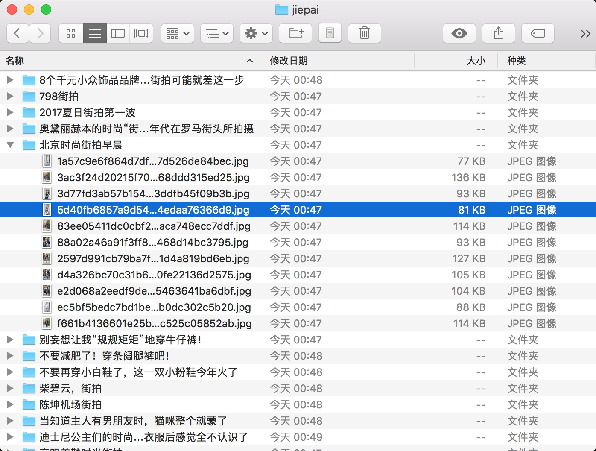

## 6.4　分析 Ajax 爬取今日头条街拍美图

本节中，我们以今日头条为例来尝试通过分析 Ajax 请求来抓取网页数据的方法。这次要抓取的目标是今日头条的街拍美图，抓取完成之后，将每组图片分文件夹下载到本地并保存下来。

#### 1. 准备工作

在本节开始之前，请确保已经安装好 requests 库。如果没有安装，可以参考第 1 章。

#### 2. 抓取分析

在抓取之前，首先要分析抓取的逻辑。打开今日头条的首页 [http://www.toutiao.com/](http://www.toutiao.com/)，如图 6-15 所示。


图 6-15　首页内容

右上角有一个搜索入口，这里尝试抓取街拍美图，所以输入 “街拍” 二字搜索一下，结果如图 6-16 所示。


图 6-16　搜索结果

这时打开开发者工具，查看所有的网络请求。首先，打开第一个网络请求，这个请求的 URL 就是当前的链接 [http://www.toutiao.com/search/?keyword = 街拍](http://www.toutiao.com/search/?keyword = 街拍)，打开 Preview 选项卡查看 Response Body。如果页面中的内容是根据第一个请求得到的结果渲染出来的，那么第一个请求的源代码中必然会包含页面结果中的文字。为了验证，我们可以尝试搜索一下搜索结果的标题，比如 “路人” 二字，如图 6-17 所示。


图 6-17　搜索结果

我们发现，网页源代码中并没有包含这两个字，搜索匹配结果数目为 0。因此，可以初步判断这些内容是由 Ajax 加载，然后用 JavaScript 渲染出来的。接下来，我们可以切换到 XHR 过滤选项卡，查看一下有没有 Ajax 请求。

不出所料，此处出现了一个比较常规的 Ajax 请求，看看它的结果是否包含了页面中的相关数据。

点击 data 字段展开，发现这里有许多条数据。点击第一条展开，可以发现有一个 title 字段，它的值正好就是页面中第一条数据的标题。再检查一下其他数据，也正好是一一对应的，如图 6-18 所示。


图 6-18　对比结果

这就确定了这些数据确实是由 Ajax 加载的。

我们的目的是要抓取其中的美图，这里一组图就对应前面 data 字段中的一条数据。每条数据还有一个 image_detail 字段，它是列表形式，这其中就包含了组图的所有图片列表，如图 6-19 所示。


图 6-19　图片列表信息

因此，我们只需要将列表中的 url 字段提取出来并下载下来就好了。每一组图都建立一个文件夹，文件夹的名称就为组图的标题。

接下来，就可以直接用 Python 来模拟这个 Ajax 请求，然后提取出相关美图链接并下载。但是在这之前，我们还需要分析一下 URL 的规律。

切换回 Headers 选项卡，观察一下它的请求 URL 和 Headers 信息，如图 6-20 所示。


图 6-20 请求信息

可以看到，这是一个 GET 请求，请求 URL 的参数有 offset、format、keyword、autoload、count 和 cur_tab。我们需要找出这些参数的规律，因为这样才可以方便地用程序构造出来。

接下来，可以滑动页面，多加载一些新结果。在加载的同时可以发现，Network 中又出现了许多 Ajax 请求，如图 6-21 所示。


图 6-21　Ajax 请求

这里观察一下后续链接的参数，发现变化的参数只有 offset，其他参数都没有变化，而且第二次请求的 offset 值为 20，第三次为 40，第四次为 60，所以可以发现规律，这个 offset 值就是偏移量，进而可以推断出 count 参数就是一次性获取的数据条数。因此，我们可以用 offset 参数来控制数据分页。这样一来，我们就可以通过接口批量获取数据了，然后将数据解析，将图片下载下来即可。

#### 3. 实战演练
我们刚才已经分析了一下 Ajax 请求的逻辑，下面就用程序来实现美图下载吧。

首先，实现方法 get_page 来加载单个 Ajax 请求的结果。其中唯一变化的参数就是 offset，所以我们将它当作参数传递，实现如下：

```python
import requests  
from urllib.parse import urlencode  

def get_page(offset):  
    params = {  
        'offset': offset,  
        'format': 'json',  
        'keyword': ' 街拍 ',  
        'autoload': 'true',  
        'count': '20',  
        'cur_tab': '3',  
    }  
    url = 'http://www.toutiao.com/search_content/?' + urlencode(params)  
    try:  
        response = requests.get(url)  
        if response.status_code == 200:  
            return response.json()  
    except requests.ConnectionError:  
        return None
```

这里我们用 urlencode 方法构造请求的 GET 参数，然后用 requests 请求这个链接，如果返回状态码为 200，则调用 response 的 json 方法将结果转为 JSON 格式，然后返回。

接下来，再实现一个解析方法：提取每条数据的 image_detail 字段中的每一张图片链接，将图片链接和图片所属的标题一并返回，此时可以构造一个生成器。实现代码如下：

```python
def get_images(json):  
    if json.get('data'):  
        for item in json.get('data'):  
            title = item.get('title')  
            images = item.get('image_detail')  
            for image in images:  
                yield {'image': image.get('url'),  
                    'title': title  
                }
```
接下来，实现一个保存图片的方法 save_image，其中 item 就是前面 get_images 方法返回的一个字典。在该方法中，首先根据 item 的 title 来创建文件夹，然后请求这个图片链接，获取图片的二进制数据，以二进制的形式写入文件。图片的名称可以使用其内容的 MD5 值，这样可以去除重复。相关代码如下：
```python
import os  
from hashlib import md5  

def save_image(item):  
    if not os.path.exists(item.get('title')):  
        os.mkdir(item.get('title'))  
    try:  
        response = requests.get(item.get('image'))  
        if response.status_code == 200:  
            file_path = '{0}/{1}.{2}'.format(item.get('title'), md5(response.content).hexdigest(), 'jpg')  
            if not os.path.exists(file_path):  
                with open(file_path, 'wb') as f:  
                    f.write(response.content)  
            else:  
                print('Already Downloaded', file_path)  
    except requests.ConnectionError:  
        print('Failed to Save Image')
```
最后，只需要构造一个 offset 数组，遍历 offset，提取图片链接，并将其下载即可：
```python
from multiprocessing.pool import Pool  

def main(offset):  
    json = get_page(offset)  
    for item in get_images(json):  
        print(item)  
        save_image(item)  


GROUP_START = 1  
GROUP_END = 20  

if __name__ == '__main__':  
    pool = Pool()  
    groups = ([x * 20 for x in range(GROUP_START, GROUP_END + 1)])  
    pool.map(main, groups)  
    pool.close()  
    pool.join()
```

这里定义了分页的起始页数和终止页数，分别为 GROUP_START 和 GROUP_END，还利用了多进程的进程池，调用其 map 方法实现多进程下载。

这样整个程序就完成了，运行之后可以发现街拍美图都分文件夹保存下来了，如图 6-22 所示。



图 6-22　保存结果

最后，我们给出本节的代码地址：[https://github.com/Python3WebSpider/Jiepai](https://github.com/Python3WebSpider/Jiepai)。

通过本节，我们了解了 Ajax 分析的流程、Ajax 分页的模拟以及图片的下载过程。

本节的内容需要熟练掌握，在后面的实战中我们还会用到很多次这样的分析和抓取。