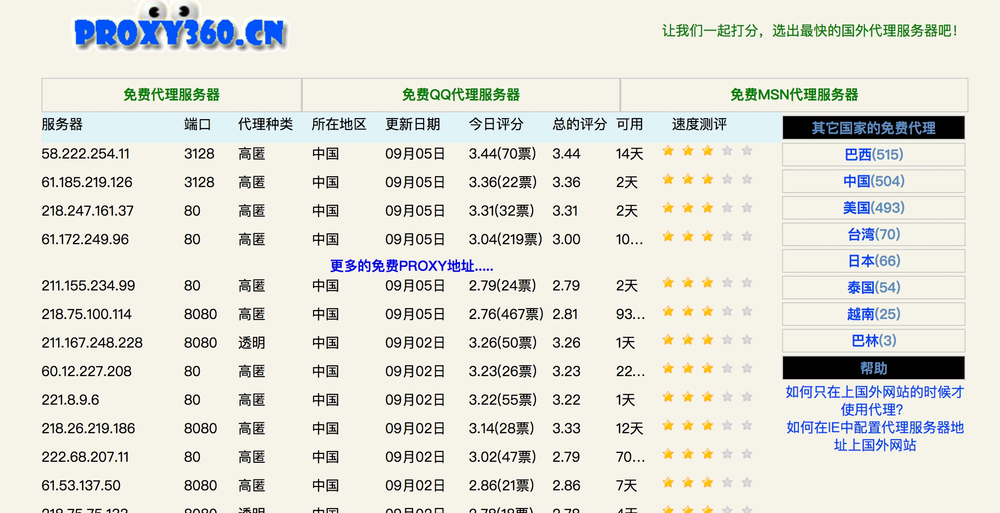
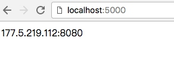

### 代理池的维护

目前有很多网站提供免费代理，而且种类齐全，比如各个地区、各个匿名级别的都有，不过质量实在不敢恭维，毕竟都是免费公开的，可能一个代理无数个人在用也说不定。所以我们需要做的是大量抓取这些免费代理，然后筛选出其中可用的代理存储起来供我们使用，不可用的进行剔除。

#### 获取代理途径

维护一个代理池第一步就是要找到提供免费代理的站点，例如[PROXY360](http://www.proxy360.cn/)，网页内容如下：




可以看到网页里提供了一些免费代理列表，包括服务器地址、端口、代理种类、地区、更新时间等等信息。

当前我们需要的就是代理服务器和端口信息，将其爬取下来即可。

#### 维护代理

那么爬取下代理之后怎样保存呢？

首先我们需要确保的目标是可以边取边存，另外还需要定时检查队列中不可用的代理将其剔除，所以需要易于存取。

另外怎样区分哪些是最新的可用的，哪些是旧的，如果用修改时间来标注是可以的，不过更简单的方法就是维护一个队列，只从一端存入，例如右端，这样就能确保最新的代理在队列右端，而在左端则是存入时间较长的代理，如果要取一个可用代理，从队列右端取一个就好了。

那么对于队列的左端，不能让它一直老化下去，还需要做的操作就是定时从队列左端取出代理，然后进行检测，如果可用，重新将其加入右端。

通过以上操作，就保证了代理一直是最新可用的。

所以目前来看，既能高效处理，又可以做到队列动态维护，合适的方法就是利用Redis数据库的队列。

可以定义一个类来维护一个Redis队列，比如get方法是批量从左端取出代理，put方法是从右端放入可用代理，pop方法是从右端取出最新可用代理。

```python
import redis
from proxypool.error import PoolEmptyError
from proxypool.setting import HOST, PORT

class RedisClient(object):
    def __init__(self, host=HOST, port=PORT):
        self._db = redis.Redis(host, port)

    def get(self, count=1):
        proxies = self._db.lrange("proxies", 0, count - 1)
        self._db.ltrim("proxies", count, -1)
        return proxies

    def put(self, proxy):
        self._db.rpush("proxies", proxy)

    def pop(self):
        try:
            return self._db.rpop("proxies").decode('utf-8')
        except:
            raise PoolEmptyError
```

#### 检测代理

那么如何来检测代理是否可用？可以使用这个代理来请求某个站点，比如[百度](https://www.baidu.com)，如果获得正常的返回结果，那证明代理可用，否则代理不可用。

```python
conn = RedisClient()
proxies = {'http': proxy}
r = requests.get('https://www.baidu.com', proxies=proxies)
if r.status_code == 200:
    conn.put(proxy)
```
例如在这里proxy就是要检测的代理，使用requests库设置好这个代理，然后请求百度，正常请求，那就可以将这个代理存入Redis。

#### 获取可用代理

现在我们维护了一个代理池，那么这个代理池需要是可以公用的。

比如现在有多个爬虫项目都需要用到代理，而代理池的维护作为另外的一个项目，他们之间如果要建立连接，最恰当的方式就是接口。

所以可以利用Web服务器来实现一个接口，其他的项目通过请求这个接口得到内容获取到一个可用代理，这样保证了代理池的通用性。

所以要实现这个还需要一个Web服务器，例如Flask，Tornado等等。

例如使用Flask，定义一个路由，然后调用的RedisClient的pop方法，返回结果即可。

```python
@app.route('/')
def get_proxy():
    conn = RedisClient()
    return conn.pop()
```

这样一来，整个程序运行起来后，请求网页就可以看到一个可用代理了。



#### 使用代理

使用代理时只需要请求这个站点，就可以拿到可使用的代理了。

```python
def get_proxy():
    r = requests.get('http://127.0.0.1:5000')
    return r.text

def crawl(url, proxy):
    proxies = {'http': get_proxy()}
    r = requests.get(url, proxies=proxies)
    # do something
```

可以定义一个简单的方法，返回网页内容即代理，然后在爬取方法里设置代理使用即可。

#### 样例实现

[https://github.com/Germey/ProxyPool](https://github.com/Germey/ProxyPool)


